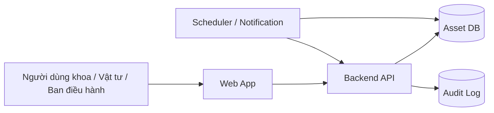
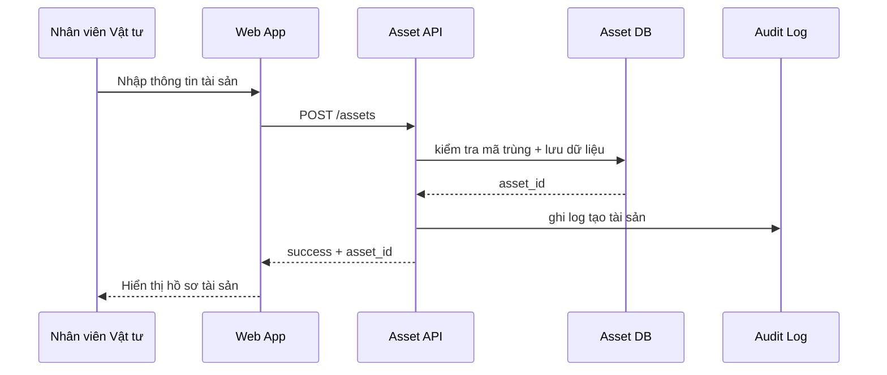
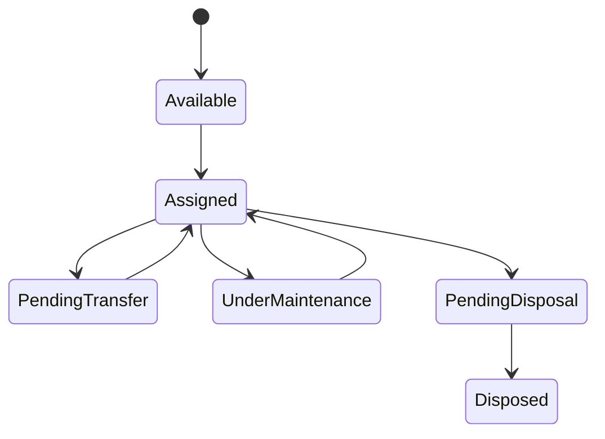

# ĐẶC TẢ YÊU CẦU PHẦN MỀM (SRS)
# Dự án Gia công: Hệ thống Quản lý Tài sản Bệnh viện

> **Phiên bản:** 1.0 | **Ngày:** 26/02/2026
> **Trạng thái:** Draft
> **Hợp đồng tham chiếu:** HD-AP-2026-018
> **⚠️ Đây là tài liệu CHỐT PHẠM VI (Baseline) — mọi thay đổi sau khi phê duyệt phải qua quy trình Yêu cầu thay đổi (CR)**

---

## 1. Tổng quan

### 1.1. Mục đích
Đặc tả yêu cầu phần mềm chi tiết cho dự án **[Tên dự án]** — đủ để đội phát triển NCC phát triển mà **giảm thiểu cần giao tiếp thời gian thực** với KH (đặc điểm gia công).

### 1.2. Đối tượng đọc

| Đối tượng | Đọc phần |
|-----------|---------|
| Người đại diện KH (PO) / Nhà tài trợ (Sponsor) | Mục 1-4, 7 (phạm vi, tính năng, phê duyệt) |
| Đội phát triển NCC | Mục 2-6 (chi tiết chức năng, yêu cầu phi chức năng, dữ liệu, API) |
| QC NCC | Mục 2-3, 5 (tiêu chí chấp nhận, NFR, quy tắc xác nhận) |
| BA NCC | Toàn bộ |

### 1.3. Tài liệu tham chiếu

| Tài liệu | Mã/Link | Phiên bản |
|-----------|---------|-----------|
| Tầm nhìn & Phạm vi | 01-Vision-Scope.md | v1.0 đã ký |
| BRD | 02-BRD.md | v1.0 đã ký |
| Quy trình nghiệp vụ | 04-Process-Flow.md | v1.0 đã ký |
| Story Map | 06-User-Story-Map.md | v1.0 |
| Wireframe/Prototype | Figma / AP Asset v7 | v7 |

### 1.4. Thuật ngữ & Viết tắt

| Thuật ngữ | Giải thích |
|-----------|------------|
| Tài sản | Thiết bị, máy móc, tài sản CNTT hoặc vật tư giá trị cao cần theo dõi vòng đời |
| Khoa sở hữu | Khoa/phòng chịu trách nhiệm sử dụng tài sản tại thời điểm hiện tại |
| Đợt kiểm kê | Phiên kiểm kê có ngày bắt đầu, ngày khóa sổ, và người phê duyệt |

### 1.5. Tổng quan kiến trúc



### 1.6. Bối cảnh dữ liệu

- `Asset` là thực thể gốc của hệ thống.
- `AssetTransfer`, `AssetMaintenance`, và `InventorySession` là các thực thể nghiệp vụ chính phát sinh từ `Asset`.
- Mọi thay đổi trạng thái tài sản phải ghi audit log và người thao tác.

---

## 2. Yêu cầu chức năng

> **Quy ước ưu tiên:**
> - **P0 (Bắt buộc):** Phải có, ảnh hưởng mốc thanh toán
> - **P1 (Nên có):** Quan trọng, nên có trước vận hành
> - **P2 (Có thể):** Tốt nếu có, có thể hoãn sang giai đoạn sau

### 2.1. Module 1: Danh mục và Đăng ký tài sản

**Goal:** Chuẩn hóa hồ sơ tài sản và mã định danh ngay từ thời điểm tạo mới.
**Actors:** Nhân viên Vật tư, Quản trị, Điều dưỡng trưởng khoa.
**Dependencies:** Danh mục khoa/phòng, danh mục nhóm tài sản, phân quyền người dùng.

#### Tính năng 1.1: Tạo hồ sơ tài sản

| Mã | Yêu cầu | Mô tả chi tiết | Ưu tiên | Source BRD | Primary Actor | Ref Wireframe |
|----|---------|-----------------|---------|---------------|
| FR-101 | Tạo hồ sơ tài sản mới | Precondition: người dùng có quyền `asset.create`. Trigger: người dùng mở form tạo tài sản. Main flow: nhập thông tin nhận diện, nhóm tài sản, khoa sở hữu, ngày mua, giá trị, bảo hành. Exception: thiếu trường bắt buộc hoặc mã tài sản trùng. Postcondition: tài sản ở trạng thái `Available` và có mã duy nhất. | P0 | BRD-101 | Nhân viên Vật tư | S-001 |
| FR-102 | Tạo mã barcode cho tài sản | Precondition: FR-101 thành công. Trigger: người dùng chọn `Sinh mã`. Main flow: hệ thống tạo barcode; hệ thống gắn barcode vào hồ sơ tài sản; hệ thống trả file in tem cho người dùng. Exception: lỗi kết nối dịch vụ in tem. Postcondition: hồ sơ tài sản lưu barcode cùng trạng thái in tem. | P0 | BRD-102 | Nhân viên Vật tư | S-002 |
| FR-103 | Phân loại tài sản theo nhóm | Precondition: danh mục nhóm tài sản có sẵn. Trigger: người dùng chọn nhóm tài sản. Main flow: hệ thống áp dụng rule hiển thị trường phù hợp theo loại. Exception: nhóm tài sản bị vô hiệu hóa. Postcondition: tài sản có classification phục vụ báo cáo và SLA bảo trì. | P1 | BRD-103 | Nhân viên Vật tư | S-003 |

**Quy tắc nghiệp vụ:**
- BR-001: Mỗi tài sản chỉ có một mã định danh duy nhất trong toàn viện. Ref BRD-101.
- BR-004: Thiết bị y tế nhóm quan trọng phải khai báo chu kỳ bảo trì. Ref BRD-301.

**Quy tắc xác nhận:**
- VR-101: `asset_code` là bắt buộc và không được trùng.
- VR-102: `purchase_date` không được lớn hơn ngày hiện tại.
- VR-103: Nếu `asset_group = medical_device_critical` thì `maintenance_cycle_days` là bắt buộc.

**Tiêu chí chấp nhận (FR-101):**
```gherkin
Scenario: Happy path - tạo tài sản mới
  Given nhân viên Vật tư đã đăng nhập và có quyền tạo tài sản
  When người dùng nhập đầy đủ thông tin hợp lệ và bấm Lưu
  Then hệ thống tạo hồ sơ tài sản mới ở trạng thái Available
    And ghi audit log với người tạo và thời gian tạo

Scenario: Negative - trùng mã tài sản
  Given đã tồn tại tài sản với mã AP-TS-0001
  When người dùng nhập lại mã AP-TS-0001
  Then hệ thống chặn lưu
    And hiển thị thông báo "Mã tài sản đã tồn tại"

Scenario: Boundary - thiếu chu kỳ bảo trì cho thiết bị quan trọng
  Given người dùng chọn nhóm tài sản là thiết bị y tế quan trọng
  When người dùng để trống chu kỳ bảo trì
  Then hệ thống không cho lưu

Scenario: Permission - người dùng khoa không có quyền tạo tài sản
  Given người dùng thuộc vai trò Người dùng khoa
  When truy cập chức năng tạo tài sản
  Then hệ thống từ chối truy cập
```

**Sequence flow**



---

#### Tính năng 1.2: Quản lý danh mục và phân quyền truy cập

| Mã | Yêu cầu | Mô tả chi tiết | Ưu tiên | Source BRD | Primary Actor | Ref Wireframe |
|----|---------|-----------------|---------|---------------|
| FR-104 | Quản lý danh mục khoa/phòng và nhóm tài sản | Precondition: người dùng có quyền cấu hình. Trigger: vào màn hình cấu hình. Main flow: tạo/sửa/vô hiệu hóa danh mục. Exception: không cho vô hiệu hóa khi còn asset active tham chiếu. Postcondition: danh mục mới có hiệu lực cho các form nghiệp vụ. | P0 | BRD-101 | Quản trị | S-004 |
| FR-105 | Phân quyền theo vai trò | Precondition: role matrix đã được cấu hình. Trigger: người dùng đăng nhập. Main flow: hệ thống cấp quyền theo vai trò. Exception: vai trò bị vô hiệu hóa. Postcondition: người dùng chỉ thấy chức năng được cấp. | P0 | BRD-201 | Quản trị | S-005 |

---

### 2.2. Module 2: Điều chuyển và Kiểm kê

**Goal:** Khóa trách nhiệm sở hữu tài sản và rút ngắn thời gian kiểm kê.
**Actors:** Người dùng khoa, Trưởng khoa, Nhân viên Vật tư.
**Dependencies:** Asset master, role matrix, barcode.

#### Tính năng 2.1: Điều chuyển tài sản

| Mã | Yêu cầu | Mô tả chi tiết | Ưu tiên | Source BRD | Primary Actor | Ref Wireframe |
|----|---------|-----------------|---------|---------------|
| FR-201 | Tạo yêu cầu điều chuyển | Precondition: tài sản đang active và có khoa sở hữu. Trigger: người dùng khoa hoặc Vật tư tạo yêu cầu điều chuyển. Main flow: chọn tài sản, khoa nhận, lý do, ngày dự kiến. Exception: tài sản đang bảo trì hoặc ở trạng thái `PendingDisposal` theo BR-003. Postcondition: yêu cầu ở trạng thái `Pending Approval`. | P0 | BRD-201 | Người dùng khoa | S-010 |
| FR-202 | Xác nhận giao và nhận bàn giao | Precondition: FR-201 đã được phê duyệt. Trigger: bên giao xác nhận theo BR-002, sau đó bên nhận xác nhận. Main flow: hệ thống ghi nhận xác nhận của bên giao; hệ thống ghi nhận xác nhận của bên nhận; hệ thống cập nhật khoa sở hữu mới. Exception: quá hạn xác nhận hoặc một bên từ chối. Postcondition: hệ thống cập nhật lịch sử sở hữu và audit log. | P0 | BRD-201 | Trưởng khoa / Vật tư | S-011 |
| FR-203 | Tạo đợt kiểm kê và chốt chênh lệch | Precondition: Nhân viên Vật tư có danh sách tài sản active của khoa. Trigger: Nhân viên Vật tư mở đợt kiểm kê. Main flow: quét barcode hoặc đánh dấu thủ công, ghi lệch theo BR-005, gửi xác nhận. Exception: tài sản không tìm thấy hoặc barcode sai. Postcondition: đợt kiểm kê có báo cáo lệch và trạng thái khóa sổ. | P0 | BRD-202, BRD-203 | Nhân viên Vật tư | S-012 |

**Quy tắc nghiệp vụ:**
- BR-002: Điều chuyển chỉ hoàn tất khi bên giao và bên nhận cùng xác nhận.
- BR-005: Chênh lệch kiểm kê phải được phân loại trước khi khóa sổ.

**Tiêu chí chấp nhận (FR-202)**
```gherkin
Scenario: Happy path - điều chuyển hoàn tất
  Given yêu cầu điều chuyển đã được phê duyệt
  When bên giao và bên nhận cùng xác nhận
  Then hệ thống cập nhật khoa sở hữu mới
    And ghi lịch sử điều chuyển

Scenario: Negative - tài sản đang bảo trì
  Given tài sản ở trạng thái Under Maintenance
  When người dùng tạo yêu cầu điều chuyển
  Then hệ thống chặn tạo yêu cầu

Scenario: Exception - quá hạn xác nhận
  Given yêu cầu điều chuyển đã quá hạn 48 giờ
  When bên nhận chưa xác nhận
  Then hệ thống cảnh báo cho Vật tư và Trưởng khoa
```

---

### 2.3. Module 3: Bảo trì và Báo cáo điều hành

**Goal:** Giảm dừng thiết bị và hỗ trợ quyết định ngân sách.
**Actors:** Nhân viên Vật tư, Ban điều hành, Kỹ sư bảo trì.

| Mã | Yêu cầu | Mô tả chi tiết | Ưu tiên | Source BRD | Primary Actor | Ref Wireframe |
|----|---------|-----------------|---------|------------|---------------|---------------|
| FR-301 | Lập lịch bảo trì định kỳ | Precondition: tài sản có chu kỳ bảo trì. Trigger: hệ thống scheduler chạy hằng ngày. Main flow: xác định tài sản sắp đến hạn theo BR-004, tạo nhắc việc. Exception: tài sản đang dừng sử dụng hoặc chờ thanh lý. Postcondition: có work item bảo trì và cảnh báo. | P0 | BRD-301, BRD-302 | Scheduler / Vật tư | S-020 |
| FR-302 | Ghi nhận kết quả bảo trì | Precondition: Nhân viên Vật tư hoặc kỹ sư có lịch bảo trì mở. Trigger: Nhân viên Vật tư hoặc kỹ sư cập nhật kết quả. Main flow: nhập ngày thực hiện, nội dung, chi phí, trạng thái. Exception: chi phí vượt ngưỡng cần phê duyệt. Postcondition: lịch sử bảo trì cập nhật, hạn bảo trì kế tiếp được tính lại. | P0 | BRD-301, BRD-302 | Nhân viên Vật tư | S-021 |
| FR-303 | Dashboard điều hành | Precondition: hệ thống đã ghi nhận dữ liệu nghiệp vụ. Trigger: Ban điều hành mở dashboard. Main flow: hệ thống hiển thị tổng số tài sản, tổng giá trị, tài sản sắp bảo trì, tài sản lệch kiểm kê theo bộ lọc khoa/thời gian. Exception: người dùng không có quyền executive dashboard. Postcondition: dashboard lưu bộ lọc cuối cùng của người dùng. | P1 | BRD-303 | Ban điều hành | S-022 |

### 2.4. Mô hình dữ liệu tóm tắt

| Entity | Purpose | Key fields |
|---|---|---|
| Asset | Hồ sơ tài sản gốc | asset_id, asset_code, asset_group, owner_department_id, status |
| AssetTransfer | Lịch sử điều chuyển | transfer_id, asset_id, from_department_id, to_department_id, approved_at |
| InventorySession | Phiên kiểm kê | session_id, department_id, started_at, closed_at, status |
| InventoryResult | Kết quả từng tài sản trong đợt kiểm kê | session_id, asset_id, result_type, comment |
| MaintenanceOrder | Phiếu/lịch bảo trì | maintenance_id, asset_id, due_date, completed_at, vendor |

### 2.5. State machine



---

## 3. Yêu cầu phi chức năng

| Mã | Danh mục | Yêu cầu | Chỉ tiêu | Cách xác minh |
|----|----------|---------|----------|---------------|
| NFR-001 | **Hiệu năng** | Dashboard tài sản phải tải xong trong mạng nội bộ | ≤ 3 giây | Lighthouse / synthetic monitoring |
| NFR-002 | **Hiệu năng** | API đọc/ghi tài sản phải phản hồi trong thời gian ngắn | ≤ 500ms (p95) | Báo cáo load test |
| NFR-003 | **Hiệu năng** | Hệ thống phải chịu tải đồng thời | ≥ 250 người dùng | Kiểm thử K6/JMeter |
| NFR-004 | **Khả dụng** | Khi đo theo tháng vận hành 06:00-22:00, hệ thống phải duy trì uptime cho người dùng | ≥ 99.5% uptime/tháng | Công cụ giám sát |
| NFR-005 | **Mở rộng** | Khi số lượng tài sản tăng từ 15.000 đến 150.000, hệ thống phải giữ thời gian tra cứu một tài sản | ≤ 3 giây và không cần đổi mô hình dữ liệu | Rà soát kiến trúc |
| NFR-006 | **Bảo mật** | Người dùng quản trị phải xác thực bằng cơ chế MFA và token hợp lệ | SSO nội bộ hoặc local auth với JWT và MFA | Kiểm tra bảo mật |
| NFR-007 | **Bảo mật** | Hệ thống phải phân quyền theo vai trò và chặn truy cập trái quyền | 6 vai trò cốt lõi, không lộ chức năng trái quyền | Kịch bản kiểm thử |
| NFR-008 | **Bảo mật** | Dữ liệu phải được mã hóa | TLS 1.2+ khi truyền, AES-256 khi lưu | Quét bảo mật |
| NFR-009 | **Bảo mật** | Khi quét bản phát hành trước go-live, hệ thống không được còn lỗ hổng mức nghiêm trọng hoặc cao | 0 lỗi Critical/High theo OWASP ZAP | Quét OWASP ZAP |
| NFR-010 | **Kiểm toán** | Khi người dùng tạo, sửa, xóa, điều chuyển, kiểm kê, hoặc bảo trì tài sản, hệ thống phải lưu audit log | Tối thiểu 5 năm | Rà soát nhật ký |
| NFR-011 | **Khả dụng** | Giao diện phải hiển thị đúng bố cục trên di động, máy tính bảng, và máy tính | Di động, máy tính bảng, máy tính | Kiểm thử trình duyệt |
| NFR-012 | **Khả dụng** | Khi truy cập bằng trình duyệt chuẩn, các màn hình P0 phải hiển thị đúng và thao tác được | Chrome, Safari, Firefox, Edge - 2 phiên bản mới nhất | Kiểm thử đa trình duyệt |
| NFR-013 | **Tin cậy** | Hệ thống phải sao lưu dữ liệu định kỳ | Hằng ngày, giữ 30 ngày | Kiểm thử sao lưu |
| NFR-014 | **Tin cậy** | Hệ thống phải phục hồi sau thảm họa | RTO ≤ 4 giờ, RPO ≤ 1 giờ | Diễn tập DR |
| NFR-015 | **Bảo trì** | Mã nguồn phải đạt chất lượng nội bộ | SonarQube Quality Gate đạt | Báo cáo CI |
| NFR-016 | **Bảo trì** | Mã nguồn phải có kiểm thử tối thiểu | ≥ 80% unit test | Báo cáo CI |
| NFR-017 | **Tuân thủ** | Dữ liệu và retention log phải tuân thủ quy định nội bộ bệnh viện | Log tối thiểu 5 năm | Danh mục tuân thủ |

### 3.1. Áp dụng NFR theo module

| NFR | Applies to | Risk if unmet |
|---|---|---|
| NFR-001, NFR-002, NFR-003 | Dashboard, tra cứu, điều chuyển, kiểm kê | Người dùng bỏ hệ thống, quay lại Excel |
| NFR-006, NFR-007, NFR-008, NFR-010 | Tất cả module | Rò rỉ dữ liệu, sai quyền, không audit được |
| NFR-013, NFR-014 | Toàn hệ thống | Mất dữ liệu tài sản, gián đoạn vận hành |

---

## 4. Phân quyền (RBAC)

### 4.1. Định nghĩa vai trò

| Vai trò | Mô tả | Tạo bởi |
|---------|--------|---------|
| **Quản trị tối cao** | Toàn quyền, quản lý hệ thống | Cài đặt sẵn |
| **Quản trị** | Quản lý người dùng, cấu hình | Quản trị tối cao |
| **Quản lý** | Xem báo cáo, phê duyệt | Quản trị |
| **Nhân viên** | Thao tác nghiệp vụ chính | Quản trị |
| **Người xem** | Chỉ đọc | Quản trị |
| **Khách hàng** | Tự đăng ký, truy cập hạn chế | Tự đăng ký |

### 4.2. Ma trận phân quyền

| Tính năng | QT tối cao | Quản trị | Quản lý | Nhân viên | Người xem | Khách hàng |
|-----------|-----------|----------|---------|-----------|-----------|-----------|
| Quản lý người dùng | CRUD | CRUD | R | — | — | — |
| [Module 1] | CRUD | CRUD | CRUD | CRUD | R | R (riêng) |
| [Module 2] | CRUD | CRUD | CRU | CR | R | — |
| Báo cáo | Toàn bộ | Toàn bộ | Phòng mình | Cá nhân | — | — |
| Cài đặt | Toàn bộ | Toàn bộ | — | — | — | — |
| Audit Log | R | R | — | — | — | — |

> **Chú thích:** C=Tạo, R=Đọc, U=Sửa, D=Xóa, —=Không truy cập

---

## 5. Yêu cầu tích hợp

### 5.1. API bên ngoài

| # | Hệ thống | Hướng | Giao thức | Xác thực | Chủ quản | Trạng thái |
|---|---------|-------|-----------|----------|----------|-----------|
| INT-01 | Dịch vụ email cảnh báo | Gửi đi | SMTP / API | API Key | NCC | Sandbox sẵn sàng |
| INT-02 | AD/SSO bệnh viện | Nhận vào | OIDC/SAML | Client ID + Secret | CNTT KH | Chờ xác nhận |
| INT-03 | Hệ thống kế toán tài sản (giai đoạn sau) | Hai chiều | REST/SFTP | Service Account | KH | Out of scope PB1 |
| INT-04 | Công cụ monitoring | Gửi đi | Webhook | Token | NCC | Sẵn sàng |
| INT-05 | Máy in barcode | Gửi đi | Local print / service | LAN trusted | KH | Cần khảo sát |

### 5.2. API do NCC xây dựng

| # | Nhóm Endpoint | Mô tả | Người sử dụng |
|---|-------------|-------|---------------|
| API-01 | /api/v1/auth/* | Xác thực & phân quyền | Frontend, Di động |
| API-02 | /api/v1/[module1]/* | [Module 1] CRUD | Frontend |
| API-03 | /api/v1/[module2]/* | [Module 2] CRUD | Frontend |
| API-04 | /api/v1/reports/* | Tạo báo cáo | Frontend, Bộ lập lịch |
| API-05 | /api/v1/webhooks/* | Nhận webhook | Bên thứ 3 |

> **Sản phẩm:** Swagger/OpenAPI spec phải được giao cùng khi phê duyệt SRS.
> **Integration rules:** Timeout mặc định 10 giây; retry tối đa 2 lần cho email/webhook; không retry tự động với thao tác tạo điều chuyển nếu đã ghi dữ liệu nghiệp vụ.

---

## 6. Yêu cầu giao diện

### 6.1. Hệ thống thiết kế

| Hạng mục | Đặc tả | Tham chiếu |
|----------|--------|-----------|
| Màu chính | [Mã Hex / Quy chuẩn thương hiệu] | Tài liệu thương hiệu |
| Kiểu chữ | [Tên font], kích thước theo thành phần | Hệ thống thiết kế |
| Bộ biểu tượng | [Material Icons / FontAwesome / Tùy chỉnh] | — |
| Điểm ngắt responsive | Di động: ≤768px, Máy tính bảng: 769-1024px, Máy tính: ≥1025px | — |

### 6.2. Màn hình chính (Ref Wireframe)

| Mã MH | Tên màn hình | Module | Link Wireframe | Ưu tiên |
|-------|-------------|--------|----------------|---------|
| S-001 | Danh sách tài sản | Danh mục tài sản | Figma/AP-001 | P0 |
| S-002 | Tạo/Sửa hồ sơ tài sản | Danh mục tài sản | Figma/AP-002 | P0 |
| S-003 | Điều chuyển tài sản | Điều chuyển | Figma/AP-010 | P0 |
| S-004 | Kiểm kê theo khoa | Kiểm kê | Figma/AP-011 | P0 |
| S-005 | Dashboard điều hành | Báo cáo | Figma/AP-020 | P1 |

---

## 7. Ma trận truy vết (RTM)

> ⚠️ **Bắt buộc trong gia công:** Đảm bảo mỗi yêu cầu trong BRD/Hợp đồng đều có triển khai + kiểm thử

| Mục BRD | Mã FR | Wireframe | Story | Kịch bản KT | Trạng thái |
|---------|-------|-----------|-----------|-------------|-----------|
| BRD-101 | FR-101 | S-001, S-002 | US-001 | UAT-001 | ☐ |
| BRD-102 | FR-102 | S-002 | US-002 | UAT-002 | ☐ |
| BRD-103 | FR-103 | S-002 | US-003 | UAT-003 | ☐ |
| BRD-201 | FR-201, FR-202 | S-003 | US-011, US-012 | UAT-011, UAT-012 | ☐ |
| BRD-202 | FR-203 | S-004 | US-021 | UAT-021 | ☐ |
| BRD-301 | FR-301, FR-302 | S-005 | US-031, US-032 | UAT-031, UAT-032 | ☐ |
| BRD-303 | FR-303 | S-005 | US-033 | UAT-033 | ☐ |
| NFR-001 | — | S-005 | — | UAT-NFR-01 | ☐ |
| NFR-003 | — | — | — | UAT-NFR-02 | ☐ |
| NFR-009 | — | — | — | UAT-NFR-03 | ☐ |

---

## 8. Phê duyệt — Chốt phạm vi SRS

> ⚠️ **Phê duyệt SRS = Chốt phạm vi yêu cầu (Baseline) = Cơ sở cho theo dõi Yêu cầu thay đổi (CR)**
> Mọi thay đổi sau thời điểm này PHẢI đi qua quy trình CR (09-Change-Log.md)

| Vai trò | Bên | Họ tên | Chữ ký | Ngày |
|---------|-----|--------|--------|------|
| Người đại diện KH (Product Owner) | Khách hàng | | | |
| Quản lý CNTT | Khách hàng | | | |
| Quản lý dự án (PM) | Nhà cung cấp | | | |
| Trưởng nhóm Phân tích (BA Lead) | Nhà cung cấp | | | |
| Trưởng nhóm Kỹ thuật (Tech Lead) | Nhà cung cấp | | | |

---

## Lịch sử chỉnh sửa

| Phiên bản | Ngày | Thay đổi | Mã CR | Người |
|-----------|------|----------|-------|-------|
| 0.1 | | Draft đầu tiên | — | BA |
| 0.2 | | Cập nhật theo phản hồi KH | — | BA |
| 1.0 | | **Đã phê duyệt — Chốt phạm vi** | — | BA |
| 1.1 | | [Cập nhật theo CR-001] | CR-001 | BA |
