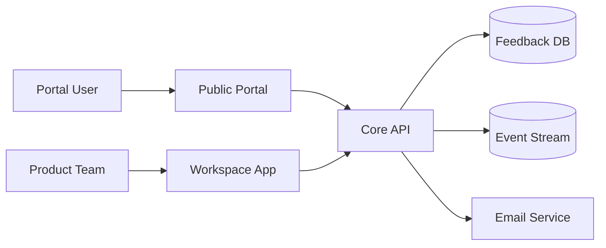
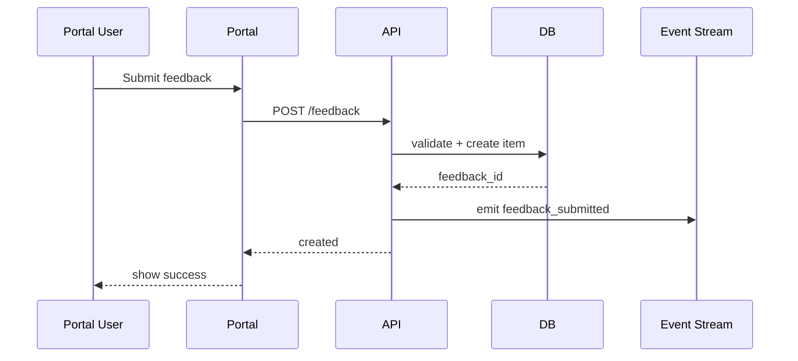
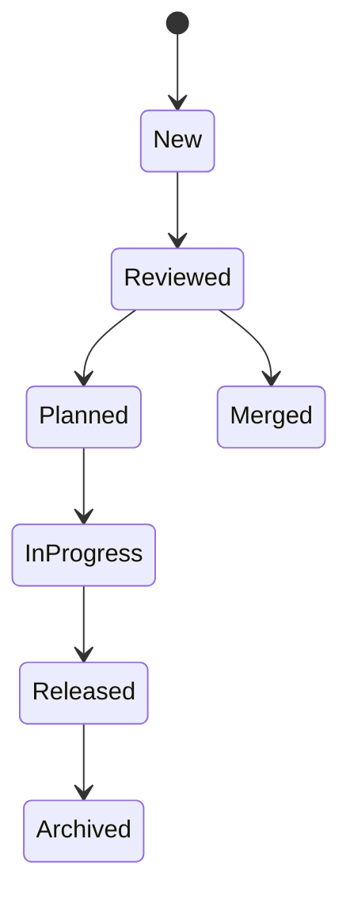

# FUNCTIONAL SPECIFICATIONS (LITE)
# SignalDesk

> **Phiên bản:** 1.0 | **Ngày:** 12/05/2026
> **Trạng thái:** Draft | **Tham chiếu:** BRD v1.0

> ⚠️ **Product Note:** Tài liệu này chỉ cover các feature phức tạp hơn user story thường: duplicate merge, notification, release note linking, analytics events.

---

## 1. Tổng quan

### 1.1. Mục đích
Mô tả kỹ thuật chi tiết cho các tính năng có nhiều rule, nhiều integration, hoặc cần traceability đo lường.

### 1.2. Tài liệu tham chiếu
- `01-Vision-Scope.md`
- `02-BRD.md`
- `04-User-Flow.md`
- `06-User-Story-Map.md`

### 1.3. Kiến trúc chức năng

### 1.4. Actors & Scope

| Actor | Goal | Key flows |
|---|---|---|
| Portal User | Submit feedback, upvote, subscribe | FR-101, FR-102 |
| Product Manager | Triage, merge, publish | FR-201, FR-202, FR-301 |
| Customer Success Lead | Share status and release proof | FR-202, FR-302 |
| System Scheduler | Trigger notifications and release publication | FR-302 |

---

## 2. Functional Specifications

### 2.1. Feedback portal submission

| Mã | Requirement | Mô tả chi tiết | Ref BRD | Actor | Ref Story |
|---|---|---|---|---|---|
| FR-101 | Submit feedback item | Precondition: portal public đang active. Trigger: portal user gửi feedback. Main flow: nhập title, description, category, email. Exception: thiếu title hoặc email invalid. Postcondition: hệ thống tạo feedback ở status `New` và phát event `feedback_submitted`. | BR-001 | Portal User | US-001 |
| FR-102 | Upvote existing feedback | Precondition: feedback item đang public. Trigger: portal user nhấn upvote. Main flow: hệ thống kiểm tra unique vote theo workspace và email/account. Exception: user đã upvote trước đó. Postcondition: hệ thống tăng vote_count lên 1. Postcondition 2: hệ thống ghi event `feedback_upvoted`. | BR-001, BIZ-01 | Portal User | US-002 |

**Validation Rules**
- VR-101: `title` từ 5 đến 120 ký tự.
- VR-102: `description` tối đa 2.000 ký tự.
- VR-103: cùng một email không được upvote cùng feedback item quá 1 lần.

**Sequence**

### 2.2. Duplicate merge & triage

| Mã | Requirement | Mô tả chi tiết | Ref BRD | Actor | Ref Story |
|---|---|---|---|---|---|
| FR-201 | Suggest duplicate candidates | Precondition: feedback mới vào inbox. Trigger: PM mở feedback detail. Main flow: hệ thống hiển thị candidate duplicates theo title similarity, shared tags, semantic keywords. Exception: score dưới threshold thì không gợi ý. Postcondition: PM thấy danh sách candidate kèm confidence score. | BR-002 | Product Manager | US-003 |
| FR-202 | Merge duplicate feedback | Precondition: PM có quyền merge. Trigger: PM chọn parent item và child item. Main flow: hệ thống chuyển vote, subscriber, link history từ child sang parent; hệ thống đóng child với trạng thái `Merged`. Exception: PM chọn 2 item ở 2 workspace khác nhau. Postcondition: chỉ còn parent item active, audit history đầy đủ, event `feedback_merged` được phát. | BR-002, BIZ-02 | Product Manager | US-003 |

### 2.3. Status notification & release notes

| Mã | Requirement | Mô tả chi tiết | Ref BRD | Actor | Ref Story |
|---|---|---|---|---|---|
| FR-301 | Update public status | Precondition: feedback item đang active. Trigger: PM đổi status. Main flow: hệ thống kiểm tra status hợp lệ, lưu status history, cập nhật public portal. Exception: người dùng không có quyền public-facing status. Postcondition: hệ thống phát event `feedback_status_changed` và lưu audit log. | BR-003, BIZ-03, BIZ-05 | Product Manager | US-005 |
| FR-302 | Notify subscribers on status change | Precondition: feedback item có subscriber. Trigger: FR-301 thành công. Main flow: hệ thống tạo notification job; hệ thống gửi email hoặc in-app update. Exception: email bounce hoặc unsubscribed. Postcondition: hệ thống lưu notification status để retry/reporting. | BR-003 | System Scheduler | US-005 |
| FR-303 | Link release note to delivered feedback | Precondition: PM tạo release note draft. Trigger: PM publish release note. Main flow: PM chọn feedback items đã `Released`; hệ thống gắn release note; hệ thống set `publish_at`; hệ thống phát event `release_note_published`. Exception: feedback chưa ở trạng thái Released. Postcondition: release note public hiển thị linked feedback trên portal. | BR-004, BR-005, BIZ-04 | Product Manager | US-006 |

### 2.4. Data model summary

| Entity | Purpose | Key fields |
|---|---|---|
| FeedbackItem | Item feedback gốc | feedback_id, title, description, status, vote_count |
| FeedbackVote | Vote theo user/email | feedback_id, voter_key, created_at |
| FeedbackMerge | Audit merge history | parent_feedback_id, child_feedback_id, merged_by |
| FeedbackStatusHistory | Lịch sử status | feedback_id, from_status, to_status, changed_by |
| ReleaseNote | Changelog item public | release_id, title, publish_at, workspace_id |

### 2.5. State machine

---

## 3. Yêu cầu Phi chức năng (NFR)

| ID | Loại | Yêu cầu | Chỉ tiêu | Cách xác minh |
|----|------|---------|----------|---------------|
| NFR-001 | Performance | Portal feedback submit phải phản hồi trong ngưỡng chấp nhận | ≤ 300ms p95 | Load test |
| NFR-002 | Performance | Duplicate candidate list phải load được với 5.000 feedback items | ≤ 2 giây | Benchmark |
| NFR-003 | Availability | Trong giờ vận hành, public portal phải phục vụ thành công >= 99.9% request hợp lệ mỗi tháng | ≥ 99.9% | Monitoring |
| NFR-004 | Security | Portal public phải chống spam mức cơ bản | Rate limit + email verification | Abuse test |
| NFR-005 | Security | Khi user không thuộc vai trò PM/Admin, hệ thống phải chặn thao tác merge hoặc publish | RBAC enforced | Permission tests |
| NFR-006 | Audit | Mọi status transition và merge phải có log | 100% mutation logged | Audit review |
| NFR-007 | Eventing | Mọi flow chính phải phát tracking event đúng schema | 100% required events present | Analytics QA |
| NFR-008 | Data | Notification retries phải tránh gửi trùng quá 1 lần cho cùng event | Idempotent delivery key | Integration test |
| NFR-009 | Compliance | Portal user phải có thể unsubscribe notification | 1-click unsubscribe | UX + integration test |

### 3.1. NFR Applicability

| NFR | Applies to | Risk if unmet |
|---|---|---|
| NFR-001, NFR-002 | Portal, inbox, merge | Activation drop, PM churn |
| NFR-004, NFR-005, NFR-006 | Portal, admin flows | Spam, data trust issues |
| NFR-007, NFR-008, NFR-009 | Notification, release notes, analytics | Không đo được value, user distrust |

---

## 4. Integration Specifications

| # | External Service | Purpose | Protocol | Auth | Error handling |
|---|-----------------|---------|----------|------|----------------|
| 1 | Email Service | Status notification | REST API | API Key | Retry 2 lần, dead-letter sau đó |
| 2 | Mixpanel | Event tracking | HTTPS | Token | Queue nếu fail, retry async |
| 3 | Feature Flag Service | Gradual rollout | SDK/API | Server key | Default safe-off |

---

## 5. Phân quyền (RBAC)

| Role | Permissions | Scope |
|------|-----------|-------|
| **Admin** | Full access, merge, publish | All workspace resources |
| **PM** | Triage, merge, publish, analytics view | Workspace |
| **CS Lead** | View feedback, comment, share release notes | Workspace |
| **Portal User** | Submit, upvote, subscribe, view public status | Public portal |
