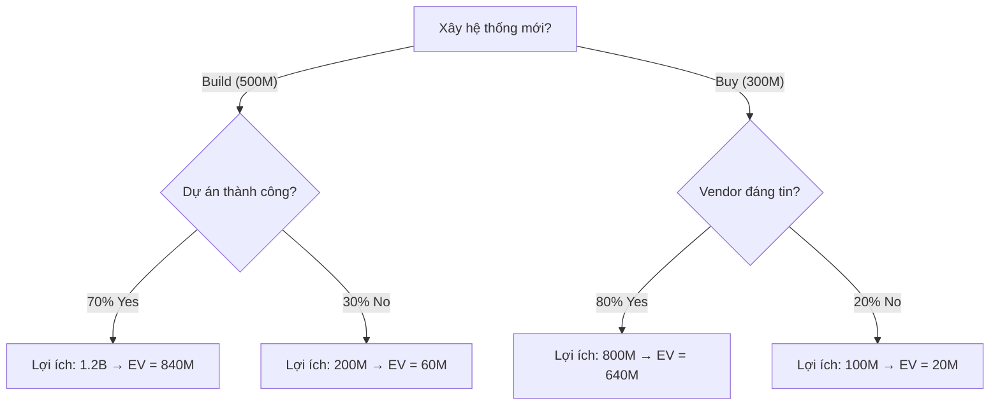

# DECISION ANALYSIS FRAMEWORK — Khung Phân Tích Ra Quyết Định (v3.3)

> **BABOK KA:** Strategy Analysis + Requirements Analysis & Design Definition
> **Mục đích:** Giúp BA dẫn dắt stakeholder ra quyết định DỰA TRÊN DATA, không dựa trên cảm tính.
> **Khi nào dùng:** Khi stakeholder hỏi "Em chọn giúp anh", hoặc có ≥ 2 phương án cần so sánh.

---

## 1. Decision Analysis Toolkit — 4 Công cụ

### 1.1 Weighted Scoring Matrix (Phổ biến nhất)

**Khi nào:** So sánh ≥ 2 phương án với ≥ 3 tiêu chí

**Template:**

| Tiêu chí | Weight (%) | Option A | Option B | Option C |
|----------|:---:|:---:|:---:|:---:|
| {{Tiêu chí 1}} | {{W1}}% | {{Score 1-10}} | {{Score 1-10}} | {{Score 1-10}} |
| {{Tiêu chí 2}} | {{W2}}% | {{Score}} | {{Score}} | {{Score}} |
| {{Tiêu chí 3}} | {{W3}}% | {{Score}} | {{Score}} | {{Score}} |
| **TOTAL** | **100%** | **{{Weighted}}** | **{{Weighted}}** | **{{Weighted}}** |

**Cách tính:** `Weighted Score = Σ (Score × Weight / 100)`

**Ví dụ thực tế — Cloud vs On-Premise:**

| Tiêu chí | Weight | Cloud | On-Prem |
|----------|:---:|:---:|:---:|
| Chi phí 5 năm (TCO) | 30% | 8 | 6 |
| Bảo mật & Compliance | 25% | 7 | 9 |
| Scalability | 20% | 9 | 5 |
| Team Skill Available | 15% | 8 | 7 |
| Vendor Lock-in Risk | 10% | 5 | 8 |
| **TOTAL** | **100%** | **7.55** | **6.85** |

> **Kết luận:** Cloud (7.55) > On-Prem (6.85). 
> **Sensitivity:** Nếu stakeholder tăng weight Bảo mật lên 40% → On-Prem thắng.

---

### 1.2 Pugh Matrix (So sánh với Baseline)

**Khi nào:** Có 1 phương án "chuẩn" (baseline) và cần so với alternatives

| Tiêu chí | Baseline (Hệ thống cũ) | Option A | Option B |
|----------|:---:|:---:|:---:|
| Tốc độ xử lý | 0 | +1 | +2 |
| Chi phí triển khai | 0 | -1 | -2 |
| Dễ sử dụng | 0 | +1 | +1 |
| Bảo trì | 0 | +1 | 0 |
| **Tổng (+)** | **0** | **3** | **3** |
| **Tổng (-)** | **0** | **1** | **2** |
| **Net** | **0** | **+2** | **+1** |

> `+1` = tốt hơn baseline, `0` = bằng, `-1` = kém hơn

---

### 1.3 Cost-Benefit Analysis (CBA)

**Khi nào:** Cần justify budget cho Sponsor/C-level

| Hạng mục | Year 0 | Year 1 | Year 2 | Year 3 |
|---------|:------:|:------:|:------:|:------:|
| **Chi phí** | | | | |
| Phát triển | {{$}} | — | — | — |
| License/Hosting | — | {{$}} | {{$}} | {{$}} |
| Training | {{$}} | — | — | — |
| **Tổng chi phí** | **{{$}}** | **{{$}}** | **{{$}}** | **{{$}}** |
| **Lợi ích** | | | | |
| Tiết kiệm nhân công | — | {{$}} | {{$}} | {{$}} |
| Giảm lỗi/phạt | — | {{$}} | {{$}} | {{$}} |
| Tăng doanh thu | — | {{$}} | {{$}} | {{$}} |
| **Tổng lợi ích** | **{{$}}** | **{{$}}** | **{{$}}** | **{{$}}** |
| **ROI lũy kế** | **-{{$}}** | **{{$}}** | **{{$}}** | **{{$}}** |

**Key Metrics:**
- **Payback Period:** Tháng nào ROI lũy kế > 0?
- **3-Year ROI (%):** `(Tổng lợi ích - Tổng chi phí) / Tổng chi phí × 100`

---

### 1.4 Decision Tree (Cho quyết định có điều kiện)

**Khi nào:** Quyết định phụ thuộc vào kịch bản (probability-based)



**Expected Value:**
- **Build:** `(840M + 60M) - 500M = 400M`
- **Buy:** `(640M + 20M) - 300M = 360M`
- **Kết luận:** Build có EV cao hơn (400M > 360M), nhưng rủi ro cao hơn.

---

## 2. Decision Report Template

```markdown
# 📋 BÁO CÁO PHÂN TÍCH QUYẾT ĐỊNH: [Tên quyết định]

> **Ngày:** [DD/MM/YYYY] | **BA:** [Tên] | **Stakeholder quyết định:** [Tên]

## Bối cảnh
[Tại sao cần quyết định? Deadline?]

## Các phương án

| # | Phương án | Mô tả ngắn | Ưu điểm chính | Nhược điểm chính |
|---|----------|-----------|--------------|-----------------|

## Phân tích (dùng 1 trong 4 tools trên)
[Weighted Scoring / Pugh / CBA / Decision Tree]

## Khuyến nghị
**Phương án đề xuất:** [X]
**Lý do:** [Data-driven rationale]
**Sensitivity:** [Điều kiện nào thay đổi sẽ khiến khuyến nghị đổi?]

## Quyết định
| Người quyết định | Chọn | Ngày | Ghi chú |
|---|---|---|---|
```

---

## 3. Chọn Tool Nào?

| Tình huống | Tool phù hợp | Đối tượng trình bày |
|-----------|-------------|-------------------|
| So sánh ≥ 2 phương án (≥ 3 tiêu chí) | **Weighted Scoring** | PO, Tech Lead |
| So sánh với hệ thống hiện tại | **Pugh Matrix** | Dev Team |
| Justify budget / đầu tư | **CBA + ROI** | Sponsor, CFO |
| Quyết định có xác suất / rủi ro | **Decision Tree** | PM, Risk Owner |
| Quyết định đơn giản 2 option | **Pros/Cons List** | Bất kỳ |

---

## 4. Lệnh Kích hoạt

```
@ba-specialist phân tích quyết định: [Option A] vs [Option B] dựa trên tiêu chí [X, Y, Z]
@ba-specialist tạo CBA cho phương án [X] với ngân sách [Y]
@ba-specialist so sánh phương án hiện tại với [alternatives] bằng Pugh Matrix
```
