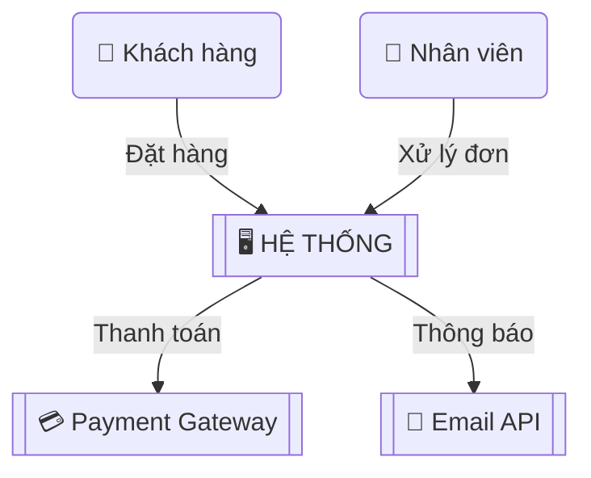
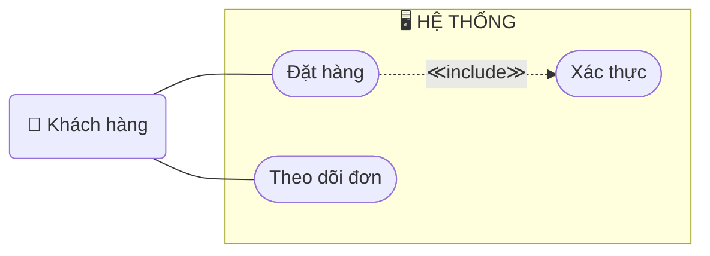
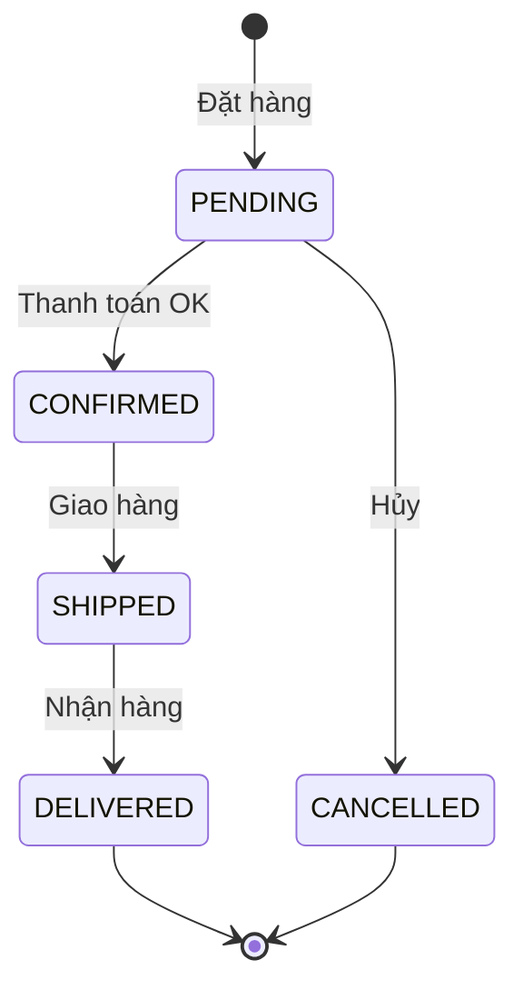

# HƯỚNG DẪN VẼ SƠ ĐỒ BA

> **Mục đích:** Chuẩn hóa cách vẽ sơ đồ trong tài liệu BA
> **Công cụ:** Mermaid (trong Markdown), draw.io, Miro, PlantUML
> **Tham chiếu chi tiết:** `so_do.md` (file gốc với ví dụ thực chiến đầy đủ)

---

## 1. Tổng hợp — Sơ đồ nào dùng ở đâu?

| Sơ đồ | Tài liệu | Câu hỏi trả lời | Khi nào vẽ | Ai đọc |
|-------|----------|-----------------|-----------|--------|
| **Context Diagram** | Vision & Scope | Hệ thống tương tác với ai? | Inception | Sponsor, PO |
| **Use Case Diagram** | BRD, SRS | User làm gì với hệ thống? | Inception/Discovery | PO, Dev |
| **Activity Diagram** (Swimlane) | Process Flow | Quy trình chạy thế nào? | Discovery | SME, Dev, QC |
| **Sequence Diagram** | SRS | Hệ thống gọi nhau thế nào? | Elaboration | Dev |
| **State Diagram** | SRS, Data Model | Trạng thái chuyển thế nào? | Elaboration | Dev, QC |
| **ERD** | Data Model | Dữ liệu quan hệ thế nào? | Elaboration | Dev, DBA |
| **User Journey Map** | Vision & Scope | Trải nghiệm user ra sao? | Discovery | PO, UX |
| **Decision Flowchart** | SRS (Business Rules) | Logic rẽ nhánh thế nào? | Elaboration | Dev, QC |
| **Gantt Chart** | Vision & Scope, BRD | Timeline dự án? | Inception | PM, Sponsor |

---

## 2. Mermaid — Cú pháp tham chiếu nhanh

### Hình dạng (Shapes)

| Hình dạng | Cú pháp | Dùng cho |
|----------|--------|---------|
| Chữ nhật | `A["Text"]` | Hành động, bước xử lý |
| Bo tròn | `A("Text")` | Actor, bước mềm |
| Viên thuốc | `A(["Text"])` | Use Case |
| Hình thoi | `A{"Text"}` | Quyết định / rẽ nhánh |
| Hình tròn | `A(("Text"))` | Start |
| Hình tròn lớn | `A((("Text")))` | End |
| Viền kép | `A[["Text"]]` | Hệ thống / Sub-process |
| Hình trụ | `A[("Text")]` | Database |

### Đường nối

| Loại | Cú pháp | Ý nghĩa |
|------|---------|---------|
| Mũi tên | `A --> B` | Luồng đi |
| Có nhãn | `A -->\|"nhãn"\| B` | Luồng + mô tả |
| Nét đứt | `A -.-> B` | Tùy chọn, include/extend |
| Đường đậm | `A ==> B` | Luồng chính / nhấn mạnh |

---

## 3. Quy tắc vẽ chung

### ✅ Nên

| Quy tắc | Lý do |
|---------|-------|
| **1 diagram = 1 mục đích** | Tránh nhồi nhét hết vào 1 sơ đồ |
| **Tối đa 7-10 node chính** | Dễ đọc, dễ hiểu |
| **Luôn ghi nhãn mũi tên** | Người đọc biết dữ liệu gì di chuyển |
| **Happy path đi THẲNG** | Exception rẽ NGANG |
| **Viết label rõ ràng** | "Đặt hàng, Tra cứu" thay vì "tương tác" |
| **Dùng icon emoji cho Actor** | 👤 🖥️ 💳 📧 → nhanh nhận biết |

### ❌ Tránh

| Sai lầm | Sửa |
|---------|-----|
| Không có Start/End | Luôn có `(("●"))` / `((("◎")))` |
| Decision thiếu nhánh | Mỗi hình thoi phải có ĐỦ nhánh |
| Quá nhiều chi tiết | Tách thành nhiều diagram con |
| Mũi tên không nhãn | Mọi mũi tên phải có mô tả |

---

## 4. Hướng dẫn vẽ nhanh theo từng loại

### Context Diagram

```
Bước 1: Hệ thống chính ở GIỮA → [["🖥️ Tên"]]
Bước 2: Actor + External System ở XUNG QUANH → ("👤 Tên")
Bước 3: Mũi tên ghi DỮ LIỆU di chuyển (không phải tên chức năng)
Giới hạn: 4-6 actor + 3-5 hệ thống ngoài
```

### Use Case Diagram

```
Bước 1: Xác định Actor — "Ai ĐĂNG NHẬP? Ai NHẬP DỮ LIỆU?"
Bước 2: Liệt kê Use Case — "Actor muốn LÀM GÌ?" → Động từ + Danh từ
Bước 3: Tìm include/extend
         - include: bước BẮT BUỘC bên trong  → -.-> ≪include≫
         - extend: tính năng TÙY CHỌN        → -.-> ≪extend≫
Giới hạn: 7-10 UC / diagram, tách module nếu nhiều hơn
```

### Activity Diagram (Swimlane)

```
Bước 1: Thu thập quy trình (phỏng vấn SME, quan sát, workshop)
Bước 2: 8 câu hỏi vàng:
         1. Bắt đầu khi nào?  → Start
         2. Bước tiếp theo?    → Flow
         3. Đi khác đường?     → Decision ◇
         4. Ai thực hiện?      → Swimlane
         5. Lỗi thì sao?      → Exception
         6. Kết thúc khi nào?  → End
         7. Hệ thống tự làm?  → Automation
         8. Cần thông tin gì?  → Data
Bước 3: Vẽ Happy Path trước → Decision → Exception → Swimlane → Start/End
```

### Sequence Diagram

```
Bước 1: Sắp participant trái → phải:
         User → Frontend → Backend → Database → External API
Bước 2: Request ->> (liền), Response -->> (đứt)
         Ghi rõ: POST /api/v1/orders (không chỉ "gửi request")
Bước 3: Nhánh:
         alt = if/else, opt = tùy chọn, loop = lặp
```

### State Diagram

```
Bước 1: Đối tượng có NHIỀU TRẠNG THÁI? → Đơn hàng, Ticket, Hợp đồng
Bước 2: Liệt kê trạng thái — ĐẦU, GIỮA, CUỐI
Bước 3: Chuyển đổi — "Sang trạng thái NÀO? HÀNH ĐỘNG gì? QUAY LẠI được?"
Đặt tên: PENDING, APPROVED, CANCELLED (viết HOA, khớp enum trong code)
```

### ERD

```
Bước 1: Danh từ quan trọng = Entity (Customer, Order, Product)
Bước 2: "1 [A] có BAO NHIÊU [B]?"
         1:N → ||--o{
         Bắt buộc → ||--|{
         N:M → }o--o{ (cần bảng trung gian)
Bước 3: Attribute mặc định: id (PK), created_at, updated_at, deleted_at, FK
```

---

## 5. Ví dụ mẫu nhanh

### Context Diagram



### Use Case (rút gọn)



### State (rút gọn)



---

> 📖 **Ví dụ chi tiết đầy đủ** cho từng loại sơ đồ: xem file `so_do.md` trong workspace.
