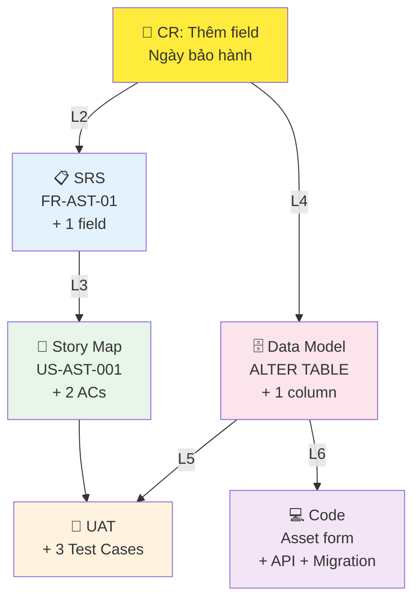
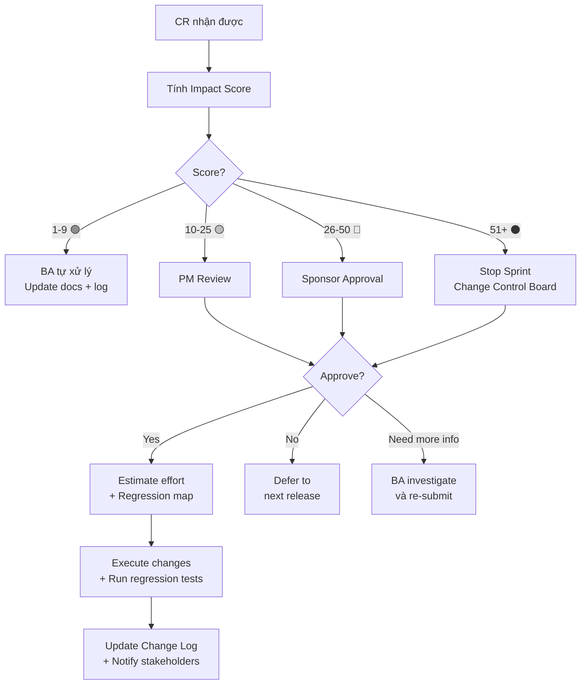

# HƯỚNG DẪN PHÂN TÍCH ẢNH HƯỞNG (Impact Analysis Guide 3.3)

> **Mục đích:** Đánh giá IMPACT khi có Change Request, đảm bảo mọi tác động được phát hiện và quản lý.
> **Nguyên tắc:** Một thay đổi nhỏ ở thượng nguồn (BRD) có thể gây sóng thần ở hạ nguồn (UAT/Code).
> **Có gì mới v3.3:** Impact Scoring Matrix, Ripple Effect Tree, Regression Mapping, Decision Flowchart.

---

## 1. Ma trận Truy vết (Traceability Matrix)

Khi một yêu cầu thay đổi, @ba-specialist thực hiện quét theo luồng sau:

| Level | Tài liệu | Ảnh hưởng tiềm năng |
|---|---|---|
| **L0: Vision** | `01-Vision-Scope.md` | Thay đổi mục tiêu kinh doanh, OKRs, phạm vi tổng thể. |
| **L1: Business** | `02-BRD.md` | Thay đổi quy trình nghiệp vụ, luật kinh doanh (Business Rules). |
| **L2: System** | `05-SRS.md` | Thay đổi tính năng kỹ thuật, API, Non-functional requirements. |
| **L3: Agile** | `User Story Map` | Thay đổi Acceptance Criteria, độ ưu tiên Story, Release plan. |
| **L4: Data** | `07-Data-Model.md` | Thay đổi schema, thêm/sửa field, ảnh hưởng tới báo cáo. |
| **L5: Testing** | `08-UAT-Plan.md` | Test case cũ không còn đúng, cần tạo bộ test mới. |
| **L6: Code** | Source Code | File code bị ảnh hưởng (via code-traceability-audit). |

---

## 2. Impact Scoring Matrix ⭐ NEW v3.3

> **Mục đích:** Lượng hóa mức ảnh hưởng bằng điểm số → giúp PM ra quyết định Approve/Defer/Reject.

### 2.1 Công thức

```
Impact Score = Scope × Severity × Urgency

| Factor   | 1 (Low)        | 3 (Medium)         | 5 (High)           |
|----------|----------------|--------------------|--------------------|
| Scope    | 1 doc/module   | 2-3 docs/modules   | ≥ 4 docs/modules   |
| Severity | Cosmetic fix   | Logic change       | Architecture change |
| Urgency  | Next release   | This sprint        | Hotfix (today)      |
```

### 2.2 Phân loại Impact Level

| Impact Score | Level | Action | Approver |
|:---:|:---:|---|---|
| **1 - 9** | 🟢 **Low** | BA tự xử lý, ghi vào Change Log | BA |
| **10 - 25** | 🟡 **Medium** | Cần PM review + effort estimate | PM |
| **26 - 50** | 🔴 **High** | Cần Sponsor approval + regression plan | Sponsor |
| **51 - 125** | ⚫ **Critical** | Stop sprint, convene Change Control Board | CCB |

### 2.3 Ví dụ thực tế

```
CR: "Thêm field Ngày hết hạn bảo hành cho Tài sản"
  Scope:    3 (SRS + Data Model + Story Map)
  Severity: 3 (Logic change — thêm validation + display)
  Urgency:  1 (Next release)
  Score:    3 × 3 × 1 = 9 → 🟢 Low → BA tự xử lý

CR: "Thay đổi kiến trúc từ Monolith sang Microservices"
  Scope:    5 (ALL docs affected)
  Severity: 5 (Architecture change)
  Urgency:  3 (This sprint — deadline áp lực)
  Score:    5 × 5 × 3 = 75 → ⚫ Critical → Stop sprint + CCB
```

---

## 3. Ripple Effect Tree ⭐ NEW v3.3

> **Mục đích:** Visualize chuỗi tác động dây chuyền (cascade effect) của 1 thay đổi.

### Template Mermaid



---

## 4. Regression Mapping ⭐ NEW v3.3

> **Mục đích:** Khi FR thay đổi → xác định CHÍNH XÁC test case nào cần re-run.

| FR Changed | Related Stories | Test Cases to Re-run | Estimated Re-test Time |
|-----------|----------------|---------------------|:----------------------:|
| FR-AST-01 (Thêm tài sản) | US-AST-001 | TC-AST-001, TC-AST-002, TC-AST-003 | 2 giờ |
| FR-AST-03 (Xem chi tiết) | US-AST-003 | TC-AST-006 | 30 phút |
| NFR-PERF-001 (API Speed) | ALL stories | TC-PERF-001 (load test) | 1 giờ |
| **TOTAL** | | **5 TCs** | **3.5 giờ** |

---

## 5. Change Decision Flowchart ⭐ NEW v3.3



---

## 6. Impact Report Template ⭐ NEW v3.3

```markdown
# 📊 BÁO CÁO PHÂN TÍCH ẢNH HƯỞNG

> **CR ID:** CR-[NNN] | **Ngày:** [DD/MM/YYYY] | **BA:** [Tên]
> **Mô tả thay đổi:** [1-2 câu]

## Impact Score
| Factor | Value | Justification |
|--------|:-----:|-------------|
| Scope | [1-5] | [Docs/modules ảnh hưởng] |
| Severity | [1-5] | [Loại thay đổi] |
| Urgency | [1-5] | [Timeline] |
| **TOTAL** | **[Score]** | **[Level: 🟢/🟡/🔴/⚫]** |

## Ripple Effect
[Mermaid diagram hoặc bảng]

## Affected Items
| # | Document | Section/ID | Change Needed | Effort |
|---|----------|-----------|:------------:|:------:|
| 1 | SRS | FR-AST-01 | Add field | 1h |
| 2 | Data Model | Entity: Asset | ALTER TABLE | 30m |
| 3 | Story Map | US-AST-001 | Add 2 ACs | 45m |
| 4 | UAT | TC-AST-001-003 | Rewrite 3 TCs | 1h |

## Regression Test Plan
| TC ID | Re-run? | Priority | Est. Time |
|-------|:-------:|:--------:|:---------:|

## Recommendation
[Approve / Defer / Reject + Rationale]

## Total Estimated Effort: [X giờ]
```

---

## 7. Tích hợp với Traceability Validator

Khi chạy Impact Analysis, agent tự động trigger:

```
1. Traceability Validator → scan forward chain (BRQ→FR→US→TC)
2. Mark ALL items in chain as "Needs Review"
3. Auto-generate Regression Map từ chain data
4. Nếu có BROKEN_CHAIN → flag trong Impact Report
```

---

## 8. Lệnh Audit Ảnh hưởng

```
@ba-specialist phân tích ảnh hưởng khi thay đổi [FR/BRQ ID] trong [file]
@ba-specialist tính impact score cho CR: [mô tả thay đổi]
@ba-specialist vẽ ripple effect tree cho thay đổi [X]
@ba-specialist tạo regression test map khi [FR-xxx] thay đổi
@ba-specialist kiểm tra nhất quán giữa [Doc A] và [Doc B] sau CR
@ba-specialist quét toàn bộ project tìm requirements mâu thuẫn
```
