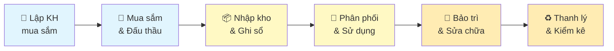
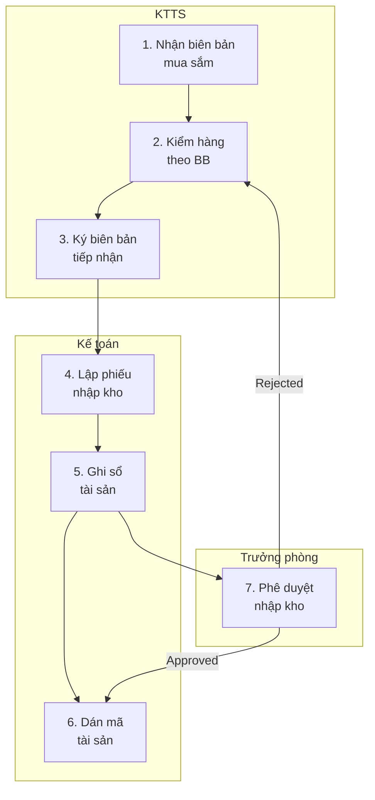

# PROCESS DECOMPOSITION GUIDE — Phân rã Quy trình theo Level (v3.3)

> **Mục đích:** Hướng dẫn BA phân rã quy trình từ tổng quan (L0) đến chi tiết (L3).
> **Vấn đề:** As-Is Process chỉ có 1 level swimlane → BA không biết khi nào đã đủ chi tiết.
> **BABOK KA:** Elicitation & Collaboration + Requirements Analysis

---

## 1. Process Hierarchy — 4 Levels

| Level | Tên | Độ chi tiết | Đối tượng đọc | Ví dụ |
|:-----:|------|-----------|-------------|-------|
| **L0** | Value Chain | Chuỗi giá trị toàn doanh nghiệp | C-Level, Sponsor | "Mua sắm → Nhập kho → Sử dụng → Thanh lý" |
| **L1** | Process Group | Nhóm quy trình trong 1 domain | PM, PO | "Nhập kho" = Tiếp nhận + Kiểm tra + Ghi sổ + Phân phối |
| **L2** | Process Detail | Các bước chi tiết trong 1 process | BA, Dev Lead | "Tiếp nhận" = Nhận biên bản → Kiểm hàng → Ký nhận → Nhập hệ thống |
| **L3** | Task/Work Instruction | Hướng dẫn từng thao tác | End User, QC | "Nhập hệ thống" = Mở form → Chọn loại → Điền 8 fields → Nhấn Lưu |

---

## 2. Khi nào dùng Level nào?

| Tình huống | Level cần | Tại sao |
|-----------|:---------:|---------|
| Pitch cho Sponsor / Project Charter | L0 | Sponsor chỉ cần big picture |
| BRD — As-Is / To-Be Process | L1 + L2 | PO cần hiểu nhóm process + chi tiết đủ để phát hiện pain points |
| SRS — Use Case / Activity Diagram | L2 + L3 | Dev cần biết chính xác từng bước để code |
| User Story Map — AC | L3 | QC cần biết từng thao tác để test |
| Training Manual / User Guide | L3 | End user cần hướng dẫn step-by-step |

---

## 3. Templates cho Từng Level

### 3.1 L0 — Value Chain Diagram



### 3.2 L1 — Process Group Map

```markdown
## Quy trình: Nhập kho & Ghi sổ (L1)

| # | Sub-process | Owner | Trigger | Output |
|---|------------|-------|---------|--------|
| 1.1 | Tiếp nhận hàng hóa | KTTS | Biên bản mua sắm | Biên bản tiếp nhận |
| 1.2 | Kiểm tra chất lượng | QC | Biên bản tiếp nhận | Phiếu kiểm tra |
| 1.3 | Ghi sổ tài sản | Kế toán | Phiếu kiểm tra PASS | Sổ tài sản cập nhật |
| 1.4 | Phân phối về khoa | KTTS | Sổ tài sản | Phiếu xuất kho |
```

### 3.3 L2 — Process Detail (Swimlane)



### 3.4 L3 — Task/Work Instruction

```markdown
## Work Instruction: "Ghi sổ tài sản" (L3 — Bước 5 trong L2)

| Step | Action | Input | System | Output | Time |
|:----:|--------|-------|--------|--------|:----:|
| 5.1 | Mở module "Quản lý Tài sản" | Phiếu nhập kho | Click menu → Tài sản → Thêm mới | Form nhập tài sản | 10s |
| 5.2 | Chọn "Loại tài sản" từ dropdown | Thông tin trên phiếu | Dropdown: TSCĐ / CCDC / VTYT | Field "Loại" được fill | 5s |
| 5.3 | Điền thông tin: Tên, Mã, Model, Hãng SX, Giá | Phiếu nhập kho | 8 required fields | Validation real-time | 2 min |
| 5.4 | Upload ảnh tài sản (nếu có) | Camera/file ảnh | Drag & drop, max 5MB, JPG/PNG | Preview thumbnail | 30s |
| 5.5 | Nhấn "Lưu" | — | Validate → Save → Generate Mã TS | Toast "Tạo thành công" + Mã TS | 3s |
| 5.6 | In tem QR tài sản | Mã TS vừa tạo | Button "In QR" → Printer | Tem QR có Mã TS | 15s |
```

---

## 4. Decomposition Rules — Khi nào cần đi sâu thêm 1 level?

| Signal | Action |
|--------|--------|
| 1 bước mất ≥ 30 phút | → Decompose thêm 1 level |
| 1 bước có ≥ 2 người tham gia | → Tách theo actor (swimlane) |
| 1 bước có decision point (IF/ELSE) | → Tách thành branches |
| 1 bước có exception handling | → Tách Happy path + Exception |
| Dev nói "chưa hiểu bước này" | → Cần L3 |
| User nói "bước này phức tạp lắm" | → Cần L2 hoặc L3 |

### Quy tắc Dừng (When to STOP decomposing)

| Stop khi... | Lý do |
|-------------|-------|
| Mỗi bước ≤ 5 phút thực hiện | Đủ chi tiết cho Dev |
| Mỗi bước = 1 actor + 1 action + 1 output | Testable |
| Dev xác nhận "hiểu đủ để code" | Đạt mục đích |
| Over-decompose → micro-management | Phản tác dụng |

---

## 5. Áp dụng vào Tài liệu BA

| Tài liệu | Level thường dùng | Khi nào cần deeper |
|-----------|:-----------------:|-------------------|
| **Vision & Scope** | L0 + L1 | Khi Sponsor hỏi "quy trình lớn gì?" |
| **BRD** (As-Is / To-Be) | L1 + L2 | Khi pain point nằm sâu trong L2 |
| **SRS** (Activity Diagram) | L2 + L3 | Khi logic phức tạp, nhiều branching |
| **User Story Map** | L2 → L3 | Khi viết AC cần biết chính xác steps |
| **UAT Plan** | L3 | Test cases cần step-by-step |

---

## 6. Lệnh Kích hoạt

```
@ba-specialist phân rã quy trình [X] từ L0 đến L2
@ba-specialist vẽ swimlane L2 cho quy trình [Y]
@ba-specialist viết work instruction L3 cho bước [Z]
@ba-specialist kiểm tra: quy trình này đã đủ chi tiết chưa?
```
