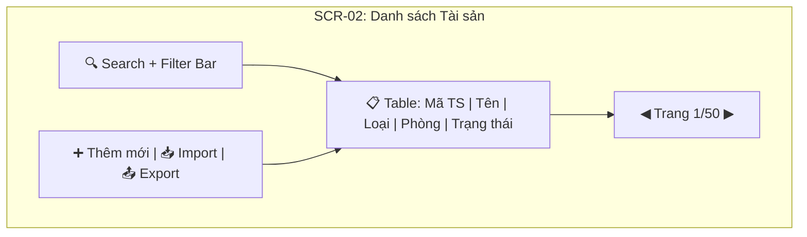

# SCREEN INVENTORY & WIREFRAME GUIDE (v3.0)

> **Mục đích:** Đảm bảo mỗi Feature được phân tích phải có danh sách màn hình (Screen Inventory) và wireframe tương ứng.
> **Trigger:** Khi viết Feature Spec hoặc SRS — agent PHẢI liệt kê screens trước khi viết chi tiết.
> **Triết lý:** "Nếu không vẽ được, nghĩa là chưa hiểu rõ."

---

## 1. Screen Inventory — Quy trình

```
Feature nhận được → Liệt kê TẤT CẢ screens cần thiết → Gán mục đích mỗi screen
  → Vẽ wireframe (StitchMCP hoặc Mermaid Mockup)
  → Review: Dev/UX đồng thuận → Tiến hành viết SRS chi tiết
```

**Quy tắc:**
- Mỗi Feature (F01-Fxx) phải có **≥ 1 screen** trong Screen Inventory
- Mỗi screen phải ghi rõ: Tên, Mục đích, Actor chính, Dữ liệu hiển thị
- Screens phức tạp (form > 5 fields, table > 5 columns, dashboard) **PHẢI có wireframe**

---

## 2. Phân loại Screen Types

| Type | Mô tả | Ví dụ | Cần Wireframe? |
|------|--------|-------|:---:|
| **List/Table** | Hiển thị danh sách dữ liệu với filter/sort/search | Danh sách tài sản, DS nhân viên | ✅ Nếu > 5 cột |
| **Form/Input** | Thu thập dữ liệu từ user | Form tạo tài sản, Đăng ký tài khoản | ✅ Nếu > 5 fields |
| **Detail/View** | Hiển thị chi tiết 1 record | Chi tiết tài sản, Profile user | ✅ Nếu có tabs/sections |
| **Dashboard** | Tổng hợp KPIs, charts, widgets | Dashboard quản lý, Báo cáo tổng hợp | ✅ Luôn luôn |
| **Dialog/Modal** | Popup xác nhận hoặc nhập nhanh | Confirm xóa, Quick edit | ⚠️ Nếu có form bên trong |
| **Wizard/Stepper** | Quy trình nhiều bước | Import Excel, Setup lần đầu | ✅ Luôn luôn |
| **Report/Print** | Layout in ấn hoặc export | Biên bản kiểm kê, Báo cáo xuống cấp | ✅ Luôn luôn |
| **Login/Auth** | Đăng nhập, quên mật khẩu | Login page, Reset password | ⚠️ Nếu custom UI |

---

## 3. Screen Inventory Table Format

```markdown
## 📱 Screen Inventory — [Tên Dự Án]

| Screen ID | Tên Screen | Feature | Type | Actor chính | Dữ liệu chính | Wireframe |
|---|---|---|---|---|---|---|
| SCR-01 | Dashboard Tổng quan | F01 | Dashboard | Admin | KPI cards, Charts | ✅ WF-01 |
| SCR-02 | Danh sách Tài sản | F05 | List/Table | KTTS | Mã TS, Tên, Trạng thái, Phòng | ✅ WF-02 |
| SCR-03 | Form Tạo Tài sản | F05 | Form/Input | KTTS | 15 fields input + upload ảnh | ✅ WF-03 |
| SCR-04 | Chi tiết Tài sản | F05 | Detail/View | KTTS | Tabs: Info, Lịch sử, Bảo trì | ✅ WF-04 |
| SCR-05 | Dialog Xác nhận Thanh lý | F09 | Dialog | Admin | Lý do, File đính kèm | ⚠️ Simple |
```

---

## 4. Wireframe Generation Protocol

### Option A: StitchMCP (Recommended cho high-fidelity)

Agent tự trigger khi gặp screen cần wireframe:

```
1. Xác định screen từ Screen Inventory
2. Mô tả screen bằng text prompt chi tiết:
   - Layout (sidebar? top-nav? tabs?)
   - Data elements (table columns, form fields, KPI cards)
   - Actions (buttons, menus, filters)
3. Gọi `generate_screen_from_text` với prompt
4. Ghi link wireframe vào Screen Inventory table
```

### Option B: Mermaid Mockup (Cho low-fidelity nhanh)



---

## 5. Screen Coverage Validation

Agent PHẢI kiểm tra sau khi hoàn tất Screen Inventory:

| Check | Điều kiện PASS | Nếu FAIL |
|-------|----------------|----------|
| **Feature Coverage** | 100% Features có ≥ 1 Screen | Bổ sung screens cho Features thiếu |
| **Wireframe Coverage** | 100% screens "cần wireframe" đã có | Sinh wireframe bằng StitchMCP/Mermaid |
| **Actor Coverage** | Mỗi Actor role trong BRD có ≥ 1 screen | Kiểm tra lại Use Cases |
| **Navigation Flow** | Có sơ đồ navigation giữa các screens | Vẽ Mermaid navigation map |
| **Responsive Spec** | Screens chính có ghi chú Desktop/Mobile/Tablet | Bổ sung responsive notes |

---

## 6. Lệnh kích hoạt

```
@ba-specialist liệt kê screen inventory cho dự án [tên]
@ba-specialist tạo wireframe cho screen [SCR-ID]
@ba-specialist kiểm tra xem Feature nào chưa có screen
@ba-specialist vẽ navigation map cho toàn bộ screens
```
