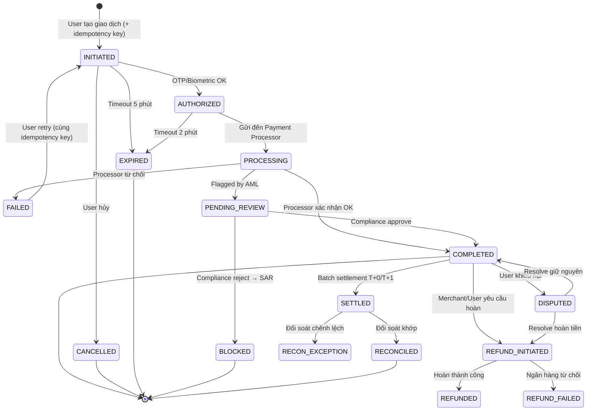

# OVERLAY: FINTECH PROJECT (Dự án Tài chính / Ngân hàng / Thanh toán)

> **Áp dụng:** Ví điện tử, payment gateway, mobile banking, lending platform, crypto/blockchain, InsurTech
> **Đặc điểm:** Transaction integrity (ACID), PCI-DSS, AML/KYC, real-time SLA, regulatory compliance NHNN/MAS/SEC

---

## 1. Tài liệu bắt buộc vs Tùy chọn

| # | Tài liệu | Bắt buộc? | Mức chi tiết | Ghi chú |
|---|----------|----------|-------------|---------|
| 1 | Vision & Scope | ✅ Bắt buộc | **Cao** | Bao gồm Regulatory Landscape + Risk Appetite |
| 2 | BRD | ✅ **Bắt buộc** | **Rất cao** | Tách rõ Feature vs Compliance requirements |
| 3 | Stakeholder Map | ✅ Bắt buộc | **Cao** | Product + Compliance + Risk + Legal + Ops |
| 4 | Process Flow | ✅ **Bắt buộc** | **Rất cao** | Transaction Flow + Settlement + Reconciliation |
| 5 | SRS | ✅ **Bắt buộc** | **Rất cao (25-35 trang)** | Idempotency, ACID, error handling chi tiết |
| 6 | User Story Map | ✅ Bắt buộc | **Cao** | Tách theo Customer Journey (Onboard → Transact → Resolve) |
| 7 | Data Model | ✅ **Bắt buộc** | **Rất cao** | Double-entry ledger + Audit trail + Event sourcing |
| 8 | UAT Plan | ✅ **Bắt buộc** | **Rất cao** | Stress test + Reconciliation verification |
| 9 | Change Log | ✅ Bắt buộc | **Cao** | Regulatory impact assessment bắt buộc |
| 10 | Meeting Minutes | ✅ Bắt buộc | **Cao** | Compliance approval records |
| 11 | Handover Checklist | ✅ Bắt buộc | **Cao** | Security credentials rotation protocol |
| 12 | API Specification | ✅ **Bắt buộc** | **Rất cao** | Open Banking standard + Webhook specs |
| 13 | Risk Register | ✅ **Bắt buộc** | **Rất cao** | Fraud Risk + Operational Risk + Compliance Risk |
| 14 | ⭐ Regulatory Mapping Matrix | ✅ **Bắt buộc** | **Đặc thù** | Feature → Quy định NHNN/PCI-DSS/AML |
| 15 | ⭐ Transaction Flow Spec | ✅ **Bắt buộc** | **Đặc thù** | Luồng giao dịch + Settlement + Reconciliation |
| 16 | ⭐ AML/KYC Process Flow | ✅ **Bắt buộc** | **Đặc thù** | eKYC → Risk scoring → Monitoring → SAR |
| 17 | ⭐ Security Architecture | ✅ **Bắt buộc** | **Đặc thù** | Threat model + Encryption + Key management |
| 18 | ⭐ DR/BCP Plan | ✅ **Bắt buộc** | **Đặc thù** | RPO/RTO + Failover + Incident response |
| 19 | ⭐ Reconciliation Spec | ✅ **Bắt buộc** | **Đặc thù** | Đối soát T+0/T+1 + Exception handling |

---

## 2. Transaction Lifecycle — Luồng đặc thù Fintech

### 2.1 Luồng giao dịch thanh toán

```
┌──────────────┐   ┌──────────────┐   ┌──────────────┐   ┌──────────────┐   ┌──────────────┐
│  INITIATE    │──▶│  AUTHORIZE   │──▶│   PROCESS    │──▶│   SETTLE     │──▶│  RECONCILE   │
│ (Khởi tạo)  │   │ (Xác thực)   │   │ (Xử lý)     │   │ (Quyết toán) │   │ (Đối soát)   │
└──────────────┘   └──────────────┘   └──────────────┘   └──────────────┘   └──────────────┘
       ↕                  ↕                  ↕                  ↕                  ↕
  Idempotency        OTP/Biometric     Double-entry       T+0 / T+1         Auto + Manual
  key required       + Risk scoring    Ledger update      Batch settlement   Exception alert
```

### 2.2 State Machine — Transaction



---

## 3. AML/KYC — Anti-Money Laundering & Know Your Customer

### 3.1 eKYC Tiering

| Tier | Xác minh | Hạn mức giao dịch | Ví dụ |
|:---:|---------|:------------------:|-------|
| **Tier 0** | Email + SĐT | ≤ 1 triệu/ngày | Ví xem demo |
| **Tier 1** | CCCD + Selfie (OCR + Face match) | ≤ 20 triệu/ngày | Ví cá nhân |
| **Tier 2** | Video call + Proof of address | ≤ 100 triệu/ngày | Ví business nhỏ |
| **Tier 3** | Xác minh tại chỗ + Giấy phép KD | Không giới hạn | Merchant / Enterprise |

### 3.2 AML Monitoring Flow

```
Transaction → Rule Engine (velocity, amount, pattern)
    ├── PASS → Complete transaction
    ├── REVIEW → Queue cho Compliance Officer
    │     ├── APPROVE → Complete
    │     └── REJECT → Block + File SAR (Suspicious Activity Report)
    └── BLOCK → Immediate block + Notify Compliance + SAR
```

### 3.3 AML Rules cơ bản (cần spec chi tiết)

| Rule | Trigger | Action |
|------|---------|--------|
| **Velocity** | > 10 GD trong 1 giờ | REVIEW |
| **Amount** | > 50 triệu / 1 GD | REVIEW |
| **Daily Limit** | > 200 triệu / ngày | BLOCK |
| **Structuring** | Nhiều GD nhỏ gần ngưỡng trong thời gian ngắn | REVIEW |
| **Blacklist** | Tên/CCCD match sanctions list | BLOCK |
| **Geographic** | GD từ high-risk country (FATF list) | REVIEW |

---

## 4. NFR đặc thù Fintech

| NFR Category | ID | Requirement | Target |
|---|---|---|---|
| **Integrity** | NFR-FT-01 | ACID compliance cho mọi giao dịch tài chính | Zero data loss, double-entry balanced |
| **Idempotency** | NFR-FT-02 | Mọi API thanh toán phải idempotent | Retry-safe, unique idempotency key |
| **Latency** | NFR-FT-03 | Payment API response time | < 500ms (p99) |
| **Latency** | NFR-FT-04 | Real-time notification | < 3 giây sau GD hoàn thành |
| **Availability** | NFR-FT-05 | Payment core availability | 99.99% (max 52 phút downtime/năm) |
| **Availability** | NFR-FT-06 | Admin/reporting availability | 99.5% |
| **Security** | NFR-FT-07 | PCI-DSS Level 1 compliance | Annual QSA audit |
| **Security** | NFR-FT-08 | Card data tokenization | Never store raw PAN/CVV |
| **Security** | NFR-FT-09 | Key Management | HSM (Hardware Security Module) for encryption keys |
| **Audit** | NFR-FT-10 | Immutable transaction ledger | Append-only, no DELETE/UPDATE |
| **Audit** | NFR-FT-11 | Dual-control for admin operations | 2 người approve cho: refund > X, user block, config change |
| **Scalability** | NFR-FT-12 | Peak transaction handling | ≥ 10,000 TPS (Tết, Black Friday, payday) |
| **Data Retention** | NFR-FT-13 | Transaction data retention | ≥ 10 năm (NHNN requirement) |
| **Recovery** | NFR-FT-14 | RPO cho transaction data | 0 (zero data loss) |
| **Recovery** | NFR-FT-15 | RTO cho payment core | ≤ 15 phút |

---

## 5. Reconciliation — Đối soát (Đặc thù Fintech)

### 5.1 Các loại đối soát

| Loại | Tần suất | So sánh | Exception handling |
|------|:--------:|---------|-------------------|
| **Internal Recon** | Real-time | Ledger debit vs credit | Auto-alert nếu chênh > 0 |
| **Partner Recon** | T+1 (hàng ngày) | Transaction log vs Partner settlement file | Auto-match → manual review exceptions |
| **Bank Recon** | T+1 (hàng ngày) | Settlement vs Bank statement | 3-way match: System ↔ Partner ↔ Bank |
| **Regulatory Recon** | Monthly | Reported figures vs Actual | Compliance team review |

### 5.2 Exception Handling

```
Reconciliation Run → Auto-Match
    ├── MATCHED → Close
    ├── AMOUNT_MISMATCH → Alert Operations + Manual review
    ├── MISSING_IN_SYSTEM → Investigate internal logs + Partner API
    ├── MISSING_IN_PARTNER → Request partner investigation (SLA 24h)
    └── DUPLICATE → Flag + Refund investigation
```

---

## 6. Regulatory Compliance Matrix

| Quy định | Phạm vi | Yêu cầu BA chính | Tài liệu reference |
|---------|---------|------------------|-------------------|
| **QĐ 2345/NHNN** | Giao dịch điện tử VN | Xác thực sinh trắc học cho GD > 10 triệu | NHNN |
| **Luật 14/2022 (AML)** | Phòng chống rửa tiền VN | KYC + CDD + EDD + SAR reporting | Quốc hội |
| **NĐ 13/2023** | Bảo vệ DLCN VN | Consent + Data classification + Cross-border transfer | Chính phủ |
| **PCI-DSS v4.0** | Xử lý card data | Never store CVV, tokenization, QSA audit | PCI Council |
| **ISO 27001** | Information Security | ISMS framework | ISO |
| **Open Banking** | API standard | RESTful, OAuth 2.0, consent-driven | UK/SG/AU standards |

---

## 7. Risk Patterns đặc thù Fintech

| # | Risk | Severity | Impact | Mitigation |
|---|------|:--------:|--------|-----------|
| 1 | Race condition → double-spending | 🔴🔴 | Mất tiền | Optimistic lock + idempotency key + DB constraints |
| 2 | Card data breach → phạt PCI-DSS | 🔴 | Phạt + mất license | Tokenization + never store CVV + HSM |
| 3 | Reconciliation mismatch | 🔴 | Chênh lệch tài chính | T+1 recon + auto-alert khi chênh > threshold |
| 4 | AML false negative → phạt regulator | 🔴 | Pháp lý | ML scoring + rule engine + manual review queue |
| 5 | Regulatory change → cần sửa gấp | 🟡 | Compliance gap | Configurable rules engine, không hard-code thresholds |
| 6 | Payment partner downtime | 🟡 | GD bị chặn | Multi-partner failover + circuit breaker |
| 7 | Fraud attack (carding, account takeover) | 🔴 | Mất tiền + uy tín | Velocity rules + device fingerprint + 3DS2 |

---

## 8. Phase Gate bổ sung

### Before Development
- [ ] Regulatory Mapping Matrix hoàn thành (feature → quy định)
- [ ] PCI-DSS scope xác định (card data flow documented)
- [ ] AML/KYC rules spec được Compliance team approve
- [ ] Transaction state machine designed + reviewed
- [ ] Double-entry ledger schema reviewed bởi Accountant/CFO

### Before UAT
- [ ] Idempotency tested (retry 100 lần cùng key → 1 GD)
- [ ] Race condition stress test passed (concurrent transactions)
- [ ] Reconciliation flow tested end-to-end (auto-match ≥ 99%)
- [ ] AML rules triggered correctly (test với scenarios)
- [ ] Security penetration test passed

### Before Go-live
- [ ] PCI-DSS audit passed (nếu xử lý card)
- [ ] Regulatory approval obtained (nếu cần license NHNN)
- [ ] DR/BCP drill completed (failover tested)
- [ ] Reconciliation dry-run với production-like data
- [ ] Incident response plan documented + team trained
- [ ] Fraud monitoring dashboard live
- [ ] Compliance Officer sign-off

---

## 9. Templates đặc thù — Dùng từ `templates/industry/`

| Template | Mô tả | Dùng tại Phase |
|----------|-------|:-------------:|
| `regulatory-compliance-matrix.md` | Map feature → PCI-DSS, NHNN, Luật AML | Discovery |
| `transaction-recon-spec.md` | State machine + Double-entry + Reconciliation | Elaboration |
| `aml-kyc-process.md` | eKYC 4-tier + AML Rules + SAR filing | Elaboration |
| `data-privacy-consent.md` | PII classification + KYC consent | Elaboration |
| `industry-integration-spec.md` | Open Banking / Payment Gateway integration | Elaboration |
| `security-continuity-plan.md` | STRIDE + DR/BCP + PCI-DSS security | Elaboration |

