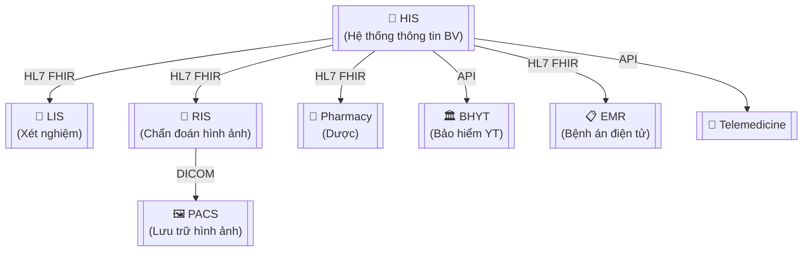

# OVERLAY: HEALTHCARE PROJECT (Dự án Y tế / HIS / EMR)

> **Áp dụng:** Dự án phần mềm y tế: HIS, EMR, LIS, RIS, Telemedicine, mHealth
> **Đặc điểm:** Bảo vệ dữ liệu bệnh nhân (PHI), tích hợp chuẩn y tế (HL7/FHIR), clinical validation, audit trail nghiêm ngặt

---

## 1. Tài liệu bắt buộc vs Tùy chọn

| # | Tài liệu | Bắt buộc? | Mức chi tiết | Ghi chú |
|---|----------|----------|-------------|---------|
| 1 | Vision & Scope | ✅ Bắt buộc | **Cao** | Bao gồm Clinical Context + Patient Safety goals |
| 2 | BRD | ✅ **Bắt buộc** | **Rất cao** | Tách rõ Clinical Requirements vs Admin Requirements |
| 3 | Stakeholder Map | ✅ Bắt buộc | **Cao — đa tầng** | Bác sĩ + Điều dưỡng + Dược sĩ + CNTT + BN + Ban lãnh đạo BV |
| 4 | Process Flow | ✅ **Bắt buộc** | **Rất cao** | Clinical Workflow Maps (khám → chẩn đoán → điều trị → xuất viện) |
| 5 | SRS | ✅ **Bắt buộc** | **Rất cao (25-35 trang)** | NFR ATTT + Data Classification + Integration specs |
| 6 | User Story Map | ✅ Bắt buộc | **Cao** | Tách theo Clinical Pathway (Nội trú / Ngoại trú / Cấp cứu) |
| 7 | Data Model | ✅ **Bắt buộc** | **Rất cao** | PHI classification + HL7 FHIR Resources mapping |
| 8 | UAT Plan | ✅ **Bắt buộc** | **Rất cao** | Clinical Validation bởi bác sĩ + Scenario-based testing |
| 9 | Change Log | ✅ Bắt buộc | **Cao** | Regulatory impact assessment cho mỗi CR |
| 10 | Meeting Minutes | ✅ Bắt buộc | **Cao** | Clinical committee meeting records |
| 11 | Handover Checklist | ✅ Bắt buộc | **Cao** | Kèm Clinical Training Plan |
| 12 | API Specification | ✅ **Bắt buộc** | **Rất cao** | HL7 FHIR R4 + DICOM + ICD-10/ICD-11 mapping |
| 13 | Risk Register | ✅ **Bắt buộc** | **Cao** | Patient Safety Risks riêng section |
| 14 | ⭐ Clinical Workflow Map | ✅ **Bắt buộc** | **Đặc thù** | Luồng khám bệnh chi tiết từng chuyên khoa |
| 15 | ⭐ Data Classification Matrix | ✅ **Bắt buộc** | **Đặc thù** | PHI / PII / Clinical / Admin / Public |
| 16 | ⭐ Consent Management Spec | ✅ **Bắt buộc** | **Đặc thù** | Quản lý đồng ý bệnh nhân (NĐ 13/2023) |
| 17 | ⭐ Integration Spec (HL7/FHIR) | ✅ **Bắt buộc** | **Đặc thù** | Đặc tả tích hợp HIS ↔ LIS ↔ RIS ↔ PACS |
| 18 | ⭐ Clinical Validation Report | ✅ **Bắt buộc** | **Đặc thù** | Bác sĩ xác nhận logic y khoa đúng |

---

## 2. Clinical Workflow — Luồng đặc thù Y tế

> Dự án y tế KHÔNG phải CRUD đơn giản. Mỗi module có quy trình y khoa riêng.

### 2.1 Luồng chính cần document

```
┌──────────────┐   ┌──────────────┐   ┌──────────────┐   ┌──────────────┐   ┌──────────────┐
│   TIẾP NHẬN  │──▶│  KHÁM BỆNH   │──▶│  CHẨN ĐOÁN   │──▶│  ĐIỀU TRỊ    │──▶│  XUẤT VIỆN   │
│ (Registration)│   │ (Examination) │   │ (Diagnosis)   │   │ (Treatment)  │   │ (Discharge)  │
└──────────────┘   └──────────────┘   └──────────────┘   └──────────────┘   └──────────────┘
       ↕                  ↕                  ↕                  ↕                  ↕
  ┌─────────┐       ┌─────────┐       ┌─────────┐       ┌─────────┐       ┌─────────┐
  │ Bảo hiểm│       │ Xét nghiệm│     │ Hội chẩn│       │ Thuốc    │       │ Thanh toán│
  │ (BHYT)  │       │ (LIS)    │       │         │       │ (Pharmacy)│      │ (Billing)│
  └─────────┘       └─────────┘       └─────────┘       └─────────┘       └─────────┘
```

### 2.2 Clinical Pathway Matrix

| Pathway | Modules liên quan | Stakeholder chính | Độ phức tạp |
|---------|------------------|-------------------|:-----------:|
| **Ngoại trú (OPD)** | Tiếp nhận → Khám → CLS → Kê đơn → Thanh toán | Bác sĩ phòng khám | ⭐⭐⭐ |
| **Nội trú (IPD)** | Nhập viện → Theo dõi → Phẫu thuật → Hồi sức → Xuất viện | Bác sĩ điều trị + Điều dưỡng | ⭐⭐⭐⭐⭐ |
| **Cấp cứu (ER)** | Phân loại → Xử trí → Chuyển khoa/viện | Bác sĩ cấp cứu | ⭐⭐⭐⭐ |
| **Cận lâm sàng (CLS)** | Chỉ định → Lấy mẫu → Xét nghiệm → Trả kết quả | Kỹ thuật viên + BS | ⭐⭐⭐ |
| **Dược (Pharmacy)** | Kê đơn → Duyệt đơn → Cấp phát → Kiểm tra tương tác | Dược sĩ | ⭐⭐⭐⭐ |

---

## 3. Data Classification — PHI Protection

### 3.1 Ma trận phân loại dữ liệu

| Cấp | Loại dữ liệu | Ví dụ | Mã hóa | Access Control | Retention |
|:---:|-------------|-------|:------:|:--------------:|:---------:|
| 🔴 **PHI** | Dữ liệu y khoa + định danh BN | Chẩn đoán, kết quả XN, tiền sử bệnh | AES-256 | Role + Context (khoa, ca trực) | ≥ 10 năm |
| 🟠 **PII** | Dữ liệu cá nhân (không y khoa) | Tên, CCCD, SĐT, địa chỉ | AES-256 | Role-based | ≥ 5 năm |
| 🟡 **Clinical** | Dữ liệu y khoa không định danh | Thống kê bệnh, dữ liệu nghiên cứu đã anonymize | TLS only | Department-based | ≥ 5 năm |
| 🟢 **Admin** | Dữ liệu vận hành | Lịch trực, danh sách phòng, thiết bị | TLS only | Role-based | ≥ 3 năm |
| ⚪ **Public** | Dữ liệu công khai | Giờ khám, danh sách chuyên khoa | None | Public | — |

### 3.2 Quy tắc PHI (Bắt buộc)

1. **Minimum Necessary** — Chỉ hiển thị dữ liệu PHI cần thiết cho vai trò đang sử dụng
2. **Context-Based Access** — Bác sĩ chỉ xem được BN thuộc khoa/ca trực của mình
3. **Break-the-Glass** — Trường hợp cấp cứu: cho phép truy cập ngoài context + audit log + thông báo
4. **Immutable Audit Log** — Mọi truy cập PHI phải được ghi log, KHÔNG cho phép DELETE/UPDATE log
5. **De-identification** — Dữ liệu cho nghiên cứu/thống kê phải xóa bỏ thông tin định danh
6. **Consent Tracking** — Ghi nhận sự đồng ý của BN cho từng mục đích sử dụng dữ liệu

---

## 4. NFR đặc thù Healthcare

| NFR Category | ID | Requirement | Target |
|---|---|---|---|
| **Audit** | NFR-HC-01 | Immutable audit log cho mọi thao tác PHI | Retention ≥ 10 năm, không DELETE |
| **Encryption** | NFR-HC-02 | Mã hóa PHI at-rest và in-transit | AES-256 + TLS 1.3 |
| **Access** | NFR-HC-03 | Role + Context-based access control | Khoa + Ca trực + Bệnh nhân assigned |
| **Availability** | NFR-HC-04 | Module Cấp cứu (ER) availability | 99.95% (max 4.38h downtime/năm) |
| **Availability** | NFR-HC-05 | Module OPD/IPD availability | 99.5% (max 43.8h/năm) |
| **Interop** | NFR-HC-06 | Tích hợp HL7 FHIR R4 | Patient, Encounter, Observation, MedicationRequest |
| **Interop** | NFR-HC-07 | Mã hóa bệnh theo ICD-10 / ICD-11 | WHO version, cập nhật hàng năm |
| **Performance** | NFR-HC-08 | Tra cứu hồ sơ bệnh nhân | < 2 giây cho 5 năm lịch sử |
| **Data Residency** | NFR-HC-09 | Dữ liệu PHI lưu trữ tại Việt Nam | NĐ 13/2023 |
| **Recovery** | NFR-HC-10 | RPO cho dữ liệu y khoa | ≤ 1 giờ (không mất dữ liệu bệnh nhân) |
| **Drug Safety** | NFR-HC-11 | Kiểm tra tương tác thuốc (DDI) | Cảnh báo realtime khi kê đơn |
| **Consent** | NFR-HC-12 | Quản lý đồng ý bệnh nhân | Granular consent per data category |

---

## 5. Tích hợp Y tế (Healthcare Integration Standards)

| Chuẩn | Mô tả | Khi nào dùng | Resource chính |
|-------|-------|-------------|---------------|
| **HL7 FHIR R4** | RESTful API cho trao đổi dữ liệu y tế | HIS ↔ LIS, HIS ↔ Pharmacy, HIS ↔ BV khác | Patient, Encounter, Observation, DiagnosticReport |
| **DICOM** | Truyền và lưu trữ hình ảnh y khoa | RIS ↔ PACS (X-quang, CT, MRI) | DICOM SOP Classes |
| **ICD-10 / ICD-11** | Mã hóa bệnh tật quốc tế | Chẩn đoán, thống kê, BHYT | WHO Classification |
| **SNOMED CT** | Ontology thuật ngữ y khoa | NLP y tế, hệ thống hỗ trợ quyết định | Clinical terms |
| **HL7 CDA** | Tài liệu lâm sàng có cấu trúc | Trao đổi hồ sơ bệnh án giữa các BV | CDA R2 |

### Mermaid — Integration Architecture



---

## 6. Risk Patterns đặc thù Healthcare

| # | Risk | Severity | Impact | Mitigation |
|---|------|:--------:|--------|-----------|
| 1 | Sai logic y khoa → sai chẩn đoán/kê đơn | 🔴🔴 | Patient safety | Clinical validation bởi BS chuyên khoa + DDI check |
| 2 | Rò rỉ PHI → vi phạm NĐ 13/2023 | 🔴 | Pháp lý + uy tín | Encryption + Context-based access + DLP |
| 3 | Tích hợp HIS fail → gián đoạn khám chữa bệnh | 🔴 | Vận hành BV | Fallback manual + queue + retry |
| 4 | Sai mã ICD → từ chối BHYT thanh toán | 🟡 | Tài chính BV | ICD mapping validation + suggest engine |
| 5 | Bác sĩ/điều dưỡng không chịu dùng | 🟡 | Adoption thấp | UX training + pilot khoa + champion program |
| 6 | Tương tác thuốc không phát hiện (DDI miss) | 🔴 | Patient safety | Drug database update + alert engine |

---

## 7. Phase Gate bổ sung

### Discovery bổ sung
- [ ] Clinical Workflow Map cho ≥ 3 pathways (OPD, IPD, ER)
- [ ] Data Classification Matrix hoàn thành
- [ ] Consent requirements xác định

### Elaboration bổ sung
- [ ] HL7 FHIR Resource mapping hoàn thành
- [ ] ICD-10 mapping strategy xác định
- [ ] DDI (Drug-Drug Interaction) database chọn xong
- [ ] Clinical Validation Plan được BS trưởng khoa duyệt

### Before Go-live
- [ ] Clinical Validation Report signed bởi ≥ 3 bác sĩ
- [ ] Audit log tested (truy cập PHI + break-the-glass)
- [ ] Data migration verified (hồ sơ BN không mất/sai)
- [ ] ATTT assessment đạt cấp yêu cầu
- [ ] Training cho ≥ 80% nhân viên y tế hoàn thành
- [ ] Consent management tested end-to-end

---

## 8. Templates đặc thù — Dùng từ `templates/industry/`

| Template | Mô tả | Dùng tại Phase |
|----------|-------|:-------------:|
| `regulatory-compliance-matrix.md` | Map feature → NĐ 13/2023, HIPAA, TT BYT | Discovery |
| `multi-level-acceptance.md` | Clinical Validation Report + Nghiệm thu | Closure |
| `clinical-workflow-map.md` | OPD/IPD/ER pathways + DDI rules | Discovery |
| `data-privacy-consent.md` | PHI classification + Consent lifecycle | Elaboration |
| `industry-integration-spec.md` | HL7 FHIR / DICOM / ICD-10 integration | Elaboration |
| `security-continuity-plan.md` | STRIDE + DR/BCP + ATTT | Elaboration |

