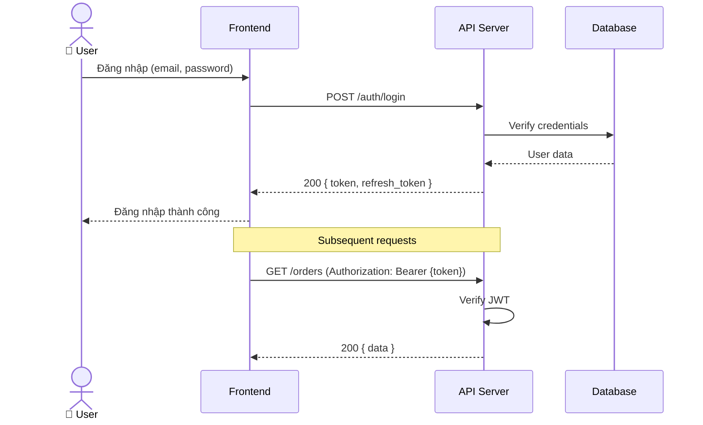

# API SPECIFICATION — {{TÊN DỰ ÁN}}

> **Phiên bản:** 0.1 | **Ngày:** {{DD/MM/YYYY}}
> **Tác giả:** {{Tên BA}} | **Trạng thái:** Draft
> **Format:** RESTful API conventions

---

## 1. Tổng quan API

| Hạng mục | Chi tiết |
|---------|---------|
| **Base URL** | `https://api.{{domain}}.com/v1` |
| **Authentication** | {{Bearer Token (JWT) / API Key / OAuth2}} |
| **Format** | JSON |
| **Versioning** | URL path: `/v1/`, `/v2/` |
| **Rate Limit** | {{N}} requests / minute |

---

## 2. Quy ước chung

### HTTP Methods

| Method | Mục đích | Ví dụ |
|--------|---------|-------|
| `GET` | Đọc dữ liệu | `GET /users/123` |
| `POST` | Tạo mới | `POST /users` |
| `PUT` | Cập nhật toàn bộ | `PUT /users/123` |
| `PATCH` | Cập nhật một phần | `PATCH /users/123` |
| `DELETE` | Xóa | `DELETE /users/123` |

### Response Format

```json
// Success
{
  "success": true,
  "data": { ... },
  "meta": {
    "page": 1,
    "per_page": 20,
    "total": 100
  }
}

// Error
{
  "success": false,
  "error": {
    "code": "VALIDATION_ERROR",
    "message": "Email is required",
    "details": [
      { "field": "email", "message": "Email is required" }
    ]
  }
}
```

### HTTP Status Codes

| Code | Ý nghĩa | Khi nào dùng |
|------|---------|-------------|
| `200` | OK | GET, PUT, PATCH thành công |
| `201` | Created | POST tạo thành công |
| `204` | No Content | DELETE thành công |
| `400` | Bad Request | Validation error |
| `401` | Unauthorized | Chưa xác thực |
| `403` | Forbidden | Không có quyền |
| `404` | Not Found | Resource không tồn tại |
| `409` | Conflict | Trùng lặp (duplicate) |
| `422` | Unprocessable Entity | Business rule violation |
| `429` | Too Many Requests | Rate limit exceeded |
| `500` | Internal Server Error | Lỗi server |

### Pagination

```
GET /users?page=1&per_page=20&sort=created_at&order=desc
```

### Filtering

```
GET /orders?status=CONFIRMED&created_from=2026-01-01&created_to=2026-03-31
```

---

## 3. Endpoints

### Module: {{Tên Module}}

#### `{{METHOD}} /{{resource}}`

| Hạng mục | Chi tiết |
|---------|---------|
| **Mô tả** | {{Mô tả chức năng}} |
| **Auth** | ☐ Required / ☐ Public |
| **Role** | {{Admin / User / All}} |
| **Trace từ FR** | FR-{{MOD}}-{{NNN}} |

**Request:**

| Parameter | Vị trí | Kiểu | Bắt buộc | Mô tả | Ví dụ |
|-----------|--------|------|---------|-------|-------|
| {{param}} | path / query / body | string / number / boolean | ✅ / ☐ | {{mô tả}} | {{ví dụ}} |

**Request Body Example:**

```json
{
  "{{field}}": "{{value}}"
}
```

**Response (200):**

```json
{
  "success": true,
  "data": {
    "id": "{{uuid}}",
    "{{field}}": "{{value}}"
  }
}
```

**Error Responses:**

| Code | Error Code | Khi nào |
|------|-----------|---------|
| 400 | `VALIDATION_ERROR` | {{Điều kiện}} |
| 404 | `NOT_FOUND` | {{Điều kiện}} |

---

## 4. Authentication & Authorization

### Flow xác thực



### Role & Permission

| Role | Permissions | Ghi chú |
|------|-----------|---------|
| {{Admin}} | Full access | |
| {{User}} | Read own data, Create | |
| {{Guest}} | Read public only | |

---

## ✅ Review Checklist

```
☐ Mọi endpoint có Method, URL, Auth, Description
☐ Request/Response có example JSON
☐ Error codes đầy đủ
☐ Pagination, Filtering, Sorting documented
☐ Auth flow có sequence diagram
☐ Role & Permission matrix rõ ràng
☐ Trace từ FR → API endpoint
```
