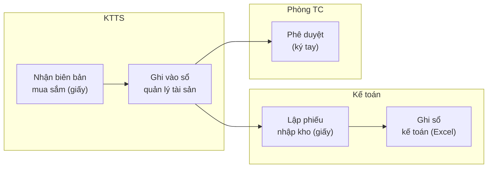
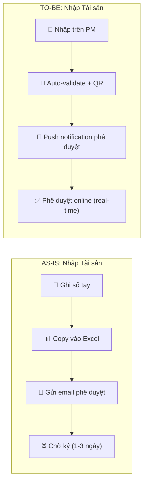

# AS-IS PROCESS DOCUMENTATION — Template

> **Tên dự án:** [Tên]
> **Ngày tạo:** [DD/MM/YYYY]
> **Phiên bản:** V1.0
> **Người viết:** @ba-specialist

---

## 1. Mục đích

Tài liệu hóa quy trình **hiện tại** (As-Is) mà tổ chức đang vận hành TRƯỚC khi có hệ thống mới. Đây là baseline để:
- Đo lường cải thiện (Before → After)
- Phát hiện pain points thực sự (không suy đoán)
- Đảm bảo hệ thống mới (To-Be) giải quyết đúng vấn đề

---

## 2. Tổng quan Quy trình Hiện tại

| # | Tên Quy trình | Người thực hiện | Tần suất | Công cụ hiện tại | Thời gian TB |
|---|---------------|-----------------|----------|-------------------|-------------|
| 1 | [VD: Nhập tài sản mới] | [VD: KTTS] | [VD: 10 lần/tuần] | [VD: Excel + Giấy] | [VD: 30 phút/lần] |
| 2 | [VD: Kiểm kê định kỳ] | [VD: Tổ kiểm kê] | [VD: 6 tháng/lần] | [VD: Sổ tay + Giấy] | [VD: 2 tuần] |
| ... | ... | ... | ... | ... | ... |

---

## 3. Chi tiết Từng Quy Trình

### 3.1 Quy trình: [Tên quy trình 1]

**Mô tả:** [Tóm tắt 1-2 dòng quy trình hiện tại]

**Swimlane Diagram (As-Is):**

**Các bước chi tiết:**

| Bước | Người thực hiện | Hành động | Input | Output | Thời gian | Vấn đề |
|------|-----------------|-----------|-------|--------|-----------|--------|
| 1 | [Role] | [Mô tả hành động] | [Tài liệu/dữ liệu đầu vào] | [Kết quả] | [Thời gian] | [Pain point nếu có] |
| 2 | ... | ... | ... | ... | ... | ... |

---

## 4. Pain Point Analysis (Phân tích Điểm đau)

| # | Pain Point | Mức độ | Ảnh hưởng | Tần suất | Bằng chứng |
|---|-----------|:------:|-----------|----------|-----------|
| PP-01 | [VD: Nhập trùng tài sản do không kiểm tra được trùng trên Excel] | 🔴 High | [VD: Sai lệch sổ sách 5-10%] | [VD: Hàng tuần] | [VD: Transcript phỏng vấn KTTS / Số liệu kiểm kê Q3] |
| PP-02 | [VD: Mất 2 tuần kiểm kê do dùng giấy] | 🟡 Medium | [VD: Tốn nhân sự 5 người x 2 tuần] | [VD: 6 tháng/lần] | [VD: Báo cáo kiểm kê 2024] |
| ... | ... | ... | ... | ... | ... |

---

## 5. Gap Analysis (As-Is → To-Be)

| # | As-Is (Hiện tại) | To-Be (Mong muốn) | Gap Description | BRQ liên quan | Priority |
|---|-------------------|-------------------|-----------------|---------------|----------|
| GAP-01 | Nhập tài sản bằng Excel, không có validation | Nhập trên PM với auto-validate + duplicate check | Cần form nhập có business rules, check trùng mã TS | BRQ-01 | Must |
| GAP-02 | Kiểm kê bằng sổ giấy, đối soát thủ công | Kiểm kê bằng QR + Mobile, đối soát tự động | Cần HHT/Mobile + QR Scanner + auto-reconcile | BRQ-06 | Must |
| ... | ... | ... | ... | ... | ... |

---

## 6. Metrics Baseline (Số liệu Cơ sở)

> **Quan trọng:** Các số liệu này sẽ được dùng để đo lường hiệu quả SAU khi triển khai hệ thống mới.

| Metric ID | Tên chỉ số | Giá trị Hiện tại (As-Is) | Mục tiêu (To-Be) | Phương pháp đo | OKR liên quan |
|-----------|-----------|:---:|:---:|---|---|
| M-01 | Thời gian nhập 1 tài sản | [VD: 30 phút] | [VD: 5 phút] | [VD: Stopwatch test] | OKR-01 |
| M-02 | Tỷ lệ lỗi dữ liệu | [VD: 10%] | [VD: < 1%] | [VD: Đối soát Excel vs thực tế] | OKR-02 |
| M-03 | Thời gian kiểm kê toàn bệnh viện | [VD: 14 ngày] | [VD: 3 ngày] | [VD: Báo cáo kiểm kê] | OKR-03 |

---

## 7. Dual Swimlane (As-Is vs To-Be Comparison)

---

## 8. Phụ lục

### A. Nguồn thông tin
- [ ] Phỏng vấn: [Ai? Ngày nào?]
- [ ] Quan sát thực tế: [Ở đâu? Bao lâu?]
- [ ] Tài liệu hiện có: [File nào?]
- [ ] Số liệu thống kê: [Nguồn?]

### B. Ký hiệu
| Ký hiệu | Ý nghĩa |
|---------|---------|
| 🔴 | Pain Point nghiêm trọng |
| 🟡 | Pain Point trung bình |
| 🟢 | Hoạt động tốt, giữ nguyên |
