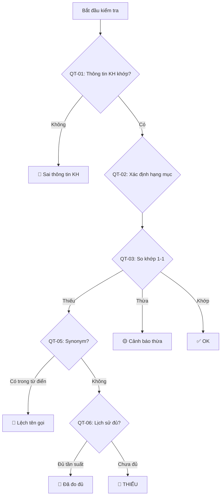
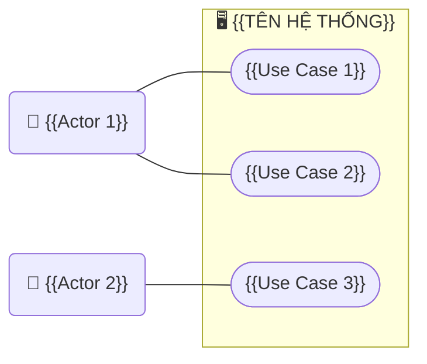

# BRD — BUSINESS REQUIREMENTS DOCUMENT
# {{TÊN DỰ ÁN}}

> **Phiên bản:** 0.1 | **Ngày:** {{DD/MM/YYYY}}
> **Tác giả:** {{Tên BA}} | **Trạng thái:** Draft
> **Dự án:** {{Tên dự án}}

---

## Lịch sử thay đổi

| Phiên bản | Ngày | Người chỉnh | Mô tả thay đổi |
|-----------|------|-------------|----------------|
| 0.1 | {{ngày}} | {{tên}} | Phiên bản đầu tiên |

## Phê duyệt

| Vai trò | Tên | Ngày ký | Chữ ký |
|---------|-----|---------|--------|
| BA | | | |
| PM | | | |
| Sponsor | | | |

---

## 1. Giới thiệu

### 1.1 Mục đích tài liệu

Tài liệu này mô tả yêu cầu kinh doanh (business requirements) cho dự án {{Tên dự án}}, bao gồm nhu cầu kinh doanh, phân tích tính khả thi, và yêu cầu cấp cao.

### 1.2 Đối tượng đọc

| Đối tượng | Mục đích đọc |
|-----------|-------------|
| Sponsor / C-level | Phê duyệt dự án, đánh giá ROI |
| PM | Lập kế hoạch dự án |
| BA | Cơ sở để viết SRS |
| Dev Lead | Đánh giá tính khả thi kỹ thuật |

### 1.3 Tham chiếu

| Tài liệu | Mô tả |
|-----------|-------|
| Vision & Scope | Tầm nhìn và phạm vi dự án |
| {{Tài liệu khác}} | {{Mô tả}} |

---

## 2. Nhu cầu kinh doanh (Need — BACCM)

### 2.1 Phân tích 5W1H

| Câu hỏi | Trả lời |
|---------|---------|
| **What** — Cần làm gì? | {{Mô tả giải pháp ở mức cao}} |
| **Why** — Tại sao cần? | {{Vấn đề / cơ hội kinh doanh}} |
| **Who** — Ai sử dụng / ai quyết định? | {{Stakeholder chính}} |
| **When** — Khi nào cần hoàn thành? | {{Timeline}} |
| **Where** — Triển khai ở đâu? | {{Platform / thị trường}} |
| **How** — Thực hiện như thế nào? | {{Phương pháp / approach}} |

### 2.2 Vấn đề hiện tại (As-Is Pain Points)

> ⭐ **v3.1:** Dùng **Narrative Storytelling** cho top 3 pain points (đau nhất), bảng tổng hợp cho phần còn lại.
> Xem chi tiết kỹ thuật tại `core/writing-guide.md` > Mục 9.

**{{Pain Point 1}} — Rủi ro #1:**
> {{Actor}} hiện đang {{action cụ thể}}. Khi {{failure point}},
> {{hậu quả 1}} → {{hậu quả 2}} → {{hậu quả 3 (tài chính/pháp lý)}}.

| # | Vấn đề | Ai bị ảnh hưởng | Tần suất | Chi phí ảnh hưởng |
|---|--------|----------------|---------|-------------------|
| 1 | {{Vấn đề}} | {{Stakeholder}} | {{Hàng ngày / tuần / tháng}} | {{Ước tính}} |

---

## 3. SWOT Analysis

```
         Tích cực (+)                    Tiêu cực (-)
       ┌──────────────────────┐       ┌──────────────────────┐
 Nội   │      STRENGTHS       │       │     WEAKNESSES       │
 bộ    │                      │       │                      │
       │ • {{Điểm mạnh 1}}   │       │ • {{Điểm yếu 1}}    │
       │ • {{Điểm mạnh 2}}   │       │ • {{Điểm yếu 2}}    │
       │                      │       │                      │
       └──────────────────────┘       └──────────────────────┘
       ┌──────────────────────┐       ┌──────────────────────┐
 Bên   │    OPPORTUNITIES     │       │       THREATS        │
 ngoài │                      │       │                      │
       │ • {{Cơ hội 1}}      │       │ • {{Nguy cơ 1}}     │
       │ • {{Cơ hội 2}}      │       │ • {{Nguy cơ 2}}     │
       │                      │       │                      │
       └──────────────────────┘       └──────────────────────┘
```

---

## 4. Yêu cầu kinh doanh cấp cao

### 4.1 Danh sách yêu cầu (MoSCoW Priority)

| Req ID | Yêu cầu | Mô tả | MoSCoW | Kano |
|--------|---------|-------|--------|------|
| BR-001 | {{Tên yêu cầu}} | {{Mô tả chi tiết}} | Must | Basic |
| BR-002 | {{Tên yêu cầu}} | {{Mô tả chi tiết}} | Must | Basic |
| BR-003 | {{Tên yêu cầu}} | {{Mô tả chi tiết}} | Should | Performance |
| BR-004 | {{Tên yêu cầu}} | {{Mô tả chi tiết}} | Could | Excitement |
| BR-005 | {{Tên yêu cầu}} | {{Mô tả chi tiết}} | Won't | — |

> **Tham chiếu phân loại:**
> - MoSCoW: xem `core/principles.md` > Mục 3
> - Kano: xem `core/principles.md` > Mục 4

### 4.2 Thống kê phân bổ MoSCoW

| Priority | Số lượng | % | Khuyến nghị |
|----------|---------|---|-------------|
| Must | {{x}} | {{%}} | ~60% |
| Should | {{x}} | {{%}} | ~20% |
| Could | {{x}} | {{%}} | ~15% |
| Won't | {{x}} | {{%}} | ~5% |

> ⚠️ Nếu Must > 60% → cần review lại: có thật sự phải Must không?

### 4.3 Business Rule Architecture (Kiến trúc Quy tắc Nghiệp vụ) ⭐ NEW v3.1

> **Khi nào cần:** Khi hệ thống có ≥ 5 business rules có tương tác lẫn nhau.
> **Mục đích:** Xác định thứ tự thực thi, quan hệ override, và luồng logic giữa các rules.
> **Không bắt buộc** cho BRD đơn giản (≤ 4 rules độc lập).

#### 4.3.1 Thứ tự Thực thi (Execution Order)

| Bước | Rule ID | Tên Rule | Điều kiện chạy |
|------|---------|----------|----------------|
| 1 | QT-01 | {{Tên}} | Chạy luôn (foundation check) |
| 2 | QT-02 | {{Tên}} | Chạy sau QT-01 PASS |
| 3 | QT-03 | {{Tên}} | Chạy trong boundary đã xác định bởi QT-02 |
| ... | ... | ... | ... |

> **Quy tắc:**
> - Rules phía trên FAIL → rules phía dưới có chạy không? (Ghi rõ: STOP hay CONTINUE)
> - Mỗi rule chỉ chạy SAU KHI dependencies đã hoàn thành

#### 4.3.2 Ma trận Ghi đè (Override Matrix)

> **Khi nào cần:** Khi rule A có thể giảm/tăng severity của rule B.

| Rule bị Override | Bởi Rule | Điều kiện Override | Severity thay đổi |
|-----------------|----------|--------------------|-----------|
| {{QT-03 (Thiếu chất)}} | {{QT-05 (Synonym)}} | {{Tên khác nhau nhưng nghĩa giống}} | 🔴 Critical → 🔵 Info |
| {{QT-03 (Thiếu chất)}} | {{QT-06 (Memory)}} | {{Lịch sử đã đo đủ tần suất}} | 🔴 Critical → 🔵 Info |

#### 4.3.3 Decision Flowchart



### 4.4 Output Severity Design (Thiết kế Mức độ Output) ⭐ NEW v3.1

> **Khi nào cần:** Hệ thống có tính năng validation / audit / comparison mà output cần phân loại mức độ để user ra quyết định.
> **Mục đích:** Xác định rõ hệ thống output bao nhiêu mức, mỗi mức nghĩa là gì, user cần làm gì.

| Level | Visual | Ý nghĩa nghiệp vụ | User Action Required |
|-------|--------|------------------|---------------------|
| 🔴 **Critical** | ❌ | {{VD: Thiếu chất bắt buộc so với File Gốc}} | PHẢI xử lý trước khi duyệt |
| 🟡 **Warning** | ⚠️ | {{VD: Thừa chất so với File Gốc}} | NÊN xem xét |
| 🔵 **Info** | ℹ️ | {{VD: Lệch tên gọi / Đã đo đủ lịch sử}} | Tham khảo, có thể bỏ qua |
| ✅ **OK** | ✓ | {{VD: So khớp chính xác 100%}} | Không cần hành động |

> **Quy tắc:**
> - Mỗi Business Rule trong mục 4.3 PHẢI gắn với ĐÚNG MỘT severity level default.
> - Severity có thể bị override bởi rule khác (xem Override Matrix ở 4.3.2).
> - Nếu hệ thống có tính năng AI, xem thêm `ai-feature-spec.md` > Mục 4 (Confidence-based Action).

### 4.5 System Memory Requirements (Yêu cầu Trí nhớ Hệ thống) ⭐ NEW v3.1

> **Khi nào cần:** Khi business rules phụ thuộc vào **dữ liệu lịch sử** từ các transactions / đợt / phien trước đó.
> **Ví dụ phổ biến:** Giới hạn tần suất (đo 2 lần/năm), credit limit tích lũy, quota sử dụng, ngày phép đã dùng.

| Rule ID | Cần nhớ gì | Scope truy vấn | Điều kiện trigger | Kết quả |
|---------|------------|----------------|-------------------|---------|
| {{QT-06}} | {{Số lần đã đo chỉ tiêu X trong năm}} | {{Cùng Folder/Dự án}} | {{Khi phát hiện thiếu chỉ tiêu X}} | {{Override lỗi nếu đã đủ tần suất năm}} |

> **Câu hỏi elicitation khi phát hiện cần System Memory:**
> 1. "Quyết định ở bước này có phụ thuộc vào lần chạy/đợt/phien TRƯỚC không?"
> 2. "Nếu phụ thuộc — nhìn lại bao xa? (1 đợt? 1 năm? tất cả?)"
> 3. "Dữ liệu cũ bị XÓA/SỬa thì tính toán hiện tại có sai không?"
> 4. "Tần suất tính theo năm dương lịch, năm tài chính, hay theo Hợp đồng?"
> 5. "Nếu đợt trước bị TỪ CHỐI (không duyệt) thì có tính vào lịch sử không?"

---

## 5. Stakeholder Analysis

> Chi tiết: xem `stakeholder-map.md`

| Stakeholder | Vai trò | Interest | Power | Chiến lược quản lý |
|-------------|---------|----------|-------|-------------------|
| {{Tên}} | {{Vai trò}} | Cao/Thấp | Cao/Thấp | Manage Closely / Keep Satisfied / Keep Informed / Monitor |

---

## 6. Use Case tổng quan



---

## 7. Phân tích tính khả thi (Feasibility)

### 7.1 Khả thi kỹ thuật

| Tiêu chí | Đánh giá | Ghi chú |
|----------|---------|---------|
| Công nghệ có sẵn | ✅ / ⚠️ / ❌ | {{Chi tiết}} |
| Team có kinh nghiệm | ✅ / ⚠️ / ❌ | {{Chi tiết}} |
| Hạ tầng | ✅ / ⚠️ / ❌ | {{Chi tiết}} |
| Tích hợp hệ thống | ✅ / ⚠️ / ❌ | {{Chi tiết}} |

### 7.2 Khả thi kinh doanh (ROI)

| Hạng mục | Năm 1 | Năm 2 | Năm 3 |
|---------|-------|-------|-------|
| Chi phí đầu tư | {{$}} | — | — |
| Chi phí vận hành / năm | {{$}} | {{$}} | {{$}} |
| Lợi ích dự kiến / năm | {{$}} | {{$}} | {{$}} |
| **ROI lũy kế** | {{$}} | {{$}} | {{$}} |

### 7.3 Khả thi thời gian

| Phase | Thời lượng dự kiến | Deadline cứng? |
|-------|-------------------|---------------|
| {{Phase}} | {{Tuần}} | Có / Không |

---

## 8. Rủi ro & Giải pháp giảm thiểu

| # | Rủi ro | Xác suất | Ảnh hưởng | Risk Score | Giải pháp |
|---|--------|---------|-----------|-----------|-----------|
| 1 | {{Rủi ro}} | C/TB/T | C/TB/T | {{H/M/L}} | {{Mitigation}} |

> **Risk Score:** Cao × Cao = High, còn lại = Medium/Low

---

## 9. Giả định & Ràng buộc

### Giả định

| # | Giả định | Nếu sai → ảnh hưởng |
|---|---------|---------------------|
| 1 | {{Giả định}} | {{Hậu quả}} |

### Ràng buộc

| # | Ràng buộc | Loại |
|---|----------|------|
| 1 | {{Ràng buộc}} | Kỹ thuật / Kinh doanh / Pháp lý / Thời gian |

---

## 10. Tiêu chí thành công

| # | Tiêu chí | KPI | Target | Cách đo |
|---|---------|-----|--------|---------|
| 1 | {{Tiêu chí}} | {{Metric}} | {{Mục tiêu}} | {{Phương pháp}} |

---

## ✅ BACCM Self-Check

```
☐ CHANGE:      Vấn đề / cơ hội kinh doanh rõ ràng (Mục 2)
☐ NEED:        Nhu cầu gốc đã phân tích (5W1H — Mục 2.1)
☐ SOLUTION:    Phạm vi giải pháp phù hợp (Use Case — Mục 6)
☐ STAKEHOLDER: Stakeholder đầy đủ + phân loại (Mục 5)
☐ VALUE:       ROI / cost-benefit đã tính (Mục 7.2)
☐ CONTEXT:     SWOT + ràng buộc ghi nhận (Mục 3, 9)
```
