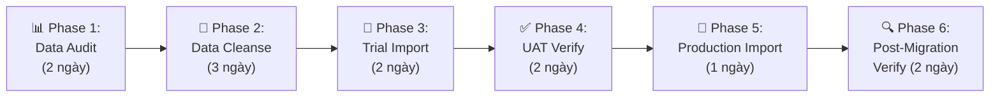

# DATA MIGRATION PLAN — Template

> **Tên dự án:** [Tên]
> **Ngày tạo:** [DD/MM/YYYY]
> **Phiên bản:** V1.0
> **Người viết:** @ba-specialist

---

## 1. Tổng quan Migration

| Item | Giá trị |
|------|---------|
| **Nguồn dữ liệu** | [VD: Excel (.xlsx), Access DB, Hệ thống cũ (SQL Server)] |
| **Đích** | [VD: PostgreSQL — Schema dự án mới] |
| **Khối lượng ước tính** | [VD: ~50,000 records, 15 bảng, ~200MB] |
| **Chiến lược** | [Big Bang / Parallel Run / Phased] |
| **Thời gian dự kiến** | [VD: 2 tuần (1 tuần test + 1 tuần cutover)] |
| **Rollback Plan** | [VD: Backup toàn bộ DB trước import. Restore trong 2h nếu fail.] |

---

## 2. Data Mapping (Source → Target)

### 2.1 Entity: [Tên Entity 1 — VD: Tài sản]

| # | Source Field (Excel) | Target Field (DB) | Type | Transform Rule | Required | Validation |
|---|---------------------|-------------------|------|---------------|:---:|---|
| 1 | Cột A: "Mã tải sản" | `asset_code` | VARCHAR(20) | `TRIM() + UPPER()` | ✅ | Unique, pattern: `TS-\d{4}-\d{3}` |
| 2 | Cột B: "Tên tải sản" | `asset_name` | VARCHAR(200) | `TRIM()` | ✅ | Length ≤ 200 |
| 3 | Cột E: "Ngày mua" | `purchase_date` | DATE | Parse DD/MM/YYYY → ISO 8601 | ✅ | ≥ 01/01/2000, ≤ Today |
| 4 | Cột F: "Giá mua" | `purchase_price` | DECIMAL(15,2) | Remove "VND", remove dots → number | ✅ | ≥ 0 |
| 5 | Cột G: "Phòng ban" | `department_id` | FK (INT) | Lookup department name → ID | ✅ | Must exist in `departments` table |
| 6 | Cột H: "Ghi chú" | `notes` | TEXT | `TRIM()`, NULL if empty | ❌ | — |
| 7 | *(không có)* | `created_at` | TIMESTAMP | Auto: NOW() | ✅ | Auto-generated |
| 8 | *(không có)* | `migration_batch` | VARCHAR(20) | Auto: `MIG-YYYYMMDD-001` | ✅ | Auto-generated |

### 2.2 Entity: [Tên Entity 2]

*(Lặp lại bảng mapping cho mỗi entity)*

---

## 3. Data Cleansing Rules

| Rule ID | Vấn đề | Cách xử lý | Ưu tiên |
|---------|--------|------------|---------|
| CLN-01 | Duplicate records (cùng Mã TS) | Giữ record mới nhất (theo Ngày mua). Log duplicates. | 🔴 |
| CLN-02 | Missing required fields | Gán giá trị mặc định + Flag "[NEEDS_REVIEW]" | 🔴 |
| CLN-03 | Invalid date format (MM/DD vs DD/MM) | Parse cả 2 format, chọn valid. Manual review nếu ambiguous. | 🟡 |
| CLN-04 | Encoding issues (UTF-8 vs Windows-1252) | Convert all → UTF-8. Test với ký tự đặc biệt VN. | 🟡 |
| CLN-05 | Orphan records (FK trỏ tới record không tồn tại) | Tạo placeholder parent record + Flag "[ORPHAN]" | 🟠 |
| CLN-06 | Số tiền format sai ("1.000.000 VND" vs 1000000) | Regex normalize → DECIMAL | 🟡 |

---

## 4. Migration Phases



### Phase 1: Data Audit (Kiểm toán dữ liệu nguồn)
- [ ] Đếm tổng records mỗi entity
- [ ] Xác định tỷ lệ missing/invalid data
- [ ] Xác định encoding
- [ ] List tất cả distinct values cho lookup fields

### Phase 2: Data Cleanse (Làm sạch)
- [ ] Chạy cleansing rules (CLN-01 → CLN-06)
- [ ] Review và approve danh sách exceptions
- [ ] Tạo "cleaned export" → sẵn sàng import

### Phase 3: Trial Import (Import thử)
- [ ] Import vào DB staging
- [ ] Chạy validation queries
- [ ] Report: X% success, Y% warnings, Z% errors

### Phase 4: UAT Verify
- [ ] KH kiểm tra dữ liệu trên hệ thống mới
- [ ] So sánh: record count, giá trị key fields
- [ ] Phê duyệt: "Dữ liệu import chính xác ≥ [X]%"

### Phase 5: Production Import
- [ ] Backup production DB
- [ ] Run import script
- [ ] Verify constraints + indexes
- [ ] Record cutover timestamp

### Phase 6: Post-Migration Verify
- [ ] Spot check 5% random records
- [ ] Run reconciliation report (Source count vs Target count)
- [ ] Decommission/archive source data

---

## 5. Cutover Strategy

| Strategy | Mô tả | Phù hợp khi |
|----------|--------|-------------|
| **Big Bang** | Import tất cả 1 lần, switch hoàn toàn sang hệ thống mới | Data đơn giản, downtime acceptable |
| **Parallel Run** | Chạy song song 2 hệ thống 1-2 tuần, so sánh kết quả | Mission-critical, cần zero-error |
| **Phased** | Import từng phòng ban / module. Verify → import tiếp. | Data lớn, team nhỏ |

**Lựa chọn cho dự án này:** [Chọn 1 + giải thích lý do]

---

## 6. Rollback Plan

| Trigger | Hành động | Thời gian RTO | Responsible |
|---------|-----------|:---:|---|
| Import > 10% errors | Stop import. Restore DB backup. Investigate. | 2h | DBA + Dev |
| Performance degradation > 50% | Rollback last batch. Optimize queries. | 1h | Dev Lead |
| Data corruption detected post-import | Full restore từ pre-migration backup | 4h | DBA |

---

## 7. Lệnh kích hoạt

```
@ba-specialist tạo data migration plan cho dự án [tên]
@ba-specialist mapping Excel cột [A,B,C...] sang schema [table_name]
@ba-specialist đề xuất data cleansing rules cho file Excel [tên file]
@ba-specialist tạo cutover checklist cho migration
```
