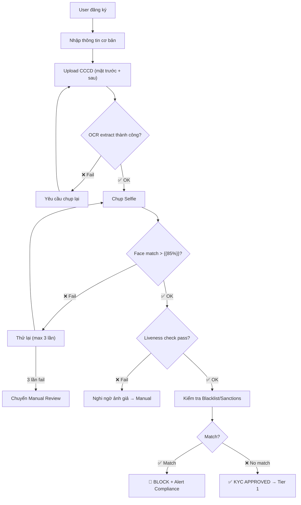

# AML / KYC PROCESS — {{TÊN DỰ ÁN}}

> **Phiên bản:** 0.1 | **Ngày:** {{DD/MM/YYYY}}
> **Áp dụng:** 💰 Fintech only
> **Mục đích:** Đặc tả quy trình eKYC + Giám sát giao dịch đáng ngờ (AML)

---

## 1. eKYC Tiering

### 1.1 Tier Definitions

| Tier | Xác minh yêu cầu | Hạn mức GD/ngày | Hạn mức GD/tháng | Use case |
|:----:|-----------------|:----------------:|:-----------------:|---------|
| 0 | Email + SĐT | ≤ {{1M}} | ≤ {{5M}} | Demo, xem thông tin |
| 1 | CCCD (OCR) + Selfie (Face match) | ≤ {{20M}} | ≤ {{200M}} | Cá nhân thông thường |
| 2 | Video call + Proof of address | ≤ {{100M}} | ≤ {{1B}} | Business / High-value |
| 3 | Xác minh tại chỗ + GPKD + Đại diện PL | Không giới hạn | Không giới hạn | Enterprise / Merchant |

### 1.2 eKYC Flow (Tier 1 — Phổ biến nhất)



### 1.3 eKYC Data Captured

| Field | Source | Validation |
|-------|--------|-----------|
| Họ tên | OCR từ CCCD | Match vs user input |
| Số CCCD | OCR từ CCCD | Check digit validation |
| Ngày sinh | OCR từ CCCD | ≥ 18 tuổi |
| Giới tính | OCR từ CCCD | — |
| Ảnh chân dung | CCCD | — |
| Selfie | Camera | Face match ≥ {{85%}} |
| Liveness score | AI | ≥ {{0.9}} |
| Địa chỉ | User input | Confirm tại Tier 2 |

---

## 2. Customer Due Diligence (CDD)

### 2.1 Risk Scoring

| Factor | Weight | Low (1) | Medium (3) | High (5) |
|--------|:------:|---------|-----------|---------|
| **Quốc tịch** | 20% | Việt Nam | ASEAN | High-risk (FATF list) |
| **Nghề nghiệp** | 15% | Nhân viên VP | Tự kinh doanh | PEP / Chính trị gia |
| **Thu nhập khai báo** | 15% | < 20M/tháng | 20-100M | > 100M |
| **Nguồn tiền** | 20% | Lương | Kinh doanh | Thừa kế / Không rõ |
| **Hành vi GD** | 30% | Phù hợp profile | Đôi khi bất thường | Thường xuyên bất thường |

**Risk Level:** Low (< 2.0) | Medium (2.0-3.5) | High (> 3.5)

### 2.2 Enhanced Due Diligence (EDD) — Khi Risk = High

| # | Action | Thực hiện bởi | Deadline |
|---|--------|:-------------:|:--------:|
| 1 | Request source of funds documentation | Compliance | 7 ngày |
| 2 | Senior management approval | Compliance Manager | 3 ngày |
| 3 | Enhanced monitoring (every transaction flagged) | System (auto) | Ongoing |
| 4 | Periodic review (3 tháng / lần) | Compliance | Recurring |

---

## 3. Transaction Monitoring (AML)

### 3.1 Rule Engine

| Rule ID | Tên | Trigger | Severity | Action |
|---------|-----|---------|:--------:|--------|
| AML-001 | **Velocity** | > {{10}} GD trong 1 giờ | 🟡 Medium | REVIEW |
| AML-002 | **Large Amount** | GD > {{50M}} | 🟡 Medium | REVIEW |
| AML-003 | **Daily Limit** | Tổng GD/ngày > {{200M}} | 🔴 High | BLOCK |
| AML-004 | **Structuring** | > {{5}} GD gần ngưỡng ({{45-49M}}) trong {{24h}} | 🔴 High | BLOCK + SAR |
| AML-005 | **Blacklist** | Match sanctions list (OFAC/UN/VN) | 🔴 Critical | BLOCK + SAR |
| AML-006 | **Geographic** | GD từ/đến high-risk country (FATF) | 🟡 Medium | REVIEW |
| AML-007 | **Dormant** | Tài khoản inactive > {{6 tháng}} + GD lớn đột ngột | 🟡 Medium | REVIEW |
| AML-008 | **Round Amount** | > {{3}} GD tròn số ({{10M, 20M}}) liên tiếp | 🟡 Medium | REVIEW |

### 3.2 Alert Processing Flow

```
Transaction → Rule Engine
    ├── PASS → Continue (no action)
    ├── REVIEW → Queue cho Compliance Officer
    │     ├── CLEAR → Release + Document reason
    │     ├── ESCALATE → Senior Compliance → Decision
    │     └── BLOCK → Freeze account + File SAR
    └── BLOCK (auto) → Freeze account + Alert Compliance + SAR
```

### 3.3 Suspicious Activity Report (SAR)

| Field | Mô tả |
|-------|-------|
| Report ID | SAR-{{YYYY}}-{{NNN}} |
| Subject | Tên + CCCD + Account ID |
| Suspicious activity | {{Mô tả hành vi đáng ngờ}} |
| Supporting evidence | Danh sách GD kèm screenshots |
| Rules triggered | {{AML-004, AML-008}} |
| Risk assessment | {{Low / Medium / High}} |
| Recommended action | {{Continue monitoring / Freeze / Close account}} |
| Filed to | {{Cục Phòng chống rửa tiền — NHNN}} |
| Filed date | {{DD/MM/YYYY}} |

---

## 4. Ongoing Monitoring

| Activity | Frequency | Owner | Tool |
|----------|:---------:|-------|------|
| Rule tuning (false positive review) | Monthly | Compliance + Data team | {{Spreadsheet / Dashboard}} |
| Sanctions list update | Weekly | System (auto) | {{API pull from OFAC/UN}} |
| KYC re-verification | Yearly (Tier 1) / 6 months (High risk) | Compliance | {{Notification + re-KYC flow}} |
| Regulatory report | Quarterly | Compliance Manager | {{Report template}} |

---

## ✅ Review Checklist

```
☐ eKYC tiering xác định rõ hạn mức + xác minh per tier
☐ Face match threshold + liveness score spec
☐ CDD risk scoring factors + weights xác định
☐ EDD process cho High-risk customers
☐ AML rules cover ≥ 6 patterns
☐ Alert processing flow: PASS / REVIEW / BLOCK
☐ SAR template + filing process to NHNN
☐ False positive monitoring plan (monthly)
```
