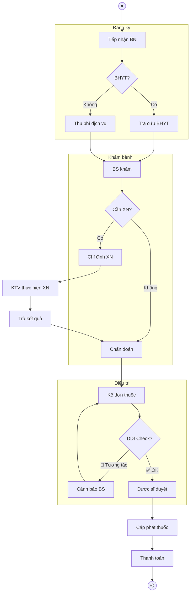

# CLINICAL WORKFLOW MAP — {{TÊN DỰ ÁN}}

> **Phiên bản:** 0.1 | **Ngày:** {{DD/MM/YYYY}}
> **Áp dụng:** 🏥 Healthcare only
> **Mục đích:** Document quy trình y khoa chi tiết cho từng Clinical Pathway

---

## 1. Clinical Pathways Index

| # | Pathway | Module HIS | Stakeholder chính | Status |
|---|---------|-----------|-------------------|:------:|
| 1 | {{Ngoại trú (OPD)}} | Tiếp nhận, Khám, CLS, Kê đơn, Thanh toán | BS phòng khám | ☐ |
| 2 | {{Nội trú (IPD)}} | Nhập viện, Theo dõi, Phẫu thuật, Xuất viện | BS điều trị + ĐD | ☐ |
| 3 | {{Cấp cứu (ER)}} | Phân loại, Xử trí, Chuyển khoa/viện | BS cấp cứu | ☐ |
| 4 | {{Cận lâm sàng (CLS)}} | Chỉ định, Lấy mẫu, XN, Trả KQ | KTV + BS | ☐ |
| 5 | {{Dược (Pharmacy)}} | Kê đơn, Duyệt, Cấp phát, DDI check | Dược sĩ | ☐ |

---

## 2. Pathway Template

> Copy section này cho MỖI pathway ở trên.

### 2.X Pathway: {{TÊN PATHWAY}}

#### Tổng quan

| Hạng mục | Chi tiết |
|---------|---------|
| **Trigger** | {{VD: Bệnh nhân đến phòng khám}} |
| **End state** | {{VD: BN nhận thuốc + ra về}} |
| **Actors** | {{Tiếp nhận, BS, ĐD, KTV, Dược sĩ, Thu ngân}} |
| **SLA** | {{VD: Thời gian khám trung bình ≤ 15 phút}} |

#### Luồng chính (Clinical Flow)

| Bước | Actor | Hành động | Hệ thống hỗ trợ | Output | Rủi ro y khoa |
|:----:|-------|----------|-----------------|--------|:-------------:|
| 1 | Tiếp nhận | {{Đăng ký BN, kiểm tra BHYT}} | {{Module Tiếp nhận}} | {{Phiếu khám}} | — |
| 2 | Bác sĩ | {{Khám, ghi nhận triệu chứng}} | {{Module Khám bệnh}} | {{Bệnh án}} | — |
| 3 | Bác sĩ | {{Chỉ định xét nghiệm}} | {{Module CLS}} | {{Phiếu chỉ định}} | ⚠️ Sai chỉ định |
| 4 | KTV | {{Lấy mẫu, thực hiện XN}} | {{Module LIS}} | {{Kết quả XN}} | ⚠️ Nhầm mẫu |
| 5 | Bác sĩ | {{Đọc KQ, chẩn đoán (ICD-10)}} | {{Module Chẩn đoán}} | {{Mã ICD}} | ⚠️ Sai chẩn đoán |
| 6 | Bác sĩ | {{Kê đơn thuốc}} | {{Module Kê đơn + DDI}} | {{Đơn thuốc}} | 🔴 DDI / Sai liều |
| 7 | Dược sĩ | {{Duyệt đơn, cấp phát}} | {{Module Dược}} | {{Thuốc}} | ⚠️ Sai thuốc |
| 8 | Thu ngân | {{Tính viện phí, thanh toán}} | {{Module Billing}} | {{Hóa đơn}} | — |

#### Luồng ngoại lệ (Exception)

| ID | Tại bước | Điều kiện | Xử lý | Rủi ro |
|----|:-------:|----------|-------|:------:|
| EX-1 | 3 | BN dị ứng thuốc cản quang | Cảnh báo + Chọn phương pháp khác | 🔴 |
| EX-2 | 6 | DDI phát hiện tương tác thuốc | Popup cảnh báo + BS xác nhận / đổi thuốc | 🔴 |
| EX-3 | 4 | Kết quả XN bất thường nguy hiểm | Alert tức thì cho BS + ĐD trực | 🔴 |

#### Diagram (Mermaid)



---

## 3. Drug-Drug Interaction (DDI) Rules

| # | Loại tương tác | Severity | Hành động hệ thống | BS có thể override? |
|---|---------------|:--------:|-------------------|:-------------------:|
| 1 | Chống chỉ định tuyệt đối | 🔴 Critical | BLOCK + Alert | ❌ Không |
| 2 | Tương tác nghiêm trọng | 🟠 Major | WARNING + Lý do bắt buộc | ✅ Có (ghi lý do) |
| 3 | Tương tác trung bình | 🟡 Moderate | INFO popup | ✅ Có |
| 4 | Tương tác nhẹ | 🔵 Minor | Log only | — |

---

## 4. Data Flow per Pathway

| Từ | Đến | Dữ liệu | Chuẩn | Frequency |
|----|-----|---------|-------|:---------:|
| HIS | LIS | Chỉ định XN (Order) | HL7 FHIR `ServiceRequest` | Per event |
| LIS | HIS | Kết quả XN | HL7 FHIR `DiagnosticReport` | Per event |
| HIS | Pharmacy | Đơn thuốc | HL7 FHIR `MedicationRequest` | Per event |
| HIS | BHYT | Hồ sơ thanh toán | API BHYT (XML) | Batch daily |

---

## ✅ Review Checklist

```
☐ Tất cả pathways chính đã có workflow map
☐ Mỗi pathway có: Trigger, End state, Actors, SLA
☐ Rủi ro y khoa đã ghi rõ per bước → Patient Safety
☐ DDI rules đã spec severity + override policy
☐ Exception flow cover ≥ 3 scenarios per pathway
☐ Data flow mapping giữa modules theo chuẩn HL7 FHIR
☐ Clinical Validation sign-off (xem multi-level-acceptance.md)
```
