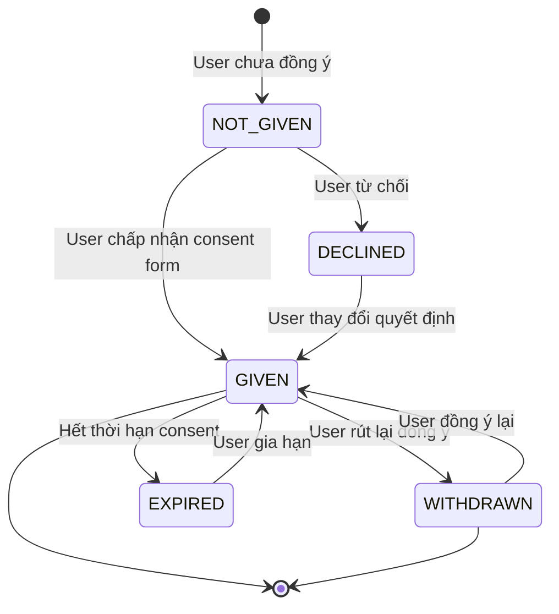

# DATA PRIVACY & CONSENT MANAGEMENT — {{TÊN DỰ ÁN}}

> **Phiên bản:** 0.1 | **Ngày:** {{DD/MM/YYYY}}
> **Áp dụng:** 🏥 Healthcare · 💰 Fintech
> **Mục đích:** Phân loại dữ liệu nhạy cảm + Quản lý đồng ý người dùng

---

## 1. Data Classification Matrix

| Cấp | Label | Ví dụ (Healthcare) | Ví dụ (Fintech) | Mã hóa | Access Control | Retention |
|:---:|-------|-------------------|-----------------|:------:|:--------------:|:---------:|
| 🔴 | **Restricted** | PHI (chẩn đoán, XN, tiền sử) | Card PAN, CVV, PIN | AES-256 + HSM | Role + Context + MFA | ≥ 10 năm |
| 🟠 | **Confidential** | PII (tên, CCCD, SĐT BN) | PII (tên, CCCD, SĐT KH) | AES-256 | Role + MFA | ≥ 5 năm |
| 🟡 | **Internal** | Thống kê bệnh (anonymized) | GD aggregated reports | TLS only | Department | ≥ 3 năm |
| 🟢 | **Public** | Giờ khám, danh sách khoa | Phí dịch vụ, FAQs | None | Public | — |

### 1.1 Field-Level Classification

| Entity | Field | Classification | Cần mã hóa? | Cần mask? | Ghi chú |
|--------|-------|:--------------:|:-----------:|:---------:|---------|
| Patient / Customer | full_name | 🟠 Confidential | ✅ | ✅ (hiển thị: N***n) | |
| Patient / Customer | id_number (CCCD) | 🟠 Confidential | ✅ | ✅ (hiển thị: ***1234) | |
| Patient | diagnosis | 🔴 Restricted | ✅ | ❌ (BS cần đọc) | Context-based |
| Transaction | card_pan | 🔴 Restricted | ✅ (tokenize) | ✅ (hiển thị: ****1234) | Never store raw |
| Transaction | amount | 🟡 Internal | ❌ | ❌ | |

---

## 2. Consent Management

### 2.1 Consent Categories

| # | Mục đích xử lý | Bắt buộc? | Granularity | VD Healthcare | VD Fintech |
|---|----------------|:---------:|:-----------:|-------------|-----------|
| 1 | **Cung cấp dịch vụ** | ✅ Bắt buộc | All-or-nothing | Khám chữa bệnh | Mở tài khoản |
| 2 | **Tiếp thị** | ☐ Tùy chọn | Opt-in | Gửi tin sức khỏe | Gửi khuyến mãi |
| 3 | **Chia sẻ bên thứ 3** | ☐ Tùy chọn | Per-partner | Chia sẻ BV khác | Chia sẻ đối tác |
| 4 | **Nghiên cứu** | ☐ Tùy chọn | Opt-in | Dữ liệu nghiên cứu y khoa | Analytics |
| 5 | **Lưu trữ lâu dài** | ☐ Tùy chọn | Duration-based | Lưu hồ sơ > 10 năm | Lưu GD > 10 năm |

### 2.2 Consent Lifecycle



### 2.3 Consent Record Schema

| Field | Type | Mô tả |
|-------|------|-------|
| consent_id | UUID | Primary key |
| user_id | FK → Users | Chủ thể dữ liệu |
| purpose | ENUM | Mục đích (service / marketing / research / ...) |
| status | ENUM | GIVEN / DECLINED / WITHDRAWN / EXPIRED |
| given_at | Timestamp | Thời điểm đồng ý |
| withdrawn_at | Timestamp | Thời điểm rút lại (nullable) |
| expires_at | Timestamp | Hết hạn (nullable) |
| consent_version | String | Version của consent form |
| ip_address | String | IP khi đồng ý (chứng cứ) |
| channel | ENUM | WEB / MOBILE / IN_PERSON / PAPER |

---

## 3. Data Subject Rights (NĐ 13/2023)

| # | Quyền | Mô tả | SLA xử lý | Endpoint/Flow |
|---|-------|-------|:---------:|--------------|
| 1 | **Truy cập** | Xem dữ liệu cá nhân của mình | ≤ 72 giờ | GET /api/v1/me/data |
| 2 | **Chỉnh sửa** | Yêu cầu sửa dữ liệu sai | ≤ 72 giờ | PATCH /api/v1/me/data |
| 3 | **Xóa** | Yêu cầu xóa dữ liệu | ≤ 72 giờ | DELETE /api/v1/me/data |
| 4 | **Rút đồng ý** | Rút lại consent đã cho | Realtime | POST /api/v1/me/consent/withdraw |
| 5 | **Xuất dữ liệu** | Tải về format đọc được (JSON/CSV) | ≤ 72 giờ | GET /api/v1/me/export |
| 6 | **Hạn chế xử lý** | Chỉ lưu, không xử lý thêm | ≤ 24 giờ | POST /api/v1/me/restrict |

> ⚠️ **Healthcare exception:** PHI dùng cho chẩn đoán/điều trị có thể KHÔNG xóa được (quy định lưu trữ bệnh án ≥ 10 năm). Ghi rõ cho user.

---

## 4. Break-the-Glass Protocol (🏥 Healthcare only)

> Khi nào: Cấp cứu cần truy cập hồ sơ BN ngoài context bình thường.

| Bước | Hành động | Ghi nhận |
|:----:|----------|---------|
| 1 | Nhân viên y tế chọn "Emergency Access" | Timestamp + User ID |
| 2 | Hệ thống yêu cầu ghi LÝ DO | Lý do bắt buộc (free text) |
| 3 | Hệ thống CẤP QUYỀN tạm thời | Duration: {{30 phút / 1 ca trực}} |
| 4 | Hệ thống GỬI THÔNG BÁO cho Head of Department | Email + In-app alert |
| 5 | Mọi thao tác trong session được LOG đặc biệt | Immutable audit log |
| 6 | Head of Department REVIEW trong 24 giờ | Approve / Escalate |

---

## ✅ Review Checklist

```
☐ Tất cả entity/field đã phân loại (Restricted → Public)
☐ Consent categories cover đủ mục đích xử lý
☐ Consent form version-tracked (khi policy đổi → re-consent)
☐ Data Subject Rights có SLA + endpoint/flow
☐ Break-the-Glass protocol spec (nếu Healthcare)
☐ Retention policy per data classification
☐ Cross-border data transfer rules xác định (nếu có)
```
