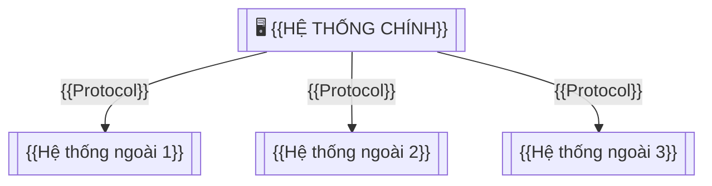

# INDUSTRY INTEGRATION SPEC — {{TÊN DỰ ÁN}}

> **Phiên bản:** 0.1 | **Ngày:** {{DD/MM/YYYY}}
> **Áp dụng:** 🏛️ Government · 🏥 Healthcare · 💰 Fintech
> **Mục đích:** Đặc tả tích hợp với hệ thống/chuẩn đặc thù ngành

---

## 1. Integration Landscape



---

## 2. Integration Points

| # | Hệ thống đích | Chuẩn/Protocol | Hướng | Frequency | Auth | SLA |
|---|--------------|---------------|:-----:|:---------:|------|:----|
| 1 | {{VD: LGSP tỉnh}} | {{REST + PKI}} | Bidirectional | Per event | {{mTLS + Token}} | {{< 3s}} |
| 2 | {{VD: HIS → LIS}} | {{HL7 FHIR R4}} | Request-Response | Per event | {{OAuth2}} | {{< 2s}} |
| 3 | {{VD: Payment Gateway}} | {{REST + Webhook}} | Bidirectional | Per event | {{API Key + HMAC}} | {{< 500ms}} |

---

## 3. Chi tiết từng Integration

> Copy section này cho MỖI integration point.

### 3.X Integration: {{Tên}} ({{Protocol}})

#### Overview

| Hạng mục | Chi tiết |
|---------|---------|
| **Endpoint** | {{URL / IP}} |
| **Authentication** | {{API Key / OAuth2 / mTLS / PKI}} |
| **Data Format** | {{JSON / XML / HL7 FHIR / SOAP}} |
| **Sandbox URL** | {{Test environment}} |
| **Documentation** | {{Link tới API docs đối tác}} |
| **Contact** | {{Tên + email đội integration đối tác}} |

#### API Contracts

| Method | Path | Request | Response | Error Codes |
|--------|------|---------|----------|------------|
| {{POST}} | {{/api/v1/resource}} | {{Request body spec}} | {{Response body spec}} | {{400, 401, 500}} |

#### Error Handling & Retry

| Error Type | HTTP Code | Retry? | Max Retries | Backoff | Fallback |
|-----------|:---------:|:------:|:-----------:|:-------:|---------|
| Network timeout | — | ✅ | 3 | Exponential (1s, 2s, 4s) | Queue for later |
| Auth expired | 401 | ✅ | 1 | Refresh token | Alert ops |
| Business error | 422 | ❌ | — | — | Log + notify user |
| Server error | 500+ | ✅ | 3 | Exponential | Circuit breaker |

#### Data Mapping

| Source Field | Target Field | Transform | Validate |
|-------------|-------------|-----------|----------|
| {{patient.name}} | {{FHIR Patient.name}} | {{firstName + lastName → HumanName}} | {{Required}} |

---

## 4. Appendix — Chuẩn ngành tham chiếu

### 🏛️ Government Standards

| Chuẩn | Mô tả | Khi nào dùng |
|-------|-------|-------------|
| LGSP | Nền tảng chia sẻ dữ liệu cấp tỉnh | Chia sẻ dữ liệu liên sở/ban/ngành |
| NGSP | Nền tảng chia sẻ dữ liệu quốc gia | Chia sẻ dữ liệu liên bộ/tỉnh |
| CSDL QG Dân cư | Dữ liệu công dân | Xác minh CCCD, thông tin dân cư |

### 🏥 Healthcare Standards

| Chuẩn | Mô tả | Resources chính |
|-------|-------|----------------|
| HL7 FHIR R4 | RESTful healthcare data exchange | Patient, Encounter, Observation, MedicationRequest, DiagnosticReport |
| DICOM | Medical imaging | SOP Classes, WADO-RS |
| ICD-10/11 | Disease classification | WHO Code System |
| HL7 CDA R2 | Clinical Document Architecture | Discharge Summary, Referral |

### 💰 Fintech Standards

| Chuẩn | Mô tả | Khi nào dùng |
|-------|-------|-------------|
| ISO 8583 | Financial transaction messaging | Card payment processing |
| ISO 20022 | Universal financial messaging | Bank transfers, SWIFT |
| Open Banking | API Standard (UK/SG/AU) | Third-party access to accounts |
| 3DS2 | 3D Secure authentication | Online card payments |

---

## ✅ Review Checklist

```
☐ Tất cả integration points đã spec: endpoint, auth, format, SLA
☐ Error handling + retry strategy per integration
☐ Data mapping hoàn thành + validation rules
☐ Sandbox/test environment xác nhận hoạt động
☐ Contact đối tác integration đã xác định
☐ Circuit breaker / fallback cho mỗi integration
☐ Security: mTLS/PKI cho Government, OAuth2 cho Healthcare, HMAC cho Fintech
```
