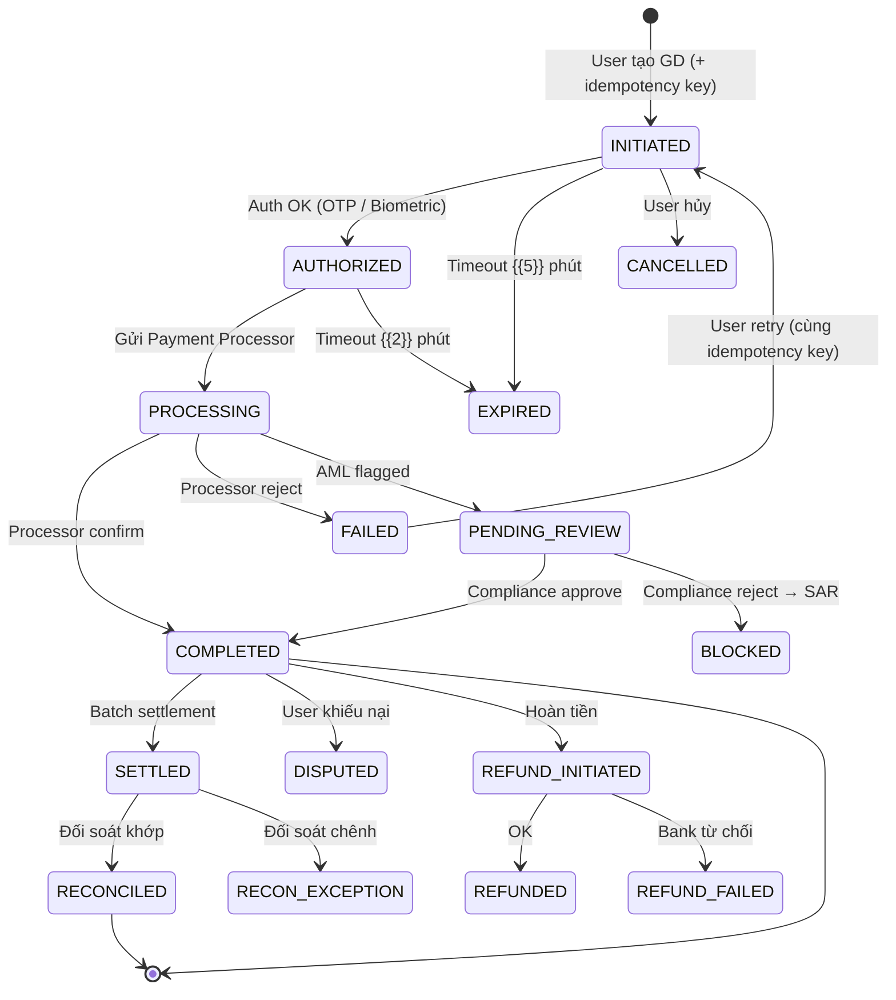

# TRANSACTION FLOW & RECONCILIATION SPEC — {{TÊN DỰ ÁN}}

> **Phiên bản:** 0.1 | **Ngày:** {{DD/MM/YYYY}}
> **Áp dụng:** 💰 Fintech only
> **Mục đích:** Đặc tả luồng giao dịch (transaction lifecycle) + quy trình đối soát

---

## 1. Transaction Types

| # | Loại GD | Mô tả | Settlement | Recon Type |
|---|--------|-------|:----------:|:----------:|
| 1 | {{Payment}} | {{Thanh toán hàng hóa/dịch vụ}} | T+0 / T+1 | Auto |
| 2 | {{Transfer}} | {{Chuyển tiền P2P / bank}} | T+0 | Auto |
| 3 | {{Topup}} | {{Nạp tiền vào ví}} | Realtime | Partner |
| 4 | {{Withdrawal}} | {{Rút tiền}} | T+1 | Bank |
| 5 | {{Refund}} | {{Hoàn tiền}} | T+1 – T+5 | Manual verify |

---

## 2. Transaction State Machine

### 2.1 State Diagram



### 2.2 State Transition Rules

| From | To | Trigger | Validation | Side Effects |
|------|-----|---------|-----------|-------------|
| INITIATED | AUTHORIZED | OTP/Biometric pass | Balance ≥ amount | Lock balance (hold) |
| AUTHORIZED | PROCESSING | Auto | Idempotency check | Send to processor |
| PROCESSING | COMPLETED | Processor callback | Signature verify | Debit ledger, Credit ledger, Release hold |
| COMPLETED | REFUND_INITIATED | Admin / User request | Within refund window ({{7}} days) | Create reverse entry |
| COMPLETED | SETTLED | Batch job ({{00:00 UTC}}) | — | Mark settled_at |

---

## 3. Double-Entry Ledger

### 3.1 Cấu trúc Ledger Entry

| Field | Type | Mô tả |
|-------|------|-------|
| entry_id | UUID | Primary key |
| transaction_id | FK | Giao dịch gốc |
| account_id | FK | Tài khoản |
| type | ENUM | DEBIT / CREDIT |
| amount | DECIMAL(20,2) | Số tiền (luôn dương) |
| currency | VARCHAR(3) | VND / USD |
| balance_after | DECIMAL(20,2) | Số dư sau GD |
| created_at | TIMESTAMP | Immutable |

### 3.2 Ví dụ Double-Entry: Payment

| # | Debit Account | Credit Account | Amount | Mô tả |
|---|:------------:|:--------------:|-------:|-------|
| 1 | User Wallet | Merchant Wallet | 100,000 | User thanh toán |
| 2 | Merchant Wallet | Platform Fee | 2,000 | Phí platform 2% |

> ⚠️ **Bất biến:** Tổng DEBIT === Tổng CREDIT cho mỗi transaction. Nếu không cân → ALERT ngay.

---

## 4. Idempotency Spec

| Hạng mục | Chi tiết |
|---------|---------|
| **Key format** | `{{client_id}}-{{timestamp}}-{{random}}` hoặc UUID v4 |
| **Key storage** | Redis (TTL = {{24h}}) + Database (permanent) |
| **Behavior khi duplicate** | Return kết quả của lần đầu tiên (không tạo GD mới) |
| **HTTP Response** | 200 OK (same response body as original) |

---

## 5. Reconciliation Spec

### 5.1 Các loại đối soát

| Loại | Tần suất | So sánh | Owner |
|------|:--------:|---------|-------|
| **Internal** | Realtime | Ledger Debit === Credit | System (auto) |
| **Partner** | T+1 | System transactions vs Partner settlement file | Ops team |
| **Bank** | T+1 | Settlement vs Bank statement | Finance team |
| **Regulatory** | Monthly | Reported vs Actual | Compliance team |

### 5.2 Reconciliation Flow

```
1. Partner gửi settlement file (CSV/SFTP) vào {{06:00}} hàng ngày
2. System parse + auto-match theo transaction_id
3. Kết quả:
   ├── MATCHED → Auto-close
   ├── AMOUNT_MISMATCH → Alert Ops + Manual review
   ├── MISSING_IN_SYSTEM → Investigate (timeout? duplicate?) 
   ├── MISSING_IN_PARTNER → Request partner check (SLA {{24h}})
   └── DUPLICATE → Flag + Refund investigation
4. Exception ≤ {{0.1%}} → PASS. Exception > {{1%}} → ESCALATE.
```

### 5.3 Reconciliation Report Template

| Metric | Giá trị | Target |
|--------|:-------:|:-----:|
| Total transactions (System) | {{N}} | — |
| Total transactions (Partner) | {{N}} | — |
| Auto-matched | {{N}} ({{%}}) | ≥ 99% |
| Amount mismatches | {{N}} | ≤ 0.1% |
| Missing in system | {{N}} | 0 |
| Missing in partner | {{N}} | ≤ 0.05% |
| **Net settlement amount** | {{VNĐ}} | **Must match bank statement** |

---

## ✅ Review Checklist

```
☐ Tất cả transaction types đã spec state machine
☐ Mỗi state transition có: trigger, validation, side effects
☐ Double-entry ledger cân bằng (Debit === Credit)
☐ Idempotency key spec rõ TTL + duplicate behavior
☐ Reconciliation flow cover ≥ 4 loại đối soát
☐ Exception handling per recon type
☐ Settlement window (T+0/T+1) xác nhận với đối tác
```
