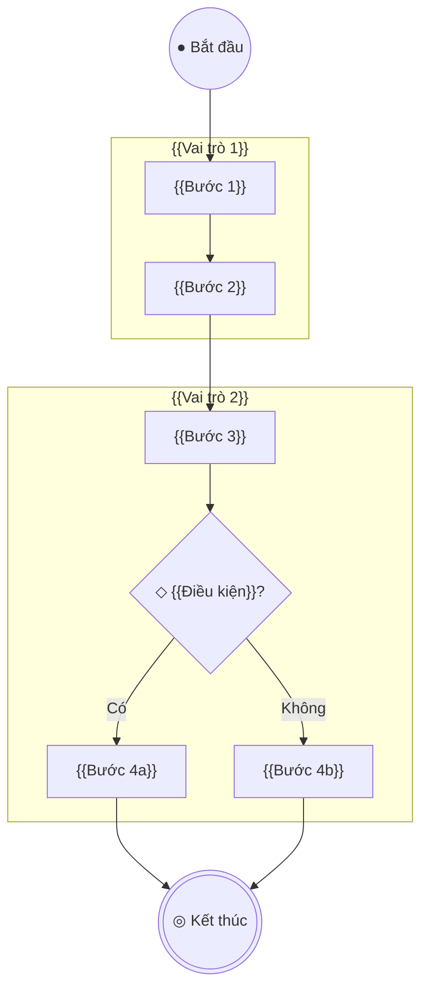
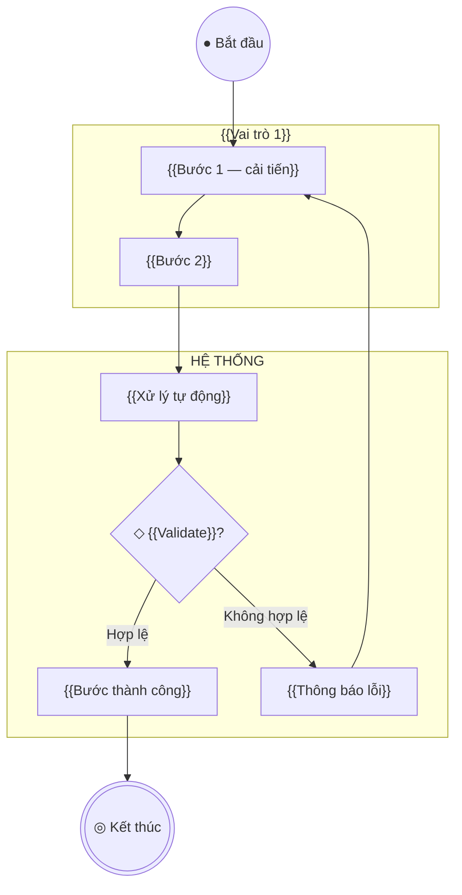

# PROCESS FLOW — {{TÊN DỰ ÁN}}

> **Phiên bản:** 0.1 | **Ngày:** {{DD/MM/YYYY}}
> **Tác giả:** {{Tên BA}} | **Trạng thái:** Draft

---

## 1. Tổng quan quy trình

| # | Quy trình | As-Is | To-Be | Mức ưu tiên |
|---|----------|-------|-------|------------|
| 1 | {{Tên quy trình}} | ☐ Đã mô tả | ☐ Đã mô tả | Must / Should |

---

## 2. Quy trình {{Tên quy trình 1}}

### 2.1 As-Is — Quy trình hiện tại

> Mô tả cách hoạt động HIỆN TẠI (trước khi có hệ thống).

**Tóm tắt:** {{Mô tả ngắn quy trình hiện tại}}

**Pain points:**
- ❌ {{Pain point 1}}
- ❌ {{Pain point 2}}



### 2.2 Gap Analysis — So sánh As-Is vs To-Be

| Bước | As-Is (hiện tại) | Vấn đề | To-Be (tương lai) | Cải tiến |
|------|-----------------|--------|-------------------|---------|
| {{Bước 1}} | {{Cách làm hiện tại}} | {{Vấn đề}} | {{Cách làm mới}} | {{Lợi ích}} |

### 2.3 To-Be — Quy trình tương lai

> Mô tả cách hoạt động SAU KHI có hệ thống.

**Cải tiến chính:**
- ✅ {{Cải tiến 1}}
- ✅ {{Cải tiến 2}}



---

## 3. Quy ước sơ đồ

> Xem `core/diagram-guide.md` để biết chi tiết Mermaid syntax.

| Thành phần | Hình | Dùng cho |
|-----------|------|---------|
| Start | `(("● Bắt đầu"))` | Điểm bắt đầu |
| End | `((("◎ Kết thúc")))` | Điểm kết thúc |
| Hành động | `["Tên"]` | Bước xử lý |
| Quyết định | `{"◇ Điều kiện?"}` | Rẽ nhánh |
| Swimlane | `subgraph "Vai trò"` | Ai chịu trách nhiệm |

### 8 câu hỏi vàng khi thu thập quy trình

```
1. Quy trình BẮT ĐẦU khi nào?           → Start
2. BƯỚC TIẾP THEO là gì?                 → Flow
3. Có trường hợp ĐI KHÁC ĐƯỜNG không?    → Decision ◇
4. AI thực hiện bước này?                 → Swimlane
5. Nếu LỖI xảy ra thì sao?              → Exception
6. Quy trình KẾT THÚC khi nào?           → End
7. Bước nào HỆ THỐNG TỰ LÀM?            → Automation
8. Cần THÔNG TIN GÌ từ bước trước?       → Data flow
```

---

## ✅ Review Checklist

```
☐ Mọi quy trình chính đều có As-Is + To-Be
☐ Gap Analysis so sánh rõ ràng
☐ Diagram có Start + End
☐ Decision node có ĐỦ nhánh
☐ Swimlane ghi rõ vai trò chịu trách nhiệm
☐ Happy path đi thẳng, exception rẽ ngang
☐ Pain points As-Is được giải quyết ở To-Be
```
