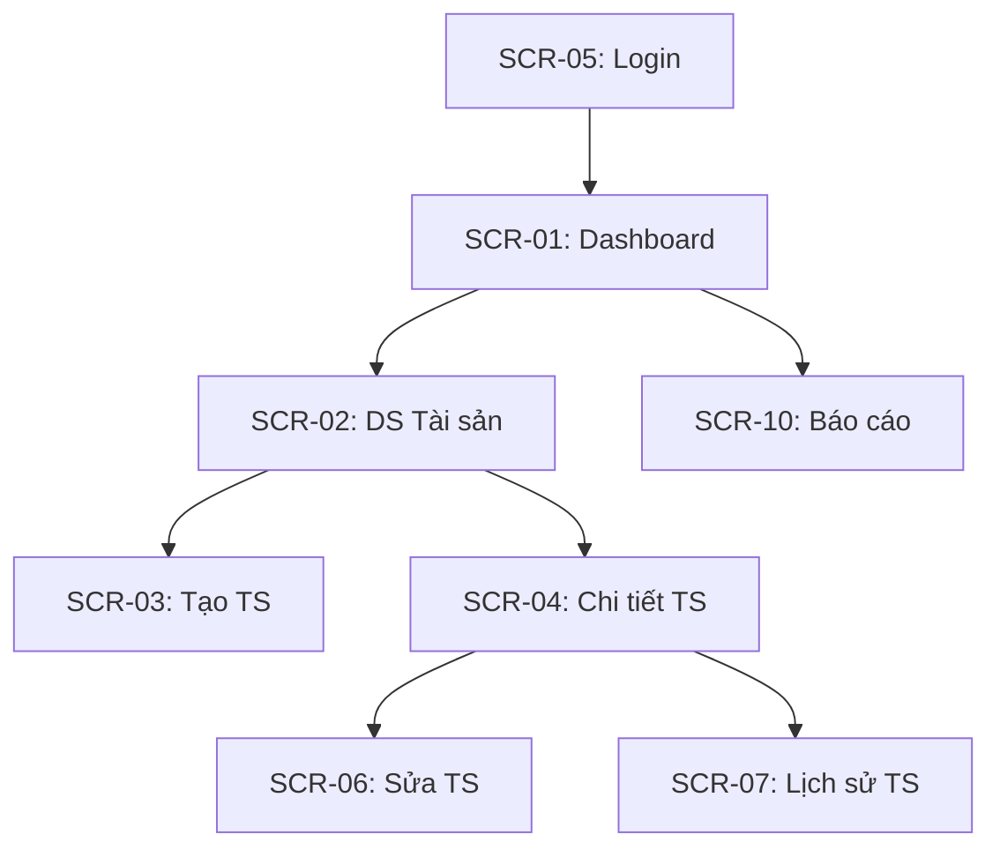

# SCREEN INVENTORY — Template

> **Tên dự án:** [Tên]
> **Ngày tạo:** [DD/MM/YYYY]
> **Phiên bản:** V1.0
> **Tổng screens:** [X]

---

## 1. Master Screen List

| Screen ID | Tên Screen | Feature | Module | Type | Actor chính | Wireframe | Status |
|---|---|---|---|---|---|---|---|
| SCR-01 | [VD: Dashboard Tổng quan] | F01 | [VD: Dashboard] | Dashboard | [VD: Admin] | [✅ WF-01 / ⏳ Pending] | [Draft / Approved] |
| SCR-02 | [VD: Danh sách Tài sản] | F05 | [VD: Quản lý TS] | List/Table | [VD: KTTS] | [✅ WF-02] | [Draft] |
| SCR-03 | [VD: Form Tạo Tài sản] | F05 | [VD: Quản lý TS] | Form/Input | [VD: KTTS] | [✅ WF-03] | [Draft] |
| SCR-04 | [VD: Chi tiết Tài sản] | F05 | [VD: Quản lý TS] | Detail/View | [VD: KTTS] | [✅ WF-04] | [Draft] |
| SCR-05 | [VD: Đăng nhập] | F02 | [VD: Auth] | Login/Auth | [VD: All] | [⏳ Pending] | [Draft] |

---

## 2. Coverage Summary

| Metric | Giá trị | Target | Status |
|--------|:---:|:---:|:---:|
| Tổng Features | [X] | — | — |
| Features có Screen | [Y] | 100% | [Y/X = ?%] |
| Tổng Screens | [Z] | — | — |
| Screens có Wireframe | [W] | 100% (cho screens cần WF) | [W/?] |
| Actors covered | [A] | = Actors trong BRD | [Match?] |

---

## 3. Screen Details

### SCR-01: [Tên Screen]

| Thuộc tính | Giá trị |
|-----------|---------|
| **Feature** | F01: [Tên Feature] |
| **Actor** | [Role] |
| **Mục đích** | [1-2 câu mô tả screen làm gì] |
| **Entry Point** | [Từ đâu navigate đến? VD: Menu trái → Dashboard] |
| **Exit Points** | [Từ screen này đi đâu? VD: Click item → SCR-04] |
| **Platform** | [Desktop / Mobile / Both] |

**Data Elements:**

| Element | Type | Source | Notes |
|---------|------|--------|-------|
| [VD: Tổng tài sản] | KPI Card | API: `/api/assets/count` | Real-time |
| [VD: Chart phân bố] | Pie Chart | API: `/api/assets/by-category` | Cached 5min |

**Actions:**

| Action | Type | Target | Permission |
|--------|------|--------|-----------|
| [VD: Xem chi tiết] | Click row | → SCR-04 | All users |
| [VD: Export CSV] | Button | Download | Admin only |

**Wireframe:** [Link hoặc Mermaid mockup]

---

## 4. Navigation Map

---

## 5. Responsive Matrix

| Screen ID | Desktop | Tablet | Mobile | Notes |
|---|:---:|:---:|:---:|---|
| SCR-01 | ✅ Full | ✅ Adapted | ✅ Simplified | Mobile: chỉ KPI cards, ẩn charts |
| SCR-02 | ✅ Full table | ✅ Scroll horizontal | ✅ Card view | Mobile chuyển table → cards |
| SCR-03 | ✅ Full form | ✅ Full form | ⚠️ Not supported | Form phức tạp → chỉ Desktop/Tablet |
