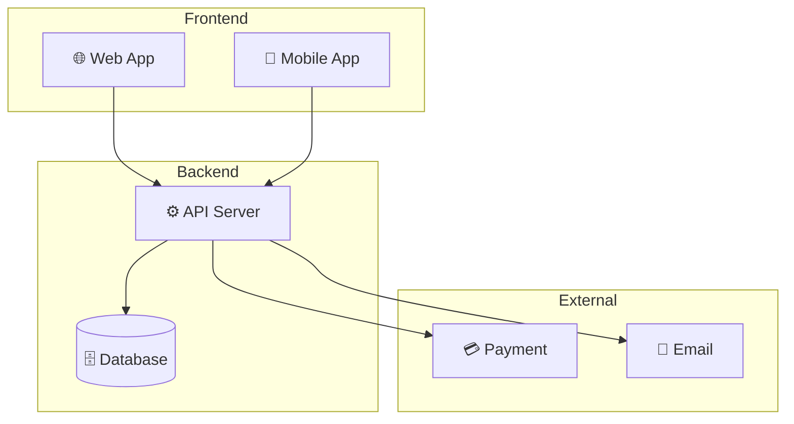
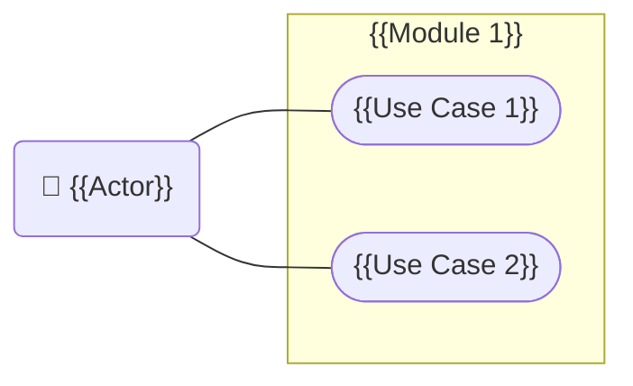
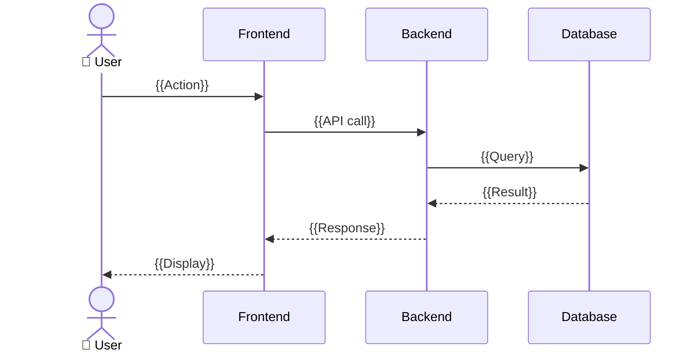

# SRS — SOFTWARE REQUIREMENTS SPECIFICATION
# {{TÊN DỰ ÁN}}

> **Phiên bản:** 0.1 | **Ngày:** {{DD/MM/YYYY}}
> **Tác giả:** {{Tên BA}} | **Trạng thái:** Draft
> **Tham chiếu BRD:** {{BRD version}}

---

## Lịch sử thay đổi

| Phiên bản | Ngày | Người chỉnh | Mô tả thay đổi |
|-----------|------|-------------|----------------|
| 0.1 | {{ngày}} | {{tên}} | Phiên bản đầu tiên |

## Phê duyệt

| Vai trò | Tên | Ngày ký | Chữ ký |
|---------|-----|---------|--------|
| BA | | | |
| Dev Lead | | | |
| PO / Sponsor | | | |

---

## 1. Giới thiệu

### 1.1 Mục đích

Tài liệu này đặc tả chi tiết yêu cầu chức năng và phi chức năng cho hệ thống {{Tên hệ thống}}, là cơ sở cho Dev team triển khai và QC team kiểm thử.

### 1.2 Phạm vi hệ thống

> Trích từ Vision & Scope (chỉ liệt kê modules trong scope)

| Module | Mô tả | MoSCoW |
|--------|-------|--------|
| {{Module 1}} | {{Mô tả}} | Must |

### 1.3 Tài liệu tham chiếu

| Tài liệu | Mô tả |
|-----------|-------|
| BRD v{{x}} | Yêu cầu kinh doanh |
| Vision & Scope v{{x}} | Tầm nhìn và phạm vi |
| Stakeholder Map | Bên liên quan |

---

## 2. Tổng quan hệ thống

### 2.1 Kiến trúc tổng quan

> Context-level architecture — hệ thống + hệ thống liên quan.



### 2.2 Actors

| Actor | Mô tả | Quyền hạn |
|-------|-------|----------|
| {{Actor 1}} | {{Mô tả}} | {{Quyền}} |

---

## 3. Yêu cầu chức năng (Functional Requirements)

### 3.1 Module: {{Tên Module 1}}

#### Use Case Diagram



#### FR-{{MOD}}-001: {{Tên chức năng}}

| Thuộc tính | Chi tiết |
|-----------|---------|
| **ID** | FR-{{MOD}}-001 |
| **Tên** | {{Tên chức năng}} |
| **Mô tả** | Hệ thống **PHẢI** {{mô tả chức năng}} |
| **Actor** | {{Actor}} |
| **Trigger** | {{Sự kiện kích hoạt}} |
| **Precondition** | {{Điều kiện tiên quyết}} |
| **MoSCoW** | Must / Should / Could |
| **Trace từ BRD** | BR-{{xxx}} |

**Luồng chính (Happy Path):**

| Bước | Actor / System | Hành động |
|------|---------------|----------|
| 1 | Actor | {{Hành động}} |
| 2 | System | {{Phản hồi}} |
| 3 | System | {{Xử lý}} |

**Luồng ngoại lệ (Exception):**

| ID | Tại bước | Điều kiện | Xử lý |
|----|---------|----------|-------|
| E1 | 2 | {{Lỗi}} | {{Hệ thống phản hồi}} |

**Business Rules:**

| Rule ID | Quy tắc | Ví dụ |
|---------|---------|-------|
| BR-{{MOD}}-001 | {{Quy tắc}} | {{Ví dụ}} |

---

## 4. Yêu cầu phi chức năng (Non-Functional Requirements)

### 4.1 Performance (Hiệu năng)

| NFR ID | Yêu cầu | Metric | Target |
|--------|---------|--------|--------|
| NFR-PERF-001 | Thời gian phản hồi API | Response time (p95) | < 500ms |
| NFR-PERF-002 | Thời gian tải trang | Page load (p95) | < 3s |
| NFR-PERF-003 | Concurrent users | Số user đồng thời | {{Số}} |
| NFR-PERF-004 | Throughput | Requests/second | {{Số}} |

### 4.2 Security (Bảo mật)

| NFR ID | Yêu cầu | Chi tiết |
|--------|---------|---------|
| NFR-SEC-001 | Authentication | {{JWT / OAuth2 / SSO}} |
| NFR-SEC-002 | Authorization | RBAC / ABAC |
| NFR-SEC-003 | Data encryption | In-transit (TLS 1.2+), At-rest (AES-256) |
| NFR-SEC-004 | Input validation | XSS, SQL Injection prevention |
| NFR-SEC-005 | Password policy | {{Min 8 chars, uppercase, number, special}} |

### 4.3 Availability (Khả dụng)

| NFR ID | Yêu cầu | Target |
|--------|---------|--------|
| NFR-AVA-001 | Uptime | {{99.9%}} |
| NFR-AVA-002 | Planned downtime | {{Window}} |
| NFR-AVA-003 | Recovery time (RTO) | {{Thời gian}} |
| NFR-AVA-004 | Recovery point (RPO) | {{Thời gian}} |

### 4.4 Scalability (Khả năng mở rộng)

| NFR ID | Yêu cầu | Target |
|--------|---------|--------|
| NFR-SCA-001 | Data growth | {{Dự kiến / tháng}} |
| NFR-SCA-002 | User growth | {{Dự kiến}} |

### 4.5 Usability (Khả dụng)

| NFR ID | Yêu cầu | Target |
|--------|---------|--------|
| NFR-USA-001 | Responsive | Desktop + Tablet + Mobile |
| NFR-USA-002 | Browser support | Chrome, Firefox, Safari, Edge (latest 2) |
| NFR-USA-003 | Accessibility | WCAG 2.1 Level AA |

### 4.6 Maintainability (Dễ bảo trì)

| NFR ID | Yêu cầu | Chi tiết |
|--------|---------|---------|
| NFR-MNT-001 | Logging | Structured logging, correlation ID |
| NFR-MNT-002 | Monitoring | Health check, APM |
| NFR-MNT-003 | Documentation | API docs (Swagger/OpenAPI) |

---

## 5. State Diagram — Vòng đời entity chính

> Dùng cho entity có nhiều trạng thái (Order, Ticket, Request...)

```mermaid
stateDiagram-v2
    [*] --> {{STATE_1}}: {{Action}}
    {{STATE_1}} --> {{STATE_2}}: {{Action}}
    {{STATE_2}} --> {{STATE_3}}: {{Action}}
    {{STATE_3}} --> [*]
```

---

## 6. Sequence Diagram — Luồng chính



---

## 7. Data Dictionary tóm tắt

> Chi tiết: xem `data-model.md`

| Entity | Mô tả | Số fields | Tham chiếu |
|--------|-------|----------|-----------|
| {{Entity}} | {{Mô tả}} | {{N}} | data-model.md > Section X |

---

## 8. Giả định & Dependencies

### Giả định

| # | Giả định | Ảnh hưởng nếu sai |
|---|---------|-------------------|
| 1 | {{Giả định}} | {{Hậu quả}} |

### Dependencies

| # | Phụ thuộc | Hệ thống / Team | Status |
|---|----------|-----------------|--------|
| 1 | {{Dependency}} | {{Ai cung cấp}} | ✅ / ⏳ / ❌ |

---

## 9. Traceability Matrix

| BRD Req ID | SRS FR/NFR ID | User Story | Test Case |
|-----------|--------------|-----------|-----------|
| BR-001 | FR-{{MOD}}-001 | US-{{MOD}}-001 | TC-{{MOD}}-001 |

---

## ✅ BACCM Self-Check

```
☐ CHANGE:      Đã align với vấn đề trong BRD
☐ NEED:        FR cover đủ business needs
☐ SOLUTION:    Giải pháp kỹ thuật cụ thể, không over-engineer
☐ STAKEHOLDER: Actor list đầy đủ
☐ VALUE:       NFR có metric đo được
☐ CONTEXT:     Ràng buộc kỹ thuật ghi đầy đủ (NFR Section 4)
```
