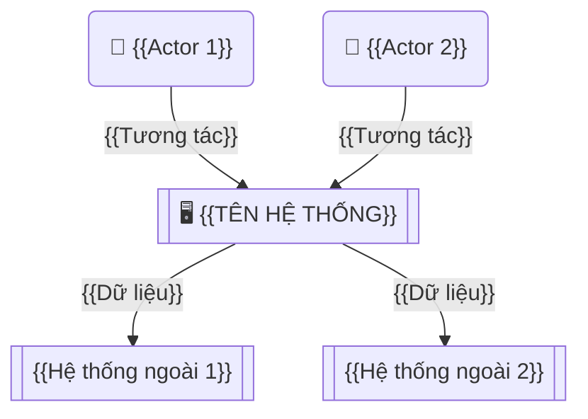

# VISION & SCOPE — {{TÊN DỰ ÁN}}

> **Phiên bản:** 0.1 | **Ngày:** {{DD/MM/YYYY}}
> **Tác giả:** {{Tên BA}} | **Trạng thái:** Draft
> **Dự án:** {{Tên dự án}}

---

## Lịch sử thay đổi

| Phiên bản | Ngày | Người chỉnh | Mô tả thay đổi |
|-----------|------|-------------|----------------|
| 0.1 | {{ngày}} | {{tên}} | Phiên bản đầu tiên |

---

## Phê duyệt

| Vai trò | Tên | Ngày ký | Chữ ký |
|---------|-----|---------|--------|
| BA | | | |
| PM | | | |
| Sponsor | | | |

---

## 1. Tổng quan dự án

### 1.1 Bối cảnh (Context — BACCM)

> Mô tả bối cảnh tổ chức, kỹ thuật, thị trường dẫn đến dự án này.

{{Mô tả bối cảnh: tổ chức đang gặp vấn đề gì? Cơ hội gì?}}

### 1.2 Vấn đề / Cơ hội (Change — BACCM)

> Lý do tại sao cần thay đổi. Vấn đề hiện tại hoặc cơ hội kinh doanh.

| Vấn đề / Cơ hội | Mô tả | Ảnh hưởng hiện tại |
|-----------------|-------|-------------------|
| {{Vấn đề 1}} | {{Mô tả}} | {{Ảnh hưởng: thời gian, chi phí, chất lượng}} |
| {{Vấn đề 2}} | {{Mô tả}} | {{Ảnh hưởng}} |

### 1.3 Tầm nhìn (Vision)

> 1-2 câu mô tả trạng thái mong muốn sau khi dự án hoàn thành.

**"{{Mô tả tầm nhìn — viết ngắn gọn, truyền cảm hứng}}"**

---

## 2. Mục tiêu kinh doanh (Value — BACCM)

| # | Mục tiêu | Metric đo lường | Target | Timeline |
|---|---------|-----------------|--------|----------|
| 1 | {{Mục tiêu 1}} | {{KPI}} | {{Số liệu cụ thể}} | {{Thời hạn}} |
| 2 | {{Mục tiêu 2}} | {{KPI}} | {{Số liệu cụ thể}} | {{Thời hạn}} |

---

## 3. Phạm vi (Scope)

### 3.1 Trong phạm vi (In Scope)

| # | Module / Feature | Mô tả ngắn | MoSCoW |
|---|-----------------|-----------|--------|
| 1 | {{Module 1}} | {{Mô tả}} | Must |
| 2 | {{Module 2}} | {{Mô tả}} | Should |

### 3.2 Ngoài phạm vi (Out of Scope)

| # | Item | Lý do loại trừ |
|---|------|---------------|
| 1 | {{Item bị loại}} | {{Lý do}} |

### 3.3 Giả định (Assumptions)

| # | Giả định | Rủi ro nếu sai |
|---|---------|----------------|
| 1 | {{Giả định}} | {{Hậu quả}} |

### 3.4 Ràng buộc (Constraints)

| # | Ràng buộc | Loại (Kỹ thuật / Kinh doanh / Pháp lý / Thời gian) |
|---|----------|-----------------------------------------------------|
| 1 | {{Ràng buộc}} | {{Loại}} |

---

## 4. Impact Mapping — Từ mục tiêu đến tính năng

> Xem `core/principles.md` > Mục 8 để hiểu framework.

```
WHY?              WHO?              HOW?              WHAT?
(Business Goal)   (Actors)          (Impacts)         (Deliverables)
──────────────    ──────────────    ──────────────    ──────────────
{{Mục tiêu 1}}    {{Actor 1}}       {{Impact 1.1}}    {{Feature 1.1.1}}
                                                      {{Feature 1.1.2}}
                                    {{Impact 1.2}}    {{Feature 1.2.1}}
                  {{Actor 2}}       {{Impact 2.1}}    {{Feature 2.1.1}}
```

---

## 5. Context Diagram

> Xem `core/diagram-guide.md` để biết cách vẽ.



---

## 6. Stakeholder tổng quan

> Chi tiết: xem `stakeholder-map.md`

| Stakeholder | Vai trò | Mức quan tâm | Mức ảnh hưởng |
|-------------|---------|--------------|---------------|
| {{Tên}} | {{Vai trò}} | Cao/Trung bình/Thấp | Cao/Trung bình/Thấp |

---

## 7. Timeline tổng quan

```mermaid
gantt
    title Timeline dự án — {{Tên dự án}}
    dateFormat YYYY-MM-DD

    section Inception
        Khởi động :a1, {{start_date}}, 14d

    section Discovery
        Khám phá  :b1, after a1, 21d

    section Elaboration
        Chi tiết hóa :c1, after b1, 14d

    section Delivery
        Sprint 1-N  :d1, after c1, 60d

    section Closure
        Nghiệm thu :e1, after d1, 14d
```

---

## 8. Rủi ro ban đầu

| # | Rủi ro | Xác suất | Ảnh hưởng | Giải pháp giảm thiểu |
|---|--------|---------|-----------|---------------------|
| 1 | {{Rủi ro}} | Cao/Trung bình/Thấp | Cao/Trung bình/Thấp | {{Mitigation}} |

---

## 9. Tiêu chí thành công

| # | Tiêu chí | Metric | Target |
|---|---------|--------|--------|
| 1 | {{Tiêu chí}} | {{Cách đo}} | {{Mục tiêu cụ thể}} |

---

## ✅ BACCM Self-Check

```
☐ CHANGE:      Lý do thay đổi rõ ràng (Mục 1.2)
☐ NEED:        Nhu cầu được xác định, không chỉ triệu chứng
☐ SOLUTION:    Phạm vi giải pháp phù hợp (Mục 3)
☐ STAKEHOLDER: Stakeholder tổng quan đủ (Mục 6)
☐ VALUE:       Mục tiêu có metric đo được (Mục 2)
☐ CONTEXT:     Bối cảnh + ràng buộc ghi nhận đủ (Mục 1.1, 3.4)
```
