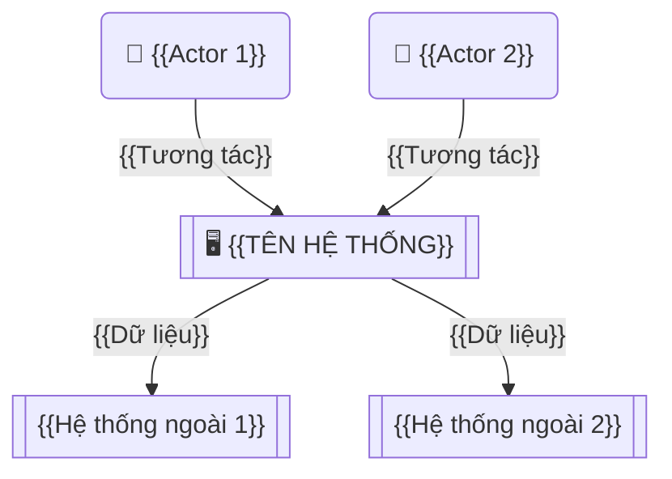

# VISION & SCOPE — {{TÊN DỰ ÁN}}

> **Phiên bản:** 0.1 | **Ngày:** {{DD/MM/YYYY}}
> **Tác giả:** {{Tên BA}} | **Trạng thái:** Draft
> **Dự án:** {{Tên dự án}}

---

## Lịch sử thay đổi

| Phiên bản | Ngày | Người chỉnh | Mô tả thay đổi |
|-----------|------|-------------|----------------|
| 0.1 | {{ngày}} | {{tên}} | Phiên bản đầu tiên |

---

## Phê duyệt

| Vai trò | Tên | Ngày ký | Chữ ký |
|---------|-----|---------|--------|
| Chuyên viên phân tích (BA) | | | |
| Quản lý dự án (PM) | | | |
| Nhà tài trợ (Sponsor) | | | |

---

## 1. Tổng quan dự án

### 1.1 Bối cảnh hiện tại

> Mô tả bối cảnh tổ chức, kỹ thuật, thị trường dẫn đến dự án này.

{{Mô tả bối cảnh: tổ chức đang gặp vấn đề gì? Cơ hội gì?}}

### 1.2 Vấn đề / Cơ hội cần giải quyết

> Lý do tại sao cần thay đổi. Vấn đề hiện tại hoặc cơ hội kinh doanh.

| Vấn đề / Cơ hội | Mô tả | Ảnh hưởng hiện tại |
|-----------------|-------|-------------------|
| {{Vấn đề 1}} | {{Mô tả}} | {{Ảnh hưởng: thời gian, chi phí, chất lượng}} |
| {{Vấn đề 2}} | {{Mô tả}} | {{Ảnh hưởng}} |

### 1.3 Tầm nhìn (Vision)

> 1-2 câu mô tả trạng thái mong muốn sau khi dự án hoàn thành.

**"{{Mô tả tầm nhìn — viết ngắn gọn, truyền cảm hứng}}"**

---

## 2. Mục tiêu kinh doanh

| # | Mục tiêu | Thước đo (KPI) | Chỉ tiêu kỳ vọng | Thời hạn |
|---|---------|----------------|------------------|----------|
| 1 | {{Mục tiêu 1}} | {{KPI}} | {{Số liệu cụ thể}} | {{Thời hạn}} |
| 2 | {{Mục tiêu 2}} | {{KPI}} | {{Số liệu cụ thể}} | {{Thời hạn}} |

---

## 3. Phạm vi (Scope)

### 3.1 Trong phạm vi

| # | Phân hệ / Nhóm tính năng | Mô tả ngắn | Mức ưu tiên |
|---|-------------------------|-----------|-------------|
| 1 | {{Module 1}} | {{Mô tả}} | Bắt buộc (Must) |
| 2 | {{Module 2}} | {{Mô tả}} | Nên có (Should) |

### 3.2 Ngoài phạm vi (Out of Scope)

| # | Item | Lý do loại trừ |
|---|------|---------------|
| 1 | {{Item bị loại}} | {{Lý do}} |

### 3.3 Giả định (Assumptions)

| # | Giả định | Rủi ro nếu sai |
|---|---------|----------------|
| 1 | {{Giả định}} | {{Hậu quả}} |

### 3.4 Ràng buộc (Constraints)

| # | Ràng buộc | Loại (Kỹ thuật / Kinh doanh / Pháp lý / Thời gian) |
|---|----------|-----------------------------------------------------|
| 1 | {{Ràng buộc}} | {{Loại}} |

---

## 4. Phân tích tác động — Từ mục tiêu đến tính năng

> Phương pháp Impact Mapping: Xem `core/principles.md` > Mục 8 để hiểu chi tiết.

```
TẠI SAO?          AI LIÊN QUAN?     TÁC ĐỘNG GÌ?     TÍNH NĂNG ĐÁP ỨNG?
(Mục tiêu KD)     (Đối tượng)       (Hiệu quả)       (Sản phẩm bàn giao)
──────────────    ──────────────    ──────────────    ──────────────
{{Mục tiêu 1}}    {{Đối tượng 1}}   {{Tác động 1.1}}  {{Tính năng 1.1.1}}
                                                      {{Tính năng 1.1.2}}
                                    {{Tác động 1.2}}  {{Tính năng 1.2.1}}
                  {{Đối tượng 2}}   {{Tác động 2.1}}  {{Tính năng 2.1.1}}
```

---

## 5. Sơ đồ tương tác tổng quan (Context Diagram)

> Xem `core/diagram-guide.md` để biết cách vẽ.



---

## 6. Các bên liên quan chính (Stakeholder)

> Chi tiết: xem `stakeholder-map.md`

| Bên liên quan | Vai trò | Mức quan tâm | Mức ảnh hưởng |
|---------------|---------|--------------|---------------|
| {{Tên}} | {{Vai trò}} | Cao/Trung bình/Thấp | Cao/Trung bình/Thấp |

---

## 7. Lộ trình triển khai tổng quan

```mermaid
gantt
    title Timeline dự án — {{Tên dự án}}
    dateFormat YYYY-MM-DD

    section Khởi động
        Khởi động & chốt phạm vi :a1, {{start_date}}, 14d

    section Khám phá
        Phân tích nghiệp vụ :b1, after a1, 21d

    section Chi tiết hóa
        Thiết kế giải pháp :c1, after b1, 14d

    section Xây dựng
        Giai đoạn lập trình 1-N :d1, after c1, 60d

    section Bàn giao
        Nghiệm thu & đào tạo :e1, after d1, 14d
```

---

## 8. Rủi ro ban đầu

| # | Rủi ro | Xác suất | Ảnh hưởng | Giải pháp giảm thiểu |
|---|--------|---------|-----------|---------------------|
| 1 | {{Rủi ro}} | Cao/Trung bình/Thấp | Cao/Trung bình/Thấp | {{Giải pháp giảm thiểu}} |

---

## 9. Tiêu chí thành công

| # | Tiêu chí | Thước đo | Chỉ tiêu kỳ vọng |
|---|---------|----------|------------------|
| 1 | {{Tiêu chí}} | {{Cách đo}} | {{Mục tiêu cụ thể}} |

---

## ✅ Checklist kiểm tra nội bộ (BACCM)

> _Phần này dành cho Team BA tự rà soát trước khi gửi khách hàng._

```
☐ LÝ DO THAY ĐỔI:   Vấn đề / cơ hội kinh doanh đã rõ ràng (Mục 1.2)
☐ NHU CẦU:           Nhu cầu được xác định đúng gốc, không chỉ triệu chứng
☐ GIẢI PHÁP:         Phạm vi giải pháp phù hợp (Mục 3)
☐ CÁC BÊN LIÊN QUAN: Đã liệt kê đủ người ra quyết định (Mục 6)
☐ GIÁ TRỊ:           Mục tiêu có thước đo định lượng (Mục 2)
☐ BỐI CẢNH:          Bối cảnh + ràng buộc đã ghi nhận đủ (Mục 1.1, 3.4)
```
