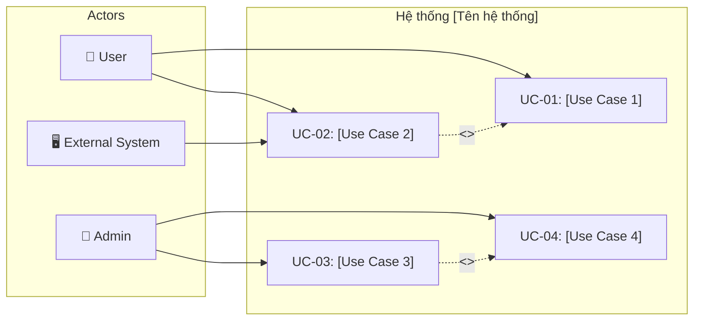
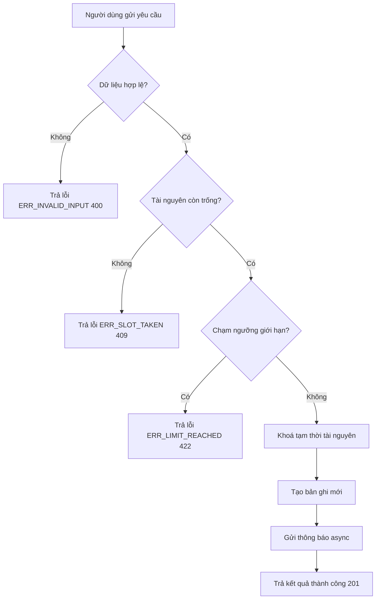
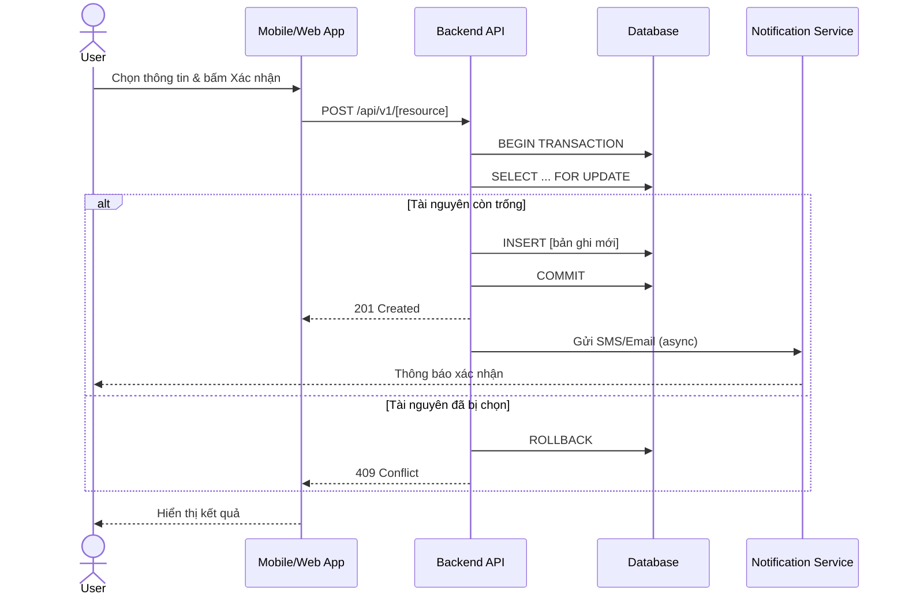
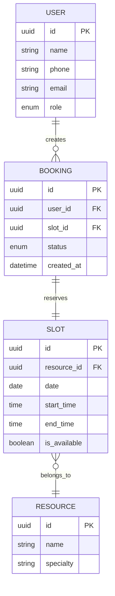

# 2. SRS — Software Requirements Specification
*Dành cho Đội Dev & QA — Ngôn ngữ kỹ thuật chính xác, chi tiết, đo lường được.*

---

## 2.0 Thông tin chung

| Mục | Chi tiết |
|---|---|
| **Tên dự án** | [Tên dự án] |
| **Loại tài liệu** | Software Requirements Specification (SRS) |
| **Phiên bản** | [x.x] Draft |
| **Tác giả** | [Tên chuyên viên BA] |
| **Ngày tạo** | [DD-MM-YYYY] |
| **Nguồn gốc** | Cụ thể hoá từ BRD v[x.x] |

### Nhật ký thay đổi (Change Log)
| Version | Ngày | Nội dung thay đổi | Người sửa |
|---|---|---|---|
| 1.0 | [DD-MM-YYYY] | Khởi tạo SRS từ BRD v[x.x] | [Tên BA] |

---

## 2.1 Giới thiệu

- **2.1.1 Mục đích tài liệu:** Mô tả chi tiết yêu cầu chức năng và phi chức năng cho hệ thống [Tên hệ thống], làm cơ sở để Dev và QA thiết kế, lập trình và kiểm thử.
- **2.1.2 Phạm vi hệ thống:** Áp dụng cho các modules [Liệt kê modules trong scope]; không bao gồm [Liệt kê ngoài scope].
- **2.1.3 Định nghĩa & Thuật ngữ viết tắt:**
  - `OTP`: One-Time Password
  - `FR`: Functional Requirement
  - `NFR`: Non-Functional Requirement
  - `BR`: Business Requirement
  - `SR`: Stakeholder Requirement
  - `FR-CC`: Cross-cutting Functional Requirement
- **2.1.4 Tài liệu tham chiếu:**
  - BRD v[x.x] ([Ngày])
  - Quy trình nghiệp vụ nội bộ

---

## 2.2 Mô tả tổng quan

- **2.2.1 Bối cảnh sản phẩm:** [Mô tả ngắn bối cảnh kỹ thuật và nghiệp vụ]
- **2.2.2 Chức năng chính:** [Liệt kê các chức năng cốt lõi]
- **2.2.3 Đối tượng người dùng (Actors):** [Khách hàng, Nhân viên, Quản trị viên, Hệ thống ngoài]
- **2.2.4 Môi trường vận hành:** Web (Chrome, Safari), Mobile (iOS, Android), Cloud Backend
- **2.2.5 Use Case Diagram tổng quan:**



---

## 2.3 Yêu cầu chức năng (Functional Requirements — FR)

### 2.3.1 Phân rã Use Case (Use Case Decomposition)
```text
UC-00: [Tên Use Case tổng]
├── UC-01: [Tên Use Case con 1]
├── UC-02: [Tên Use Case con 2]
└── UC-03: [Tên Use Case con 3]
```

### 2.3.2 Hướng dẫn phân nhóm FR theo Module
*Với hệ thống nhiều module, nhóm FR theo từng phân hệ để dễ quản lý.*

```text
Module A: [Tên Module]
├── FR-A01: [Chức năng 1]
├── FR-A02: [Chức năng 2]
└── FR-A03: [Chức năng 3]

Module B: [Tên Module]
├── FR-B01: [Chức năng 1]
└── FR-B02: [Chức năng 2]
```

### 2.3.3 Ánh xạ Use Case ➔ FR
| Use Case | FR tương ứng | Module | Ghi chú |
|---|---|---|---|
| **UC-01** | `FR-A01`: [Tên chức năng] | [Module A] | API GET |
| **UC-02** | `FR-A02`: [Tên chức năng] | [Module A] | API POST |
| **UC-03** | `FR-B01`: [Tên chức năng] | [Module B] | Chi tiết bên dưới |

---

### Chi tiết chức năng: FR-001 — [Tên chức năng]

- **Actor:** [Tên Actor]
- **Mô tả:** [Mô tả chi tiết hành động hệ thống]
- **Pre-condition:** [Điều kiện trước khi thực hiện]
- **Post-condition:** [Điều kiện sau khi thực hiện thành công]

#### Bảng Input & Validation
| Field | Kiểu dữ liệu | Bắt buộc (Required) | Ràng buộc Validation |
|---|---|---|---|
| `field_id` | UUID / String | Có | Phải tồn tại trong bảng [Tên bảng] |
| `date_field` | Date (YYYY-MM-DD) | Có | >= Ngày hiện tại, <= +30 ngày |
| `note` | String | Không | Tối đa 250 ký tự |

#### Xử lý (Processing Logic)
1. Hệ thống kiểm tra dữ liệu đầu vào và trạng thái tài nguyên (real-time check).
2. Khóa tạm thời tài nguyên (giữ chỗ 5 phút) qua DB transaction.
3. Tạo bản ghi mới với trạng thái ban đầu.
4. Gửi thông báo bất đồng bộ qua SMS/Email.

#### Output
- `id`: Mã định danh vừa tạo
- `status`: Trạng thái xử lý
- `data`: Object thông tin chi tiết

#### Luồng chính & Luồng ngoại lệ
- **Main Flow (Luồng chính):**
  1. Người dùng chọn thông tin và bấm xác nhận.
  2. Hệ thống kiểm tra hợp lệ, tạo bản ghi, hiển thị màn hình thành công.
  3. Hệ thống gửi thông báo xác nhận.
- **Exception Flow (Luồng ngoại lệ):**
  - `3a.` Tài nguyên vừa bị người khác chọn trước:
    - ➔ Báo lỗi `ERR_SLOT_TAKEN (HTTP 409 Conflict)`, yêu cầu chọn lại.
  - `3b.` Người dùng chạm ngưỡng giới hạn (theo `BRULE-04`):
    - ➔ Báo lỗi `ERR_LIMIT_REACHED (HTTP 422)`, từ chối tạo mới.

#### Activity Diagram (Minh hoạ luồng xử lý)



#### Sequence Diagram (Minh họa tương tác)



#### Bảng Mã lỗi & Thông báo (Error Codes)
| Mã lỗi | HTTP Status | Message hiển thị người dùng |
|---|---|---|
| `ERR_SLOT_TAKEN` | 409 | Khung giờ vừa được đặt, vui lòng chọn giờ khác |
| `ERR_LIMIT_REACHED` | 422 | Bạn đã đạt giới hạn số lịch hẹn đang chờ |
| `ERR_INVALID_INPUT` | 400 | Dữ liệu nhập vào không hợp lệ |

---

## 2.4 Yêu cầu chức năng xuyên suốt (Cross-cutting FRs — FR-CC)
*Các chức năng áp dụng cho TOÀN BỘ hệ thống, không thuộc riêng module nào.*

| Mã FR-CC | Tên chức năng | Mô tả | Áp dụng cho |
|---|---|---|---|
| **FR-CC-01** | **Authentication (Xác thực)** | Đăng nhập OTP / Social Login / Biometric. Session timeout sau [X] phút không hoạt động. | Tất cả actors |
| **FR-CC-02** | **RBAC (Phân quyền theo vai trò)** | Mỗi actor chỉ truy cập được tính năng theo vai trò được gán. Ma trận quyền được quản lý bởi Admin. | Tất cả modules |
| **FR-CC-03** | **Consent Management (Quản lý đồng ý)** | [VD: Phụ huynh phải đồng ý trước khi trẻ em sử dụng chức năng X]. Lưu log đồng ý với timestamp. | [Modules liên quan] |
| **FR-CC-04** | **Audit Log (Nhật ký kiểm toán)** | Ghi log mọi hành động CUD (Create/Update/Delete) bao gồm: user_id, action, timestamp, old_value, new_value. Retention [X] tháng. | Tất cả modules |

---

## 2.5 Yêu cầu phi chức năng (Non-Functional Requirements — NFR)

| Phân loại | Yêu cầu định lượng cụ thể (SLA / Metric) |
|---|---|
| **Hiệu năng (Performance)** | Thời gian phản hồi API tra cứu ≤ 2 giây; tạo bản ghi ≤ 1 giây |
| **Bảo mật (Security)** | Xác thực OTP 2 lớp; mã hóa thông tin nhạy cảm bằng AES-256; truyền tải qua TLS 1.3 |
| **Mở rộng (Scalability)** | Hỗ trợ tối thiểu 500 CCU đặt lịch đồng thời trong giờ cao điểm |
| **Độ tin cậy (Reliability)** | Uptime 99.5%; cơ chế retry 3 lần khi gửi thông báo thất bại |
| **Tuân thủ pháp luật (Compliance)** | [VD: Nghị định 13/2023/NĐ-CP về bảo vệ dữ liệu cá nhân; GDPR nếu có user quốc tế] |

---

## 2.6 Mô hình dữ liệu (Data Model / ERD)



- Mô tả các quy tắc toàn vẹn dữ liệu.

---

## 2.7 Đặc tả giao diện ngoài (External Interface Requirements)
*Mô tả chi tiết các điểm tích hợp với hệ thống bên ngoài.*

### 2.7.1 Tổng quan tích hợp
| Hệ thống ngoài | Mục đích | Chiều đồng bộ | Giao thức |
|---|---|---|---|
| [Hệ thống 1: VD Payment Gateway] | Thanh toán trực tuyến | App → External | REST API / Webhook |
| [Hệ thống 2: VD SMS Provider] | Gửi OTP & thông báo | App → External | REST API |
| [Hệ thống 3: VD ERP nội bộ] | Đồng bộ dữ liệu | Hai chiều (Bidirectional) | REST API / Message Queue |

### 2.7.2 Chi tiết tích hợp: [Hệ thống 1]
- **Base URL:** `https://api.external-system.com/v1`
- **Authentication:** API Key / OAuth 2.0
- **Rate Limit:** [X] requests/minute
- **Mapping trạng thái:**

| Trạng thái hệ thống nội bộ | Trạng thái hệ thống ngoài | Ghi chú |
|---|---|---|
| `pending` | `PROCESSING` | Mặc định khi tạo mới |
| `confirmed` | `COMPLETED` | Sau khi thanh toán thành công |
| `cancelled` | `REFUNDED` | Hoàn tiền tự động |

- **Xử lý conflict:** [Mô tả chiến lược khi dữ liệu 2 bên không khớp: Last-write-wins / Manual merge / Queue retry]
- **Fallback:** [Hành vi khi hệ thống ngoài không phản hồi: Cache local / Queue retry / Thông báo admin]

---

## 2.8 Đặc tả API (API Specification)

```http
POST /api/v1/appointments
Headers:
  Authorization: Bearer {access_token}
  Content-Type: application/json
Body:
  {
    "doctor_id": "DOC-102",
    "slot_id": "SLOT-5002",
    "reason": "Khám tổng quát định kỳ"
  }
Response 201 Created:
  {
    "booking_id": "APT-88213",
    "status": "confirmed"
  }
Response 409 Conflict:
  {
    "error_code": "ERR_SLOT_TAKEN",
    "message": "Khung giờ vừa được đặt, vui lòng chọn giờ khác"
  }
```

---

## 2.9 Giao diện người dùng (UI / Wireframe)

- *(Chèn wireframe bố cục màn hình và các trạng thái element: Active, Hover, Disabled, Selected)*

---

## 2.10 Ma trận truy xuất (Traceability Matrix — SR → FR)

| Mã SR (BRD) | Mã FR (SRS) | Mã FR-CC | Trạng thái |
|---|---|---|---|
| **SR-01** | `FR-A01`, `FR-A02` | `FR-CC-01` | Done |
| **SR-02** | `FR-A03` | - | Done |
| **SR-03** | `FR-B01`, `FR-B02` | `FR-CC-02`, `FR-CC-04` | In Progress |
| **SR-04** | `FR-B03` | - | To Do |

---

## 2.11 Phụ lục — Module / Package Use Case Diagram
*(Chèn sơ đồ phân rã package nếu hệ thống có nhiều phân hệ)*
