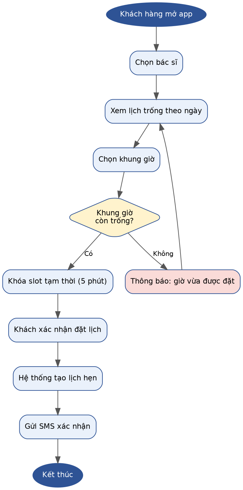
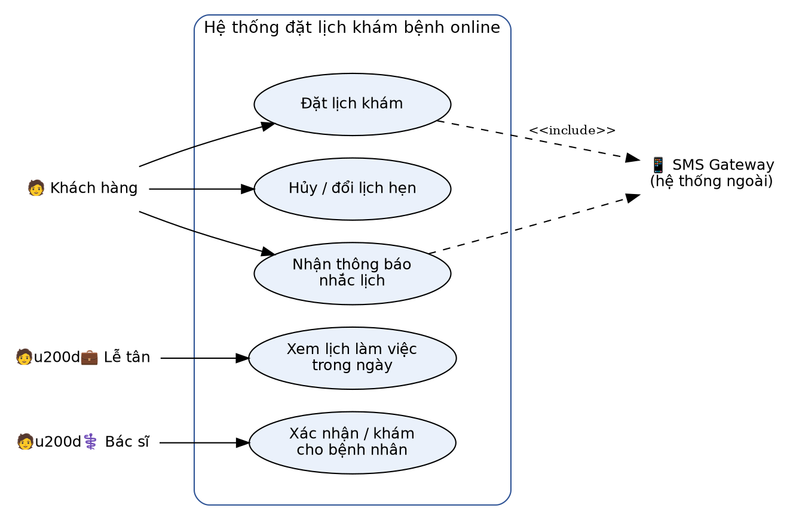
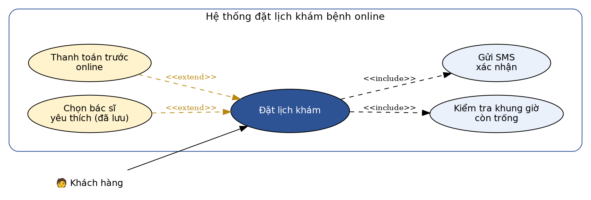
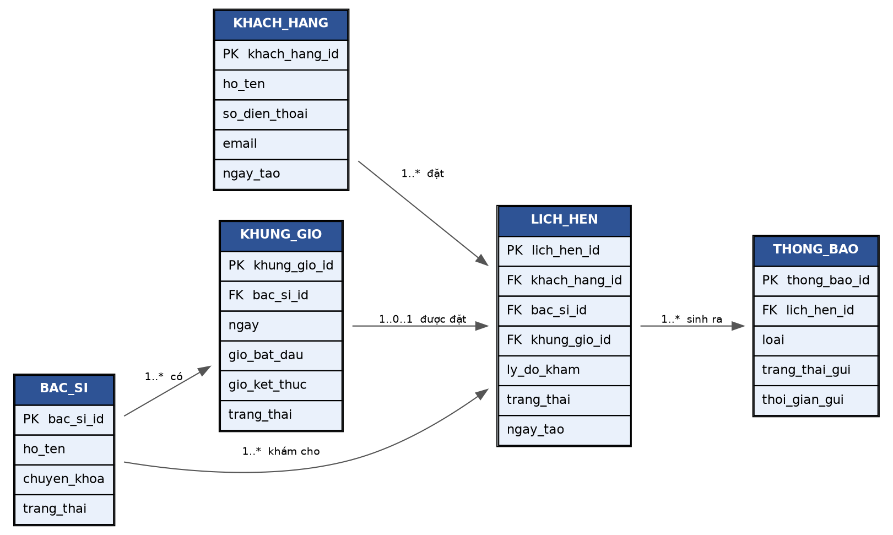
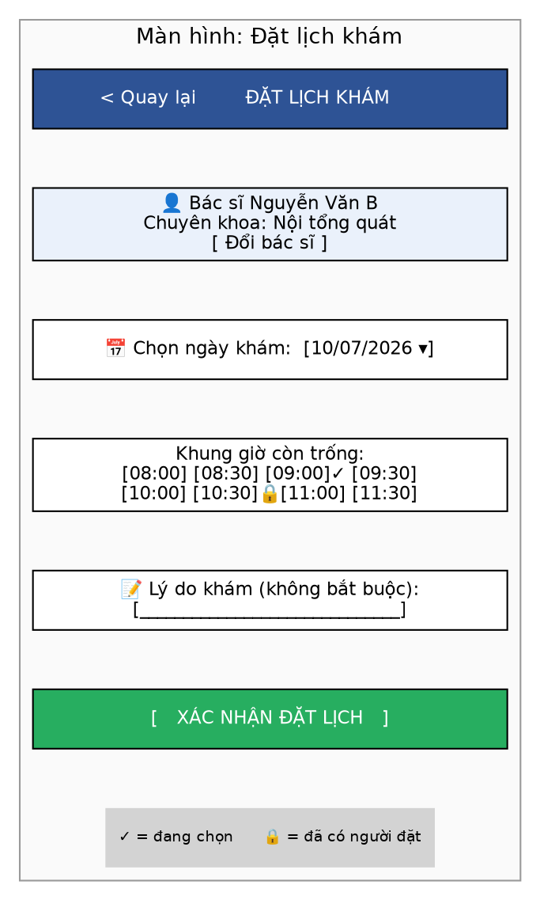
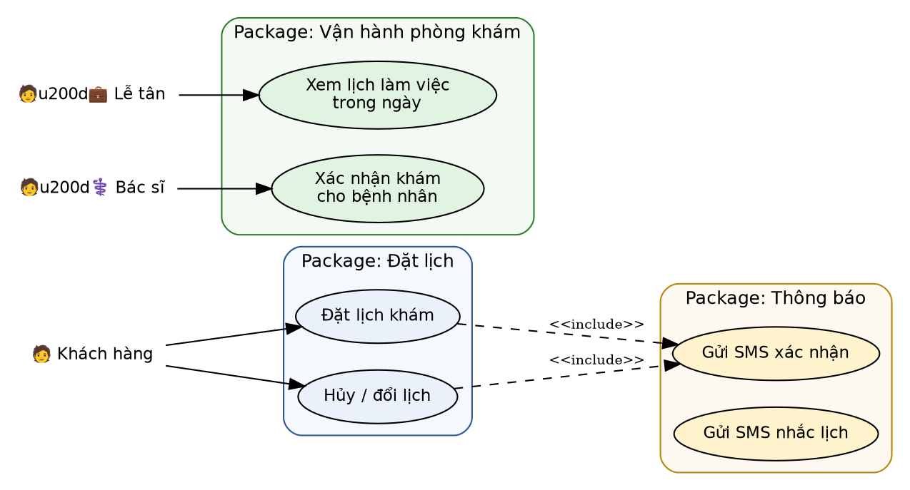

# Template-tai-lieu-BA-BRD-SRS-UserStory-AC_done

TEMPLATE TÀI LIỆU BA

BRD · SRS · User Story · Acceptance Criteria

Mỗi mục là 1 template đầy đủ, dùng được ngay cho công việc thực tế

Kèm ví dụ trực quan: Đặt lịch khám bệnh online

## Mục lục

- 1. BRD — Business Requirements Document

- 1.1 Thông tin chung

- 1.2 Bối cảnh & mục tiêu kinh doanh

- 1.3 Phạm vi (Scope)

- 1.4 Stakeholders

- 1.5 Business Requirements

- 1.6 Business Rules

- 1.7 Quy trình nghiệp vụ (As-Is / To-Be)

- 1.8 Ràng buộc & giả định

- 1.9 Rủi ro

- 1.10 Tiêu chí thành công (KPI)

- 1.11 Phê duyệt

- 2. SRS — Software Requirements Specification

- 2.1 Giới thiệu

- 2.2 Mô tả tổng quan

- 2.3 Yêu cầu chức năng (FR) — gồm Phân rã Use Case

- 2.4 Yêu cầu phi chức năng (NFR)

- 2.5 Mô hình dữ liệu (Data Model / ERD)

- 2.6 API Specification

- 2.7 Giao diện người dùng (UI / Wireframe)

- 2.8 Ma trận truy xuất (Traceability Matrix)

- 2.9 Phụ lục — Module/Package Use Case Diagram

- 3. User Story

- 4. Acceptance Criteria

## 1. BRD (Business Requirements Document)

Dùng khi làm việc với khách hàng/stakeholder — ngôn ngữ nghiệp vụ, ít chi tiết kỹ thuật.

## 1.1 Thông tin chung

| - Tên dự án: - Business Owner: - BA phụ trách: - Ngày / Phiên bản: |
| --- |

- Tên dự án: Hệ thống đặt lịch khám bệnh online - PK ABC

- Business Owner: Chị Lan (Giám đốc vận hành phòng khám)

- BA phụ trách: Nguyễn Văn A

- Ngày / Phiên bản: 07/07/2026 — v1.0

- Lịch sử phiên bản: v1.0 (07/07/2026) — Nguyễn Văn A — Khởi tạo tài liệu

## 1.2 Bối cảnh & mục tiêu kinh doanh

| - Bối cảnh (Background): - Mục tiêu kinh doanh (Business Objectives): |
| --- |

Bối cảnh: Khách hàng phải gọi điện đặt lịch, nhân viên lễ tân quá tải giờ cao điểm, tỷ lệ khách bỏ cuộc vì máy bận cao (~20%).

Mục tiêu kinh doanh: Giảm 50% cuộc gọi đặt lịch trong 2 tháng đầu; tăng 15% số lượt khám nhờ đặt lịch thuận tiện hơn.

## 1.3 Phạm vi (Scope)

| In-scope: - Out-of-scope: - |
| --- |

- In-scope: Đặt lịch, chọn bác sĩ/khung giờ, nhắc lịch qua SMS, hủy/đổi lịch

- Out-of-scope: Thanh toán online (giai đoạn 2), tư vấn qua video call

## 1.4 Stakeholders

| Vai trò | Tên | Trách nhiệm |
| --- | --- | --- |
| ... | ... | ... |

| Vai trò | Tên | Trách nhiệm |
| --- | --- | --- |
| Sponsor | Chị Lan | Duyệt ngân sách, mục tiêu |
| Bác sĩ trưởng khoa | BS. Hùng | Xác nhận quy trình khám |
| Lễ tân trưởng | Chị Mai | Góp ý quy trình vận hành thực tế |
| Tech Lead | Anh Đức | Đánh giá tính khả thi kỹ thuật |

## 1.5 Business Requirements (yêu cầu nghiệp vụ)

| Mã YC | Mô tả | Ưu tiên | Ghi chú |
| --- | --- | --- | --- |
| ... | ... | Must/Should/Could | ... |

| Mã YC | Mô tả | Ưu tiên | Ghi chú |
| --- | --- | --- | --- |
| BR-001 | Khách hàng tự đặt lịch khám qua app/web | Must | - |
| BR-002 | Hệ thống gửi SMS nhắc lịch trước 1 giờ | Must | - |
| BR-003 | Khách hàng có thể hủy/đổi lịch trước 2 giờ | Should | - |
| BR-004 | Lễ tân xem được toàn bộ lịch trong ngày (dashboard) | Must | - |

## 1.6 Business Rules (luật nghiệp vụ)

Business Requirement mô tả "cái gì cần đạt được"; Business Rule mô tả "ràng buộc/luật vận hành" — nên tách riêng để không bị lẫn khi viết SRS.

| Mã Rule | Nội dung luật |
| --- | --- |
| ... | ... |

| Mã Rule | Nội dung luật |
| --- | --- |
| BRULE-01 | Một khung giờ chỉ được gán cho đúng 1 lịch hẹn (không double-booking) |
| BRULE-02 | Slot được giữ tạm tối đa 5 phút kể từ lúc khách chọn, quá hạn tự nhả slot |
| BRULE-03 | Khách chỉ được hủy/đổi lịch trước giờ khám tối thiểu 2 giờ |
| BRULE-04 | Mỗi khách hàng tối đa 3 lịch hẹn đang ở trạng thái "Chờ khám" cùng lúc |

## 1.7 Quy trình nghiệp vụ (As-Is / To-Be)

As-Is (hiện tại)

Khách gọi điện → Lễ tân kiểm tra lịch trống thủ công (sổ giấy) → Lễ tân xác nhận qua điện thoại → Không có nhắc lịch tự động.

To-Be (đề xuất) — có thể vẽ bằng BPMN/flowchart

Quy trình đặt lịch khám bệnh (To-Be)

## 1.8 Ràng buộc & giả định

- Ràng buộc: Ngân sách 200 triệu, hoàn thành trong 3 tháng

- Giả định: Phòng khám đã có sẵn danh sách bác sĩ và lịch làm việc số hóa

## 1.9 Rủi ro

| Rủi ro | Ảnh hưởng | Giải pháp |
| --- | --- | --- |
| Lễ tân/khách hàng lớn tuổi ngại đổi thói quen, không chịu dùng app đặt lịch | Cao | Đào tạo lễ tân, giữ song song kênh gọi điện trong 1 tháng đầu chuyển đổi |
| Dự án trễ tiến độ do phụ thuộc nhà cung cấp SMS Gateway tích hợp chậm | Trung bình | Chốt hợp đồng và SLA với nhà cung cấp SMS Gateway ngay từ đầu dự án |

## 1.10 Tiêu chí thành công (KPI)

- Giảm 50% cuộc gọi đặt lịch trong 2 tháng đầu

- Tỷ lệ khách đến khám đúng giờ tăng 20% nhờ nhắc lịch SMS

## 1.11 Phê duyệt

| Vai trò | Tên | Ngày |
| --- | --- | --- |
| Sponsor | Chị Lan | 07/07/2026 — Đã duyệt |

## 2. SRS (Software Requirements Specification)

Dùng khi làm việc với đội Dev/QA — chi tiết, kỹ thuật. SRS luôn bắt nguồn từ 1 hoặc nhiều Business Requirement trong BRD.

## 2.1 Giới thiệu

| 1.1 Mục đích tài liệu 1.2 Phạm vi hệ thống 1.3 Định nghĩa, thuật ngữ viết tắt 1.4 Tài liệu tham chiếu |
| --- |

Ví dụ:

| 1.1 Mục đích tài liệu: Mô tả chi tiết yêu cầu chức năng/phi chức năng của hệ thống đặt lịch khám bệnh online, làm cơ sở để đội Dev/QA thiết kế, code và kiểm thử. 1.2 Phạm vi hệ thống: Áp dụng cho module Đặt lịch khám (web + app di động) của phòng khám ABC; không bao gồm module Thanh toán, Quản lý hồ sơ bệnh án (giai đoạn 2). 1.3 Định nghĩa, thuật ngữ viết tắt: OTP = One-Time Password (mã xác thực dùng 1 lần); Slot = khung giờ khám; BR = Business Requirement; FR = Functional Requirement. 1.4 Tài liệu tham chiếu: BRD v1.0 (07/07/2026); Quy trình vận hành phòng khám ABC (nội bộ). |
| --- |

## 2.2 Mô tả tổng quan

| 2.1 Bối cảnh sản phẩm 2.2 Chức năng chính 2.3 Đối tượng người dùng 2.4 Môi trường vận hành 2.5 Use Case Diagram (sơ đồ use case tổng quan) |
| --- |

Ví dụ:

| 2.1 Bối cảnh sản phẩm: Phòng khám ABC hiện xử lý đặt lịch hoàn toàn qua điện thoại, gây quá tải lễ tân và tỷ lệ khách bỏ cuộc cao. 2.2 Chức năng chính: Đặt lịch khám, chọn bác sĩ/khung giờ, nhắc lịch qua SMS, hủy/đổi lịch, lễ tân xem dashboard lịch trong ngày. 2.3 Đối tượng người dùng: Khách hàng (bệnh nhân), Lễ tân, Bác sĩ. 2.4 Môi trường vận hành: Web (Chrome/Safari mới nhất), App di động (iOS 13+, Android 8+), Backend triển khai trên Cloud (AWS). |
| --- |

Use Case Diagram — bức tranh tổng quan

Liệt kê Actor (ai dùng hệ thống) và các Use Case ở mức cao (hệ thống làm được gì), giúp người đọc nắm nhanh phạm vi trước khi đi vào chi tiết FR.

Use Case Diagram — Hệ thống đặt lịch khám bệnh online

- Actor: Khách hàng, Lễ tân, Bác sĩ, SMS Gateway (hệ thống ngoài)

- Quan hệ <<include>>: Use case bắt buộc gọi tới 1 use case/hệ thống khác để hoàn tất (VD: Đặt lịch khám luôn cần gọi SMS Gateway để gửi xác nhận)

## 2.3 Yêu cầu chức năng (Functional Requirements)

Detailed Use Case Diagram (quan hệ include / extend)

Vẽ chi tiết hơn Use Case Diagram tổng quan ở mục 2.2 — làm rõ use case nào bắt buộc gọi tới use case khác (<<include>>) và use case nào chỉ xảy ra khi có điều kiện (<<extend>>). Đây là bước trung gian giữa "bức tranh tổng quan" và "bảng phân rã UC → FR" bên dưới.

Detailed Use Case — quan hệ include/extend của "Đặt lịch khám"

- <<include>>: "Đặt lịch khám" luôn bắt buộc gọi "Kiểm tra khung giờ còn trống" và "Gửi SMS xác nhận" — thiếu 1 trong 2 thì use case chính không thể hoàn tất

- <<extend>>: "Thanh toán trước online" và "Chọn bác sĩ yêu thích (đã lưu)" chỉ xảy ra khi khách hàng chủ động chọn — không bắt buộc, không có vẫn hoàn tất được use case chính

Phân rã Use Case (Use Case Decomposition)

Trước khi viết chi tiết từng FR, nên bẻ nhỏ 1 use case lớn thành các use case con — giúp không bỏ sót chức năng và dễ ánh xạ 1-1 sang FR.

| UC-00: Đặt lịch khám (use case tổng, mức cao) ├─ UC-01: Xem danh sách bác sĩ ├─ UC-02: Xem khung giờ trống theo bác sĩ + ngày ├─ UC-03: Chọn khung giờ & giữ chỗ tạm thời (5 phút) ├─ UC-04: Xác nhận đặt lịch (tạo lịch hẹn chính thức) └─ UC-05: Nhận SMS xác nhận đặt lịch thành công |
| --- |

Ánh xạ Use Case → FR

| Use Case | FR tương ứng |
| --- | --- |
| UC-01 | FR-001a: Lấy danh sách bác sĩ |
| UC-02 | FR-001b: Lấy khung giờ trống (API GET /doctors/{id}/slots) |
| UC-03 + UC-04 | FR-001: Đặt lịch khám bệnh (chi tiết bên dưới) |
| UC-05 | FR-002: Gửi SMS xác nhận |

Use Case Specification (tùy chọn — nếu không muốn gộp vào FR)

Nhiều công ty không viết cả Use Case Spec lẫn FR vì hai thứ gần như trùng nội dung — chỉ cần chọn 1 trong 2. Ví dụ Use Case Spec cho UC-03:

| Mã Use Case: UC-03 Tên: Chọn khung giờ & giữ chỗ tạm thời Actor: Khách hàng Mức độ: User goal Pre-condition: Khách hàng đã đăng nhập, đã chọn bác sĩ + ngày khám Trigger: Khách hàng bấm chọn 1 khung giờ trong danh sách trống Main flow: 1. Khách hàng chọn khung giờ 2. Hệ thống kiểm tra slot còn trống (real-time) 3. Hệ thống khóa slot tạm thời trong 5 phút 4. Hệ thống hiển thị màn hình xác nhận thông tin Alternative flow: 2a. Slot vừa bị người khác chọn trước: → Hệ thống báo lỗi, yêu cầu chọn lại khung giờ khác Post-condition: Slot ở trạng thái "đang giữ chỗ", chỉ khách hàng này thao tác được trong 5 phút tới |
| --- |

Template cho mỗi chức năng

| Mã chức năng: Tên chức năng: Mô tả: Actor: Input: (liệt kê field + kiểu dữ liệu + validation) Xử lý (Processing Logic): Output: Luồng chính (Main Flow): Luồng ngoại lệ (Exception Flow): Pre-condition: Post-condition: Error code / message: (nếu có) |
| --- |

Ví dụ: FR-001 — Đặt lịch khám bệnh

Actor: Khách hàng (đã đăng nhập)

Mô tả: Cho phép khách hàng chọn bác sĩ, ngày giờ khám còn trống và xác nhận đặt lịch.

Input & Validation

| Field | Kiểu dữ liệu | Validation |
| --- | --- | --- |
| bacsi_id | string (UUID) | Bắt buộc, phải tồn tại trong bảng BAC_SI |
| ngay_kham | date (yyyy-mm-dd) | Bắt buộc, >= ngày hiện tại, <= +30 ngày |
| khung_gio_id | string (UUID) | Bắt buộc, slot phải có trạng thái "trống" |
| ly_do_kham | string | Optional, tối đa 250 ký tự |

Xử lý (Processing Logic)

| 1. Hệ thống kiểm tra khung giờ đã chọn còn trống hay không (real-time) 2. Nếu còn trống → khóa slot tạm thời (giữ chỗ 5 phút) qua DB transaction 3. Khách hàng xác nhận → tạo bản ghi lịch hẹn (status = "Đã xác nhận") 4. Trừ slot khỏi danh sách khung giờ trống 5. Gửi thông báo xác nhận qua SMS/email (bất đồng bộ, có retry) |
| --- |

Output

| booking_id: string — mã lịch hẹn vừa tạo (VD: APT-88213) status: string — trạng thái lịch hẹn (confirmed) slot: object — thông tin khung giờ đã đặt (date, start, end) |
| --- |

Luồng chính / Luồng ngoại lệ

| Main Flow: 1. Khách hàng chọn bác sĩ → Hệ thống hiển thị lịch trống theo ngày 2. Khách hàng chọn khung giờ → Bấm "Xác nhận đặt lịch" 3. Hệ thống tạo lịch hẹn, hiển thị màn hình thành công 4. Hệ thống gửi SMS xác nhận trong vòng 30 giây Exception Flow: 3a. Khung giờ vừa bị người khác đặt trước 1 giây: → HTTP 409 Conflict, báo "Khung giờ vừa được đặt, chọn giờ khác" 3b. Khách hàng đã có 3 lịch hẹn "Chờ khám" (BRULE-04): → HTTP 422, báo "Bạn đã đạt giới hạn số lịch hẹn đang chờ" |
| --- |

Pre-condition: Khách hàng đã đăng nhập, bác sĩ có lịch làm việc trong ngày đó

Post-condition: Lịch hẹn được lưu vào hệ thống, slot giờ đó không còn hiển thị trống

Minh họa luồng xử lý (Sequence Diagram)

Với các chức năng có tương tác nhiều thành phần (App - Backend - DB - bên thứ 3), nên vẽ thêm sequence diagram để dev dễ hình dung, đặc biệt các trường hợp tranh chấp dữ liệu (race condition).

| Khách hàng App Backend Database SMS Gateway │ │ │ │ │ │─chọn giờ + xác nhận─────▶│ │ │ │ │──POST appointments───────────▶│ │ │ │ │──lock+kiểm tra (transaction)───▶│ │ [Còn trống] │◀──khóa OK──────│ │ │ │ │──tạo appointment▶│ │ │ │ │──gửi SMS xác nhận────────────────▶│ │ │◀──201 Created│ │ │ │◀─màn hình thành công─│ │ │ │ │ │ │ │ │ │ [Vừa bị đặt] │◀──conflict─────│ │ │ │◀──409────────│ │ │ │◀─"giờ vừa được đặt"─│ │ │ │ |
| --- |

Error code / message (dùng chung cho các FR)

| Mã lỗi | HTTP Status | Message hiển thị |
| --- | --- | --- |
| ERR_SLOT_TAKEN | 409 | Khung giờ vừa được đặt, vui lòng chọn giờ khác |
| ERR_LIMIT_REACHED | 422 | Bạn đã đạt giới hạn số lịch hẹn đang chờ |
| ERR_SLOT_EXPIRED | 410 | Phiên giữ chỗ đã hết hạn, vui lòng chọn lại |
| ERR_INVALID_DATE | 400 | Ngày khám không hợp lệ |

## 2.4 Yêu cầu phi chức năng (Non-Functional Requirements)

| Loại | Yêu cầu |
| --- | --- |
| Hiệu năng | ... |
| Bảo mật | ... |
| Khả năng mở rộng | ... |
| Độ tin cậy | ... |

| Loại | Yêu cầu |
| --- | --- |
| Hiệu năng | Thời gian phản hồi tra cứu lịch trống ≤ 2 giây; tạo lịch hẹn ≤ 1 giây |
| Bảo mật | Xác thực OTP khi đăng nhập; mã hóa số điện thoại (AES-256) khi lưu trữ |
| Khả năng mở rộng | Hỗ trợ tối thiểu 500 request đặt lịch đồng thời trong giờ cao điểm |
| Độ tin cậy | Uptime 99.5%; cơ chế retry 3 lần khi gửi SMS thất bại |

## 2.5 Mô hình dữ liệu (Data Model / ERD)

Xác định entity, quan hệ (1-1, 1-nhiều), khóa chính/khóa ngoại — giúp backend thiết kế database đúng ngay từ đầu, tránh phải hỏi lại BA.

ERD — phân hệ đặt lịch khám

- 1 khách hàng có thể có nhiều lịch hẹn (1..*)

- 1 bác sĩ có nhiều khung giờ làm việc (1..*)

- 1 khung giờ chỉ gắn với tối đa 1 lịch hẹn (1..0..1) — đảm bảo BRULE-01

## 2.6 API Specification

Không bắt buộc phải có trong mọi SRS, nhưng rất nên có nếu BA làm việc trực tiếp với backend team — giúp thống nhất input/output trước khi code.

Template endpoint

| [METHOD] /api/v1/{resource} Mục đích: Request: Headers: Body (nếu có): Response thành công (2xx): Response lỗi (4xx/5xx): |
| --- |

Ví dụ: POST /api/v1/appointments

| POST /api/v1/appointments Headers: Authorization: Bearer {access_token} Content-Type: application/json Body: { "doctor_id": "DOC-102", "slot_id": "SLOT-5002", "reason": "Khám tổng quát định kỳ" } Response 201 Created: { "booking_id": "APT-88213", "status": "confirmed", "slot": { "date": "2026-07-10", "start": "09:00", "end": "09:30" } } Response 409 Conflict: { "error_code": "ERR_SLOT_TAKEN", "message": "Khung giờ vừa được đặt, vui lòng chọn giờ khác" } |
| --- |

## 2.7 Giao diện người dùng (UI / Wireframe)

Wireframe mức thấp (low-fidelity) giúp thống nhất bố cục với stakeholder trước khi chuyển cho UI/UX Designer làm mockup chi tiết. BA không cần vẽ đẹp, chỉ cần đủ ý.

Wireframe màn hình "Đặt lịch khám"

- Slot đã chọn (✓) đổi màu nổi bật để khách xác nhận trước khi bấm nút chính

- Slot đã có người đặt (🔒) hiển thị mờ, không cho phép click

## 2.8 Ma trận truy xuất (Traceability Matrix)

Đảm bảo mỗi yêu cầu nghiệp vụ (BR) đều được triển khai (FR/User Story) và kiểm thử đầy đủ (Test Case/AC) — không bị rơi rớt giữa các tầng tài liệu.

| BR | FR (SRS) | User Story | Test Case / AC | Trạng thái |
| --- | --- | --- | --- | --- |
| ... | ... | ... | ... | ... |

| BR | FR (SRS) | User Story | Test Case / AC | Trạng thái |
| --- | --- | --- | --- | --- |
| BR-001 | FR-001 | US-021 | AC-021 | Done |
| BR-002 | FR-002 | US-022 | AC-022 | Done |
| BR-003 | FR-003 | US-023 | AC-023 | Chưa bắt đầu |
| BR-004 | FR-004 | US-024 | AC-024 | Chưa bắt đầu |

## 2.9 Phụ lục — Module/Package Use Case Diagram

Chỉ cần vẽ khi hệ thống có nhiều module — giúp chia việc, phân quyền code review, và tránh nhồi hết use case vào 1 diagram tổng gây rối mắt. Case "đặt lịch khám" hiện tại chỉ có 1 module nên phần này KHÔNG bắt buộc — để ở đây minh họa cách làm khi hệ thống mở rộng thêm (VD: thêm module Thanh toán, Quản lý hồ sơ bệnh án...).

Module Use Case Diagram — chia theo 3 package nghiệp vụ

- Package "Đặt lịch": Khách hàng tự thao tác (đặt lịch, hủy/đổi lịch)

- Package "Thông báo": chạy nền, được các use case khác include tới (SMS xác nhận, SMS nhắc lịch)

- Package "Vận hành phòng khám": dành cho nội bộ (Lễ tân, Bác sĩ), tách riêng vì khác actor và khác quyền truy cập

## 3. User Story

Phù hợp với mô hình Agile/Scrum, thường thay thế một phần cho SRS trong các dự án chạy sprint ngắn.

Template

| Mã User Story: Tiêu đề: Là một [role] Tôi muốn [action] Để [benefit] Độ ưu tiên: Mức độ phức tạp: [Đơn giản \| Trung bình \| Phức tạp] - Đơn giản: thao tác đọc dữ liệu đơn giản (view-only), ít logic. - Trung bình: có validate, xử lý ngoại lệ, hoặc liên quan thông báo. - Phức tạp: tích hợp hệ thống ngoài, xử lý AI/thiết bị phần cứng, hoặc nhiều nhánh rẽ. Sprint: Dependencies: Liên kết Acceptance Criteria: Definition of Done (DoD): - Code đã merge, pass code review - Unit test/integration test đạt coverage yêu cầu - Acceptance Criteria pass trên môi trường Staging - QA sign-off, không còn bug Critical/Major |
| --- |

Ví dụ: US-021

| Mã User Story: US-021 Tiêu đề: Đặt lịch khám theo bác sĩ và khung giờ mong muốn Là một khách hàng, Tôi muốn chọn bác sĩ và khung giờ khám còn trống, Để tôi chủ động sắp xếp thời gian mà không cần gọi điện chờ lễ tân xác nhận. Độ ưu tiên: High Mức độ phức tạp: Trung bình Sprint: Sprint 5 Dependencies: US-018 (Đăng nhập bằng OTP), US-019 (Xem danh sách bác sĩ) Liên kết Acceptance Criteria: AC-021 (xem mục 4) Definition of Done (DoD): - Code đã merge vào branch main, pass code review - Unit test + integration test cho FR-001 đạt coverage >= 80% - Toàn bộ AC-021 pass trên môi trường Staging - API đã cập nhật vào Swagger/Postman collection - QA sign-off, không còn bug mức Critical/Major |
| --- |

## 4. Acceptance Criteria

Template (Gherkin - Given/When/Then)

| Scenario 1: [Tên tình huống - happy case] Given [điều kiện ban đầu] When [hành động] Then [kết quả mong đợi] Scenario 2: [Tình huống ngoại lệ - edge/negative case] Given ... When ... Then ... |
| --- |

Ví dụ: AC-021 (cho US-021)

| Scenario 1: Đặt lịch thành công Given khách hàng đã đăng nhập và chọn bác sĩ Nguyễn Văn B When khách hàng chọn khung giờ 09:00 - 09:30 ngày 10/07/2026 (còn trống) và bấm "Xác nhận đặt lịch" Then hệ thống tạo lịch hẹn thành công, hiển thị mã lịch hẹn và khung giờ đó không còn hiển thị trống cho khách khác Scenario 2 (Race condition): Khung giờ vừa bị người khác đặt trước Given hai khách hàng cùng xem một khung giờ trống 09:00 - 09:30 When khách hàng A xác nhận đặt lịch trước 1 giây so với khách B Then khách hàng B nhận lỗi ERR_SLOT_TAKEN (409) và danh sách khung giờ được cập nhật lại Scenario 3 (Boundary): Đặt lịch đúng ranh giới +30 ngày Given hôm nay là 07/07/2026 When khách hàng chọn ngày khám 06/08/2026 (đúng +30 ngày) Then hệ thống cho phép đặt lịch bình thường Scenario 4 (Negative): Vượt giới hạn số lịch hẹn đang chờ (BRULE-04) Given khách hàng đã có 3 lịch hẹn ở trạng thái "Chờ khám" When khách hàng cố đặt thêm lịch hẹn thứ 4 Then hệ thống báo lỗi ERR_LIMIT_REACHED (422) và không tạo lịch hẹn mới |
| --- |

Checklist tương đương (dùng nhanh khi review)

- Hiển thị danh sách khung giờ trống theo bác sĩ đã chọn

- Khung giờ được khóa tạm thời 5 phút khi khách bắt đầu đặt

- Không cho phép 2 khách đặt trùng 1 khung giờ (test race condition)

- Giới hạn tối đa 3 lịch hẹn "Chờ khám" / khách hàng

- SMS xác nhận gửi trong vòng 30 giây sau khi đặt thành công

## Ghi chú sử dụng

- BRD → viết trước tiên, thống nhất với stakeholder/khách hàng

- SRS → viết sau khi BRD được duyệt, dùng để làm việc với Dev/QA

- User Story + Acceptance Criteria → dùng song song hoặc thay thế SRS trong dự án Agile

- Mục 2.5 (ERD), 2.6 (API), 2.7 (Wireframe) trong SRS không bắt buộc phải làm đầy đủ ngay từ đầu — có thể bổ sung dần khi dự án đi vào chi tiết kỹ thuật
