# HƯỚNG DẪN VẼ SƠ ĐỒ BA — VÍ DỤ THỰC CHIẾN
# Dự án minh họa: Hệ thống Quản lý đơn hàng trực tuyến

> **Mục đích:** File tham khảo các loại sơ đồ BA thường dùng
> **Công cụ vẽ:** draw.io, Miro, PlantUML, hoặc Mermaid (trong markdown)

---

## 0. Mermaid — Bảng tham chiếu hình dạng (Shapes)

> Copy-paste đúng cú pháp để render trong VS Code / GitHub / Confluence

| Hình dạng | Cú pháp Mermaid | Dùng cho | Preview |
|----------|----------------|---------|---------|
| Hình chữ nhật | `A["Text"]` | Hành động, bước xử lý | ▭ |
| Bo tròn | `A("Text")` | Bước xử lý mềm, Actor | ▢ |
| Viên thuốc (Stadium) | `A(["Text"])` | Use Case (thay oval) | ⬭ |
| Hình thoi | `A{"Text"}` | Điều kiện rẽ nhánh | ◇ |
| Hình tròn | `A(("Text"))` | Start / End | ● |
| Hình lục giác | `A{{"Text"}}` | Sự kiện, trigger | ⬡ |
| Hình bình hành | `A[/"Text"/]` | Input / Output dữ liệu | ▱ |
| Hình thang | `A[/"Text"\]` | Request (manual) | ⏢ |
| Viền kép | `A[["Text"]]` | Sub-process, hệ thống con | ⧈ |
| Hình trụ | `A[("Text")]` | Database | ⌸ |
| Hình tròn lớn | `A((("Text")))` | Kết thúc (End) | ◎ |

### Ví dụ nhanh — tất cả hình dạng

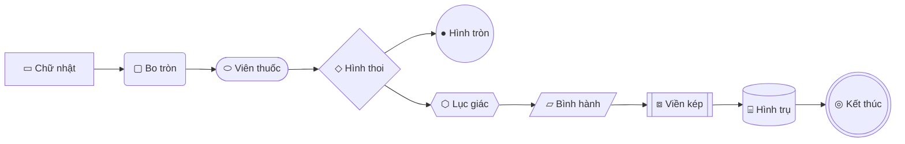

### Đường nối & Mũi tên

| Loại | Cú pháp | Ý nghĩa |
|------|---------|---------|
| Mũi tên | `A --> B` | Luồng đi |
| Có nhãn | `A -->\|"nhãn"\| B` | Luồng đi có mô tả |
| Đường nét đứt | `A -.-> B` | Tùy chọn, phụ thuộc |
| Đường nét đứt + nhãn | `A -.->\|"nhãn"\| B` | `<<include>>` hoặc `<<extend>>` |
| Không mũi tên | `A --- B` | Kết nối (Use Case ↔ Actor) |
| Đường đậm | `A ==> B` | Luồng chính / nhấn mạnh |

---

## 1. Context Diagram — "Hệ thống tương tác với ai?"

> **Dùng khi:** Bắt đầu dự án, trình bày cho Sponsor/Ban lãnh đạo
> **Mức chi tiết:** Level 0 — tổng quan nhất

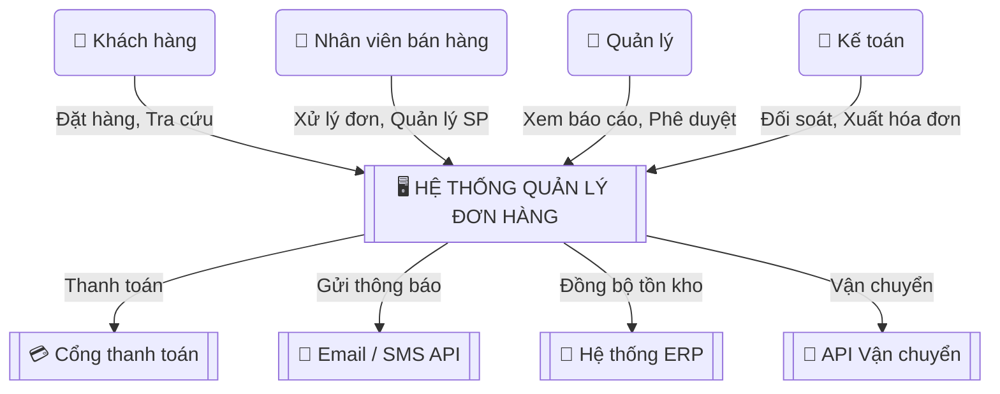

**Quy ước hình dạng:**
| Thành phần | Hình | Cú pháp |
|-----------|------|---------|
| Actor (con người) | Bo tròn | `("👤 Tên")` |
| Hệ thống chính | Viền kép | `[["🖥️ Tên"]]` |
| Hệ thống ngoài | Viền kép | `[["💳 Tên"]]` |
| Tương tác | Mũi tên + nhãn | `-->\|"mô tả"\|` |

### 📝 Hướng dẫn vẽ Context Diagram

**Bước 1 — Liệt kê:**
```
Hỏi: "Ai sẽ ĐĂNG NHẬP vào hệ thống?"          → Actor (người)
Hỏi: "Hệ thống nào GỬI/NHẬN dữ liệu?"         → External System
Hỏi: "Dữ liệu gì đi VÀO và đi RA hệ thống?"   → Data Flow
```

**Bước 2 — Vẽ:**
1. Hệ thống chính ở **giữa** → `[["🖥️ Tên"]]`
2. Actor / External system ở **xung quanh** → `("👤 Tên")`
3. Mũi tên ghi **dữ liệu gì** di chuyển, không phải tên chức năng

| ❌ Sai | ✅ Đúng |
|--------|--------|
| Mũi tên: "Quản lý đơn hàng" | Mũi tên: "Đặt hàng, Tra cứu trạng thái" |
| Quá nhiều chi tiết | Tối đa **4-6 actor** + **3-5 hệ thống ngoài** |

---

## 2. Use Case Diagram — "Ai làm gì với hệ thống?"

> **Dùng khi:** Xác định phạm vi, liệt kê chức năng
> **Đặt trong:** BRD, SRS

### 2.1 Use Case cơ bản (với `<<include>>` và `<<extend>>`)

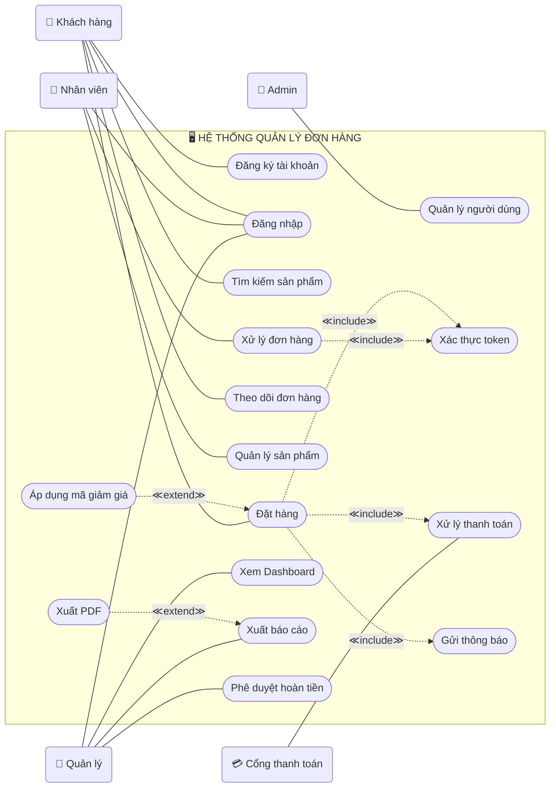

### 2.2 Giải thích `<<include>>` vs `<<extend>>`

| Quan hệ | Ý nghĩa | Hướng mũi tên | Ví dụ |
|---------|---------|---------------|-------|
| **≪include≫** | Use Case chính **BẮT BUỘC** gọi UC con | UC chính `-.->` UC con | "Đặt hàng" **include** "Xác thực token" |
| **≪extend≫** | UC phụ **TÙY CHỌN** mở rộng UC chính | UC phụ `-.->` UC chính | "Áp mã giảm giá" **extend** "Đặt hàng" |
| **generalization** | Actor con kế thừa Actor cha | UC con `-->` UC cha | "Admin" kế thừa "Nhân viên" |

```
≪include≫: Đặt hàng ----include----> Xác thực     (PHẢI xác thực mới đặt được)
≪extend≫:  Áp mã giảm giá --extend--> Đặt hàng    (KHÔNG áp cũng đặt được)
```

> **Mẹo nhớ:**
> - **include** = "không có nó thì KHÔNG CHẠY ĐƯỢC"
> - **extend** = "không có nó vẫn chạy được, chỉ thêm tính năng"

### 2.3 Quy ước hình dạng Use Case

| Thành phần | Hình | Cú pháp | Giống UML |
|-----------|------|---------|-----------|
| Actor (người) | Bo tròn | `("👤 Tên")` | 🧑‍💼 Hình người |
| Actor (hệ thống) | Bo tròn | `("💳 Tên")` | 📦 Box |
| Use Case | Viên thuốc (≈ oval) | `(["Tên UC"])` | ⬭ Oval |
| System boundary | subgraph | `subgraph "Tên"` | ▭ Chữ nhật |
| include | Nét đứt + nhãn | `-.->` ≪include≫ | - - - ▸ |
| extend | Nét đứt + nhãn | `-.->` ≪extend≫ | - - - ▸ |
| Kết nối Actor↔UC | Đường liền | `---` | ─── |

### 📝 Hướng dẫn vẽ Use Case Diagram

**Bước 1 — Xác định Actor:**
```
Hỏi: "Ai ĐĂNG NHẬP?"        → Actor
Hỏi: "Ai NHẬP DỮ LIỆU?"     → Actor
Hỏi: "Ai XEM BÁO CÁO?"      → Actor
Hỏi: "Ai PHÊ DUYỆT?"        → Actor
Hỏi: "Hệ thống nào GỌI API?" → External Actor
Hỏi: "Có job CHẠY TỰ ĐỘNG?" → Timer Actor
```

**Phân biệt Actor vs Stakeholder:**
- Có tương tác **trực tiếp** với hệ thống → **Actor**
- Chỉ nhận thông tin gián tiếp → **Stakeholder** (không vẽ)

**Bước 2 — Liệt kê Use Case:**
- Với MỖI Actor → hỏi "Muốn LÀM GÌ với hệ thống?"
- Đặt tên: **Động từ + Danh từ** ("Tạo đơn hàng", không phải "Đơn hàng")

**Bước 3 — Tìm include/extend:**
- "UC này có bước CHUNG với UC khác?" → `<<include>>`
- "UC này có tính năng TÙY CHỌN?" → `<<extend>>`

**Sai lầm thường gặp:**

| ❌ Sai | ✅ Đúng |
|--------|--------|
| "Khách hàng" chung chung | Tách: "Khách vãng lai" vs "Khách đã đăng ký" |
| Phòng ban là actor | **Vai trò** mới là actor |
| 1 sơ đồ 20 UC | Tối đa **7-10 UC** → tách theo module |
| Viết bước nhỏ thành UC | UC = **mục tiêu**, không phải từng bước |

---

## 3. Activity Diagram (Swimlane) — "Quy trình chạy thế nào?"

> **Dùng khi:** Mô tả quy trình nghiệp vụ As-Is / To-Be
> **Đặt trong:** Process Flow

### 3.1 Ví dụ: Quy trình đặt hàng (To-Be)

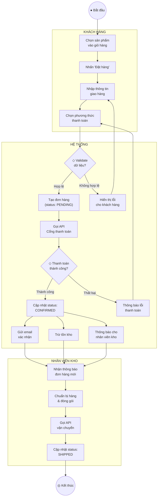

**Lưu ý khi vẽ Activity Diagram:**
- `(("●"))` = Start (hình tròn), `((("◎")))` = End (tròn lớn)
- `{"text"}` = Decision / rẽ nhánh (hình thoi) → **phải có đủ nhánh**
- `["text"]` = Hành động (hình chữ nhật)
- Swimlane = `subgraph "Tên vai trò"` → **ai chịu trách nhiệm**
- Happy path đi thẳng, exception rẽ sang

| Thành phần | Hình | Cú pháp |
|-----------|------|---------|
| Start | ● Tròn | `(("● Bắt đầu"))` |
| End | ◎ Tròn lớn | `((("◎ Kết thúc")))` |
| Hành động | ▭ Chữ nhật | `["Tên hành động"]` |
| Quyết định | ◇ Hình thoi | `{"Điều kiện?"}` |
| Swimlane | Nhóm khung | `subgraph "Tên lane"` |
| Song song (fork/join) | Nhiều mũi tên ra/vào | `A --> B` + `A --> C` |

### 📝 Hướng dẫn vẽ Activity Diagram

**Bước 1 — Thu thập quy trình:**

| Kỹ thuật | Mô tả |
|----------|------|
| **Phỏng vấn SME** | "Mô tả 1 ngày làm việc bình thường" |
| **Quan sát / Shadow** | Ngồi cạnh user xem họ thao tác |
| **Chia sẻ màn hình** | SME demo qua video call (remote/outsource) |
| **Workshop** | Vẽ cùng nhau trên Miro/whiteboard |

**Bước 2 — 8 câu hỏi vàng:**
```
1. "Quy trình BẮT ĐẦU khi nào?"                → Start
2. "BƯỚC TIẾP THEO là gì?"                      → Flow
3. "Có trường hợp ĐI KHÁC ĐƯỜNG không?"         → Decision ◇
4. "AI thực hiện bước này?"                      → Swimlane
5. "Nếu LỖI xảy ra thì sao?"                    → Exception
6. "Quy trình KẾT THÚC khi nào?"                → End
7. "Bước nào HỆ THỐNG TỰ LÀM?"                  → Automation
8. "Cần THÔNG TIN GÌ từ bước trước?"             → Data
```

**Bước 3 — Thứ tự vẽ:**
```
1. Vẽ Happy Path trước (đường thẳng chính)
2. Thêm Decision — ghi rõ điều kiện
3. Thêm Exception Flow (xử lý lỗi)
4. Chia Swimlane (ai làm gì)
5. Thêm Start / End
```

**Layout:** Happy path đi **THẲNG**, exception rẽ **NGANG**.

---

### 3.2 Ví dụ: Quy trình phê duyệt hoàn tiền

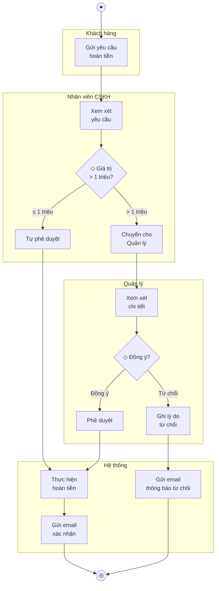

---

## 4. Sequence Diagram — "Các thành phần nói chuyện thế nào?"

> **Dùng khi:** Mô tả API flow, tích hợp hệ thống
> **Đặt trong:** SRS (phần tích hợp)

### 📝 Hướng dẫn vẽ Sequence Diagram

**Bước 1 — Sắp participant từ trái → phải:**
```
User → Frontend → Backend → Database → External API
Quy tắc: NGƯỜI DÙNG → HỆ THỐNG NỘI BỘ → BÊN NGOÀI
```

**Bước 2 — Vẽ luồng chính:**
- Request: mũi tên liền `->>` (trái → phải)
- Response: mũi tên đứt `-->>` (phải → trái)
- Ghi rõ: `POST /api/v1/orders`, không chỉ "gửi request"

**Bước 3 — Thêm nhánh:**
```
alt  = if/else    → "alt Thành công ... else Thất bại"
opt  = tùy chọn   → "opt Có mã giảm giá"
loop = lặp lại    → "loop Mỗi item trong giỏ"
```

| ❌ Sai | ✅ Đúng |
|--------|--------|
| Không ghi method | `POST /api/v1/orders` |
| Không phân biệt chiều | Request `->>` vs Response `-->>` |
| Thiếu error case | Dùng `alt` cho success/failure |

### 4.1 Ví dụ: Luồng đặt hàng + thanh toán

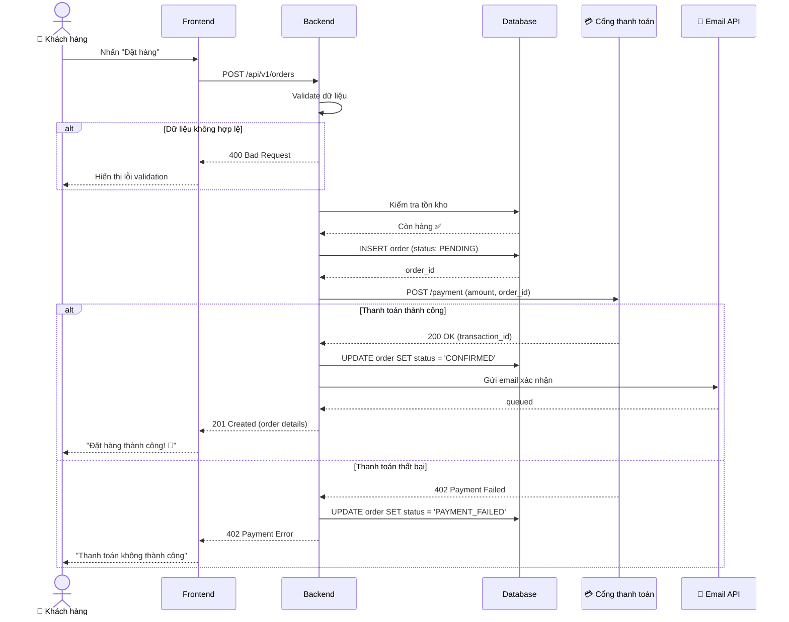

### 4.2 Ví dụ: Luồng SSO Login

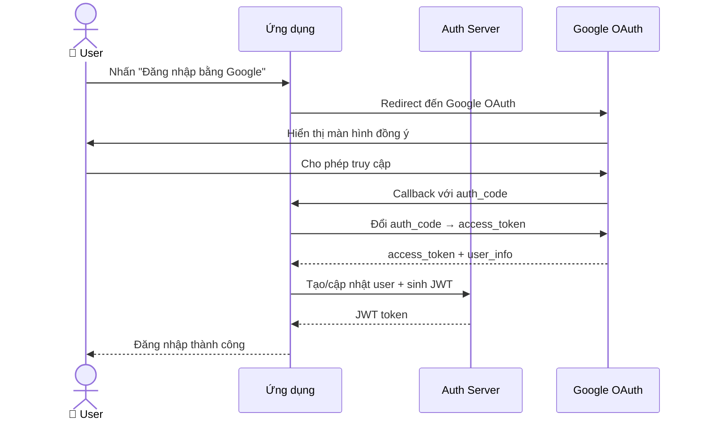

---

## 5. State Diagram — "Đối tượng chuyển trạng thái thế nào?"

> **Dùng khi:** Mô tả vòng đời của 1 entity (đơn hàng, yêu cầu, ticket...)
> **Đặt trong:** SRS, Data Model

### 📝 Hướng dẫn vẽ State Diagram

**Bước 1 — Xác định đối tượng:** Cái gì có NHIỀU TRẠNG THÁI?
→ Đơn hàng, Ticket, Yêu cầu, Hợp đồng, Bài viết...

**Bước 2 — Liệt kê trạng thái:**
```
Hỏi: "Trạng thái BAN ĐẦU là gì?"           → [*] --> FIRST_STATE
Hỏi: "Trạng thái KẾT THÚC là gì?"          → LAST_STATE --> [*]
Hỏi: "Còn trạng thái nào GIỮA ĐƯỜNG?"      → Liệt kê hết
```

**Bước 3 — Xác định chuyển đổi:**
```
Với MỖI trạng thái, hỏi:
  "Sang trạng thái NÀO được?" → mũi tên
  "HÀNH ĐỘNG gì gây chuyển?"  → nhãn trên mũi tên
  "Có QUAY LẠI được không?"   → mũi tên ngược
```

**Đặt tên trạng thái:**
- ✅ `PENDING`, `APPROVED`, `PAYMENT_FAILED` (viết HOA, khớp enum trong code)
- ❌ "Trạng thái 1", "Bước 2" (mơ hồ)

### 5.1 Ví dụ: Vòng đời đơn hàng

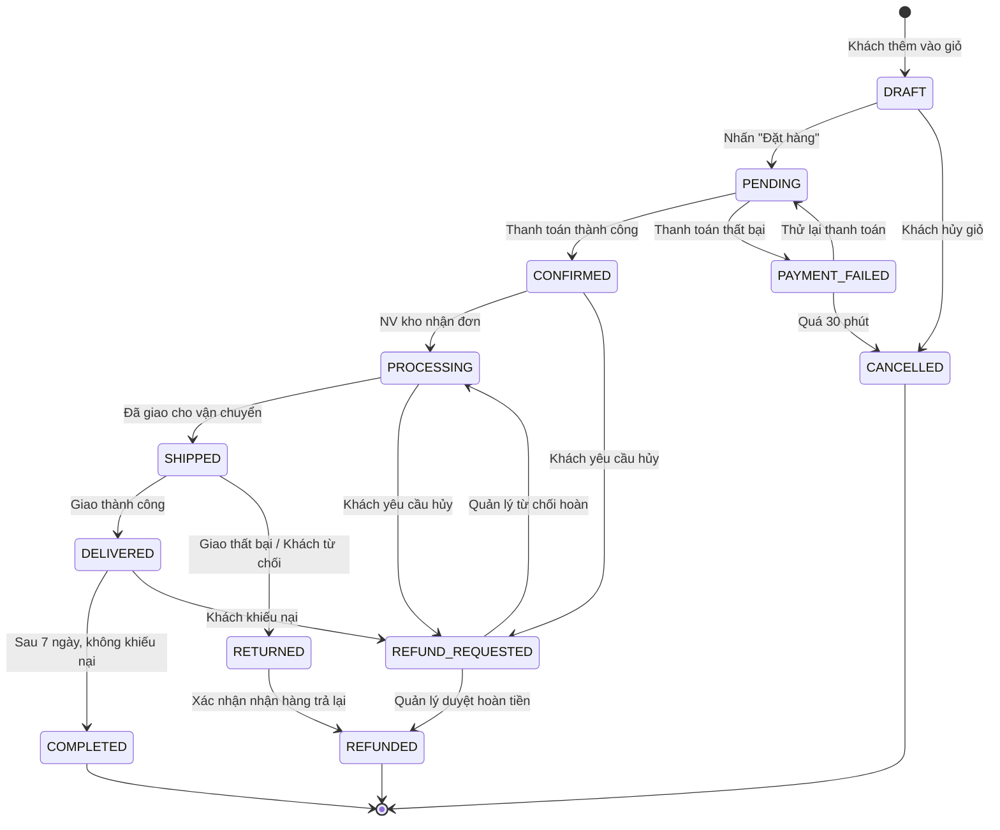

### 5.2 Ví dụ: Vòng đời Ticket hỗ trợ

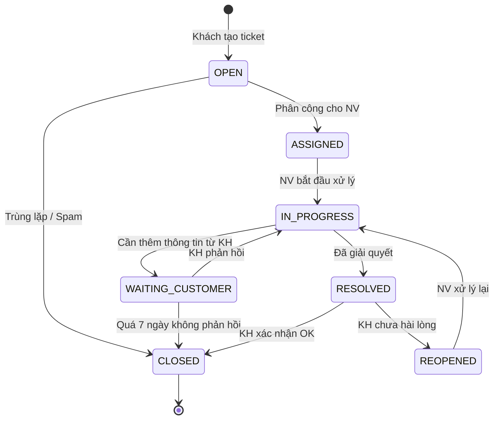

---

## 6. ERD (Entity Relationship Diagram) — "Dữ liệu quan hệ thế nào?"

> **Dùng khi:** Thiết kế database
> **Đặt trong:** Data Model

### 📝 Hướng dẫn vẽ ERD

**Bước 1 — Tìm Entity:** Danh từ quan trọng trong nghiệp vụ = Entity
```
"Hệ thống quản lý KHÁCH HÀNG, ĐƠN HÀNG, SẢN PHẨM"
→ Entity: Customer, Order, Product
```

**Bước 2 — Xác định quan hệ:**
```
Hỏi: "1 [Entity A] có BAO NHIÊU [Entity B]?"
  1 Customer → NHIỀU Order        → 1:N  (||--o{)
  1 Order    → ÍT NHẤT 1 Item     → 1:N bắt buộc (||--|{)
  Product ↔ Category NHIỀU-NHIỀU  → N:M (}o--o{) → bảng trung gian
```

**Bước 3 — Attribute mặc định mọi entity:**
- `id` (PK), `created_at`, `updated_at`, `deleted_at` (soft delete), FK

**Ký hiệu quan hệ:**

| Ký hiệu | Ý nghĩa |
|----------|--------|
| `\|\|--o{` | 1 — 0 hoặc nhiều |
| `\|\|--\|{` | 1 — 1 hoặc nhiều (bắt buộc) |
| `}o--o{` | Nhiều — nhiều |
| `\|\|--\|\|` | 1 — đúng 1 |

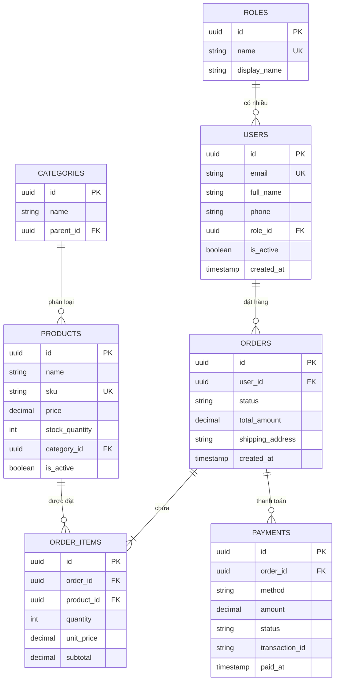

**Cách đọc quan hệ:**
- `||--o{` = 1-nhiều (1 User có nhiều Order)
- `||--|{` = 1-nhiều bắt buộc (1 Order phải có ≥ 1 Item)
- `}o--o{` = nhiều-nhiều

---

## 7. User Journey Map — "Trải nghiệm người dùng end-to-end"

> **Dùng khi:** Hiểu trải nghiệm tổng thể, tìm pain point
> **Đặt trong:** Vision & Scope, BRD

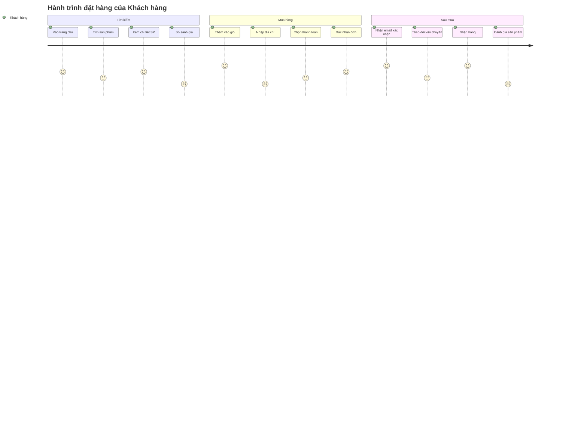

**Cách đọc:** Điểm 1-5 = mức hài lòng. Điểm thấp (1-2) = pain point cần cải thiện.

---

## 8. Flowchart quyết định — "Logic rẽ nhánh phức tạp"

> **Dùng khi:** Quy tắc nghiệp vụ phức tạp, nhiều điều kiện
> **Đặt trong:** SRS (Business Rules)

### Ví dụ: Logic tính phí vận chuyển

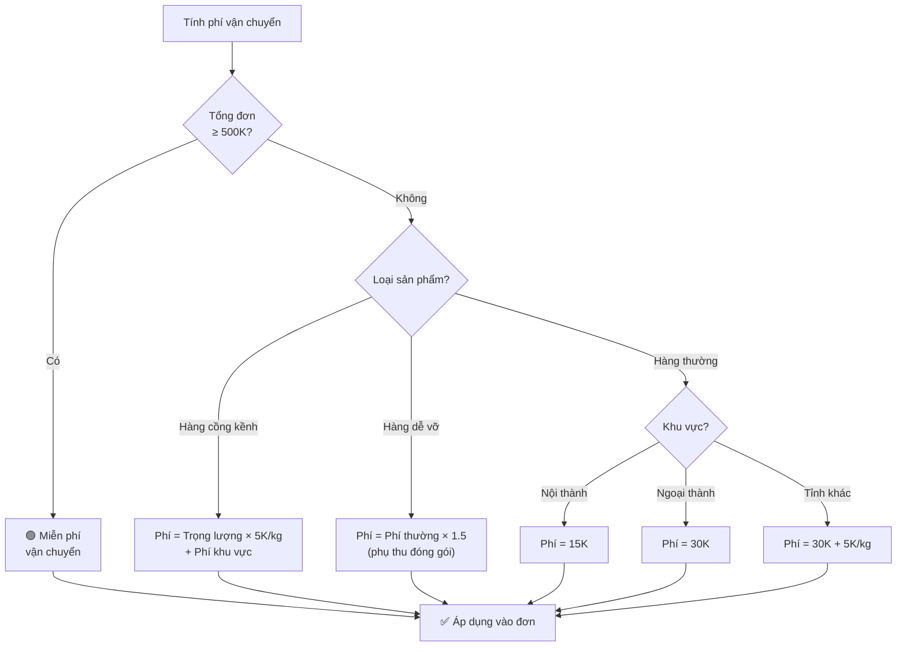

---

## 9. Gantt Chart — "Timeline dự án"

> **Dùng khi:** Lập kế hoạch release, trình bày cho Client
> **Đặt trong:** Vision & Scope, BRD

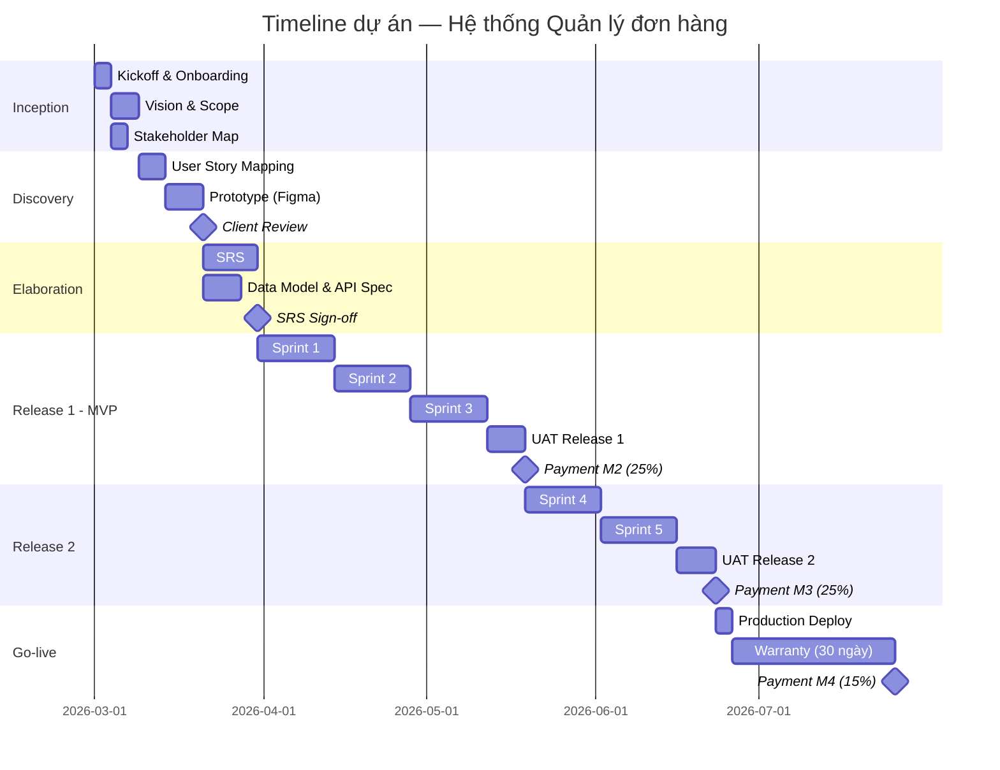

---

## 10. Tổng hợp — Sơ đồ nào dùng ở đâu?

| Sơ đồ | Tài liệu | Khi nào vẽ | Ai đọc chính |
|-------|----------|-----------|-------------|
| Context Diagram | Vision & Scope | Inception | Sponsor, PO |
| Use Case Diagram | BRD, SRS | Inception / Discovery | PO, Dev |
| Activity Diagram (Swimlane) | Process Flow | Discovery | SME, Dev, QC |
| Sequence Diagram | SRS | Elaboration | Dev |
| State Diagram | SRS, Data Model | Elaboration | Dev, QC |
| ERD | Data Model | Elaboration | Dev, DBA |
| User Journey | Vision & Scope | Discovery | PO, UX |
| Decision Flowchart | SRS (Business Rules) | Elaboration | Dev, QC |
| Gantt Chart | Vision & Scope, BRD | Inception | PM, Sponsor |

---

## Công cụ khuyên dùng

| Công cụ | Miễn phí? | Tốt cho | Ghi chú |
|---------|-----------|---------|---------|
| **draw.io** (diagrams.net) | ✅ | Tất cả loại sơ đồ | Tích hợp Confluence, VS Code |
| **Miro** | Freemium | Workshop, brainstorm, Swimlane | Cộng tác real-time |
| **Mermaid** | ✅ | Viết trong Markdown/Confluence | Đúng cú pháp → tự render |
| **PlantUML** | ✅ | Sequence, Use Case, Class | Text-based, version control |
| **dbdiagram.io** | ✅ | ERD | Viết text → sinh sơ đồ |
| **Figma** | Freemium | UI Flow, Wireframe | Thiết kế giao diện |
| **Lucidchart** | Freemium | Tất cả, chuyên nghiệp | Tích hợp Google Workspace |

---

## 12. Best Practices — Checklist trước khi gửi sơ đồ

### Quy trình vẽ chuẩn

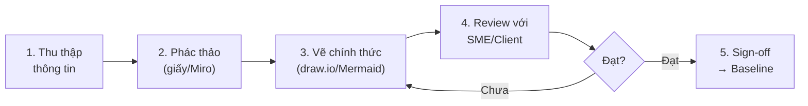

### Đúng mức chi tiết cho từng đối tượng

```
Level 0: Context Diagram     → Sponsor đọc   → "Tương tác với CÁI GÌ?"
Level 1: Use Case Diagram    → PO đọc        → "LÀM ĐƯỢC GÌ, cho AI?"
Level 2: Activity / Flowchart → SME xác nhận  → "MỖI VIỆC chạy THẾ NÀO?"
Level 3: Sequence Diagram    → Dev đọc       → "HỆ THỐNG gọi nhau RA SAO?"
```

### Anti-patterns

| # | ❌ Anti-pattern | 💡 Cách sửa |
|---|---------------|------------|
| 1 | **Spaghetti** — quá nhiều đường chéo | Tách sub-process |
| 2 | **Thiếu Start/End** | Luôn có `●` và `◎` |
| 3 | **Rẽ nhánh không ghi điều kiện** | Ghi rõ Yes/No trên mỗi nhánh |
| 4 | **Trộn Actor trong Swimlane** | 1 lane = 1 vai trò |
| 5 | **Vẽ trước khi hiểu nghiệp vụ** | Phỏng vấn → notes → vẽ draft |
| 6 | **Bỏ quên Exception Flow** | 70% bug nằm ở exception chưa vẽ |
| 7 | **Không có người review** | SME phải xem lại + xác nhận |

### ✅ Final Checklist

```
TRƯỚC KHI GỬI SƠ ĐỒ:
☐ Có điểm BẮT ĐẦU và KẾT THÚC rõ ràng?
☐ Mọi rẽ nhánh ◇ đều có ĐỦ ĐƯỜNG ĐI?
☐ Mọi Actor / Swimlane được XÁC ĐỊNH RÕ?
☐ Không có phần tử "LƠ LỬNG" (không kết nối)?
☐ Đặt tên ĐỘNG TỪ + DANH TỪ?
☐ Exception flow đã được mô tả?
☐ ĐÚNG MỨC CHI TIẾT cho người đọc?
☐ Có Legend / Chú thích?
☐ Đánh version?
☐ SME / Client đã XÁC NHẬN?
```
<!-- [MermaidChart: a36e4139-179a-4708-8c0a-46c4ac8634d3] -->
