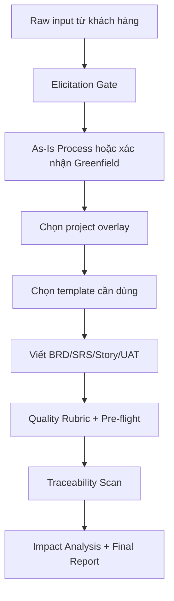

# BA-agent — Hướng dẫn sử dụng

`BA-agent` là bộ công cụ Business Analysis dùng để tạo, rà soát và quản trị tài liệu BA cho nhiều loại dự án: Product, In-house, Outsource, Startup/MVP, Government, Healthcare và Fintech.

Bộ này không chỉ là tập template. Nó gồm workflow, agent rule, template, checklist và script kiểm tra để giúp BA đi từ khai thác yêu cầu đến BRD/SRS/User Story/UAT, traceability và báo cáo chất lượng.

---

## 1. Bắt đầu nhanh

Lệnh chính:

```text
/ba-workflow [Tên dự án] "[Mô tả ngắn]"
```

Ví dụ:

```text
/ba-workflow QLTS "Hệ thống quản lý tài sản bệnh viện"
/ba-workflow eWallet "Ví điện tử thanh toán và đối soát giao dịch"
/ba-workflow HRM-SaaS "Nền tảng quản lý nhân sự SaaS cho doanh nghiệp vừa"
```

Khi chạy `/ba-workflow`, agent sẽ đi theo luồng:

1. Hỏi thêm để khai thác yêu cầu, pain point, stakeholder, ràng buộc.
2. Xác định loại dự án và chọn overlay phù hợp.
3. Gợi ý bộ tài liệu cần tạo.
4. Viết tài liệu theo template.
5. Kiểm tra chất lượng requirement, numbering và traceability.
6. Xuất báo cáo cuối cùng: gaps, risks, traceability, readiness.

---

## 2. Khi nào dùng BA-agent?

| Nhu cầu | Cách dùng |
|---|---|
| Bắt đầu dự án mới | Dùng `/ba-workflow [Tên] "[Mô tả]"` |
| Viết một tài liệu cụ thể | Yêu cầu trực tiếp: "Viết BRD/SRS/UAT cho..." |
| Audit bộ tài liệu hiện có | Yêu cầu: "Review bộ tài liệu BA trong thư mục..." |
| Kiểm tra truy vết yêu cầu | Chạy `traceability_scan.py` hoặc yêu cầu agent scan |
| Chuẩn hóa tài liệu outsource/product | Chọn overlay `outsource` hoặc `product` |
| Dự án ngành đặc thù | Chọn overlay `government`, `healthcare`, `fintech` |
| Cần quyết định đầu tư | Dùng `business-case.md` |
| Cần quản trị issue/dependency | Dùng `raid-log.md` |
| Cần phân quyền | Dùng `rbac-matrix.md` |
| Cần KPI/report/dashboard | Dùng `reporting-specification.md` |
| Chuẩn bị go-live | Dùng `operational-readiness-checklist.md` |

---

## 3. Cấu trúc chính

```text
BA-agent/
├── SKILL.md                         # Entry point cho agent
├── USER-GUIDE.md                    # Hướng dẫn chi tiết
├── DOCUMENT-MAP.md                  # Bản đồ toàn bộ tài liệu
├── BA-GAP-CHECKLIST.md              # Checklist gap đã bổ sung
├── agents/
│   └── ba-specialist.md             # Persona và skill suite của BA agent
├── workflows/
│   └── ba-workflow.md               # Quy trình /ba-workflow
├── BA-document-rule/
│   ├── core/                        # Rule, quality gate, validator, guide
│   ├── templates/                   # 28 generic templates
│   ├── templates/industry/          # 9 templates ngành
│   ├── overlays/                    # Cấu hình theo loại dự án
│   └── references/                  # Tài liệu tham khảo
├── BA-Documents-Product/            # Bộ tài liệu mẫu cho Product
├── BA-Documents-Outsource/          # Bộ tài liệu mẫu cho Outsource
├── scripts/                         # Automation scripts
└── tests/                           # Runtime script tests
```

Các file nên đọc đầu tiên:

| Mục đích | File |
|---|---|
| Hiểu cách agent vận hành | `BA-agent/SKILL.md` |
| Xem workflow đầy đủ | `BA-agent/workflows/ba-workflow.md` |
| Xem vai trò và skill của agent | `BA-agent/agents/ba-specialist.md` |
| Tìm đúng tài liệu cần dùng | `BA-agent/DOCUMENT-MAP.md` |
| Xem checklist phần đã bổ sung | `BA-agent/BA-GAP-CHECKLIST.md` |

---

## 4. Workflow chuẩn



Quy tắc vận hành:

1. Không viết BRD/SRS khi chưa có đủ input tối thiểu.
2. Luôn xác định loại dự án trước khi chọn template.
3. Với dự án có quy trình hiện hữu, phải ghi nhận As-Is trước To-Be.
4. Mỗi requirement quan trọng phải trace được theo chuỗi:

```text
BRQ / BRD -> FR / NFR -> Feature -> User Story -> Test Case
```

5. Nếu có conflict stakeholder, xử lý bằng conflict-resolution protocol trước khi baseline tài liệu.

---

## 5. Chọn loại dự án

| Loại dự án | Overlay | Khi nào dùng |
|---|---|---|
| In-house | `inhouse` | Dự án nội bộ, linh hoạt, ít sign-off formal |
| Outsource | `outsource` | Dự án thuê ngoài, cần hợp đồng, baseline, sign-off |
| Product | `product` | SaaS, platform, app, cần OKR/analytics/release |
| Startup/MVP | `startup-mvp` | Cần ra MVP nhanh, ít tài liệu nhưng đủ quyết định |
| Government | `government` | Dự án công, đấu thầu, ATTT, nghiệm thu nhiều cấp |
| Healthcare | `healthcare` | HIS/EMR/LIS, PHI, clinical workflow, HL7/FHIR |
| Fintech | `fintech` | Payment, wallet, AML/KYC, reconciliation, NHNN |

Ví dụ prompt:

```text
@ba-specialist chọn overlay phù hợp cho dự án "Cổng dịch vụ công trực tuyến cấp tỉnh" và liệt kê tài liệu cần tạo.
```

---

## 6. Bộ template chính

`BA-agent` hiện có 28 generic templates trong `BA-agent/BA-document-rule/templates/`.

### Tài liệu BA nền tảng

| Template | Dùng khi |
|---|---|
| `vision-scope.md` | Xác định tầm nhìn, mục tiêu, phạm vi |
| `brd.md` | Viết Business Requirements |
| `stakeholder-map.md` | Phân tích stakeholder, RACI |
| `as-is-process.md` | Ghi nhận quy trình hiện tại |
| `process-flow.md` | Thiết kế As-Is/To-Be process |
| `srs.md` | Đặc tả yêu cầu phần mềm |
| `user-story-map.md` | Epic, Feature, User Story, AC |
| `uat-plan.md` | Lập kế hoạch UAT |

### Tài liệu kỹ thuật/nghiệp vụ bổ trợ

| Template | Dùng khi |
|---|---|
| `data-model.md` | ERD, data dictionary |
| `api-specification.md` | API contract, auth, response, error |
| `screen-inventory.md` | Danh sách màn hình, navigation, wireframe coverage |
| `data-migration-plan.md` | Migration, mapping, rollback |
| `ai-feature-spec.md` | Tính năng AI/ML, confidence, fallback |
| `bpmn-modeling-standard.md` | Chuẩn hóa BPMN/process modeling |

### Tài liệu quản trị dự án và vận hành

| Template | Dùng khi |
|---|---|
| `business-case.md` | ROI, feasibility, Go/No-Go, buy/build |
| `risk-register.md` | Risk, heatmap, mitigation |
| `raid-log.md` | Risks, Assumptions, Issues, Dependencies |
| `change-log.md` | Change Request và impact |
| `meeting-minutes.md` | MoM, decision, open items |
| `handover-checklist.md` | Bàn giao dự án |
| `operational-readiness-checklist.md` | Go-live, support, monitoring, rollback |
| `post-implementation-review.md` | PIR, benefits realization, lessons learned |

### Tài liệu product/data/testing

| Template | Dùng khi |
|---|---|
| `user-research-plan.md` | Interview, observation, usability test |
| `product-analytics-spec.md` | Metrics, funnel, event taxonomy, experiment |
| `reporting-specification.md` | KPI, dashboard, report, source mapping |
| `data-governance-plan.md` | Data owner, CDE, quality, retention |
| `rbac-matrix.md` | Role, permission, data scope, SoD |
| `test-strategy.md` | SIT, regression, NFR testing, defect triage |

---

## 7. Template ngành

Các template ngành nằm ở:

```text
BA-agent/BA-document-rule/templates/industry/
```

| Template | Government | Healthcare | Fintech |
|---|:---:|:---:|:---:|
| `regulatory-compliance-matrix.md` | Yes | Yes | Yes |
| `industry-integration-spec.md` | Yes | Yes | Yes |
| `security-continuity-plan.md` | Yes | Yes | Yes |
| `multi-level-acceptance.md` | Yes | Yes | No |
| `data-privacy-consent.md` | No | Yes | Yes |
| `procurement-bidding-spec.md` | Yes | No | No |
| `clinical-workflow-map.md` | No | Yes | No |
| `transaction-recon-spec.md` | No | No | Yes |
| `aml-kyc-process.md` | No | No | Yes |

Ví dụ:

```text
@ba-specialist tạo regulatory compliance matrix cho dự án ví điện tử, mapping từng feature với yêu cầu AML/KYC và bảo mật.
```

---

## 8. Prompt mẫu theo nhu cầu

### Khai thác yêu cầu

```text
@ba-specialist tạo bộ câu hỏi phỏng vấn cho dự án [Tên dự án], stakeholder gồm [vai trò].
```

```text
@ba-specialist phân tích transcript sau, rút ra pain points, hidden needs, assumptions và constraints: [nội dung].
```

### Viết tài liệu

```text
@ba-specialist viết BRD cho dự án [Tên], dựa trên input sau: [nội dung].
```

```text
@ba-specialist viết SRS cho module [Tên module], bao gồm FR, NFR, business rules, API và traceability.
```

```text
@ba-specialist tạo User Story Map cho feature [Tên], acceptance criteria theo Given-When-Then.
```

### Tài liệu bổ sung

```text
@ba-specialist tạo Business Case cho dự án [Tên], so sánh Build vs Buy vs Do Nothing.
```

```text
@ba-specialist tạo RBAC Matrix cho hệ thống [Tên], gồm role, permission, data scope và negative test cases.
```

```text
@ba-specialist tạo Product Analytics Spec cho feature [Tên], gồm funnel, event taxonomy và guardrail metrics.
```

```text
@ba-specialist tạo Operational Readiness Checklist cho go-live dự án [Tên].
```

### Kiểm tra chất lượng

```text
@ba-specialist review SRS này theo requirement-quality-rubric, chỉ ra requirement mơ hồ, thiếu actor, thiếu boundary.
```

```text
@ba-specialist chạy traceability scan cho bộ tài liệu trong thư mục [folder].
```

```text
@ba-specialist phân tích impact nếu thay đổi yêu cầu [ID/tên yêu cầu].
```

---

## 9. Lệnh kiểm tra bằng script

Chạy các lệnh sau trong thư mục `BA-agent`:

```powershell
cd BA-agent
```

### Kiểm tra bundle

```powershell
python .\scripts\ba_bundle_audit.py
```

Script này kiểm tra metadata, version marker, file bắt buộc và một số drift chính.

### Pre-flight trước khi duyệt tài liệu

```powershell
python .\scripts\preflight_check.py <project-folder>
```

Dùng trước khi draft hoặc approve BRD, SRS, User Story Map, UAT.

### Chấm chất lượng requirement

```powershell
python .\scripts\quality_rubric.py <project-folder-or-file>
```

Dùng để phát hiện requirement mơ hồ, thiếu actor, thiếu boundary, implementation bias, untestable NFR.

### Scan traceability

```powershell
python .\scripts\traceability_scan.py <project-folder>
```

Xuất report markdown/json:

```powershell
python .\scripts\traceability_scan.py <project-folder> --output-md traceability-report.md --output-json traceability-report.json
```

Với bộ tài liệu dùng ID legacy:

```powershell
python .\scripts\traceability_scan.py <project-folder> --scheme legacy
```

Với bộ tài liệu dùng ID canonical:

```powershell
python .\scripts\traceability_scan.py <project-folder> --scheme canonical --strict
```

### Kiểm tra và sửa numbering

Dry-run trước:

```powershell
python .\scripts\reindex_markdown.py <project-folder>
```

Chỉ apply sau khi đã xem kết quả:

```powershell
python .\scripts\reindex_markdown.py <project-folder> --apply
```

---

## 10. Quy tắc chất lượng khi dùng BA-agent

1. Requirement phải cụ thể, đo được, có actor, có điều kiện và test được.
2. Không dùng từ mơ hồ như "nhanh", "dễ dùng", "linh hoạt" nếu không có metric.
3. Mỗi tài liệu quan trọng phải có owner, version, trạng thái và approval nếu cần.
4. Mỗi thay đổi scope phải đi qua Change Log hoặc RAID/Risk update.
5. Với dự án outsource, không baseline BRD/SRS nếu chưa có traceability và sign-off.
6. Với dự án product, không chỉ viết feature; phải có metric, analytics hoặc hypothesis nếu feature ảnh hưởng outcome.
7. Với dự án có dữ liệu nhạy cảm, phải có RBAC, Data Governance và Security/Privacy controls.

---

## 11. Cách cập nhật BA-agent

Khi thêm template mới:

1. Tạo file trong `BA-agent/BA-document-rule/templates/`.
2. Cập nhật `BA-agent/DOCUMENT-MAP.md`.
3. Cập nhật `BA-agent/BA-document-rule/README.md`.
4. Nếu agent cần tự chọn template đó, cập nhật `BA-agent/SKILL.md`.
5. Nếu template ảnh hưởng workflow, cập nhật `BA-agent/workflows/ba-workflow.md`.
6. Chạy:

```powershell
cd BA-agent
python .\scripts\ba_bundle_audit.py
```

Nếu có test runtime:

```powershell
python -m unittest discover -s tests
```

---

## 12. Khuyến nghị sử dụng thực tế

Nếu bạn không chắc bắt đầu từ đâu, dùng một trong ba cách sau:

```text
/ba-workflow [Tên dự án] "[Mô tả ngắn]"
```

```text
@ba-specialist đọc input sau và đề xuất bộ tài liệu BA cần tạo: [input]
```

```text
@ba-specialist review thư mục tài liệu hiện tại, chấm score và liệt kê missing artifacts.
```

Nguyên tắc đơn giản: bắt đầu bằng workflow, để agent hỏi thiếu gì, rồi chỉ tạo thêm tài liệu khi có tín hiệu nghiệp vụ thật.
