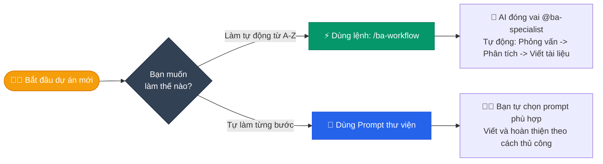
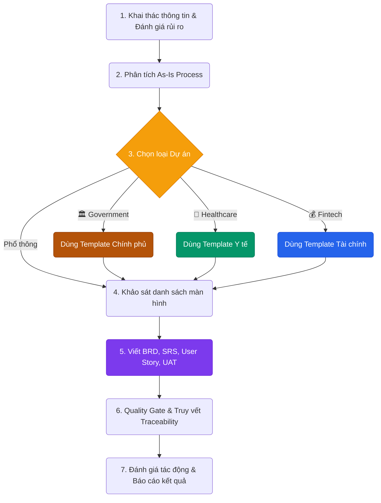
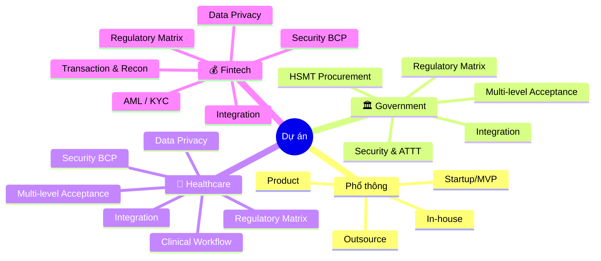

# 📘 BA KIT v3.3.1 — Thư viện Prompt cho BA

Copy bất kỳ dòng `👉` nào → dán vào chat → thay `[phần trong ngoặc]` bằng nội dung thật.

**Công thức:** `@ba-specialist + [Hành động] + [Đối tượng] + [Ràng buộc]`

---

## ⚡ Lệnh nhanh — 1 dòng, AI làm hết

```
/ba-workflow [Tên dự án] "[Mô tả]"
```

**Ví dụ:**
```
/ba-workflow QLTS "Hệ thống quản lý tài sản bệnh viện"
/ba-workflow eWallet "Ví điện tử thanh toán"
```

AI tự động: Phỏng vấn → Phân tích → Viết BRD, SRS, User Story, UAT → Kiểm tra → Báo cáo.

## 🤖 Flow thực thi: ba-specialist + ba-workflow

Khi bạn dùng lệnh nhanh, đây là cách bạn và AI tương tác trực tiếp với nhau:

1. **Khởi tạo:** Bạn gọi `/ba-workflow` kèm mô tả tắt dự án.
2. **Kích hoạt Agent:** AI tự động khoác lên vai trò chuyên gia `@ba-specialist` (nắm vững BA rule, template, workflow).
3. **Phỏng vấn socratic (Step 0-2):** AI ngừng lại và hỏi bạn các câu hỏi trọng tâm để bóc tách vấn đề. Bạn trả lời (bằng gạch đầu dòng hoặc mô tả tự do).
4. **Định tuyến thông minh (Step 3):** Dựa vào câu trả lời của bạn, AI tự phán đoán ngành nghề (Phổ thông, Government, Healthcare, Fintech) để load đúng loại tài liệu cần thiết.
5. **Sinh tài liệu hàng loạt (Step 4-5):** AI bắt đầu tự viết tài liệu (BRD, SRS, Wireframe list). Cứ mỗi báo cáo xong, AI có thể xin phép bạn trước khi đi tiếp.
6. **Tự audit & đóng gói (Step 6-8):** AI chạy quét Traceability, tự chấm điểm tài liệu và xuất ra danh sách các link/artifact hoàn chỉnh.

---

## 🗺️ Cách sử dụng — Bạn muốn làm gì?



## 📊 Flow chi tiết — `/ba-workflow` chạy thế nào?



## 🚦 Industry Routing (Phân luồng đặc thù ngành)



## 📁 Phân bổ 9 Industry Templates

Dưới đây là bảng ma trận AI sẽ tự động kích hoạt các template bổ sung tùy thuộc vào ngành nghề của bạn. Nhờ vậy, tài liệu sẽ bao gồm và tuân thủ chặt chẽ các thông lệ tiêu chuẩn của từng ngành:

| Tên Template | 🏛️ Government | 🏥 Healthcare | 💰 Fintech |
|:---|:---:|:---:|:---:|
| **📋 Regulatory Compliance Matrix** | ✅ | ✅ | ✅ |
| **🔌 Industry Integration Spec** | ✅ | ✅ | ✅ |
| **🔒 Security & Continuity Plan** | ✅ | ✅ | ✅ |
| **✅ Multi-level Acceptance** | ✅ | ✅ | ❌ |
| **🔐 Data Privacy & Consent** | ❌ | ✅ | ✅ |
| **📑 Procurement & Bidding Spec** | ✅ | ❌ | ❌ |
| **🏥 Clinical Workflow Map** | ❌ | ✅ | ❌ |
| **💳 Transaction & Reconciliation** | ❌ | ❌ | ✅ |
| **🔍 AML/KYC Process** | ❌ | ❌ | ✅ |

---

## ❓ Dự án bạn thuộc loại nào?

Chọn 1 loại → AI tự điều chỉnh flow + template:

### Loại phổ thông

| Loại | Mô tả | Flow |
|------|-------|------|
| **In-house** | Dự án nội bộ công ty | Standard |
| **Outsource** | Làm thuê cho khách hàng | Standard + Hợp đồng/NDA |
| **Product** | Xây sản phẩm riêng (SaaS, app) | Standard + OKR |
| **Startup/MVP** | Làm nhanh bản demo | Lean (2-4 docs) |

### Loại đặc thù ngành *(AI load thêm template riêng)*

| Loại | Mô tả | Flow bổ sung |
|------|-------|-------------|
| 🏛️ **Government** | Cơ quan nhà nước, đấu thầu | + HSMT, ATTT, nghiệm thu |
| 🏥 **Healthcare** | Bệnh viện, HIS/EMR | + Clinical, PHI, HL7/FHIR |
| 💰 **Fintech** | Thanh toán, ví điện tử | + Transaction, AML, Recon |

**Ví dụ lệnh cho dự án đặc thù:**
```
/ba-workflow HIS-BV "Xây dựng HIS cho bệnh viện đa khoa"
/ba-workflow DVC "Cổng dịch vụ công trực tuyến tỉnh X"
```

---

## 📖 Thư viện Prompt — Từng bước

> Nếu muốn tự gõ lệnh riêng thay vì chạy `/ba-workflow`.

### Bước 1 · Khai thác thông tin từ khách hàng

> **Dùng khi:** Vừa nhận dự án mới, cần hiểu KH muốn gì.

👉 `"Tạo 10 câu hỏi phỏng vấn để tìm nhu cầu ẩn cho tính năng [Tên]. Hỏi theo góc nhìn của [Giám đốc / Nhân viên / Người dùng cuối]."`

👉 `"Phân tích đoạn hội thoại này với KH và chỉ ra pain points, nhu cầu ẩn, ràng buộc: [Dán nội dung hội thoại]"`

👉 `"Tạo Risk Register cho dự án [Tên]. Liệt kê rủi ro theo nhóm: Scope / Technology / Timeline."`

👉 `"Phân tích What-If: Nếu [điều kiện X xảy ra] thì ảnh hưởng gì?"`

---

### Bước 2 · Vẽ quy trình hiện tại (As-Is)

> **Dùng khi:** Cần hiểu cách KH đang làm việc TRƯỚC khi đề xuất cải tiến.
> **Bỏ qua nếu:** Dự án mới hoàn toàn (chưa có quy trình).

👉 `"Viết tài liệu As-Is cho quy trình [Tên quy trình]. Chỉ ra pain points, tạo Gap Analysis, thiết lập baseline metrics."`

---

### Bước 3 · Liệt kê màn hình + Wireframe

> **Dùng khi:** Cần biết hệ thống có bao nhiêu màn hình và ai dùng.

👉 `"Liệt kê tất cả màn hình cho Feature [Tên]. Ghi rõ: mục đích, ai sử dụng, loại màn hình."`

👉 `"Tạo wireframe cho màn hình [Tên]. Chỉ ra layout, dữ liệu chính, nút action."`

---

### Bước 4 · Viết tài liệu (BRD, SRS, User Story, UAT)

> **Dùng khi:** Đã có đủ thông tin, sẵn sàng viết tài liệu chính thức.

👉 `"Viết BRD cho dự án [Tên] dựa trên thông tin đã thu thập."`

👉 `"Viết SRS cho dự án [Tên]. Bao gồm NFR và Data Model."`

👉 `"Tạo User Story Map cho Feature [Tên Feature]."`

👉 `"Tạo UAT Plan cho toàn bộ dự án."`

> 💡 AI tự chạy Pre-Flight Check trước khi viết → đảm bảo không thiếu input.

---

### Bước 5 · Vẽ sơ đồ

> **Dùng khi:** Cần minh họa luồng nghiệp vụ bằng hình ảnh.

**Vẽ tự động** (AI chọn loại phù hợp):

👉 `"Vẽ sơ đồ cho quy trình: [Dán mô tả quy trình]"`

**Vẽ chỉ định loại sơ đồ:**

👉 `"Vẽ Sequence Diagram cho luồng [Tên luồng]."`

👉 `"Vẽ ERD cho các bảng [Tên bảng 1], [Tên bảng 2]."`

👉 `"Vẽ State Diagram cho vòng đời [Đối tượng]."`

👉 `"Vẽ BPMN cho quy trình [Tên quy trình]."`

---

### Bước 6 · Kiểm tra chất lượng + Truy vết

> **Dùng khi:** Viết xong tài liệu, cần kiểm tra lỗi và độ liên kết.

**Chấm điểm tài liệu:**

👉 `"Chấm điểm C-S-K-A cho file [Tên file]. Chỉ ra lỗi Critical cần sửa ngay."`

**Kiểm tra liên kết** (Yêu cầu → Feature → User Story → Test Case):

👉 `"Chạy Traceability Validator cho toàn bộ tài liệu. Chỗ nào bị đứt chuỗi thì báo."`

**Đánh giá ảnh hưởng khi đổi yêu cầu:**

👉 `"KH muốn đổi [Yêu cầu A] thành [Yêu cầu B]. Dò quét thay đổi này ảnh hưởng đến những file nào?"`

**Đối soát với code:**

👉 `"Đối soát yêu cầu vs mã nguồn. Kiểm tra tính năng [Tên] trong SRS đã được code đúng Acceptance Criteria chưa?"`

**Đóng gói cho các đối tượng khác nhau:**

👉 `"Đóng gói nội dung thành 3 bản: tóm tắt cho Giám đốc, bản kỹ thuật cho Dev, bản test cho QC."`

---

## 🏛️🏥💰 Prompt đặc thù ngành

> ⚠️ Chỉ dùng khi dự án thuộc **Government / Healthcare / Fintech**.
> Dự án thông thường → bỏ qua phần này.

### 🏛️ Chính phủ

> Dùng khi: Dự án CNTT dùng ngân sách nhà nước, cần đấu thầu.

👉 `"Lập bảng đối chiếu: mỗi tính năng → tuân thủ quy định nào (Luật Đấu thầu 2023, NĐ 85 ATTT, NĐ 73). Chỉ ra gaps."`

👉 `"Chuẩn bị phần kỹ thuật cho HSMT (Hồ sơ mời thầu). Bao gồm: ước lượng ngân sách, đào tạo cán bộ, tiến độ Gantt."`

👉 `"Tạo quy trình nghiệm thu 3 bước: Nghiệm thu sơ bộ → Vận hành thử 30-90 ngày → Nghiệm thu chính thức. Gắn với mốc thanh toán."`

👉 `"Spec tích hợp LGSP/NGSP cho chia sẻ dữ liệu liên cơ quan."`

---

### 🏥 Y tế

> Dùng khi: Phần mềm bệnh viện (HIS, EMR, LIS), telemedicine.

👉 `"Vẽ luồng khám bệnh ngoại trú (OPD): đăng ký → khám → xét nghiệm → kê đơn → thanh toán. Đánh dấu chỗ nào có rủi ro y khoa."`

👉 `"Phân loại dữ liệu bệnh nhân theo 5 cấp: PHI / PII / Clinical / Admin / Public. Spec mã hóa + quyền truy cập cho từng cấp."`

👉 `"Tạo Consent Management (quản lý đồng ý bệnh nhân) theo NĐ 13/2023. Bao gồm Break-the-Glass protocol cho cấp cứu."`

👉 `"Spec tích hợp HL7 FHIR R4 giữa HIS ↔ LIS. Mapping: Patient, DiagnosticReport, MedicationRequest."`

---

### 💰 Fintech

> Dùng khi: Ví điện tử, payment gateway, mobile banking, lending.

👉 `"Thiết kế vòng đời giao dịch: Khởi tạo → Xác thực → Xử lý → Quyết toán → Đối soát. Bao gồm idempotency + double-entry ledger."`

👉 `"Spec quy trình AML/KYC: eKYC 4 cấp + 8 rules chống rửa tiền + mẫu SAR. Tuân thủ Luật 14/2022."`

👉 `"Tạo Reconciliation Spec (đối soát) 4 loại: Nội bộ, Đối tác T+1, Ngân hàng, Báo cáo NHNN."`

👉 `"Lập Security Architecture: STRIDE threat model + DR/BCP plan (RPO=0, RTO≤15 phút)."`

---

## 💡 3 mẹo quan trọng

1. **Mở file trước khi ra lệnh** — AI đọc file đang mở. Muốn phân tích BRD? Mở file BRD trước.

2. **Càng cụ thể càng tốt**
   - ❌ `"Viết SRS cho dự án"`
   - ✅ `"Viết SRS cho dự án QLTS, module Kiểm kê + Thanh lý, user là Phòng Vật tư bệnh viện 500 giường"`

3. **Không cần nhớ hết** — Chỉ cần nhớ `/ba-workflow [tên] "[mô tả]"`. AI sẽ tự hỏi bạn những gì còn thiếu.
