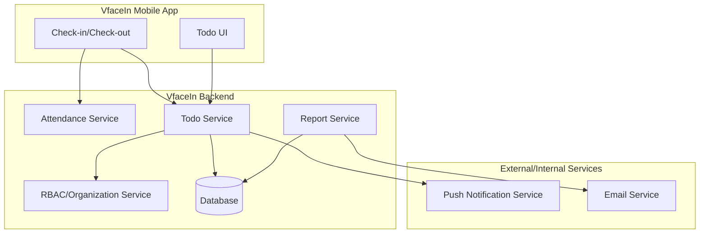
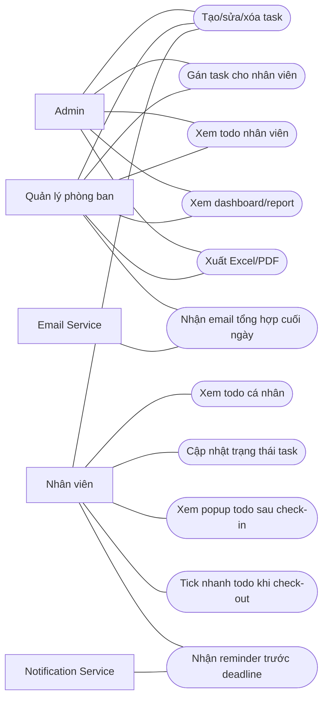
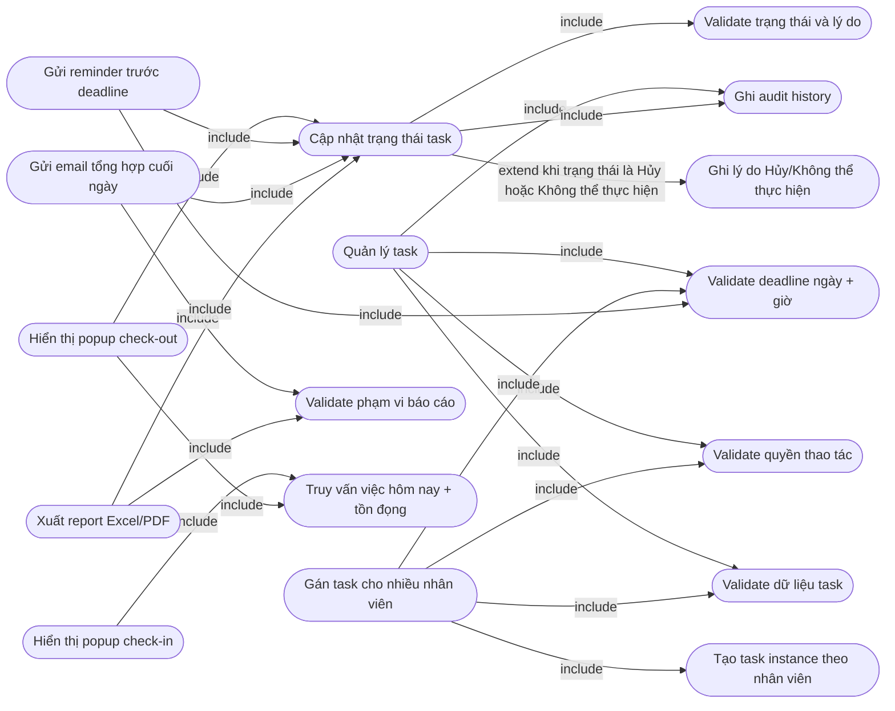
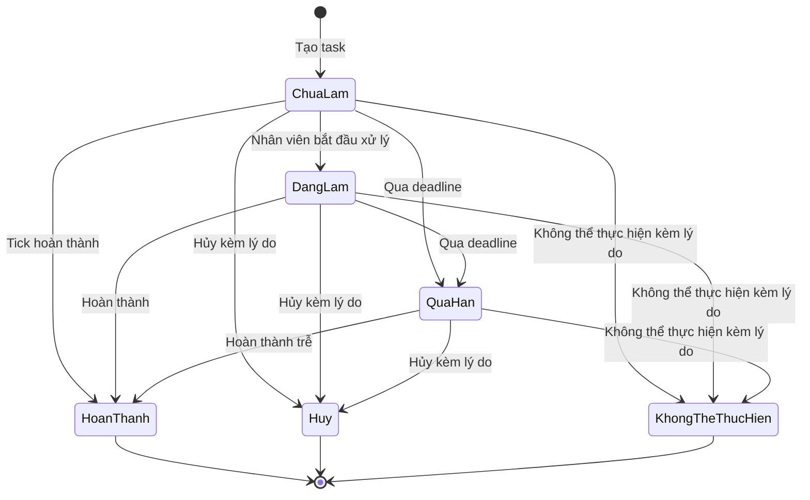
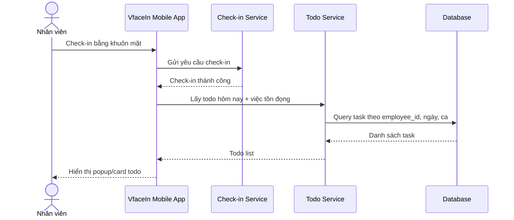
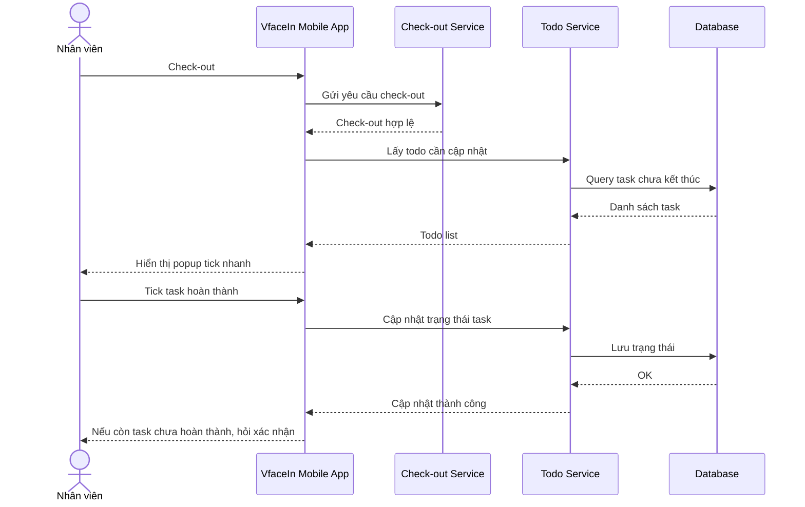
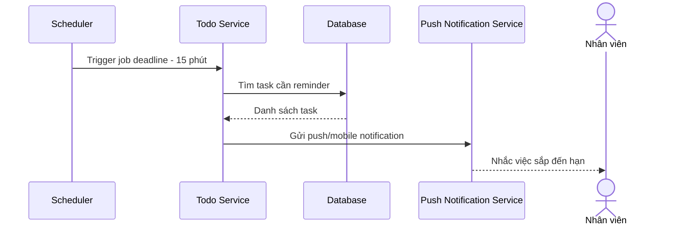
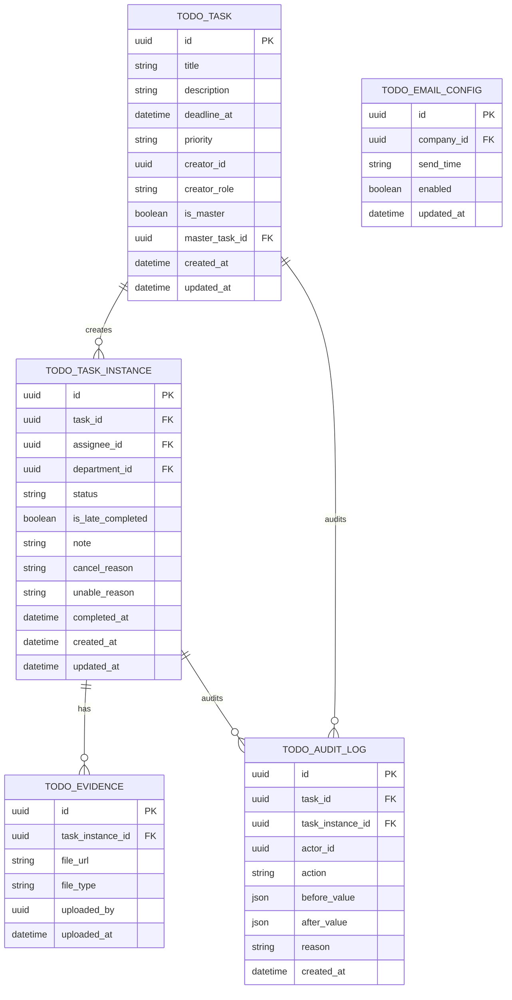

# SRS - SOFTWARE REQUIREMENTS SPECIFICATION
# VfaceIn - Module Todo Checklist cho Check-in/Check-out

> **Phiên bản:** 0.1 | **Ngày:** 04/08/2026  
> **Tác giả:** BA Agent | **Trạng thái:** Draft  
> **Tham chiếu BRD:** Chưa có BRD riêng cho module Todo Checklist

---

## Lịch sử thay đổi

| Phiên bản | Ngày | Người chỉnh | Mô tả thay đổi |
|-----------|------|-------------|----------------|
| 0.1 | 04/08/2026 | BA Agent | Phiên bản SRS đầu tiên cho module Todo Checklist |

## Phê duyệt

| Vai trò | Tên | Ngày ký | Chữ ký |
|---------|-----|---------|--------|
| BA | | | |
| Product Owner | | | |
| Dev Lead | | | |
| QA Lead | | | |

---

## 1. Giới thiệu

### 1.1 Mục đích

Tài liệu này đặc tả yêu cầu phần mềm cho module **Todo Checklist** trong app **VfaceIn**, dùng để nhắc việc cho nhân viên trong quá trình check-in/check-out bằng khuôn mặt.

Tài liệu là cơ sở để:

- Product Owner xác nhận phạm vi nghiệp vụ.
- Dev team thiết kế và triển khai chức năng.
- QA team xây dựng test case và acceptance criteria.
- Admin/quản lý hiểu quy tắc vận hành, báo cáo và thông báo.

### 1.2 Phạm vi hệ thống

| Module | Mô tả | MoSCoW |
|--------|-------|--------|
| Todo Checklist | Quản lý danh sách công việc của nhân viên theo ngày/ca, hiển thị khi check-in/check-out | Must |
| Task Assignment | Admin/quản lý tạo task và gán cho một hoặc nhiều nhân viên | Must |
| Personal Todo | Nhân viên tự tạo, sửa, xóa task của chính mình | Must |
| Reminder & Notification | Nhắc trước deadline 15 phút, thông báo việc chưa hoàn thành khi check-out | Must |
| End-of-day Email Summary | Email tổng hợp theo phòng ban gửi cho quản lý phòng ban theo lịch cấu hình | Must |
| Dashboard & Report | Dashboard/report theo quyền, lọc dữ liệu, xuất Excel/PDF | Must |
| Audit History | Ghi nhận lịch sử sửa nội dung, hủy task, xóa task | Must |

### 1.3 Ngoài phạm vi

| Hạng mục | Lý do |
|----------|------|
| Offline mode | Module yêu cầu có mạng để đồng bộ deadline, trạng thái, notification và report |
| Bắt buộc hoàn thành task trước khi check-out | Check-out không bị chặn bởi task chưa hoàn thành |
| Duyệt trạng thái Hủy/Không thể thực hiện | Nhân viên chỉ cần nhập lý do, không yêu cầu quản lý duyệt |
| Bắt buộc ảnh minh chứng | Ảnh là thông tin không bắt buộc |

### 1.4 Định nghĩa, thuật ngữ viết tắt

| Thuật ngữ | Định nghĩa |
|----------|------------|
| VfaceIn | Ứng dụng check-in/check-out bằng khuôn mặt |
| Todo Checklist | Danh sách công việc cần làm của nhân viên |
| Task gốc | Task được Admin/quản lý tạo trước khi gán cho nhân viên |
| Task instance | Bản task riêng của từng nhân viên sau khi task gốc được gán |
| Việc tồn đọng | Task chưa hoàn thành từ ngày/ca trước, tiếp tục hiển thị ở ngày/ca hiện tại |
| Ca gãy | Một ngày làm việc có nhiều lần check-in/check-out theo ca |
| Deadline | Hạn hoàn thành task, bắt buộc gồm ngày và giờ |
| Trễ hạn | Nhãn của task đã quá deadline nhưng sau đó được hoàn thành |

### 1.5 Tài liệu tham chiếu

| Tài liệu | Mô tả |
|----------|-------|
| BA-agent/Curated templates/Template-tai-lieu-BA-BRD-SRS-UserStory-AC.docx | Template tham chiếu cấu trúc BRD/SRS/User Story/AC |
| BA-agent/Curated templates/SRS.pdf | Reference completeness cho SRS |
| BA-agent/BA-document-rule/templates/srs.md | Template markdown canonical của repo |
| Elicitation notes ngày 04/08/2026 | Thông tin làm rõ yêu cầu với stakeholder |

---

## 2. Mô tả tổng quan

### 2.1 Bối cảnh sản phẩm

VfaceIn hiện hỗ trợ nhân viên check-in/check-out bằng khuôn mặt. Để phù hợp hơn với nhóm khách hàng là cửa hàng và doanh nghiệp nhỏ, hệ thống cần bổ sung module Todo Checklist nhằm nhắc nhân viên các việc cần làm khi vào ca, trong ngày và trước khi rời khỏi nơi làm việc.

Ví dụ nghiệp vụ:

- Khi check-in: nhân viên thấy danh sách việc hôm nay như lau dọn, sắp xếp bàn ghế, chuẩn bị tài liệu.
- Khi check-out: nhân viên tick nhanh việc đã hoàn thành, ghi lý do cho việc hủy/không thể thực hiện, và xác nhận nếu vẫn còn việc chưa làm.
- Ngày hôm sau: nhân viên tiếp tục thấy các việc tồn đọng/quá hạn từ hôm trước.

### 2.2 Chức năng chính

| Nhóm chức năng | Mô tả |
|----------------|-------|
| Quản lý task | Tạo, sửa, xóa, hủy task theo quyền |
| Gán task | Admin/quản lý gán một task cho một hoặc nhiều nhân viên |
| Theo dõi cá nhân | Nhân viên xem, lọc, cập nhật trạng thái todo của mình |
| Check-in popup | Hiển thị todo hôm nay và việc tồn đọng sau khi check-in thành công |
| Check-out popup | Cho phép tick nhanh task, xác nhận nếu còn task chưa hoàn thành |
| Deadline & reminder | Deadline bắt buộc ngày + giờ, nhắc trước 15 phút |
| Báo cáo | Dashboard/report theo quyền, xuất Excel/PDF |
| Thông báo | Push/mobile notification và email tổng hợp cuối ngày |
| Audit | Ghi lịch sử sửa nội dung, hủy task, xóa task |

### 2.3 Đối tượng người dùng

| Actor | Mô tả | Quyền hạn chính |
|-------|-------|-----------------|
| Admin | Người quản trị hệ thống/công ty | Xem toàn bộ todo, tạo/gán task cho nhân viên, xem dashboard toàn công ty, xuất Excel/PDF toàn công ty |
| Quản lý phòng ban | Người quản lý phòng ban đã có sẵn trong VfaceIn | Xem todo của nhân viên trong phòng, tạo/gán task cho nhân viên trong phòng, nhận email tổng hợp cuối ngày, xuất report phòng ban |
| Nhân viên | Người dùng check-in/check-out bằng VfaceIn | Xem task của chính mình, tự tạo task cá nhân, cập nhật trạng thái task, tick nhanh khi check-out |
| Notification Service | Dịch vụ gửi push/mobile notification | Gửi reminder trước deadline và notification nghiệp vụ |
| Email Service | Dịch vụ gửi email | Gửi email tổng hợp cuối ngày theo phòng ban |

### 2.4 Môi trường vận hành

| Thành phần | Yêu cầu |
|------------|---------|
| Mobile App | VfaceIn mobile app, có mạng |
| Backend API | Cung cấp API Todo Checklist, Notification, Report |
| Database | Lưu task, task instance, lịch sử, cấu hình email |
| Existing VfaceIn modules | Tích hợp với check-in/check-out, ca làm, ngày làm việc, phòng ban, manager |

### 2.5 Kiến trúc tổng quan



### 2.6 Use Case Diagram tổng quan



---

## 3. Yêu cầu chức năng

### 3.1 Module: Todo Checklist

#### 3.1.1 Detailed Use Case - include/extend



#### 3.1.2 Phân rã Use Case

| Use Case | Mô tả | Validation bắt buộc | FR tương ứng |
|----------|-------|---------------------|--------------|
| UC-TODO-001 | Tạo task cá nhân hoặc task gốc | Validate quyền tạo, title, deadline ngày + giờ, priority enum, assignee hợp lệ | FR-TODO-001 |
| UC-TODO-002 | Gán task cho một hoặc nhiều nhân viên | Validate quyền gán, phạm vi phòng ban, danh sách assignee, giới hạn 500 nhân viên/lần | FR-TODO-002 |
| UC-TODO-003 | Tạo task instance theo nhân viên | Validate mỗi assignee có một instance riêng, không tạo trùng instance trong cùng task gốc | FR-TODO-002 |
| UC-TODO-004 | Sửa/xóa/hủy task theo quyền | Validate owner/source task, trạng thái hiện tại, rule xóa vật lý/chuyển Hủy | FR-TODO-003 |
| UC-TODO-005 | Xem danh sách todo cá nhân/team | Validate scope dữ liệu theo role, filter trạng thái/ưu tiên/người giao/deadline/ca | FR-TODO-004 |
| UC-TODO-006 | Popup todo sau check-in | Validate check-in thành công, có mạng, truy vấn việc hôm nay và việc tồn đọng theo nhân viên/ca | FR-TODO-005 |
| UC-TODO-007 | Popup tick nhanh khi check-out | Validate check-out hợp lệ, danh sách task chưa kết thúc, xác nhận khi còn task chưa hoàn thành | FR-TODO-006 |
| UC-TODO-008 | Cập nhật trạng thái task | Validate quyền cập nhật, state transition, reason bắt buộc với `Hủy`/`Không thể thực hiện` | FR-TODO-007 |
| UC-TODO-009 | Reminder trước deadline 15 phút | Validate deadline ngày + giờ, task chưa kết thúc, thời điểm reminder = deadline - 15 phút | FR-TODO-008 |
| UC-TODO-010 | Email tổng hợp cuối ngày | Validate lịch gửi cấu hình, phòng ban có manager, dữ liệu theo ngày báo cáo | FR-TODO-009 |
| UC-TODO-011 | Dashboard/report và export | Validate phạm vi dữ liệu theo role, bộ lọc thời gian, định dạng export Excel/PDF | FR-TODO-010 |
| UC-TODO-012 | Audit history | Validate action thuộc nhóm cần audit, actor, before/after value, lý do nếu có | FR-TODO-011 |

### 3.2 Tạo task

| Thuộc tính | Chi tiết |
|-----------|----------|
| **ID** | FR-TODO-001 |
| **Tên** | Tạo task |
| **Mô tả** | Hệ thống PHẢI cho phép Admin/quản lý tạo task để gán nhân viên và cho phép nhân viên tự tạo task cá nhân |
| **Actor** | Admin, Quản lý phòng ban, Nhân viên |
| **Trigger** | Người dùng chọn tạo task mới |
| **Precondition** | Người dùng đã đăng nhập và có quyền truy cập module Todo |
| **Post-condition** | Task được tạo thành công với trạng thái ban đầu `Chưa làm` |
| **MoSCoW** | Must |
| **Trace từ BRD** | BR-TODO-001, BR-TODO-002 |

#### Requirement summary

| ID | Requirement |
|----|-------------|
| FR-TODO-001 | Admin, quản lý phòng ban hoặc nhân viên PHẢI tạo task khi nhập title, deadline ngày giờ; hệ thống kiểm tra validation trước khi lưu audit log sửa nội dung. |

#### Input & Validation

| Field | Kiểu dữ liệu | Bắt buộc | Validation |
|-------|--------------|----------|------------|
| title | string | Có | Tối đa 255 ký tự, không được rỗng |
| description | string | Không | Tối đa 2.000 ký tự |
| deadline_at | datetime | Có | Bắt buộc gồm ngày + giờ, phải là thời điểm hợp lệ |
| assignee_ids | array UUID | Tùy actor | Bắt buộc với Admin/quản lý khi giao task; nhân viên tự tạo thì mặc định là chính mình |
| priority | enum | Có | `Thấp`, `Bình thường`, `Cao`, `Khẩn cấp` |
| note | string | Không | Tối đa 2.000 ký tự |
| evidence_images | array file | Không | Ảnh minh chứng không bắt buộc |

#### Luồng chính

| Bước | Actor/System | Hành động |
|------|--------------|-----------|
| 1 | Actor | Mở màn hình tạo task |
| 2 | Actor | Nhập tên việc, deadline, mức độ ưu tiên và các thông tin tùy chọn |
| 3 | System | Validate dữ liệu |
| 4 | Actor | Lưu task |
| 5 | System | Tạo task với trạng thái `Chưa làm` |
| 6 | System | Nếu priority là `Cao` hoặc `Khẩn cấp`, đánh dấu task cần highlight |

#### Luồng ngoại lệ

| ID | Tại bước | Điều kiện | Xử lý |
|----|---------|-----------|-------|
| E1 | 3 | Thiếu title | Hiển thị lỗi `ERR_TODO_TITLE_REQUIRED` |
| E2 | 3 | Thiếu deadline | Hiển thị lỗi `ERR_TODO_DEADLINE_REQUIRED` |
| E3 | 3 | Deadline không có giờ | Hiển thị lỗi `ERR_TODO_DEADLINE_TIME_REQUIRED` |
| E4 | 3 | Actor không có quyền gán cho assignee | Hiển thị lỗi `ERR_TODO_FORBIDDEN_ASSIGNEE` |

### 3.3 Gán task cho nhân viên

| Thuộc tính | Chi tiết |
|-----------|----------|
| **ID** | FR-TODO-002 |
| **Tên** | Gán task cho nhân viên |
| **Mô tả** | Hệ thống PHẢI cho phép Admin/quản lý gán một task cho một hoặc nhiều nhân viên, mỗi nhân viên nhận một task instance riêng |
| **Actor** | Admin, Quản lý phòng ban |
| **Trigger** | Người dùng chọn danh sách nhân viên nhận task |
| **Precondition** | Người dùng có quyền quản lý các nhân viên được chọn |
| **Post-condition** | Mỗi nhân viên có một task instance riêng để cập nhật trạng thái độc lập |
| **MoSCoW** | Must |
| **Trace từ BRD** | BR-TODO-002 |

#### Requirement summary

| ID | Requirement |
|----|-------------|
| FR-TODO-002 | Admin hoặc quản lý phòng ban PHẢI gán task cho tối đa 500 nhân viên/lần khi có quyền với assignee; hệ thống tạo instance riêng để kiểm tra trạng thái độc lập. |

#### Luồng chính

| Bước | Actor/System | Hành động |
|------|--------------|-----------|
| 1 | Actor | Tạo task và chọn một hoặc nhiều nhân viên |
| 2 | System | Kiểm tra quyền gán task |
| 3 | System | Tạo task gốc |
| 4 | System | Tạo task instance riêng cho từng nhân viên |
| 5 | System | Hiển thị thông báo gán task thành công |

#### Business Rules

| Rule ID | Quy tắc | Ví dụ |
|---------|---------|-------|
| BRULE-TODO-001 | Một task gán cho nhiều nhân viên phải tách thành task instance riêng theo từng nhân viên | Task "Kiểm tra tồn kho" gán cho 3 nhân viên tạo 3 instance |
| BRULE-TODO-002 | Admin được gán task cho toàn bộ nhân viên trong công ty | Admin chọn nhân viên ở nhiều phòng ban |
| BRULE-TODO-003 | Quản lý phòng ban chỉ được gán task cho nhân viên thuộc phòng ban mình quản lý | Manager phòng Sales không gán task cho nhân viên HR |

### 3.4 Sửa, xóa, hủy task theo quyền

| Thuộc tính | Chi tiết |
|-----------|----------|
| **ID** | FR-TODO-003 |
| **Tên** | Sửa, xóa, hủy task |
| **Mô tả** | Hệ thống PHẢI kiểm soát quyền sửa/xóa/hủy task theo nguồn tạo và trạng thái task |
| **Actor** | Admin, Quản lý phòng ban, Nhân viên |
| **Trigger** | Người dùng chọn sửa, xóa hoặc hủy task |
| **Precondition** | Task tồn tại và người dùng có quyền thao tác |
| **Post-condition** | Task được cập nhật/xóa/hủy theo rule và được ghi audit nếu thuộc nhóm cần audit |
| **MoSCoW** | Must |
| **Trace từ BRD** | BR-TODO-003 |

#### Requirement summary

| ID | Requirement |
|----|-------------|
| FR-TODO-003 | Admin, quản lý phòng ban hoặc nhân viên PHẢI thao tác task trong phạm vi quyền khi task thỏa điều kiện trạng thái; hệ thống ghi audit log cho mỗi hành động. |

#### Quyền thao tác

| Loại task | Actor | Sửa nội dung | Xóa | Hủy | Ghi chú |
|-----------|-------|--------------|-----|-----|---------|
| Task do Admin/quản lý giao | Nhân viên | Không | Không | Có | Phải nhập lý do khi hủy |
| Task do nhân viên tự tạo | Nhân viên tạo task | Có | Có | Có | Được thao tác task của chính mình |
| Task do nhân viên tự tạo | Quản lý/Admin | Không | Không | Không | Chỉ xem trong phạm vi quyền báo cáo |
| Task do Admin giao | Admin | Có | Có theo rule | Có | Áp dụng cho task gốc và instance |
| Task do quản lý giao | Quản lý tạo task | Có | Có theo rule | Có | Trong phạm vi phòng ban |

#### Business Rules

| Rule ID | Quy tắc | Ví dụ |
|---------|---------|-------|
| BRULE-TODO-004 | Nhân viên không được sửa/xóa task do Admin/quản lý giao | Nhân viên chỉ đổi trạng thái/ghi chú |
| BRULE-TODO-005 | Quản lý/Admin không được sửa/xóa task cá nhân do nhân viên tự tạo | Task "Mua thêm bút" do nhân viên tự tạo chỉ nhân viên sửa/xóa |
| BRULE-TODO-006 | Khi xóa task gốc, chỉ xóa task instance ở trạng thái `Chưa làm` | Instance đã `Đang làm` không bị xóa vật lý |
| BRULE-TODO-007 | Task đang làm không được xóa vật lý, phải chuyển sang `Hủy` để giữ lịch sử | Task đã có xử lý được chuyển `Hủy` |
| BRULE-TODO-008 | Task đã hoàn thành giữ snapshot nội dung tại thời điểm hoàn thành | Sửa task gốc sau đó không làm đổi nội dung task đã hoàn thành |
| BRULE-TODO-009 | Khi sửa task gốc, các instance chưa hoàn thành phải cập nhật theo nội dung mới | Sửa title/deadline áp dụng cho instance chưa hoàn thành |

### 3.5 Xem danh sách todo và tìm kiếm/lọc

| Thuộc tính | Chi tiết |
|-----------|----------|
| **ID** | FR-TODO-004 |
| **Tên** | Xem danh sách todo |
| **Mô tả** | Hệ thống PHẢI cho phép người dùng xem danh sách todo theo quyền và tìm kiếm/lọc theo các tiêu chí cần thiết |
| **Actor** | Admin, Quản lý phòng ban, Nhân viên |
| **Trigger** | Người dùng mở màn hình Todo List |
| **Precondition** | Người dùng đã đăng nhập |
| **Post-condition** | Hệ thống hiển thị danh sách task đúng phạm vi quyền |
| **MoSCoW** | Must |
| **Trace từ BRD** | BR-TODO-004 |

#### Requirement summary

| ID | Requirement |
|----|-------------|
| FR-TODO-004 | Admin, quản lý phòng ban hoặc nhân viên PHẢI xem danh sách todo đúng phạm vi quyền khi mở Todo List; hệ thống hỗ trợ kiểm tra theo bộ lọc đã chọn. |

#### Phạm vi dữ liệu

| Actor | Phạm vi xem |
|-------|-------------|
| Admin | Toàn bộ todo của tất cả phòng ban/nhân viên |
| Quản lý phòng ban | Todo của tất cả nhân viên trong phòng ban, bao gồm task nhân viên tự tạo |
| Nhân viên | Chỉ task của chính mình |

#### Bộ lọc

| Bộ lọc | Giá trị |
|--------|---------|
| Trạng thái | `Chưa làm`, `Đang làm`, `Hoàn thành`, `Quá hạn`, `Hủy`, `Không thể thực hiện` |
| Ưu tiên | `Thấp`, `Bình thường`, `Cao`, `Khẩn cấp` |
| Người giao | Admin/quản lý/nhân viên tự tạo |
| Deadline | Hôm nay, tuần này, tháng này, từ ngày đến ngày |
| Ca | Danh sách ca làm từ hệ thống VfaceIn |
| Từ khóa | Tìm theo tên việc/mô tả |

### 3.6 Popup todo sau check-in

| Thuộc tính | Chi tiết |
|-----------|----------|
| **ID** | FR-TODO-005 |
| **Tên** | Hiển thị todo sau check-in |
| **Mô tả** | Sau khi nhân viên check-in thành công, hệ thống PHẢI hiển thị popup/card danh sách todo hôm nay và việc tồn đọng |
| **Actor** | Nhân viên |
| **Trigger** | Check-in bằng khuôn mặt thành công |
| **Precondition** | Nhân viên có mạng và có phiên đăng nhập hợp lệ |
| **Post-condition** | Nhân viên nhìn thấy todo cần chú ý và có thể đóng popup/card |
| **MoSCoW** | Must |
| **Trace từ BRD** | BR-TODO-005 |

#### Requirement summary

| ID | Requirement |
|----|-------------|
| FR-TODO-005 | Nhân viên PHẢI thấy popup/card todo trong vòng 1 giây sau khi check-in thành công; hệ thống hiển thị việc hôm nay kèm việc tồn đọng để kiểm tra. |

#### Luồng chính

| Bước | Actor/System | Hành động |
|------|--------------|-----------|
| 1 | Nhân viên | Check-in bằng khuôn mặt |
| 2 | System | Xác nhận check-in thành công |
| 3 | System | Truy vấn todo hôm nay và việc tồn đọng của nhân viên |
| 4 | System | Hiển thị popup/card todo |
| 5 | Nhân viên | Xem danh sách và đóng popup/card |

#### Business Rules

| Rule ID | Quy tắc | Ví dụ |
|---------|---------|-------|
| BRULE-TODO-010 | Popup check-in chỉ là nhắc việc, nhân viên có thể đóng | Không bắt buộc tick task khi check-in |
| BRULE-TODO-011 | Popup check-in phải hiển thị cả task hôm nay và việc tồn đọng từ ngày/ca trước | Task quá hạn hôm qua nằm trong nhóm `Việc tồn đọng` |
| BRULE-TODO-012 | Task không bắt buộc gắn ca, mặc định hiển thị ở mọi ca trong ngày | Nhân viên ca gãy vẫn thấy task trong từng ca |

### 3.7 Popup tick khi check-out

| Thuộc tính | Chi tiết |
|-----------|----------|
| **ID** | FR-TODO-006 |
| **Tên** | Tick nhanh todo khi check-out |
| **Mô tả** | Khi nhân viên check-out, hệ thống PHẢI hiển thị popup/card để tick nhanh task và xác nhận nếu còn task chưa hoàn thành |
| **Actor** | Nhân viên |
| **Trigger** | Nhân viên thực hiện check-out |
| **Precondition** | Nhân viên check-out thành công hoặc đang trong luồng check-out hợp lệ |
| **Post-condition** | Task được cập nhật nếu nhân viên tick; check-out không bị chặn nếu còn task chưa hoàn thành |
| **MoSCoW** | Must |
| **Trace từ BRD** | BR-TODO-006 |

#### Requirement summary

| ID | Requirement |
|----|-------------|
| FR-TODO-006 | Nhân viên PHẢI cập nhật task trong popup/card check-out trong vòng 1 giây mỗi lần lưu; hệ thống yêu cầu xác nhận khi còn task chưa hoàn thành. |

#### Luồng chính

| Bước | Actor/System | Hành động |
|------|--------------|-----------|
| 1 | Nhân viên | Thực hiện check-out |
| 2 | System | Hiển thị popup/card todo cần cập nhật |
| 3 | Nhân viên | Tick các task đã hoàn thành hoặc cập nhật nhanh trạng thái |
| 4 | System | Lưu trạng thái task |
| 5 | System | Nếu còn task chưa hoàn thành, hiển thị xác nhận |
| 6 | Nhân viên | Xác nhận vẫn check-out |
| 7 | System | Hoàn tất luồng check-out |

#### Luồng ngoại lệ

| ID | Tại bước | Điều kiện | Xử lý |
|----|---------|-----------|-------|
| E1 | 4 | Mất mạng khi lưu trạng thái | Hiển thị lỗi và yêu cầu thử lại; check-out phụ thuộc vào rule hiện tại của VfaceIn |
| E2 | 5 | Còn task chưa hoàn thành | Hiển thị thông điệp xác nhận "Bạn còn X việc chưa hoàn thành, vẫn check-out?" |

#### Business Rules

| Rule ID | Quy tắc | Ví dụ |
|---------|---------|-------|
| BRULE-TODO-013 | Không bắt buộc hoàn thành todo mới được check-out | Nhân viên vẫn check-out khi còn task `Chưa làm` |
| BRULE-TODO-014 | Nếu nhân viên check-out khi còn task chưa hoàn thành, hệ thống phải yêu cầu xác nhận | Popup xác nhận trước khi hoàn tất |
| BRULE-TODO-015 | Việc chưa hoàn thành sau check-out phải được đưa vào dữ liệu báo cáo/thông báo cho manager | Email cuối ngày có số task chưa hoàn thành |

### 3.8 Cập nhật trạng thái task

| Thuộc tính | Chi tiết |
|-----------|----------|
| **ID** | FR-TODO-007 |
| **Tên** | Cập nhật trạng thái task |
| **Mô tả** | Hệ thống PHẢI cho phép nhân viên cập nhật trạng thái task trong phạm vi quyền và bắt buộc nhập lý do với trạng thái `Hủy` hoặc `Không thể thực hiện` |
| **Actor** | Nhân viên |
| **Trigger** | Người dùng thay đổi trạng thái task |
| **Precondition** | Task thuộc phạm vi xem/cập nhật của nhân viên |
| **Post-condition** | Trạng thái task được cập nhật và ghi nhận thời điểm cập nhật |
| **MoSCoW** | Must |
| **Trace từ BRD** | BR-TODO-007 |

#### Requirement summary

| ID | Requirement |
|----|-------------|
| FR-TODO-007 | Nhân viên PHẢI cập nhật trạng thái task khi task thuộc phạm vi của mình; hệ thống kiểm tra reason bắt buộc với trạng thái kết thúc bất thường. |

#### Trạng thái

| Trạng thái | Mô tả |
|------------|-------|
| Chưa làm | Task mới, chưa có xử lý |
| Đang làm | Nhân viên đã bắt đầu xử lý |
| Hoàn thành | Task đã được hoàn thành |
| Quá hạn | Hệ thống tự chuyển khi qua deadline mà task chưa hoàn thành |
| Hủy | Task bị hủy, bắt buộc có lý do |
| Không thể thực hiện | Nhân viên không thể thực hiện task, bắt buộc có lý do |

#### Business Rules

| Rule ID | Quy tắc | Ví dụ |
|---------|---------|-------|
| BRULE-TODO-016 | Hệ thống tự chuyển task sang `Quá hạn` khi qua deadline | Deadline 17:00, 17:01 chưa hoàn thành thì quá hạn |
| BRULE-TODO-017 | Task quá hạn vẫn cho phép nhân viên làm tiếp và chuyển sang `Hoàn thành` | Task hôm qua hoàn thành hôm nay |
| BRULE-TODO-018 | Task quá hạn sau khi hoàn thành có trạng thái `Hoàn thành` và nhãn `Trễ hạn` | Báo cáo phân biệt hoàn thành đúng hạn/trễ hạn |
| BRULE-TODO-019 | Chuyển sang `Hủy` hoặc `Không thể thực hiện` bắt buộc nhập lý do | Không lưu nếu reason rỗng |
| BRULE-TODO-020 | Không cần quản lý duyệt khi nhân viên chuyển task sang `Hủy` hoặc `Không thể thực hiện` | Hệ thống lưu lý do và đưa vào report |

### 3.9 Reminder trước deadline 15 phút

| Thuộc tính | Chi tiết |
|-----------|----------|
| **ID** | FR-TODO-008 |
| **Tên** | Gửi reminder trước deadline |
| **Mô tả** | Hệ thống PHẢI gửi push/mobile notification trước deadline 15 phút cho tất cả task có deadline |
| **Actor** | Notification Service, Nhân viên |
| **Trigger** | Thời điểm hiện tại = deadline - 15 phút |
| **Precondition** | Task chưa ở trạng thái kết thúc và thiết bị nhận được push/mobile notification |
| **Post-condition** | Nhân viên nhận notification nhắc việc |
| **MoSCoW** | Must |
| **Trace từ BRD** | BR-TODO-008 |

#### Requirement summary

| ID | Requirement |
|----|-------------|
| FR-TODO-008 | Hệ thống PHẢI gửi push/mobile notification trước deadline 15 phút khi task chưa ở trạng thái kết thúc; scheduler kiểm tra task cần nhắc theo chu kỳ cấu hình. |

#### Business Rules

| Rule ID | Quy tắc | Ví dụ |
|---------|---------|-------|
| BRULE-TODO-021 | Reminder áp dụng cho tất cả task có deadline, không có tùy chọn bật/tắt theo task | Mọi task đều nhắc trước 15 phút |
| BRULE-TODO-022 | Không gửi reminder cho task đã `Hoàn thành`, `Hủy`, `Không thể thực hiện` trước thời điểm reminder | Task đã xong không cần nhắc |
| BRULE-TODO-023 | Reminder dùng push/mobile notification | Không chỉ là notification trong app |

### 3.10 Email tổng hợp cuối ngày

| Thuộc tính | Chi tiết |
|-----------|----------|
| **ID** | FR-TODO-009 |
| **Tên** | Email tổng hợp cuối ngày |
| **Mô tả** | Hệ thống PHẢI gửi email tổng hợp tình hình todo trong ngày cho quản lý phòng ban theo lịch cấu hình |
| **Actor** | Email Service, Quản lý phòng ban |
| **Trigger** | Đến thời điểm gửi email theo lịch cấu hình |
| **Precondition** | Phòng ban có quản lý và có dữ liệu todo trong ngày |
| **Post-condition** | Quản lý phòng ban nhận email tổng hợp |
| **MoSCoW** | Must |
| **Trace từ BRD** | BR-TODO-009 |

#### Requirement summary

| ID | Requirement |
|----|-------------|
| FR-TODO-009 | Hệ thống PHẢI gửi email tổng hợp cho quản lý phòng ban khi đến lịch cấu hình cuối ngày; email gồm số task theo trạng thái kèm lý do nếu phát sinh. |

#### Nội dung email

| Thông tin | Bắt buộc |
|-----------|----------|
| Ngày báo cáo | Có |
| Phòng ban | Có |
| Danh sách nhân viên | Có |
| Số task hoàn thành | Có |
| Số task chưa hoàn thành | Có |
| Số task quá hạn | Có |
| Số task hủy | Có |
| Số task không thể thực hiện | Có |
| Lý do hủy/không thể thực hiện | Có nếu phát sinh |

#### Business Rules

| Rule ID | Quy tắc | Ví dụ |
|---------|---------|-------|
| BRULE-TODO-024 | Email tổng hợp chỉ gửi cho quản lý phòng ban | Không CC Admin |
| BRULE-TODO-025 | Thời điểm gửi email theo lịch cấu hình | Công ty cấu hình gửi 19:00 mỗi ngày |
| BRULE-TODO-026 | Email tổng hợp theo phòng ban | Manager phòng Sales nhận dữ liệu phòng Sales |

### 3.11 Dashboard, report và export

| Thuộc tính | Chi tiết |
|-----------|----------|
| **ID** | FR-TODO-010 |
| **Tên** | Dashboard/report Todo |
| **Mô tả** | Hệ thống PHẢI cung cấp dashboard/report theo quyền, có bộ lọc thời gian và xuất Excel/PDF |
| **Actor** | Admin, Quản lý phòng ban |
| **Trigger** | Người dùng mở dashboard/report hoặc chọn xuất file |
| **Precondition** | Người dùng có quyền xem report |
| **Post-condition** | Hệ thống hiển thị hoặc xuất report đúng phạm vi dữ liệu |
| **MoSCoW** | Must |
| **Trace từ BRD** | BR-TODO-010 |

#### Requirement summary

| ID | Requirement |
|----|-------------|
| FR-TODO-010 | Admin hoặc quản lý phòng ban PHẢI xem dashboard/report theo phạm vi quyền khi chọn bộ lọc thời gian; hệ thống xuất Excel/PDF trong vòng 30 giây. |

#### Bộ lọc thời gian

| Bộ lọc | Mô tả |
|--------|-------|
| Hôm nay | Dữ liệu trong ngày hiện tại |
| Tuần này | Dữ liệu tuần hiện tại |
| Tháng này | Dữ liệu tháng hiện tại |
| Tùy chọn từ ngày đến ngày | Người dùng chọn khoảng thời gian |

#### Chỉ số báo cáo

| Chỉ số | Mô tả |
|--------|-------|
| Tổng số task | Tổng task trong phạm vi lọc |
| Số task hoàn thành | Task trạng thái `Hoàn thành` |
| Số task chưa hoàn thành | Task chưa ở trạng thái kết thúc |
| Số task quá hạn | Task trạng thái `Quá hạn` |
| Số task hủy | Task trạng thái `Hủy` |
| Số task không thể thực hiện | Task trạng thái `Không thể thực hiện` |
| % hoàn thành theo nhân viên | Completed / total theo nhân viên |
| % hoàn thành theo phòng ban | Completed / total theo phòng ban |
| % hoàn thành theo ngày | Completed / total theo ngày |
| % hoàn thành theo ca | Completed / total theo ca |

#### Phạm vi export

| Actor | Phạm vi export |
|-------|----------------|
| Admin | Toàn công ty |
| Quản lý phòng ban | Phòng ban mình quản lý |

#### Định dạng export

| Định dạng | Yêu cầu |
|-----------|---------|
| Excel | `.xlsx` |
| PDF | `.pdf` |

### 3.12 Audit history

| Thuộc tính | Chi tiết |
|-----------|----------|
| **ID** | FR-TODO-011 |
| **Tên** | Ghi lịch sử chỉnh sửa |
| **Mô tả** | Hệ thống PHẢI ghi nhận lịch sử đối với các hành động sửa nội dung, hủy task và xóa task |
| **Actor** | System |
| **Trigger** | Có hành động cần audit |
| **Precondition** | Task tồn tại |
| **Post-condition** | Audit log được lưu |
| **MoSCoW** | Must |
| **Trace từ BRD** | BR-TODO-011 |

#### Requirement summary

| ID | Requirement |
|----|-------------|
| FR-TODO-011 | Hệ thống PHẢI ghi audit log khi có hành động sửa nội dung, hủy task hoặc xóa task; audit log lưu actor, thời điểm, giá trị trước/sau, lý do nếu có. |

#### Hành động cần audit

| Action | Nội dung ghi nhận |
|--------|-------------------|
| Sửa nội dung | Người sửa, thời điểm, field thay đổi, giá trị cũ, giá trị mới |
| Hủy task | Người hủy, thời điểm, lý do, trạng thái trước đó |
| Xóa task | Người xóa, thời điểm, phạm vi xóa, danh sách instance bị ảnh hưởng |

---

## 4. Yêu cầu phi chức năng

### 4.1 Performance

| NFR ID | Yêu cầu | Metric | Target |
|--------|---------|--------|--------|
| NFR-PERF-001 | Tải danh sách todo cá nhân | Response time p95 | <= 1 giây |
| NFR-PERF-002 | Hiển thị popup sau check-in/check-out | Response time p95 | <= 1 giây sau khi check-in/check-out thành công |
| NFR-PERF-003 | Cập nhật trạng thái task | Response time p95 | <= 1 giây |
| NFR-PERF-004 | Tạo task cho nhiều nhân viên | Processing time | <= 5 giây với 500 nhân viên |
| NFR-PERF-005 | Xuất report Excel/PDF | Processing time | <= 30 giây cho khoảng dữ liệu 31 ngày |

### 4.2 Security

| NFR ID | Yêu cầu | Chi tiết |
|--------|---------|----------|
| NFR-SEC-001 | Authentication | Sử dụng cơ chế đăng nhập hiện có của VfaceIn |
| NFR-SEC-002 | Authorization | RBAC theo Admin, Quản lý phòng ban, Nhân viên |
| NFR-SEC-003 | Data scope | Admin xem toàn công ty, manager xem phòng ban, nhân viên xem cá nhân |
| NFR-SEC-004 | Input validation | Validate title, deadline, enum status/priority, reason |
| NFR-SEC-005 | File upload | Nếu có ảnh minh chứng, phải kiểm tra định dạng và kích thước theo chuẩn upload hiện có |

### 4.3 Availability

| NFR ID | Yêu cầu | Target |
|--------|---------|--------|
| NFR-AVA-001 | Uptime | Theo SLA hiện có của VfaceIn |
| NFR-AVA-002 | Job reminder | Scheduler không bỏ sót task cần nhắc |
| NFR-AVA-003 | Email summary | Có log trạng thái gửi email và retry theo cấu hình hệ thống |

### 4.4 Scalability

| NFR ID | Yêu cầu | Target |
|--------|---------|--------|
| NFR-SCA-001 | Số task/ngày | Hỗ trợ tối thiểu 10.000 task instance/ngày/công ty |
| NFR-SCA-002 | Gán hàng loạt | Hỗ trợ gán task cho tối thiểu 500 nhân viên/lần |
| NFR-SCA-003 | Report | Hỗ trợ truy vấn report theo tháng trong phạm vi quyền |

### 4.5 Usability

| NFR ID | Yêu cầu | Target |
|--------|---------|--------|
| NFR-USA-001 | Popup check-in/check-out | Popup/card có thể đóng, không gây chặn luồng chính |
| NFR-USA-002 | Tick nhanh | Nhân viên có thể cập nhật nhanh task trong popup check-out |
| NFR-USA-003 | Highlight priority | Task `Cao` và `Khẩn cấp` phải nổi bật trong danh sách |
| NFR-USA-004 | Mobile-first | Giao diện tối ưu cho mobile app |

### 4.6 Maintainability

| NFR ID | Yêu cầu | Chi tiết |
|--------|---------|----------|
| NFR-MNT-001 | API documentation | API Todo cần có OpenAPI/Swagger khi triển khai |
| NFR-MNT-002 | Structured logging | Log action quan trọng kèm actor_id, task_id, correlation_id |
| NFR-MNT-003 | Auditability | Audit log có thể truy xuất theo task và actor |

---

## 5. State Diagram - Vòng đời Todo Task



---

## 6. Sequence Diagram - Luồng chính

### 6.1 Check-in thành công và hiển thị todo



### 6.2 Check-out và tick nhanh todo



### 6.3 Reminder trước deadline



---

## 7. Data Model / ERD

### 7.1 ERD mức logic



### 7.2 Data Dictionary tóm tắt

| Entity | Mô tả | Field chính |
|--------|-------|-------------|
| TODO_TASK | Task gốc hoặc task cá nhân | title, description, deadline_at, priority, creator_id, is_master |
| TODO_TASK_INSTANCE | Task theo từng nhân viên | assignee_id, department_id, status, is_late_completed, note |
| TODO_EVIDENCE | Ảnh minh chứng tùy chọn | task_instance_id, file_url, uploaded_by |
| TODO_AUDIT_LOG | Lịch sử thao tác cần audit | action, before_value, after_value, reason |
| TODO_EMAIL_CONFIG | Cấu hình lịch gửi email cuối ngày | company_id, send_time, enabled |

---

## 8. API Specification dự kiến

> API bên dưới là đặc tả mức SRS để Dev team dùng làm baseline. Tên endpoint có thể điều chỉnh theo chuẩn API hiện có của VfaceIn.

### 8.1 Tạo task

```http
POST /api/v1/todo/tasks
Authorization: Bearer {access_token}
Content-Type: application/json
```

#### Request

```json
{
  "title": "Kiểm tra tồn kho cuối ngày",
  "description": "Kiểm tra số lượng hàng còn lại trước khi rời cửa hàng",
  "deadline_at": "2026-08-04T18:00:00+07:00",
  "priority": "Cao",
  "assignee_ids": ["EMP-001", "EMP-002"],
  "note": "Ưu tiên khu vực quầy thu ngân"
}
```

#### Response 201

```json
{
  "task_id": "TASK-001",
  "instance_count": 2,
  "status": "created"
}
```

### 8.2 Lấy danh sách todo

```http
GET /api/v1/todo/tasks?status=QuaHan&priority=Cao&from=2026-08-01&to=2026-08-04&shift_id=SHIFT-001
Authorization: Bearer {access_token}
```

### 8.3 Cập nhật trạng thái task

```http
PATCH /api/v1/todo/task-instances/{id}/status
Authorization: Bearer {access_token}
Content-Type: application/json
```

#### Request

```json
{
  "status": "Hoàn thành",
  "note": "Đã kiểm tra xong",
  "reason": null
}
```

### 8.4 Export report

```http
GET /api/v1/todo/reports/export?format=xlsx&from=2026-08-01&to=2026-08-04
Authorization: Bearer {access_token}
```

### 8.5 Error code/message

| Error code | HTTP Status | Message hiển thị |
|------------|-------------|------------------|
| ERR_TODO_TITLE_REQUIRED | 400 | Vui lòng nhập tên công việc |
| ERR_TODO_DEADLINE_REQUIRED | 400 | Vui lòng chọn hạn hoàn thành |
| ERR_TODO_DEADLINE_TIME_REQUIRED | 400 | Hạn hoàn thành phải bao gồm ngày và giờ |
| ERR_TODO_FORBIDDEN_ASSIGNEE | 403 | Bạn không có quyền giao việc cho nhân viên này |
| ERR_TODO_REASON_REQUIRED | 400 | Vui lòng nhập lý do |
| ERR_TODO_NOT_FOUND | 404 | Không tìm thấy công việc |
| ERR_TODO_DELETE_NOT_ALLOWED | 422 | Công việc đã có xử lý, không thể xóa |

---

## 9. UI / Wireframe mức thấp

### 9.1 Popup Todo sau check-in

```text
+------------------------------------------------+
| Check-in thành công                             |
|------------------------------------------------|
| Việc hôm nay                                    |
| [!] Kiểm tra tồn kho cuối ngày      Cao         |
| [ ] Lau dọn khu vực quầy            Bình thường |
|                                                |
| Việc tồn đọng                                  |
| [Quá hạn] Chụp ảnh hiện trạng       Khẩn cấp    |
|                                                |
|                         [Đóng] [Xem Todo List] |
+------------------------------------------------+
```

### 9.2 Popup tick nhanh khi check-out

```text
+------------------------------------------------+
| Cập nhật công việc trước khi check-out          |
|------------------------------------------------|
| [x] Lau dọn khu vực quầy                        |
| [ ] Kiểm tra tồn kho cuối ngày                  |
| [ ] Chụp ảnh hiện trạng                         |
|                                                |
| Bạn còn 2 việc chưa hoàn thành.                 |
|                                                |
|                [Quay lại cập nhật] [Vẫn check-out] |
+------------------------------------------------+
```

### 9.3 Màn hình Todo List

```text
+------------------------------------------------+
| Todo List                                       |
| Search...                                      |
| Trạng thái v | Ưu tiên v | Người giao v | Ca v |
| Deadline: Hôm nay v                            |
|------------------------------------------------|
| [Khẩn cấp] Chụp ảnh hiện trạng      Quá hạn     |
| Deadline: 03/08/2026 18:00                     |
|                                                |
| [Cao] Kiểm tra tồn kho              Đang làm    |
| Deadline: 04/08/2026 18:00                     |
|                                                |
| [Bình thường] Lau dọn quầy         Hoàn thành   |
+------------------------------------------------+
```

### 9.4 Dashboard/Report

```text
+------------------------------------------------+
| Todo Report                                     |
| Hôm nay | Tuần này | Tháng này | Tùy chọn       |
|------------------------------------------------|
| Tổng task: 120 | Hoàn thành: 90 | Quá hạn: 12   |
| % hoàn thành: 75%                               |
|------------------------------------------------|
| Nhân viên | Tổng | Hoàn thành | Quá hạn | %      |
| Nguyễn A  | 10   | 8          | 1       | 80%    |
| Trần B    | 12   | 9          | 2       | 75%    |
|------------------------------------------------|
|                         [Xuất Excel] [Xuất PDF] |
+------------------------------------------------+
```

---

## 10. Business Rules tổng hợp

| Rule ID | Quy tắc |
|---------|---------|
| BRULE-TODO-001 | Một task gán cho nhiều nhân viên phải tách thành task instance riêng theo từng nhân viên |
| BRULE-TODO-002 | Admin được xem và quản lý todo toàn công ty theo quyền Admin |
| BRULE-TODO-003 | Quản lý phòng ban chỉ xem/gán task trong phạm vi phòng ban mình quản lý |
| BRULE-TODO-004 | Nhân viên chỉ xem task của chính mình |
| BRULE-TODO-005 | Nhân viên không được sửa/xóa task do Admin/quản lý giao |
| BRULE-TODO-006 | Quản lý/Admin không được sửa/xóa task cá nhân do nhân viên tự tạo |
| BRULE-TODO-007 | Deadline bắt buộc gồm ngày và giờ |
| BRULE-TODO-008 | Reminder gửi trước deadline 15 phút cho mọi task chưa kết thúc |
| BRULE-TODO-009 | Task priority `Cao` và `Khẩn cấp` phải được highlight |
| BRULE-TODO-010 | Check-out không bị chặn bởi task chưa hoàn thành |
| BRULE-TODO-011 | Nếu check-out còn task chưa hoàn thành, phải hiển thị xác nhận |
| BRULE-TODO-012 | Task quá hạn được hiển thị trong nhóm `Việc tồn đọng` |
| BRULE-TODO-013 | Task quá hạn vẫn cho hoàn thành; khi hoàn thành lưu trạng thái `Hoàn thành` và nhãn `Trễ hạn` |
| BRULE-TODO-014 | Task không bắt buộc gắn ca, mặc định hiển thị ở mọi ca trong ngày |
| BRULE-TODO-015 | Email tổng hợp cuối ngày chỉ gửi cho quản lý phòng ban |
| BRULE-TODO-016 | Task đang làm không được xóa vật lý, phải chuyển `Hủy` để giữ lịch sử |
| BRULE-TODO-017 | Task đã hoàn thành giữ snapshot tại thời điểm hoàn thành |

---

## 11. Giả định & Dependencies

### 11.1 Giả định

| # | Giả định | Ảnh hưởng nếu sai |
|---|----------|-------------------|
| 1 | VfaceIn đã có sẵn phân cấp phòng ban/manager | Nếu chưa có, phải bổ sung module cấu hình tổ chức/RBAC trước |
| 2 | VfaceIn đã có sẵn luồng check-in/check-out và ca làm | Nếu chưa có API/hook, cần bổ sung điểm tích hợp |
| 3 | VfaceIn đã có hạ tầng push/mobile notification | Nếu chưa có, FR reminder cần thêm scope kỹ thuật |
| 4 | VfaceIn đã có hạ tầng email service hoặc SMTP provider | Nếu chưa có, cần thêm integration với email provider |
| 5 | Module yêu cầu có mạng | Không cần thiết kế offline sync |

### 11.2 Dependencies

| # | Phụ thuộc | Hệ thống/Team | Status |
|---|-----------|---------------|--------|
| 1 | API xác thực và phân quyền hiện có | VfaceIn Core | Chờ xác nhận |
| 2 | Dữ liệu phòng ban/manager | VfaceIn Organization | Chờ xác nhận |
| 3 | Dữ liệu ca làm/ngày làm việc/ca gãy | VfaceIn Attendance | Chờ xác nhận |
| 4 | Push/mobile notification | VfaceIn Notification | Chờ xác nhận |
| 5 | Email service | VfaceIn Communication | Chờ xác nhận |
| 6 | Export Excel/PDF | Reporting Service | Chờ xác nhận |

---

## 12. Traceability Matrix

| BRD Req ID | SRS FR/NFR ID | User Story dự kiến | Test Case dự kiến |
|------------|---------------|--------------------|-------------------|
| BR-TODO-001 | FR-TODO-001 | US-TODO-001 | TC-TODO-001 |
| BR-TODO-002 | FR-TODO-002 | US-TODO-002 | TC-TODO-002 |
| BR-TODO-003 | FR-TODO-003 | US-TODO-003 | TC-TODO-003 |
| BR-TODO-004 | FR-TODO-004 | US-TODO-004 | TC-TODO-004 |
| BR-TODO-005 | FR-TODO-005 | US-TODO-005 | TC-TODO-005 |
| BR-TODO-006 | FR-TODO-006 | US-TODO-006 | TC-TODO-006 |
| BR-TODO-007 | FR-TODO-007 | US-TODO-007 | TC-TODO-007 |
| BR-TODO-008 | FR-TODO-008 | US-TODO-008 | TC-TODO-008 |
| BR-TODO-009 | FR-TODO-009 | US-TODO-009 | TC-TODO-009 |
| BR-TODO-010 | FR-TODO-010 | US-TODO-010 | TC-TODO-010 |
| BR-TODO-011 | FR-TODO-011 | US-TODO-011 | TC-TODO-011 |

---

## 13. Acceptance Criteria mức SRS

### AC-TODO-001: Tạo task hợp lệ

```gherkin
Scenario: Admin tạo task và gán cho nhiều nhân viên
  Given Admin đã đăng nhập
  When Admin nhập tên task, deadline gồm ngày giờ, priority và chọn 3 nhân viên
  Then hệ thống tạo 1 task gốc
  And hệ thống tạo 3 task instance riêng cho từng nhân viên
```

### AC-TODO-002: Check-in hiển thị todo

```gherkin
Scenario: Nhân viên check-in thành công
  Given nhân viên có 2 task hôm nay và 1 task quá hạn hôm trước
  When nhân viên check-in bằng khuôn mặt thành công
  Then hệ thống hiển thị popup/card Todo
  And popup gồm nhóm "Việc hôm nay"
  And popup gồm nhóm "Việc tồn đọng"
```

### AC-TODO-003: Check-out còn task chưa hoàn thành

```gherkin
Scenario: Nhân viên check-out khi còn task chưa hoàn thành
  Given nhân viên còn 2 task chưa hoàn thành
  When nhân viên thực hiện check-out
  Then hệ thống hiển thị popup tick nhanh
  And hệ thống hiển thị xác nhận "Bạn còn 2 việc chưa hoàn thành, vẫn check-out?"
  And nhân viên vẫn có thể hoàn tất check-out sau khi xác nhận
```

### AC-TODO-004: Quá hạn và hoàn thành trễ

```gherkin
Scenario: Nhân viên hoàn thành task quá hạn
  Given task có deadline 03/08/2026 18:00
  And hiện tại là 04/08/2026 09:00
  When hệ thống chạy job cập nhật quá hạn
  Then task chuyển trạng thái "Quá hạn"
  When nhân viên hoàn thành task
  Then task có trạng thái "Hoàn thành"
  And task có nhãn "Trễ hạn"
```

### AC-TODO-005: Nhập lý do khi hủy task

```gherkin
Scenario: Nhân viên hủy task được giao
  Given nhân viên có task do quản lý giao
  When nhân viên chọn trạng thái "Hủy" mà không nhập lý do
  Then hệ thống không cho lưu
  And hệ thống hiển thị lỗi "Vui lòng nhập lý do"
```

### AC-TODO-006: Reminder trước deadline

```gherkin
Scenario: Gửi reminder trước deadline 15 phút
  Given task chưa hoàn thành có deadline 04/08/2026 18:00
  When thời gian hệ thống là 04/08/2026 17:45
  Then hệ thống gửi push/mobile notification nhắc việc cho nhân viên được giao
```

### AC-TODO-007: Report theo quyền

```gherkin
Scenario: Quản lý phòng ban xem report
  Given quản lý phòng Sales đã đăng nhập
  When quản lý mở Todo Report tháng này
  Then hệ thống chỉ hiển thị dữ liệu của nhân viên phòng Sales
  And report có % hoàn thành theo nhân viên, phòng ban, ngày và ca
```

---

## 14. Open Points

| ID | Nội dung cần xác nhận | Ảnh hưởng |
|----|-----------------------|-----------|
| OP-TODO-001 | Chuẩn đặt tên endpoint/API hiện có của VfaceIn | Có thể cần đổi endpoint trong mục API |
| OP-TODO-002 | Giới hạn upload ảnh minh chứng theo chuẩn hệ thống hiện có | Ảnh không bắt buộc nhưng vẫn cần rule kỹ thuật nếu bật upload |
| OP-TODO-003 | SLA hiện tại của VfaceIn | Cần điền target availability chính xác |
| OP-TODO-004 | Cơ chế retry/log của Email Service và Push Notification | Ảnh hưởng NFR availability/observability |
