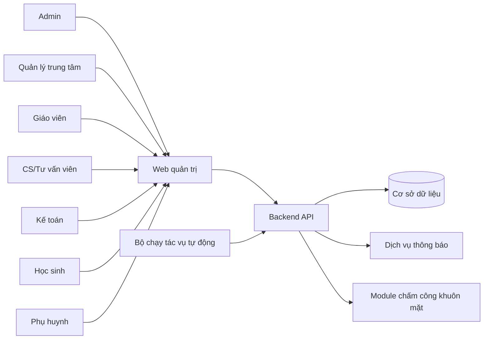
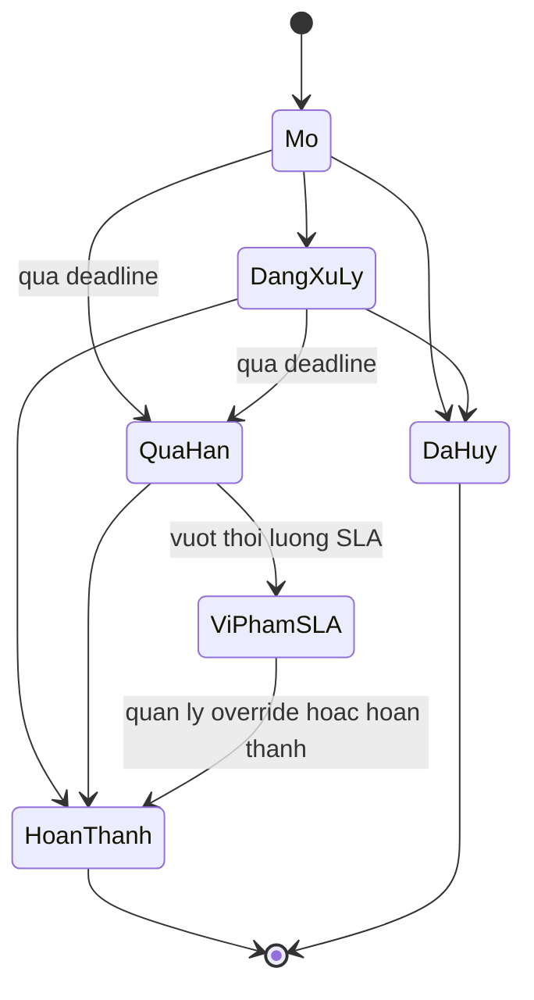
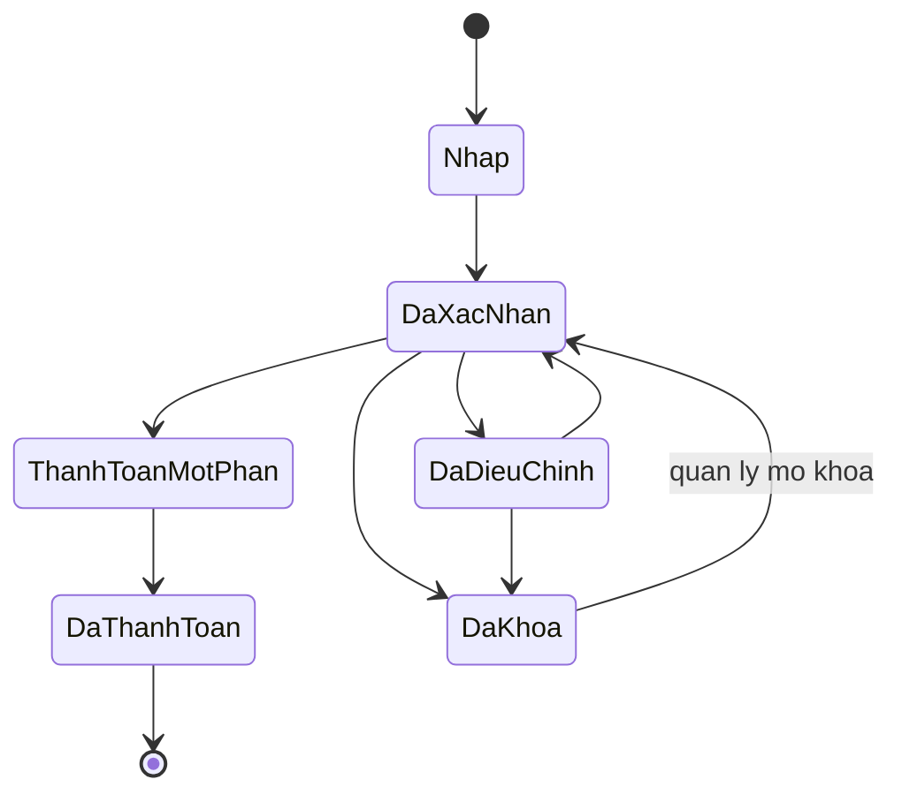
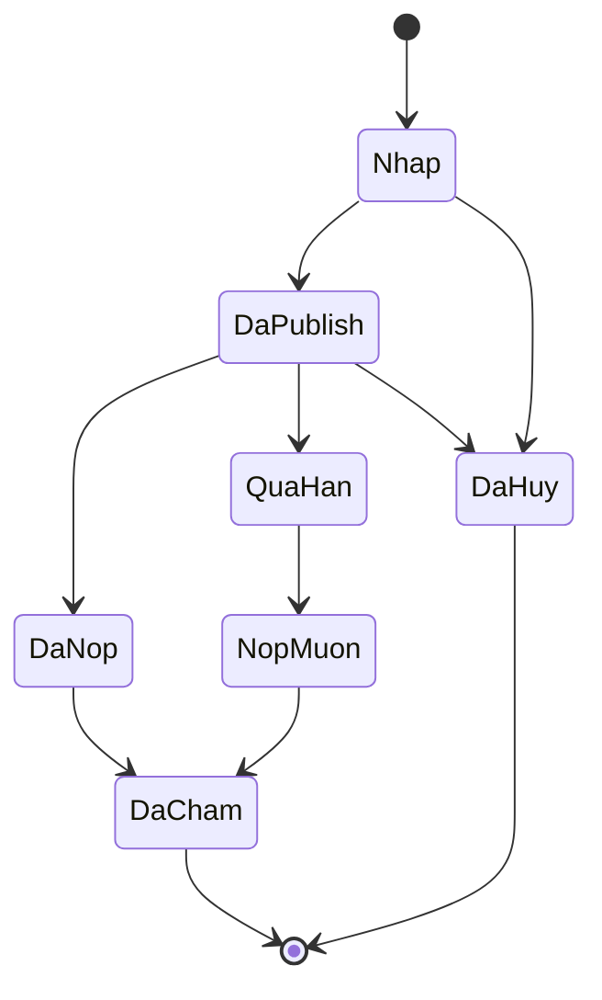
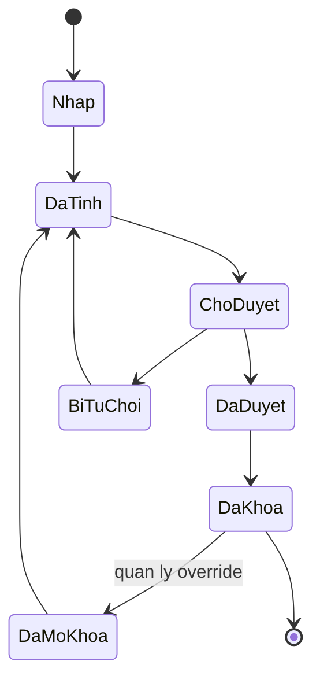
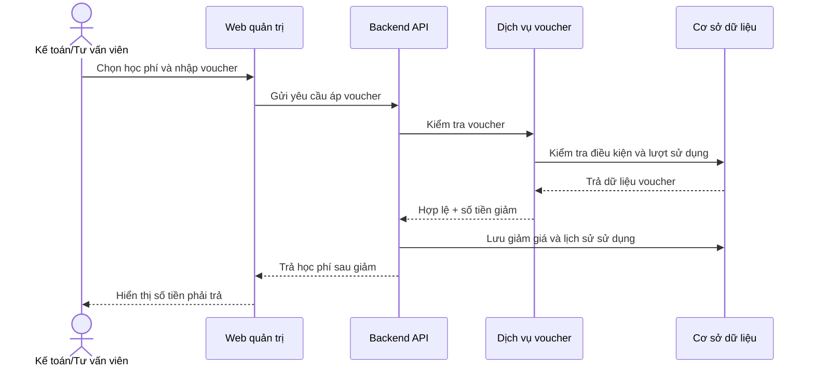
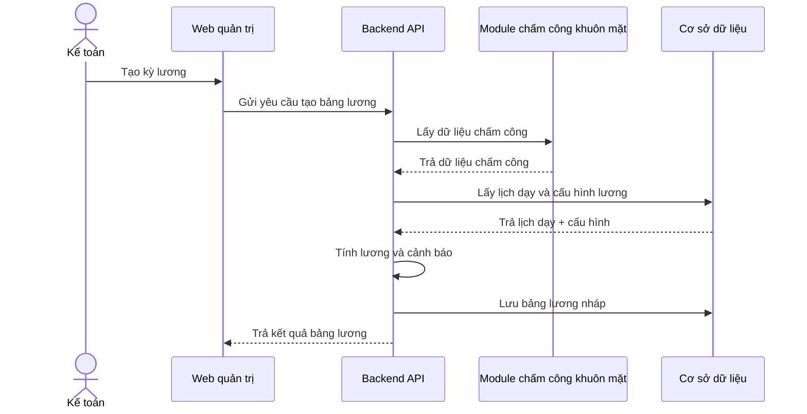
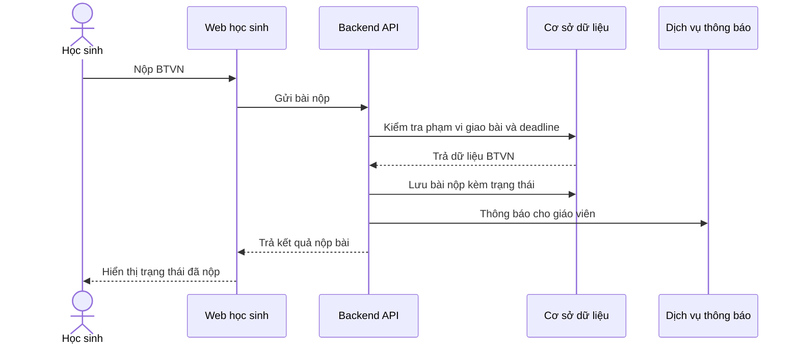

# ĐẶC TẢ YÊU CẦU PHẦN MỀM
# Mở rộng tính năng web quản lý trung tâm đào tạo

> **Phiên bản:** 1.0  
> **Ngày:** 27/07/2026  
> **Trạng thái:** Bản nháp  
> **Phạm vi:** Quản lý học sinh, quản lý giáo viên, voucher khóa học, tinh chỉnh học phí, BTVN  
> **Tham chiếu:** `01-BACCM-Feature-Expansion.md`

---

## 1. Giới thiệu

### 1.1. Mục đích

Tài liệu này đặc tả yêu cầu phần mềm cho các tính năng mở rộng của web quản lý trung tâm đào tạo. Tài liệu là cơ sở để đội phát triển triển khai, đội kiểm thử viết test case, PO/BA kiểm soát phạm vi và truy vết yêu cầu.

### 1.2. Phạm vi

| Module | Mô tả | Ưu tiên |
|---|---|---|
| Mở rộng quản lý học sinh | Sổ liên lạc, nhật ký chăm sóc, điểm thi. | Bắt buộc |
| Mở rộng quản lý giáo viên | Tính lương từ chấm công khuôn mặt/lịch dạy, giao việc, nhắc việc, SLA. | Bắt buộc/Nên có |
| Voucher khóa học | Tạo và quản lý voucher giảm giá khóa học. | Bắt buộc |
| Tinh chỉnh học phí | Chỉnh sửa học phí và áp voucher vào học phí. | Bắt buộc |
| BTVN | Tạo BTVN, nộp bài, chấm/nhận xét, theo dõi deadline. | Bắt buộc |

### 1.3. Ngoài phạm vi v1.0

| Hạng mục | Lý do |
|---|---|
| Workflow phê duyệt nhiều cấp phức tạp | Chưa có quy tắc nghiệp vụ chi tiết. |
| Tích hợp thanh toán bên thứ ba | Yêu cầu hiện tại tập trung vào học phí/voucher, chưa mô tả cổng thanh toán. |
| AI chấm bài tự động | Chưa có yêu cầu AI/rubric. |
| Công thức lương tùy biến bằng expression engine | Nên triển khai cấu hình lương cơ bản trước. |

### 1.4. Bảng thuật ngữ và viết tắt

| Thuật ngữ/Viết tắt | Tên đầy đủ | Giải thích |
|---|---|---|
| SLA | Service Level Agreement | Cam kết mức độ dịch vụ/thời hạn xử lý. Trong hệ thống này, SLA dùng để kiểm soát deadline xử lý task, chăm sóc học sinh hoặc công việc nội bộ. |
| BTVN | Bài tập về nhà | Bài tập giáo viên giao cho học sinh thực hiện ngoài giờ học, có deadline, trạng thái nộp bài và kết quả chấm/nhận xét. |
| API | Application Programming Interface | Giao diện lập trình ứng dụng, dùng để web gọi tới backend hoặc các module khác như chấm công khuôn mặt, thông báo, voucher. |
| Backend API | Backend Application Programming Interface | Tầng dịch vụ phía sau web, chịu trách nhiệm xử lý nghiệp vụ, lưu dữ liệu, kiểm tra quyền và trả kết quả cho giao diện. |
| RBAC | Role-Based Access Control | Cơ chế phân quyền theo vai trò, ví dụ Admin, Quản lý trung tâm, Giáo viên, Kế toán, Học sinh, Phụ huynh. |
| Audit log | Nhật ký kiểm tra/thay đổi | Bản ghi lịch sử thao tác quan trọng như chỉnh học phí, áp voucher, sửa điểm đã công bố, mở khóa bảng lương. |
| Voucher | Mã/Chương trình giảm giá | Chính sách giảm giá áp dụng cho khóa học hoặc học phí theo điều kiện cấu hình. |
| Template voucher | Mẫu voucher | Bộ cấu hình voucher dựng sẵn để người dùng chọn nhanh khi tạo chương trình giảm giá, ví dụ giảm theo phần trăm, giảm số tiền cố định, ưu đãi học viên mới, ưu đãi theo khóa học. |
| Zalo OA | Zalo Official Account | Kênh tài khoản chính thức trên Zalo dùng để trung tâm gửi thông báo tới phụ huynh/học sinh. |
| App phụ huynh | Ứng dụng dành cho phụ huynh | Kênh ứng dụng hiện có để phụ huynh nhận thông báo liên quan tới học phí, BTVN, điểm thi, sổ liên lạc và voucher. |
| TuitionFee | Học phí | Khoản phí học sinh cần thanh toán cho khóa học/lớp học, có thể được điều chỉnh hoặc áp voucher. |
| Payroll | Bảng lương | Bảng tính lương giáo viên/nhân sự theo kỳ lương dựa trên cấu hình lương, chấm công, lịch dạy, phụ cấp và khấu trừ. |
| Face Attendance | Chấm công khuôn mặt | Module ghi nhận chấm công bằng nhận diện khuôn mặt, là nguồn dữ liệu đầu vào cho tính lương giáo viên. |
| Task | Công việc | Việc được giao cho giáo viên/nhân sự, có người nhận, deadline, trạng thái, nhắc việc và SLA nếu có. |
| Follow-up | Chăm sóc/nhắc lại sau | Hành động cần thực hiện tiếp theo sau một lần chăm sóc học sinh/khách hàng, thường được chuyển thành task hoặc lịch nhắc. |
| Deadline | Hạn xử lý/hạn nộp | Thời điểm cuối cùng cần hoàn thành task hoặc nộp BTVN. |
| Override | Ghi đè quyền/quy tắc | Thao tác cho phép người có quyền cao xử lý ngoại lệ, ví dụ mở khóa bảng lương hoặc chỉnh học phí đã khóa. |
| Permission test | Kiểm thử phân quyền | Test case xác minh người dùng chỉ xem/sửa đúng dữ liệu theo vai trò và quyền được cấp. |
| Negative test | Kiểm thử trường hợp không hợp lệ | Test case kiểm tra hệ thống có chặn đúng thao tác sai, thiếu quyền hoặc dữ liệu không hợp lệ hay không. |
| p95 | Percentile 95 | Chỉ số hiệu năng cho biết 95% request có thời gian xử lý nhỏ hơn hoặc bằng ngưỡng đã đặt. |

---

## 2. Tổng quan hệ thống

### 2.1. Kiến trúc chức năng

### 2.2. Vai trò và quyền tổng quan

| Vai trò | Mô tả | Quyền chính |
|---|---|---|
| Admin | Quản trị hệ thống. | Cấu hình, phân quyền, xem/sửa toàn bộ module. |
| Quản lý trung tâm | Quản lý vận hành trung tâm. | Duyệt học phí/lương, xem báo cáo, quản lý SLA/task. |
| Giáo viên | Người giảng dạy. | Nhập điểm, giao/chấm BTVN, xem task, xem bảng lương của mình. |
| CS/Tư vấn viên | Nhân sự chăm sóc và tư vấn học sinh. | Tạo nhật ký chăm sóc, tạo task follow-up, xem hồ sơ học sinh được phân công. |
| Kế toán | Nhân sự phụ trách học phí và lương. | Chỉnh học phí, áp voucher, tạo/duyệt bảng lương theo quyền. |
| Học sinh | Người học. | Xem/nộp BTVN, xem điểm, xem thông báo liên quan. |
| Phụ huynh | Người theo dõi quá trình học của học sinh. | Xem sổ liên lạc, điểm thi, BTVN và thông báo của học sinh liên kết. |
| Bộ chạy tác vụ tự động | Tác vụ tự động của hệ thống. | Gửi nhắc việc, kiểm tra SLA, cập nhật trạng thái quá hạn. |

---

## 3. Yêu cầu chức năng

## 3.1. Module mở rộng quản lý học sinh

### 3.1.1. Tạo sổ liên lạc

| Thuộc tính | Chi tiết |
|---|---|
| ID | FR-STU-001 |
| Tên | Tạo sổ liên lạc |
| Vai trò | Giáo viên, CS, Quản lý trung tâm |
| Kích hoạt | Người dùng tạo ghi chú liên lạc từ hồ sơ học sinh, lớp học hoặc buổi học. |
| Điều kiện tiên quyết | Người dùng đã đăng nhập và có quyền tạo sổ liên lạc cho học sinh/lớp. |
| Ưu tiên | Bắt buộc |
| Truy vết | BRQ-STU-001 |

| Bước | Người thực hiện/Hệ thống | Xử lý |
|---:|---|---|
| 1 | Người dùng | Chọn học sinh hoặc lớp cần ghi sổ liên lạc. |
| 2 | Hệ thống | Hiển thị form gồm tiêu đề, nội dung, loại ghi chú, người nhận và file đính kèm nếu có. |
| 3 | Người dùng | Nhập nội dung và bấm Lưu/Gửi. |
| 4 | Hệ thống | Kiểm tra dữ liệu và tạo bản ghi sổ liên lạc. |
| 5 | Hệ thống | Gửi thông báo cho phụ huynh/học sinh nếu actor chọn gửi thông báo. |

| Ngoại lệ | Điều kiện | Xử lý |
|---|---|---|
| E-STU-001 | Thiếu học sinh/lớp hoặc nội dung | Hệ thống chặn lưu và hiển thị thông báo trường bắt buộc. |
| E-STU-002 | Người dùng không có quyền | Hệ thống từ chối thao tác và không tạo bản ghi sổ liên lạc. |

### 3.1.2. Xem lịch sử sổ liên lạc

| Thuộc tính | Chi tiết |
|---|---|
| ID | FR-STU-002 |
| Tên | Xem lịch sử sổ liên lạc |
| Vai trò | Giáo viên, CS, Quản lý trung tâm, Phụ huynh, Học sinh |
| Kích hoạt | Người dùng mở tab Sổ liên lạc trong hồ sơ học sinh/lớp. |
| Điều kiện tiên quyết | Người dùng có quyền xem học sinh hoặc lớp tương ứng. |
| Ưu tiên | Bắt buộc |
| Truy vết | BRQ-STU-002 |

| Mã | Yêu cầu |
|---|---|
| FR-STU-002.1 | Hệ thống phải hiển thị danh sách bản ghi sổ liên lạc theo học sinh, lớp, khoảng ngày và người tạo. |
| FR-STU-002.2 | Hệ thống phải hiển thị chi tiết bản ghi gồm tiêu đề, nội dung, người nhận, người tạo, thời gian tạo và danh sách file đính kèm. |
| FR-STU-002.3 | Hệ thống phải ẩn ghi chú nội bộ đối với vai trò phụ huynh và học sinh. |

### 3.1.3. Tạo nhật ký chăm sóc

| Thuộc tính | Chi tiết |
|---|---|
| ID | FR-STU-003 |
| Tên | Tạo nhật ký chăm sóc học sinh |
| Vai trò | CS, Tư vấn viên, Quản lý trung tâm |
| Kích hoạt | Người dùng ghi nhận lần chăm sóc sau cuộc gọi/tin nhắn/gặp trực tiếp. |
| Điều kiện tiên quyết | Học sinh/lead tồn tại và actor có quyền chăm sóc. |
| Ưu tiên | Bắt buộc |
| Truy vết | BRQ-STU-003 |

| Mã | Yêu cầu |
|---|---|
| FR-STU-003.1 | Hệ thống phải cho phép người dùng tạo nhật ký chăm sóc với học sinh, loại chăm sóc, nội dung, kết quả, người phụ trách và ngày cần follow-up tiếp theo. |
| FR-STU-003.2 | Hệ thống phải tự động tạo task follow-up khi người dùng nhập ngày cần follow-up tiếp theo. |
| FR-STU-003.3 | Hệ thống phải hiển thị lịch sử chăm sóc theo thứ tự thời gian tạo mới nhất lên đầu. |

### 3.1.4. Quản lý điểm thi

| Thuộc tính | Chi tiết |
|---|---|
| ID | FR-STU-004 |
| Tên | Nhập và cập nhật điểm thi |
| Vai trò | Giáo viên, Quản lý trung tâm |
| Kích hoạt | Người dùng tạo bài thi hoặc nhập điểm cho lớp/học sinh. |
| Điều kiện tiên quyết | Lớp/khóa học/học sinh tồn tại và actor có quyền quản lý điểm. |
| Ưu tiên | Bắt buộc |
| Truy vết | BRQ-STU-004, BRQ-STU-005 |

| Mã | Yêu cầu |
|---|---|
| FR-STU-004.1 | Hệ thống phải cho phép giáo viên tạo bài thi với tên bài thi, lớp, khóa học, ngày thi, điểm tối đa và trọng số. |
| FR-STU-004.2 | Hệ thống phải cho phép giáo viên nhập điểm và nhận xét cho từng học sinh trong lớp được chọn. |
| FR-STU-004.3 | Hệ thống phải kiểm tra điểm thi nằm trong khoảng từ 0 đến điểm tối đa của bài thi. |
| FR-STU-004.4 | Hệ thống phải yêu cầu nhập lý do khi người dùng chỉnh sửa điểm đã công bố. |
| FR-STU-004.5 | Hệ thống phải lưu lịch sử thay đổi điểm gồm điểm cũ, điểm mới, lý do, người sửa và thời gian sửa. |

## 3.2. Module mở rộng quản lý giáo viên

### 3.2.1. Cấu hình tính lương giáo viên

| Thuộc tính | Chi tiết |
|---|---|
| ID | FR-TEA-001 |
| Tên | Cấu hình lương giáo viên |
| Vai trò | Admin, Kế toán, Quản lý trung tâm |
| Kích hoạt | Người dùng tạo hoặc cập nhật cấu hình lương cho giáo viên. |
| Điều kiện tiên quyết | Giáo viên tồn tại và actor có quyền cấu hình lương. |
| Ưu tiên | Bắt buộc |
| Truy vết | BRQ-TEA-001 |

| Mã | Yêu cầu |
|---|---|
| FR-TEA-001.1 | Hệ thống phải cho phép người dùng cấu hình loại lương theo giáo viên: lương cố định theo tháng, lương theo giờ dạy, lương theo buổi dạy hoặc kết hợp nhiều loại. |
| FR-TEA-001.2 | Hệ thống phải cho phép người dùng cấu hình các khoản phụ cấp và khấu trừ. |
| FR-TEA-001.3 | Hệ thống phải lưu ngày hiệu lực cho từng cấu hình lương. |
| FR-TEA-001.4 | Hệ thống phải giữ lịch sử cấu hình lương cũ để phục vụ kiểm tra bảng lương. |

### 3.2.2. Tính bảng lương từ chấm công khuôn mặt và lịch dạy

| Thuộc tính | Chi tiết |
|---|---|
| ID | FR-TEA-002 |
| Tên | Tính bảng lương giáo viên |
| Vai trò | Kế toán, Quản lý trung tâm |
| Kích hoạt | Người dùng tạo bảng lương theo kỳ lương. |
| Điều kiện tiên quyết | Có dữ liệu giáo viên, cấu hình lương, lịch dạy và dữ liệu chấm công khuôn mặt. |
| Ưu tiên | Bắt buộc |
| Truy vết | BRQ-TEA-001, BRQ-TEA-005 |

| Mã | Yêu cầu |
|---|---|
| FR-TEA-002.1 | Hệ thống phải đọc dữ liệu chấm công khuôn mặt trong kỳ lương được chọn. |
| FR-TEA-002.2 | Hệ thống phải đối chiếu dữ liệu chấm công với lịch dạy theo giáo viên và ngày. |
| FR-TEA-002.3 | Hệ thống phải tính lương gộp theo cấu hình lương đang có hiệu lực trong kỳ lương. |
| FR-TEA-002.4 | Hệ thống phải áp dụng các khoản phụ cấp và khấu trừ trước khi tính lương cuối cùng. |
| FR-TEA-002.5 | Hệ thống phải hiển thị cảnh báo với các bản ghi chấm công hoặc lịch dạy không đối chiếu được. |

### 3.2.3. Duyệt và khóa bảng lương

| Thuộc tính | Chi tiết |
|---|---|
| ID | FR-TEA-003 |
| Tên | Duyệt/khóa bảng lương |
| Vai trò | Kế toán, Quản lý trung tâm |
| Kích hoạt | Người dùng review bảng lương và bấm Duyệt/Khóa. |
| Điều kiện tiên quyết | Bảng lương đã được tính và không còn lỗi nghiêm trọng. |
| Ưu tiên | Bắt buộc |
| Truy vết | BRQ-TEA-005 |

| Mã | Yêu cầu |
|---|---|
| FR-TEA-003.1 | Hệ thống phải cho phép kế toán gửi bảng lương để quản lý duyệt. |
| FR-TEA-003.2 | Hệ thống phải cho phép quản lý trung tâm duyệt hoặc từ chối bảng lương kèm ghi chú. |
| FR-TEA-003.3 | Hệ thống phải khóa bảng lương đã duyệt để không bị chỉnh sửa trực tiếp. |
| FR-TEA-003.4 | Hệ thống phải yêu cầu quyền mở khóa và lý do trước khi thay đổi bảng lương đã duyệt. |

### 3.2.4. Giao việc

| Thuộc tính | Chi tiết |
|---|---|
| ID | FR-TEA-004 |
| Tên | Tạo và giao việc |
| Vai trò | Admin, Quản lý trung tâm, CS, Giáo viên |
| Kích hoạt | Người dùng tạo task cho giáo viên/nhân sự. |
| Điều kiện tiên quyết | Người dùng có quyền tạo task và người nhận việc tồn tại. |
| Ưu tiên | Bắt buộc |
| Truy vết | BRQ-TEA-002 |

| Mã | Yêu cầu |
|---|---|
| FR-TEA-004.1 | Hệ thống phải cho phép người dùng tạo task với tiêu đề, mô tả, người nhận, mức ưu tiên, deadline và học sinh/lớp liên quan nếu có. |
| FR-TEA-004.2 | Hệ thống phải cho phép người nhận việc cập nhật trạng thái task: Mở, Đang xử lý, Hoàn thành, Đã hủy. |
| FR-TEA-004.3 | Hệ thống phải hiển thị danh sách task theo người nhận, deadline, mức ưu tiên, trạng thái và đối tượng liên quan. |
| FR-TEA-004.4 | Hệ thống phải lưu lịch sử hoạt động của task cho mỗi lần thay đổi trạng thái. |

### 3.2.5. Nhắc việc và SLA

| Thuộc tính | Chi tiết |
|---|---|
| ID | FR-TEA-005 |
| Tên | Nhắc việc và kiểm soát SLA |
| Vai trò | Bộ chạy tác vụ tự động, Quản lý trung tâm, Người nhận việc |
| Kích hoạt | Bộ chạy tác vụ tự động chạy job nhắc việc hoặc kiểm tra SLA. |
| Điều kiện tiên quyết | Task có deadline hoặc cấu hình SLA. |
| Ưu tiên | Nên có |
| Truy vết | BRQ-TEA-003, BRQ-TEA-004 |

| Mã | Yêu cầu |
|---|---|
| FR-TEA-005.1 | Hệ thống phải gửi nhắc việc trước deadline theo cấu hình nhắc việc. |
| FR-TEA-005.2 | Hệ thống phải đánh dấu task là Quá hạn khi deadline đã qua và task chưa Hoàn thành hoặc Đã hủy. |
| FR-TEA-005.3 | Hệ thống phải ghi nhận vi phạm SLA khi task vượt quá thời lượng SLA được cấu hình. |
| FR-TEA-005.4 | Hệ thống phải thông báo cho quản lý trung tâm khi phát sinh vi phạm SLA. |
| FR-TEA-005.5 | Hệ thống phải chặn đóng task bị khóa SLA nếu chưa có thao tác override của quản lý, trong trường hợp rule khóa SLA được bật. |

## 3.3. Module voucher khóa học

### 3.3.1. Tạo và quản lý voucher khóa học

| Thuộc tính | Chi tiết |
|---|---|
| ID | FR-VOU-001 |
| Tên | Tạo voucher giảm giá khóa học |
| Vai trò | Admin, Marketing, Quản lý trung tâm |
| Kích hoạt | Người dùng tạo chương trình giảm giá mới. |
| Điều kiện tiên quyết | Người dùng có quyền quản lý voucher. |
| Ưu tiên | Bắt buộc |
| Truy vết | BRQ-VOU-001 |

| Mã | Yêu cầu |
|---|---|
| FR-VOU-001.1 | Hệ thống phải cho phép người dùng tạo voucher với mã, tên, loại giảm giá, giá trị giảm, ngày bắt đầu, ngày kết thúc và trạng thái. |
| FR-VOU-001.2 | Hệ thống phải hỗ trợ loại giảm giá theo số tiền cố định và theo phần trăm. |
| FR-VOU-001.3 | Hệ thống phải cho phép người dùng chọn phạm vi áp dụng theo khóa học, nhóm khóa học, lớp hoặc toàn bộ khóa học. |
| FR-VOU-001.4 | Hệ thống phải kiểm tra mã voucher là duy nhất trước khi lưu. |
| FR-VOU-001.5 | Hệ thống phải cho phép người dùng kích hoạt, tạm ngưng hoặc đánh dấu voucher hết hạn. |
| FR-VOU-001.6 | Hệ thống phải cho phép người dùng tạo voucher mới từ mẫu voucher có sẵn hoặc tạo mới từ đầu. |

### 3.3.2. Kiểm tra điều kiện voucher

| Thuộc tính | Chi tiết |
|---|---|
| ID | FR-VOU-002 |
| Tên | Kiểm tra voucher |
| Vai trò | Hệ thống, Kế toán, Tư vấn viên |
| Kích hoạt | Người dùng áp voucher vào học phí. |
| Điều kiện tiên quyết | Voucher tồn tại và học phí tồn tại. |
| Ưu tiên | Bắt buộc |
| Truy vết | BRQ-VOU-002, BRQ-VOU-003 |

| Mã | Yêu cầu |
|---|---|
| FR-VOU-002.1 | Hệ thống phải từ chối voucher khi ngày hiện tại nằm ngoài khoảng hiệu lực của voucher. |
| FR-VOU-002.2 | Hệ thống phải từ chối voucher khi trạng thái voucher không phải Đang hoạt động. |
| FR-VOU-002.3 | Hệ thống phải từ chối voucher khi khóa học/lớp/học sinh được chọn không khớp phạm vi áp dụng của voucher. |
| FR-VOU-002.4 | Hệ thống phải từ chối voucher khi vượt giới hạn tổng lượt dùng hoặc giới hạn lượt dùng theo từng học sinh. |
| FR-VOU-002.5 | Hệ thống phải trả về lý do kiểm tra khi voucher không thể áp dụng. |

### 3.3.3. Lưu lịch sử sử dụng voucher

| Thuộc tính | Chi tiết |
|---|---|
| ID | FR-VOU-003 |
| Tên | Lịch sử sử dụng voucher |
| Vai trò | Hệ thống |
| Kích hoạt | Voucher được áp dụng thành công vào học phí. |
| Điều kiện tiên quyết | Voucher đã qua kiểm tra hợp lệ. |
| Ưu tiên | Bắt buộc |
| Truy vết | BRQ-VOU-004 |

| Mã | Yêu cầu |
|---|---|
| FR-VOU-003.1 | Hệ thống phải tạo bản ghi lịch sử sử dụng voucher khi voucher được áp dụng thành công. |
| FR-VOU-003.2 | Hệ thống phải lưu học sinh, học phí, khóa học, số tiền giảm, người áp dụng và thời gian áp dụng. |
| FR-VOU-003.3 | Hệ thống phải cập nhật số lượt sử dụng voucher sau khi áp dụng thành công. |

### 3.3.4. Quản lý template voucher

| Thuộc tính | Chi tiết |
|---|---|
| ID | FR-VOU-004 |
| Tên | Quản lý template voucher |
| Vai trò | Admin, Marketing, Quản lý trung tâm |
| Kích hoạt | Người dùng mở màn hình tạo voucher hoặc thư viện template voucher. |
| Điều kiện tiên quyết | Người dùng có quyền quản lý voucher hoặc quyền tạo chiến dịch voucher. |
| Ưu tiên | Nên có |
| Truy vết | BRQ-VOU-005 |

| Mã | Yêu cầu |
|---|---|
| FR-VOU-004.1 | Hệ thống phải cung cấp danh sách template voucher có sẵn để người dùng chọn khi tạo voucher mới. |
| FR-VOU-004.2 | Hệ thống phải hiển thị thông tin chính của mỗi template gồm tên mẫu, loại giảm giá, giá trị gợi ý, phạm vi áp dụng gợi ý, thời hạn gợi ý và mô tả mục đích sử dụng. |
| FR-VOU-004.3 | Hệ thống phải cho phép người dùng chọn một template và tự động điền các trường cấu hình voucher theo template đó. |
| FR-VOU-004.4 | Hệ thống phải cho phép người dùng chỉnh sửa các trường được điền từ template trước khi lưu voucher chính thức. |
| FR-VOU-004.5 | Hệ thống phải cho phép Admin hoặc Marketing tạo template voucher mới để tái sử dụng cho các chiến dịch sau. |
| FR-VOU-004.6 | Hệ thống phải cho phép Admin hoặc Marketing bật/tắt trạng thái sử dụng của template voucher. |

### 3.3.5. Thông báo voucher sau khi tạo

| Thuộc tính | Chi tiết |
|---|---|
| ID | FR-VOU-005 |
| Tên | Gửi thông báo voucher |
| Vai trò | Admin, Marketing, Quản lý trung tâm, Hệ thống |
| Kích hoạt | Voucher được tạo mới hoặc được kích hoạt cho một nhóm người nhận. |
| Điều kiện tiên quyết | Voucher ở trạng thái Đang hoạt động, còn hiệu lực và có nhóm người nhận hợp lệ. |
| Ưu tiên | Nên có |
| Truy vết | BRQ-VOU-006 |

| Mã | Yêu cầu |
|---|---|
| FR-VOU-005.1 | Hệ thống phải cho phép người dùng chọn kênh gửi thông báo voucher gồm email, Zalo OA và app phụ huynh. |
| FR-VOU-005.2 | Hệ thống phải cho phép người dùng chọn nhóm người nhận thông báo theo học sinh, phụ huynh, lớp, khóa học hoặc nhóm khách hàng mục tiêu. |
| FR-VOU-005.3 | Hệ thống phải tự động sinh nội dung thông báo từ thông tin voucher gồm mã voucher, giá trị giảm, khóa học áp dụng, thời hạn sử dụng và điều kiện áp dụng chính. |
| FR-VOU-005.4 | Hệ thống phải cho phép người dùng xem trước nội dung thông báo trước khi gửi. |
| FR-VOU-005.5 | Hệ thống phải ghi nhận trạng thái gửi theo từng kênh gồm Chờ gửi, Đã gửi, Gửi lỗi và Đã hủy. |
| FR-VOU-005.6 | Hệ thống phải lưu lịch sử gửi thông báo voucher gồm voucher, kênh gửi, nhóm người nhận, người gửi, thời gian gửi và kết quả gửi. |

## 3.4. Module tinh chỉnh học phí

### 3.4.1. Chỉnh sửa học phí

| Thuộc tính | Chi tiết |
|---|---|
| ID | FR-FEE-001 |
| Tên | Chỉnh sửa học phí |
| Vai trò | Kế toán, Quản lý trung tâm, Admin |
| Kích hoạt | Người dùng mở học phí của học sinh và bấm Chỉnh sửa. |
| Điều kiện tiên quyết | Học phí tồn tại và actor có quyền sửa học phí. |
| Ưu tiên | Bắt buộc |
| Truy vết | BRQ-FEE-001, BRQ-FEE-002, BRQ-FEE-005 |

| Mã | Yêu cầu |
|---|---|
| FR-FEE-001.1 | Hệ thống phải cho phép người dùng chỉnh số tiền học phí, lịch thanh toán hoặc số tiền điều chỉnh theo quyền được cấp. |
| FR-FEE-001.2 | Hệ thống phải yêu cầu nhập lý do điều chỉnh trước khi lưu mọi thay đổi học phí. |
| FR-FEE-001.3 | Hệ thống phải hiển thị số tiền trước và sau khi điều chỉnh trước khi người dùng xác nhận lưu. |
| FR-FEE-001.4 | Hệ thống phải chặn chỉnh sửa khi học phí ở trạng thái Đã thanh toán hoặc Đã khóa, trừ khi người dùng có quyền override. |
| FR-FEE-001.5 | Hệ thống phải tạo audit log học phí sau mỗi thay đổi thành công. |

### 3.4.2. Áp voucher vào học phí

| Thuộc tính | Chi tiết |
|---|---|
| ID | FR-FEE-002 |
| Tên | Áp voucher vào học phí |
| Vai trò | Kế toán, Tư vấn viên, Quản lý trung tâm |
| Kích hoạt | Người dùng nhập/chọn voucher trong màn hình học phí. |
| Điều kiện tiên quyết | Học phí tồn tại, voucher tồn tại và học phí chưa bị khóa thanh toán. |
| Ưu tiên | Bắt buộc |
| Truy vết | BRQ-FEE-003, BRQ-FEE-004, BRQ-FEE-005 |

| Mã | Yêu cầu |
|---|---|
| FR-FEE-002.1 | Hệ thống phải kiểm tra điều kiện voucher trước khi áp dụng voucher vào học phí. |
| FR-FEE-002.2 | Hệ thống phải tính số tiền giảm dựa trên loại voucher và học phí gốc. |
| FR-FEE-002.3 | Hệ thống phải tính số tiền phải trả sau cùng sau khi áp dụng điều chỉnh thủ công và voucher giảm giá. |
| FR-FEE-002.4 | Hệ thống phải chặn kết quả nếu số tiền phải trả sau cùng nhỏ hơn 0. |
| FR-FEE-002.5 | Hệ thống phải lưu voucher đã áp dụng và số tiền giảm vào lịch sử học phí. |

### 3.4.3. Xem lịch sử học phí

| Thuộc tính | Chi tiết |
|---|---|
| ID | FR-FEE-003 |
| Tên | Xem lịch sử thay đổi học phí |
| Vai trò | Kế toán, Quản lý trung tâm, Admin |
| Kích hoạt | Người dùng mở tab Lịch sử trong chi tiết học phí. |
| Điều kiện tiên quyết | Người dùng có quyền xem học phí. |
| Ưu tiên | Bắt buộc |
| Truy vết | BRQ-FEE-005 |

| Mã | Yêu cầu |
|---|---|
| FR-FEE-003.1 | Hệ thống phải hiển thị toàn bộ lịch sử thay đổi học phí theo thứ tự mới nhất lên đầu. |
| FR-FEE-003.2 | Hệ thống phải hiển thị giá trị cũ, giá trị mới, loại thay đổi, lý do, người thay đổi và thời gian thay đổi. |
| FR-FEE-003.3 | Hệ thống phải đưa thao tác áp voucher và gỡ voucher vào lịch sử học phí. |

## 3.5. Module BTVN

### 3.5.1. Tạo BTVN

| Thuộc tính | Chi tiết |
|---|---|
| ID | FR-HW-001 |
| Tên | Tạo bài tập về nhà |
| Vai trò | Giáo viên, Quản lý trung tâm |
| Kích hoạt | Người dùng tạo BTVN từ lớp, buổi học hoặc module BTVN. |
| Điều kiện tiên quyết | Lớp/học sinh tồn tại và actor có quyền tạo BTVN. |
| Ưu tiên | Bắt buộc |
| Truy vết | BRQ-HW-001 |

| Mã | Yêu cầu |
|---|---|
| FR-HW-001.1 | Hệ thống phải cho phép giáo viên tạo BTVN với tiêu đề, mô tả, lớp, phạm vi học sinh, deadline, file đính kèm và hình thức nộp bài. |
| FR-HW-001.2 | Hệ thống phải hỗ trợ giao BTVN cho toàn bộ lớp, nhóm học sinh được chọn hoặc từng học sinh cụ thể. |
| FR-HW-001.3 | Hệ thống phải thông báo cho học sinh và phụ huynh được giao bài khi BTVN được publish. |
| FR-HW-001.4 | Hệ thống phải cho phép giáo viên lưu BTVN ở trạng thái Nháp trước khi publish. |

### 3.5.2. Nộp BTVN

| Thuộc tính | Chi tiết |
|---|---|
| ID | FR-HW-002 |
| Tên | Học sinh nộp BTVN |
| Vai trò | Học sinh, Phụ huynh |
| Kích hoạt | Người dùng mở BTVN và bấm Nộp bài. |
| Điều kiện tiên quyết | BTVN ở trạng thái Đã publish và người dùng thuộc phạm vi được giao bài. |
| Ưu tiên | Bắt buộc |
| Truy vết | BRQ-HW-002, BRQ-HW-003 |

| Mã | Yêu cầu |
|---|---|
| FR-HW-002.1 | Hệ thống phải cho phép học sinh nộp BTVN bằng nội dung văn bản, link hoặc file theo hình thức nộp bài được cấu hình. |
| FR-HW-002.2 | Hệ thống phải đánh dấu bài nộp là Đã nộp nếu học sinh nộp trước hoặc đúng deadline. |
| FR-HW-002.3 | Hệ thống phải đánh dấu bài nộp là Nộp muộn nếu học sinh nộp sau deadline. |
| FR-HW-002.4 | Hệ thống phải cho phép học sinh nộp lại trước deadline nếu giáo viên bật quyền nộp lại. |

### 3.5.3. Chấm và nhận xét BTVN

| Thuộc tính | Chi tiết |
|---|---|
| ID | FR-HW-003 |
| Tên | Chấm và nhận xét bài nộp |
| Vai trò | Giáo viên |
| Kích hoạt | Giáo viên mở danh sách bài nộp. |
| Điều kiện tiên quyết | BTVN đã có bài nộp hoặc có danh sách học sinh được giao. |
| Ưu tiên | Nên có |
| Truy vết | BRQ-HW-004 |

| Mã | Yêu cầu |
|---|---|
| FR-HW-003.1 | Hệ thống phải cho phép giáo viên nhập điểm và nhận xét cho từng bài nộp BTVN. |
| FR-HW-003.2 | Hệ thống phải cập nhật trạng thái bài nộp thành Đã chấm sau khi giáo viên lưu điểm hoặc nhận xét. |
| FR-HW-003.3 | Hệ thống phải hiển thị kết quả chấm cho học sinh và phụ huynh sau khi giáo viên công bố kết quả. |

### 3.5.4. Nhắc hạn BTVN

| Thuộc tính | Chi tiết |
|---|---|
| ID | FR-HW-004 |
| Tên | Nhắc BTVN sắp đến hạn/quá hạn |
| Vai trò | Bộ chạy tác vụ tự động |
| Kích hoạt | Bộ chạy tác vụ tự động chạy job nhắc hạn. |
| Điều kiện tiên quyết | BTVN đã publish và có deadline. |
| Ưu tiên | Nên có |
| Truy vết | BRQ-HW-005 |

| Mã | Yêu cầu |
|---|---|
| FR-HW-004.1 | Hệ thống phải thông báo cho học sinh và phụ huynh trước deadline theo cấu hình nhắc hạn. |
| FR-HW-004.2 | Hệ thống phải thông báo cho học sinh khi BTVN đã quá hạn nhưng chưa có bài nộp. |
| FR-HW-004.3 | Hệ thống phải hiển thị số lượng Chưa nộp, Đã nộp, Nộp muộn và Đã chấm cho từng BTVN. |

---

## 4. Quy tắc kiểm tra dữ liệu

| ID | Quy tắc | Áp dụng cho |
|---|---|---|
| VR-STU-001 | Tiêu đề sổ liên lạc phải từ 3-150 ký tự và nội dung phải từ 1-5000 ký tự. | FR-STU-001 |
| VR-STU-002 | Nhật ký chăm sóc bắt buộc có học sinh/lead, loại chăm sóc, nội dung và người phụ trách. | FR-STU-003 |
| VR-STU-003 | Điểm thi phải nằm trong khoảng từ 0 đến điểm tối đa của bài thi. | FR-STU-004 |
| VR-TEA-001 | Kỳ lương không được trùng với kỳ lương đang active của cùng nhóm giáo viên. | FR-TEA-002 |
| VR-TEA-002 | Deadline của task phải lớn hơn hoặc bằng ngày tạo task. | FR-TEA-004 |
| VR-VOU-001 | Mã voucher phải là duy nhất và dài từ 3-50 ký tự. | FR-VOU-001 |
| VR-VOU-002 | Giá trị voucher phần trăm phải lớn hơn 0 và nhỏ hơn hoặc bằng 100. | FR-VOU-001 |
| VR-FEE-001 | Học phí phải trả sau cùng phải lớn hơn hoặc bằng 0. | FR-FEE-002 |
| VR-FEE-002 | Lý do chỉnh học phí là bắt buộc cho mọi thay đổi thủ công. | FR-FEE-001 |
| VR-HW-001 | Deadline BTVN phải lớn hơn thời điểm publish. | FR-HW-001 |

---

## 5. Quy tắc nghiệp vụ

| ID | Quy tắc | Áp dụng cho |
|---|---|---|
| BR-SRS-001 | Phụ huynh và học sinh không được xem ghi chú sổ liên lạc nội bộ. | FR-STU-002 |
| BR-SRS-002 | Sửa điểm đã công bố phải có lý do và audit log. | FR-STU-004 |
| BR-SRS-003 | Bảng lương đã duyệt phải bị khóa khỏi chỉnh sửa trực tiếp. | FR-TEA-003 |
| BR-SRS-004 | Vi phạm SLA phải được ghi nhận khi task vượt quá thời lượng SLA. | FR-TEA-005 |
| BR-SRS-005 | Voucher chỉ được áp dụng khi đang hoạt động, còn hiệu lực và chưa vượt giới hạn sử dụng. | FR-VOU-002 |
| BR-SRS-006 | Voucher không được làm học phí phải trả sau cùng nhỏ hơn 0. | FR-FEE-002 |
| BR-SRS-007 | Học phí đã thanh toán hoặc đã khóa cần quyền override trước khi chỉnh sửa. | FR-FEE-001 |
| BR-SRS-008 | BTVN nộp sau deadline phải được đánh dấu Nộp muộn. | FR-HW-002 |
| BR-SRS-009 | Template voucher chỉ được dùng để tạo voucher mới, không tự phát sinh ưu đãi nếu người dùng chưa lưu voucher chính thức. | FR-VOU-004 |
| BR-SRS-010 | Thông báo voucher chỉ được gửi khi voucher ở trạng thái Đang hoạt động và còn hiệu lực. | FR-VOU-005 |
| BR-SRS-011 | Thông báo qua Zalo OA và app phụ huynh chỉ được gửi cho phụ huynh/học sinh có thông tin liên kết hợp lệ với hệ thống. | FR-VOU-005 |

---

## 6. Sơ đồ trạng thái

### 6.1. Vòng đời Task/SLA

### 6.2. Vòng đời học phí

### 6.3. Vòng đời BTVN

### 6.4. Vòng đời bảng lương

---

## 7. Sơ đồ tuần tự

### 7.1. Áp voucher vào học phí

### 7.2. Tính bảng lương

### 7.3. Học sinh nộp BTVN

---

## 8. Từ điển dữ liệu

| Thực thể | Trường dữ liệu | Kiểu dữ liệu | Bắt buộc | Quy tắc |
|---|---|---|---|---|
| CommunicationRecord | id | UUID | Có | ID duy nhất của bản ghi sổ liên lạc. |
| CommunicationRecord | student_id | UUID | Có | Phải tham chiếu tới học sinh tồn tại. |
| CommunicationRecord | visibility | Enum | Có | Nội bộ, Phụ huynh/Học sinh. |
| CareLog | id | UUID | Có | ID duy nhất của nhật ký chăm sóc. |
| CareLog | next_follow_up_at | Datetime | Không | Tạo task nếu có ngày follow-up. |
| Exam | max_score | Decimal | Có | Phải lớn hơn 0. |
| ExamScore | score | Decimal | Có | Phải nằm trong khoảng từ 0 đến max_score của bài thi. |
| SalaryConfig | salary_type | Enum | Có | Lương cố định theo tháng, theo giờ, theo buổi, kết hợp. |
| PayrollRun | status | Enum | Có | Nháp, Đã tính, Chờ duyệt, Đã duyệt, Bị từ chối, Đã khóa. |
| Task | status | Enum | Có | Mở, Đang xử lý, Hoàn thành, Đã hủy, Quá hạn, Vi phạm SLA. |
| SLAConfig | duration_minutes | Integer | Có | Phải lớn hơn 0. |
| Voucher | code | String | Có | Duy nhất, từ 3-50 ký tự. |
| Voucher | discount_type | Enum | Có | Giảm số tiền cố định, Giảm theo phần trăm. |
| VoucherUsage | discount_amount | Decimal | Có | Phải lớn hơn hoặc bằng 0. |
| TuitionFee | final_amount | Decimal | Có | Phải lớn hơn hoặc bằng 0. |
| TuitionAuditLog | reason | Text | Có | Bắt buộc khi chỉnh học phí thủ công. |
| Homework | status | Enum | Có | Nháp, Đã publish, Đã hủy. |
| HomeworkSubmission | status | Enum | Có | Chưa nộp, Đã nộp, Nộp muộn, Đã chấm. |

---

## 9. Phác thảo API

| Phương thức | Endpoint | Mục đích | Vai trò |
|---|---|---|---|
| POST | `/students/{studentId}/communication-records` | Tạo sổ liên lạc. | Giáo viên, CS, Quản lý |
| GET | `/students/{studentId}/communication-records` | Lấy lịch sử sổ liên lạc. | Giáo viên, CS, Phụ huynh, Học sinh, Quản lý |
| POST | `/students/{studentId}/care-logs` | Tạo nhật ký chăm sóc. | CS, Tư vấn viên, Quản lý |
| POST | `/classes/{classId}/exams` | Tạo bài thi. | Giáo viên, Quản lý |
| POST | `/exams/{examId}/scores` | Nhập/cập nhật điểm thi. | Giáo viên, Quản lý |
| POST | `/salary-configs` | Tạo cấu hình lương. | Admin, Kế toán, Quản lý |
| POST | `/payroll-runs` | Tạo bảng lương theo kỳ. | Kế toán |
| POST | `/payroll-runs/{id}/submit` | Gửi bảng lương để duyệt. | Kế toán |
| POST | `/payroll-runs/{id}/approve` | Duyệt bảng lương. | Quản lý |
| POST | `/tasks` | Tạo task/giao việc. | Quản lý, Giáo viên, CS |
| PATCH | `/tasks/{id}` | Cập nhật task. | Người nhận việc, Quản lý |
| POST | `/vouchers` | Tạo voucher. | Admin, Marketing, Quản lý |
| POST | `/vouchers/validate` | Kiểm tra voucher. | Hệ thống, Kế toán, Tư vấn viên |
| GET | `/voucher-templates` | Lấy danh sách template voucher. | Admin, Marketing, Quản lý |
| POST | `/voucher-templates` | Tạo template voucher mới. | Admin, Marketing |
| POST | `/vouchers/{id}/notifications` | Gửi thông báo voucher qua email, Zalo OA hoặc app phụ huynh. | Admin, Marketing, Quản lý |
| POST | `/tuition-fees/{id}/adjust` | Chỉnh sửa học phí. | Kế toán, Quản lý |
| POST | `/tuition-fees/{id}/apply-voucher` | Áp voucher vào học phí. | Kế toán, Tư vấn viên |
| GET | `/tuition-fees/{id}/history` | Xem lịch sử học phí. | Kế toán, Quản lý, Admin |
| POST | `/homeworks` | Tạo BTVN. | Giáo viên, Quản lý |
| POST | `/homeworks/{id}/publish` | Publish BTVN. | Giáo viên, Quản lý |
| POST | `/homeworks/{id}/submissions` | Nộp BTVN. | Học sinh |
| POST | `/homework-submissions/{id}/grade` | Chấm/nhận xét BTVN. | Giáo viên |

---

## 10. Yêu cầu phi chức năng

| ID | Loại | Yêu cầu | Chỉ tiêu | Cách kiểm tra |
|---|---|---|---|---|
| NFR-PERF-001 | Hiệu năng | Hệ thống phải tải các trang danh sách học sinh, task, học phí và BTVN trong ngưỡng cho phép. | p95 <= 3 giây | Kiểm thử tải |
| NFR-PERF-002 | Hiệu năng | Hệ thống phải lưu thao tác tạo/cập nhật sổ liên lạc, nhật ký chăm sóc, task, voucher, học phí và BTVN trong ngưỡng cho phép. | p95 <= 800ms | Kiểm thử API |
| NFR-SEC-001 | Bảo mật | Hệ thống phải áp dụng RBAC cho toàn bộ module trong SRS này. | 100% permission tests pass | Kiểm thử bảo mật |
| NFR-SEC-002 | Bảo mật | Hệ thống phải ẩn dữ liệu lương, học phí, điểm và chăm sóc khỏi actor không có quyền. | 100% negative tests pass | Kiểm thử phân quyền |
| NFR-AUD-001 | Audit | Hệ thống phải lưu audit log cho chỉnh học phí, áp voucher, sửa điểm đã công bố và mở khóa bảng lương. | 100% sensitive mutations logged | Rà soát audit |
| NFR-NOTI-001 | Thông báo | Hệ thống phải gửi nhắc việc cho deadline task, vi phạm SLA và hạn BTVN. | >= 95% notification job success | Giám sát job |
| NFR-NOTI-002 | Thông báo | Hệ thống phải ghi nhận kết quả gửi thông báo voucher theo từng kênh email, Zalo OA và app phụ huynh. | 100% lượt gửi có trạng thái | Rà soát lịch sử gửi |
| NFR-DATA-001 | Toàn vẹn dữ liệu | Hệ thống phải chặn học phí sau cùng nhỏ hơn 0 sau khi áp voucher và điều chỉnh. | 0 trường hợp âm tiền | Unit/integration test |
| NFR-AVA-001 | Khả dụng | Hệ thống phải đáp ứng vận hành bình thường cho các module mới trong giờ hoạt động. | >= 99.5% monthly availability | Monitoring |
| NFR-OBS-001 | Quan sát hệ thống | Hệ thống phải ghi log khi voucher không hợp lệ, payroll có cảnh báo và task vi phạm SLA. | 100% key events logged | Rà soát log |

---

## 11. Giả định và phụ thuộc

### 11.1. Giả định

| ID | Giả định | Ảnh hưởng nếu sai |
|---|---|---|
| ASM-001 | Hệ thống đã có dữ liệu học sinh, giáo viên, khóa học, lớp học và học phí cơ bản. | Cần bổ sung migration và API nền tảng trước. |
| ASM-002 | Module chấm công khuôn mặt có API hoặc bảng dữ liệu để payroll đọc dữ liệu chấm công. | Payroll integration phải đổi scope nếu chấm công không truy xuất được. |
| ASM-003 | Phụ huynh có tài khoản hoặc mapping với học sinh để xem sổ liên lạc/BTVN/điểm. | Cần bổ sung parent portal nếu chưa có. |
| ASM-004 | V1.0 cho phép reminder qua notification channel sẵn có của web. | Cần thêm email/SMS/Zalo nếu notification hiện tại chưa đủ. |
| ASM-005 | Voucher áp dụng trên học phí của học sinh, không áp trực tiếp trên thanh toán bên thứ ba. | Cần đổi luồng nếu tích hợp payment gateway. |

### 11.2. Phụ thuộc

| ID | Phụ thuộc | Owner | Trạng thái |
|---|---|---|---|
| DEP-001 | Dữ liệu và API học sinh/lớp/khóa học. | Hệ thống hiện có | Giả định đã có |
| DEP-002 | Dữ liệu chấm công khuôn mặt. | Module chấm công khuôn mặt | Giả định đã có |
| DEP-003 | Dịch vụ thông báo. | Engineering | Cần xác nhận |
| DEP-004 | Khung RBAC/phân quyền. | Engineering | Cần xác nhận |
| DEP-005 | Upload/lưu trữ file cho BTVN và sổ liên lạc. | Engineering | Cần xác nhận |
| DEP-006 | Kết nối Zalo OA để gửi thông báo voucher. | Engineering/Marketing | Đã có, cần xác nhận API sử dụng |
| DEP-007 | App phụ huynh để nhận thông báo voucher. | Engineering/Product | Đã có, cần xác nhận luồng đẩy thông báo |

---

## 12. Ma trận truy vết yêu cầu

| BRQ | FR | Test case gợi ý |
|---|---|---|
| BRQ-STU-001 | FR-STU-001 | TC-STU-001 |
| BRQ-STU-002 | FR-STU-002 | TC-STU-002 |
| BRQ-STU-003 | FR-STU-003 | TC-STU-003 |
| BRQ-STU-004, BRQ-STU-005 | FR-STU-004 | TC-STU-004, TC-STU-005 |
| BRQ-TEA-001 | FR-TEA-001, FR-TEA-002 | TC-TEA-001, TC-TEA-002 |
| BRQ-TEA-005 | FR-TEA-003 | TC-TEA-003 |
| BRQ-TEA-002 | FR-TEA-004 | TC-TEA-004 |
| BRQ-TEA-003, BRQ-TEA-004 | FR-TEA-005 | TC-TEA-005 |
| BRQ-VOU-001 | FR-VOU-001 | TC-VOU-001 |
| BRQ-VOU-002, BRQ-VOU-003 | FR-VOU-002 | TC-VOU-002 |
| BRQ-VOU-004 | FR-VOU-003 | TC-VOU-003 |
| BRQ-VOU-005 | FR-VOU-004 | TC-VOU-004 |
| BRQ-VOU-006 | FR-VOU-005 | TC-VOU-005 |
| BRQ-FEE-001, BRQ-FEE-002, BRQ-FEE-005 | FR-FEE-001, FR-FEE-003 | TC-FEE-001, TC-FEE-003 |
| BRQ-FEE-003, BRQ-FEE-004, BRQ-FEE-005 | FR-FEE-002 | TC-FEE-002 |
| BRQ-HW-001 | FR-HW-001 | TC-HW-001 |
| BRQ-HW-002, BRQ-HW-003 | FR-HW-002 | TC-HW-002 |
| BRQ-HW-004 | FR-HW-003 | TC-HW-003 |
| BRQ-HW-005 | FR-HW-004 | TC-HW-004 |

---

## 13. Câu hỏi mở

| ID | Câu hỏi | Owner |
|---|---|---|
| OQ-001 | Voucher có cho phép áp nhiều mã trên một học phí không? | Product + Kế toán |
| OQ-002 | Học phí đã thanh toán có được hoàn/chỉnh sau khi thanh toán không? | Kế toán |
| OQ-003 | Công thức lương giáo viên chính xác theo giờ dạy, buổi dạy, lớp hay KPI? | HR + Kế toán |
| OQ-004 | SLA khóa thao tác nào: khóa đóng task, khóa sửa task hay chỉ đánh dấu vi phạm? | Vận hành |
| OQ-005 | BTVN có bắt buộc upload file hay chấp nhận link/text? | Đào tạo |
| OQ-006 | Phụ huynh nhận thông báo bằng web app, email, SMS hay kênh khác? | Product |
| OQ-007 | Khi tạo voucher, hệ thống có tự gửi thông báo ngay hay cần người dùng bấm gửi sau khi xem trước? | Product + Marketing |
| OQ-008 | Nội dung thông báo qua Zalo OA và app phụ huynh có dùng chung template hay cần template riêng theo từng kênh? | Product + Marketing |
