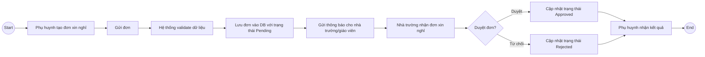
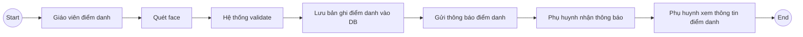
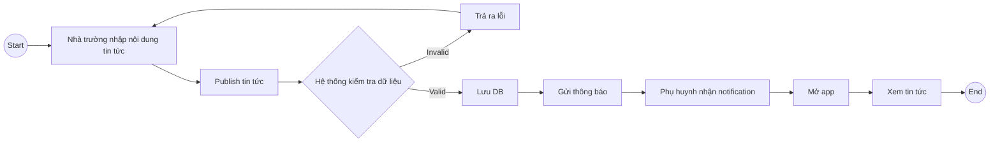

# BRD

## Parent mobile app

Business Requirements Document

Version: 0.9 Draft

Author: Bùi Ngọc Sơn

Date: 14-07-2026

## Mục lục

## NHẬT KÝ THAY ĐỔI (CHANGE LOG)

| Version | Ngày | Nội dung thay đổi | Người sửa |
| --- | --- | --- | --- |
| 0.1 | 14-07-2026 | Bản BRD draft ban đầu | Bùi Ngọc Sơn |
| 0.2 | 16-07-2026 | Sửa lỗi RACI (2 Accountable cùng 1 dòng); tách RACI thành 2 bảng (Vận hành nghiệp vụ / Hoạt động dự án); sửa Success Criteria bị trùng lặp (BR-003, BR-004); bổ sung bảng Yêu cầu nghiệp vụ theo chức năng (traceability); bổ sung Business Rule về dữ liệu khuôn mặt; thêm cột Likelihood cho bảng Rủi ro; thêm mục Câu hỏi mở cần làm rõ với stakeholder; điền TBD cho các ô Tên còn trống |  |
| 0.3 | 16-07-2026 | Bổ sung mục 4.3 Traceability Matrix (khung skeleton) liên kết BR → BRF → FR/US/TC, gồm cả 2 dòng yêu cầu cross-cutting (Bảo mật, Notification); các cột FR/US/TC sẽ điền dần ở giai đoạn SRS/Backlog/Test |  |
| 0.4 | 16-07-2026 | Tách lại mục 4.2: đổi "BRF (Function-level Business Requirement)" thành "SR (Stakeholder Requirement)" — viết theo giọng NHU CẦU thay vì giọng giải pháp/chức năng, đúng chuẩn phân tầng BABOK (BR → SR → FR); cập nhật Traceability Matrix theo (cột "Mã BRF" → "Mã SR") |  |
| 0.5 | 16-07-2026 | Đồng bộ hoá xác nhận công nghệ "Quét khuôn mặt" (face recognition) xuyên suốt tài liệu — Business Rule, Rủi ro, As-is/To-be, Phạm vi dự án; đánh dấu câu hỏi liên quan trong Open Questions là đã trả lời |  |
| 0.6 | 16-07-2026 | Mở rộng SR-04 (Điểm danh) gộp thêm nhu cầu thống kê chuyên cần theo thời gian (phát hiện khi rà lại nguyên văn elicitation gốc); thêm BRULE-018 về nội dung thông báo điểm danh (ảnh, giờ vào, địa điểm, giáo viên); làm rõ "thông tin giáo viên" là 1 phần nội dung thông báo chứ không phải mục riêng; thêm câu hỏi mở về "địa điểm điểm danh" và 3 mục còn treo lửng (quản lý lớp, tin tức, nhắn tin) |  |
| 0.7 | 16-07-2026 | Chốt "địa điểm điểm danh" = tên lớp + toạ độ GPS (cập nhật BRULE-018, SR-04); xử lý dứt điểm 3 mục treo lửng từ elicitation gốc — thêm "Tin tức" vào Trong phạm vi (SR-07, BRULE-019), xác nhận "Tương tác nhắn tin" vào Ngoài phạm vi, xác nhận "Quản lý lớp" đã đáp ứng gián tiếp qua BRULE-018 |  |
| 0.8 | 16-07-2026 | Rà soát 2 chiều Traceability Matrix (BR→SR và ngược lại): bổ sung dòng cross-cutting còn thiếu cho BR-005 (Hiệu năng/Performance) và BRULE-013 (Toàn vẹn dữ liệu); gộp BRULE-014 (Audit Log) vào dòng Bảo mật; ghi chú rõ BR-008 (CSAT) cố ý không có dòng traceability vì là chỉ số tổng hợp |  |
| 0.9 | 16-07-2026 | Rà soát toàn diện, đối chiếu chéo giữa các mục: thêm vai trò Business Analyst vào bảng Stakeholder; thêm dòng RACI cho Tin tức; bổ sung As-is/To-be cho Tin tức (trước đó thiếu hoàn toàn); bổ sung "thống kê chuyên cần" vào As-is/To-be Điểm danh cho khớp với SR-04; thêm rủi ro về dữ liệu vị trí GPS; thêm giả định về thiết bị giáo viên (camera + GPS); thêm KPI cho Tin tức |  |

## Mục Lục

## Thuật ngữ viết tắt

| Kí hiệu | Ý nghĩa | Mô tả |
| --- | --- | --- |
| R | Responsible | Người làm trực tiếp |
| A | Accountable | Người chịu trách nhiệm cuối cùng (chốt) |
| C | Consulted | Người cần hỏi ý kiến |
| I | Informed | Người cần được cập nhật |

## Bối cảnh và mục tiêu

## Bối cảnh

Hiện tại, việc kết nối thông tin giữa nhà trường và phụ huynh còn rời rạc, thiếu tính tức thời. Dự án phát triển Ứng dụng Phụ huynh (Parent App) nhằm số hóa toàn diện quy trình tương tác, quản lý thông tin học tập, chuyên cần và tài chính của học sinh. Qua đó, tối ưu hóa trải nghiệm người dùng và nâng cao sợi dây liên kết giữa Gia đình - Nhà trường.

## Mục tiêu

- Số hóa & Tự động hóa: Giảm thiểu quy trình thủ công trong việc gửi thông báo, quản lý chuyên cần, học phí và duyệt đơn từ.

- Tăng cường tương tác: Xây dựng kênh giao tiếp trực tiếp, tức thời (real-time) giữa phụ huynh và giáo viên/nhà trường.

- Nâng cao trải nghiệm khách hàng (CX): Cung cấp một nền tảng tập trung duy nhất (All-in-one) giúp phụ huynh dễ dàng đồng hành và theo sát mọi hoạt động của con tại trường.

## Phạm vi dự án

## Trong phạm vi

- Sổ liên lạc

- Thời khoá biểu

- Xem hạn đóng học phí và trạng thái thanh toán

- ● Theo dõi điểm danh học sinh (bao gồm xác thực bằng nhận diện khuôn mặt — face recognition)

- Xem lịch sử đăng ký khóa học

- Gửi và theo dõi đơn xin nghỉ học

- Tin tức / thông báo chung từ nhà trường (sự kiện, thông báo toàn trường)

## Ngoài phạm vi

- Không hỗ trợ thanh toán học phí online

- Không cho phép chỉnh sửa dữ liệu điểm danh

- Không hỗ trợ tương tác nhắn tin 2 chiều (chat) giữa phụ huynh và giáo viên trong giai đoạn này

## Stakeholder

## Định danh các bên liên quan

| Vai trò | Tên | Trách nhiệm |
| --- | --- | --- |
| PM |  | Chủ trì khảo sát nghiệp vụ, quản lý tiến độ và chất lượng sản phẩm. |
| Business Analyst |  | Thu thập, phân tích, tài liệu hoá yêu cầu; cấu nối giữa nghiệp vụ và kỹ thuật |
| School Admin |  | Chủ quản hệ thống, cung cấp quy trình nghiệp vụ gốc và phê duyệt đầu ra. |
| Teacher |  | Người dùng vận hành hệ thống ở góc độ quản lý lớp học. |
| Parent |  | Người dùng cuối sử dụng ứng dụng di động để theo dõi và tương tác. |
| Dev |  | Đội ngũ kỹ thuật lập trình ứng dụng. |
| QA |  | Đội ngũ kiểm thử và đảm bảo chất lượng phần mềm. |

## Ma trận phân công trách nhiệm (Role Matrix - RACI)

### Vận hành nghiệp vụ (Business Process)

| Hành động | School Admin | Teacher | Parent |
| --- | --- | --- | --- |
| Cung cấp & cập nhật Sổ liên lạc | A | R | I |
| Cung cấp & cập nhật Thời khoá biểu | A/R | C | I |
| Cung cấp thông tin học phí | A/R | I | I |
| Thực hiện điểm danh học sinh | C | A/R | I |
| Gửi đơn xin nghỉ học | I | I | R |
| Duyệt đơn xin nghỉ học | C | A/R | I |
| Quản lý danh mục lớp/học sinh (dữ liệu nền) | A/R | C | I |
| Đăng & quản lý Tin tức | A/R | I | I |

### Hoạt động dự án (Project Activites)

| Hoạt động dự án | PM | School Admin | BA | Dev | QA |
| --- | --- | --- | --- | --- | --- |
| Chốt yêu cầu nghiệp vụ (BRD) | A | C | R | I | I |
| Phân tích & thiết kế chi tiết (SRS) | A | C | R | C | I |
| Phát triển hệ thống | A | I | C | R | I |
| Kiểm thử hệ thống (Testing/UAT) | A | C | C | C | R |
| Release / Deploy | A | I | I | R | C |
| Đào tạo & bàn giao | A | C | R | I | I |

## Business Requirements

## Mục tiêu nghiệp vụ tổng thể (Strategic Business Objectives)

| Mã YC | Mô tả | Ưu tiên | Success Criteria |
| --- | --- | --- | --- |
| BR-001 | Cung cấp cho phụ huynh khả năng theo dõi thông tin học tập, chuyên cần và sinh hoạt của học sinh | Must | ≥ 80% phụ huynh truy cập ứng dụng ít nhất 1 lần/tuần |
| BR-002 | Đảm bảo thông tin từ nhà trường đến phụ huynh được cập nhật kịp thời và chính xác | Must | ≥ 95% dữ liệu được cập nhật đúng hạn |
| BR-003 | Giúp phụ huynh chủ động quản lý lịch học và các hoạt động của học sinh | Must | ≥ 70% phụ huynh sử dụng tính năng xem lịch mỗi tuần |
| BR-004 | Giảm sự phụ thuộc vào các phương thức liên lạc thủ công (sổ giấy, gọi điện, tin nhắn rời rạc) | Must | Giảm ≥ 50% tương tác qua điện thoại/Zalo trong 2 tháng đầu triển khai |
| BR-005 | Cung cấp trải nghiệm truy cập thông tin nhanh chóng, thuận tiện trên thiết bị di động | Must | Thời gian truy cập thông tin < 3 giây / màn hình |
| BR-006 | Đảm bảo tính bảo mật và phân quyền dữ liệu người dùng | Must | 0 sự cố rò rỉ dữ liệu; 100% user chỉ truy cập đúng dữ liệu |
| BR-007 | Tăng tính minh bạch trong việc theo dõi tình trạng học tập và chuyên cần của học sinh | Must | ≥ 90% phụ huynh đánh giá hài lòng về độ minh bạch |
| BR-008 | Tăng mức độ hài lòng của phụ huynh đối với dịch vụ của nhà trường | Should | CSAT (Customer Satisfaction Score) ≥ 4.0/5 sau 6 tháng triển khai |

## Stakeholder requirement - SR (Yêu cầu của các bên liên quan)

SR trả lời câu hỏi "Bên liên quan CẦN GÌ" để đạt được outcome ở mục 4.1 — vẫn là NHU CẦU, chưa mô tả giải pháp/màn hình/thao tác cụ thể trên hệ thống (phần đó thuộc về Functional Requirement, sẽ viết ở SRS).

| Mã | Yêu cầu của bên liên quan | Chức năng liên quan | Liên kết BR | Ưu tiên |
| --- | --- | --- | --- | --- |
| SR-01 | Phụ huynh cần nắm bắt tình hình học tập và sinh hoạt hàng ngày của con một cách tập trung, kịp thời — thay vì phụ thuộc vào trao đổi rời rạc qua giấy/tin nhắn/nhóm chat | Sổ liên lạc | BR-001, BR-004 | Must |
| SR-02 | Phụ huynh cần nắm được lịch học của con để chủ động sắp xếp việc đưa đón và hỗ trợ học tập tại nhà | Thời khoá biểu | BR-001, BR-003 | Must |
| SR-03 | Phụ huynh cần biết rõ nghĩa vụ tài chính (số tiền, hạn đóng, trạng thái) để chủ động thanh toán đúng hạn | Học phí | BR-001, BR-002 | Must |
| SR-04 | Phụ huynh cần được thông báo real-time khi con điểm danh — kèm ảnh chụp tại thời điểm điểm danh, giờ vào lớp, địa điểm điểm danh, và giáo viên thực hiện — để yên tâm và kịp thời phản ứng nếu có bất thường; đồng thời cần xem được thống kê chuyên cần (số buổi đi học/vắng) theo tuần/tháng để nắm xu hướng tổng thể, không chỉ theo từng buổi riêng lẻ | Điểm danh | BR-001, BR-007 | Must |
| SR-05 | Phụ huynh cần theo dõi được quá trình học tập của con qua các khoá học đã tham gia | Lịch sử đăng ký | BR-001 | Should |
| SR-06 | Phụ huynh cần một kênh chính thức, minh bạch để xin nghỉ học cho con và biết được kết quả xử lý — thay vì gọi điện/nhắn tin không có xác nhận rõ ràng | Xin nghỉ | BR-001, BR-004, BR-007 | Must |
| SR-07 | Phụ huynh cần được cập nhật tin tức/thông báo chung từ nhà trường (sự kiện, thông báo toàn trường) để không bỏ lỡ thông tin ngoài phạm vi cá nhân học sinh | Tin tức | BR-001, BR-002 | Should |

## Business Rule

| Mã Rule | Mô tả | Áp dụng cho |
| --- | --- | --- |
| BRULE-001 | Phụ huynh chỉ được phép xem dữ liệu của học sinh thuộc quyền quản lý của mình | Toàn hệ thống |
| BRULE-002 | Thông tin điểm danh chỉ được tạo và cập nhật bởi giáo viên | Điểm danh |
| BRULE-003 | Phụ huynh không được phép chỉnh sửa dữ liệu điểm danh | Điểm danh |
| BRULE-004 | Mỗi bản ghi điểm danh phải gắn với một học sinh, một lớp và một ngày học cụ thể | Điểm danh |
| BRULE-005 | Phụ huynh có thể gửi đơn xin nghỉ trước hoặc sau ngày nghỉ tối đa X ngày (configurable) | Xin nghỉ |
| BRULE-006 | Đơn xin nghỉ phải bao gồm tối thiểu: ngày nghỉ và lý do | Xin nghỉ |
| BRULE-007 | Mỗi đơn xin nghỉ phải có trạng thái: Pending / Approved / Rejected | Xin nghỉ |
| BRULE-008 | Chỉ giáo viên phụ trách lớp mới có quyền duyệt đơn xin nghỉ | Xin nghỉ |
| BRULE-009 | Thông tin học phí phải hiển thị đầy đủ: số tiền, hạn đóng, trạng thái | Học phí |
| BRULE-010 | Hệ thống không hỗ trợ thanh toán học phí online trong giai đoạn hiện tại | Học phí |
| BRULE-011 | Thời khoá biểu phải được hiển thị theo đúng lớp học của học sinh | Thời khoá biểu |
| BRULE-012 | Phụ huynh chỉ có quyền xem, không được chỉnh sửa thời khoá biểu | Thời khoá biểu |
| BRULE-013 | Mỗi học sinh phải thuộc ít nhất một lớp học hợp lệ trong hệ thống | Toàn hệ thống |
| BRULE-014 | Hệ thống phải ghi nhận lịch sử các thay đổi quan trọng (audit log) | Toàn hệ thống |
| BRULE-015 | Thông báo phải được gửi đến phụ huynh khi có thay đổi liên quan đến học sinh | Notification |
| BRULE-016 | Dữ liệu khuôn mặt học sinh dùng cho điểm danh (áp dụng nhận diện khuôn mặt) phải được xử lý tuân thủ quy định bảo vệ dữ liệu trẻ em; ưu tiên lưu ở dạng mã hoá (embedding), hạn chế lưu ảnh gốc nếu không cần thiết | Điểm danh / Bảo mật |
| BRULE-017 | Phụ huynh phải đồng ý (consent) trước khi dữ liệu khuôn mặt của con được thu thập và sử dụng cho mục đích điểm danh | Điểm danh / Bảo mật |
| BRULE-018 | Thông báo điểm danh gửi đến phụ huynh phải bao gồm tối thiểu: ảnh chụp tại thời điểm điểm danh, giờ vào lớp, địa điểm điểm danh (gồm cả tên lớp học và toạ độ GPS tại thời điểm điểm danh), và tên giáo viên thực hiện điểm danh | Điểm danh / Notification |
| BRULE-019 | Nội dung Tin tức chỉ được đăng bởi School Admin; phụ huynh chỉ có quyền xem, không được chỉnh sửa hoặc bình luận (do "tương tác nhắn tin" đã xác nhận ngoài phạm vi ở giai đoạn này) | Tin tức |

## Traceability Matrix (Khung ban đầu - Skeleton)

Traceability Matrix theo dõi mối liên kết xuyên suốt 4 tầng: Business Requirement → Stakeholder Requirement → Functional Requirement (SRS) → User Story → Test Case — đảm bảo không yêu cầu nào bị bỏ sót khi chuyển từ BRD sang SRS, Backlog, rồi đến kiểm thử, và giúp đánh giá nhanh phạm vi ảnh hưởng khi có Change Request.

Ở giai đoạn BRD, mới chỉ có tầng BR và SR — nên các cột Functional Requirement, User Story, Test Case dưới đây được để dạng khung (chưa có nội dung). Bảng sẽ được nối dài dần khi dự án đi qua từng giai đoạn: điền cột FR khi viết SRS, điền US khi lên Backlog, điền TC khi QA viết test case.

| BR liên quan | Mã SR | Functional Requirement (SRS) | User Story | Test Case |
| --- | --- | --- | --- | --- |
| BR-001, BR-004 | SR-01 — Sổ liên lạc | (Bổ sung ở giai đoạn SRS) | (Bổ sung ở giai đoạn Backlog) | (Bổ sung ở giai đoạn Test) |
| BR-001, BR-003 | SR-02 — Thời khoá biểu | (Bổ sung ở giai đoạn SRS) | (Bổ sung ở giai đoạn Backlog) | (Bổ sung ở giai đoạn Test) |
| BR-001, BR-002 | SR-03 — Học phí | (Bổ sung ở giai đoạn SRS) | (Bổ sung ở giai đoạn Backlog) | (Bổ sung ở giai đoạn Test) |
| BR-001, BR-007 | SR-04 — Điểm danh | (Bổ sung ở giai đoạn SRS) | (Bổ sung ở giai đoạn Backlog) | (Bổ sung ở giai đoạn Test) |
| BR-001 | SR-05 — Lịch sử đăng ký | (Bổ sung ở giai đoạn SRS) | (Bổ sung ở giai đoạn Backlog) | (Bổ sung ở giai đoạn Test) |
| BR-001, BR-004, BR-007 | SR-06 — Xin nghỉ | (Bổ sung ở giai đoạn SRS) | (Bổ sung ở giai đoạn Backlog) | (Bổ sung ở giai đoạn Test) |
| BR-001, BR-002 | SR-07 — Tin tức | (Bổ sung ở giai đoạn SRS) | (Bổ sung ở giai đoạn Backlog) | (Bổ sung ở giai đoạn Test) |
| BR-006 (cross-cutting) | Bảo mật, phân quyền & Audit Log (BRULE-001, 014, 016, 017) | (Bổ sung ở giai đoạn SRS) | (Bổ sung ở giai đoạn Backlog) | (Bổ sung ở giai đoạn Test) |
| BR-002 (cross-cutting) | Notification (BRULE-015) | (Bổ sung ở giai đoạn SRS) | (Bổ sung ở giai đoạn Backlog) | (Bổ sung ở giai đoạn Test) |
| BR-005 (cross-cutting) | Hiệu năng / Performance (NFR — thời gian tải <3 giây/màn hình, áp dụng mọi chức năng) | (Bổ sung ở giai đoạn SRS) | (Bổ sung ở giai đoạn Backlog) | (Bổ sung ở giai đoạn Test) |
| (không gắn 1 BR cụ thể) | Toàn vẹn dữ liệu học sinh/lớp (BRULE-013 — nền tảng dữ liệu cho mọi chức năng) | (Bổ sung ở giai đoạn SRS) | (Bổ sung ở giai đoạn Backlog) | (Bổ sung ở giai đoạn Test) |

## Quy trình nghiệp vụ (As-is/To-be)

## Quy trình hiện tại

- Xin nghỉ

- Phụ huynh thông báo xin nghỉ qua:

- Gọi điện trực tiếp cho giáo viên

- Nhắn tin qua Zalo / SMS

- Giáo viên ghi nhận thủ công

- Nhà trường không có hệ thống lưu trữ tập trung

- Khó theo dõi lịch sử và trạng thái đơn

=> Vấn đề:

- Dễ thất lạc thông tin

- Không minh bạch trạng thái (đã duyệt hay chưa)

- Không có lịch sử

- Điểm danh:

- Giáo viên điểm danh bằng:

- Sổ giấy hoặc file excel

- Không có ảnh xác thực

- Phụ huynh không được cập nhật real-time

=> Vấn đề:

- Thiếu minh bạch

- Phụ huynh không biết con đã đến lớp chưa

- Dễ sai sót

- Học phí:

Nhà trường thông báo qua giấy/tin nhắn, phụ huynh tự ghi nhớ hạn đóng.

=> Vấn đề:

- Dễ quên deadline

- Không có hệ thống nhắc nhở

- Sổ liên lạc và thời khoá biểu

Thông tin rời rạc qua giấy, nhóm chat — không có hệ thống tập trung.

=> Vấn đề:

- Khó tra cứu

- Thông tin không đồng bộ

- Tin tức

Nhà trường thông báo tin tức/sự kiện qua bảng tin dán tại trường, loa phát thanh, hoặc nhóm chat phân tán theo từng lớp.

=> Vấn đề:

- Khó tra cứu

- Thông tin không đồng bộ

## Quy trình tương lai

- Xin nghỉ

- Phụ huynh tạo đơn trực tiếp qua app

- Hệ thống:

- Validate dự liệu

- Lưu trữ tập trung

- Gửi thông báo cho nhà trường

- Nhà trường duyệt / từ chối trên hệ thống

- Phụ huynh nhận kết quả trên app

=> Lợi ích:

- Minh bạch trạng thái

- Có lịch sử

- Giảm phụ thuộc vào trao đổi thủ công

<!-- Ảnh gốc: media/BRD_image_01.png -->

Sơ đồ BPMN — Quy trình "Xin nghỉ" (To-Be)

- Điểm danh:

- Giáo viên điểm danh trên hệ thống bằng nhận diện khuôn mặt (face recognition)

- Hệ thống lưu dữ liệu và gửi thông báo cho phụ huynh

- Phụ huynh xem được thống kê chuyên cần (số buổi đi học/vắng) theo tuần/tháng

=> Lợi ích:

- Phụ huynh biết được tình trạng đi học

- Tăng độ tin cậy nhờ xác thực bằng nhận diện khuôn mặt, giảm sai sót do ghi nhận thủ công

- Phụ huynh nắm được xu hướng chuyên cần tổng thể, không chỉ từng buổi riêng lẻ

<!-- Ảnh gốc: media/BRD_image_02.png -->

Sơ đồ BPMN — Quy trình "Điểm danh" (To-Be)

- Học phí:

- Phụ huynh xem hạn đóng học phí và trạng thái

=> Lợi ích:

- Giảm quên hẹn

- Theo dõi dễ dàng

- Sổ liên lạc và thời khoá biểu

- Hiển thị tập trung trên app, cập nhật từ hệ thống nhà trường

=> Lợi ích:

- Dễ tra cứu

- Thông tin đồng nhất

- Tin tức

- Hiệu trưởng/giáo viên đăng tin tức

- Phụ huynh nhận thông báo và xem trực tiếp trên app

=> Lợi ích:

- Tiếp cận thông tin nhanh, đồng đều cho mọi phụ huynh

- Không phụ thuộc vào việc có mặt tại trường hay theo dõi đúng nhóm chat

<!-- Ảnh gốc: media/BRD_image_03.png -->

- Lịch sử khoá học

- Phụ huynh xem lại các khoá học đã đăng ký

=> Lợi ích:

- Theo dõi quá trình học

## Giả định (Assumptions)

Các giả định sau được đưa ra trong quá trình xây dựng tài liệu:

- Người dùng (phụ huynh, giáo viên) có thiết bị di động và kết nối Internet ổn định

- Phụ huynh đã được cấp tài khoản và liên kết với học sinh

- Dữ liệu học sinh, lớp học, thời khóa biểu được cung cấp đầy đủ từ hệ thống nhà trường

- Giáo viên thực hiện điểm danh đầy đủ và đúng thời gian trên hệ thống

- Nhà trường có quy trình nội bộ để duyệt đơn xin nghỉ học

- Thông báo (notification) có thể được gửi qua mobile app

## Rủi ro

| Rủi ro | Khả năng xảy ra | Ảnh hưởng | Giải pháp |
| --- | --- | --- | --- |
| Dữ liệu điểm danh không được cập nhật kịp thời | Trung bình | Cao | Quy định thời gian điểm danh (SLA) + nhắc nhở giáo viên |
| Thông báo (notification) gửi chậm hoặc thất bại | Trung bình | Trung bình | Cơ chế retry + logging + monitoring |
| Phụ huynh không sử dụng ứng dụng thường xuyên | Cao | Trung bình | Hướng dẫn sử dụng + push notification |
| Dữ liêụ từ nhà trường không đồng bộ | Trung bình | Cao | Kiểm tra và đồng bộ dữ liệu định kỳ |
| Lỗi hệ thống / downtime | Thấp | Cao | Triển khai monitoring + backup |
| Rủi ro pháp lý/quyền riêng tư khi thu thập dữ liệu khuôn mặt trẻ em nếu áp dụng nhận diện khuôn mặt | Trung bình | Cao | Xác nhận rõ yêu cầu với stakeholder; xin tư vấn pháp lý; xây dựng cơ chế consent rõ ràng cho phụ huynh |
| Rủi ro quyền riêng tư khi thu thập dữ liệu vị trí (GPS) của học sinh qua thiết bị giáo viên | Trung bình | Trung bình | Chỉ lưu GPS tại thời điểm điểm danh (không theo dõi liên tục); nêu rõ trong chính sách bảo mật/consent cùng với dữ liệu khuôn mặt |

## Tiêu chí thành công (KPI)

- Giảm ≥ 50% việc trao đổi thủ công (gọi điện / tin nhắn) trong 2 tháng đầu

- ≥ 70% phụ huynh sử dụng ứng dụng hàng tháng

- ≥ 80% phụ huynh xem thông tin điểm danh

- 100% đơn xin nghỉ được xử lý trên hệ thống

- Thời gian xử lý đơn xin nghỉ < 24 giờ

- Tỷ lệ dữ liệu điểm danh chính xác ≥ 95%

## Phê duyệt

| Vai trò | Tên | Ngày |
| --- | --- | --- |
| Sponsor |  |  |
| Product Owner |  |  |
| Project Manager |  |  |
| Business Analyst |  |  |
| School Representative |  |  |
