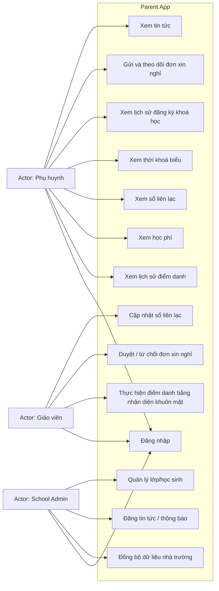
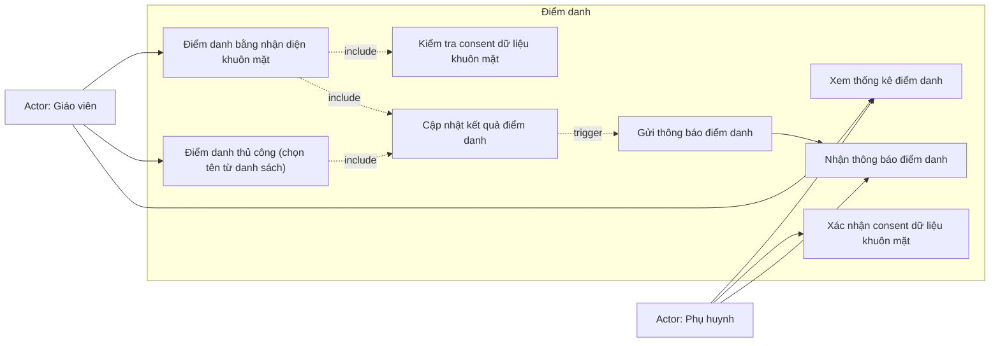
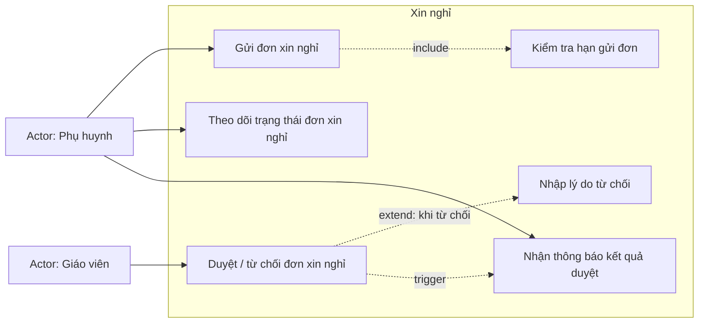
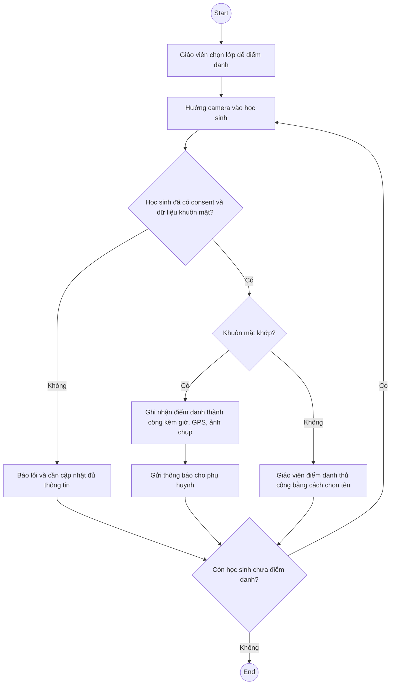
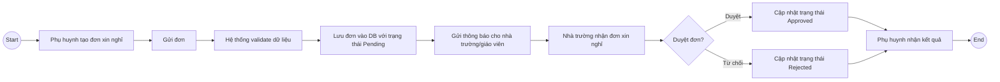
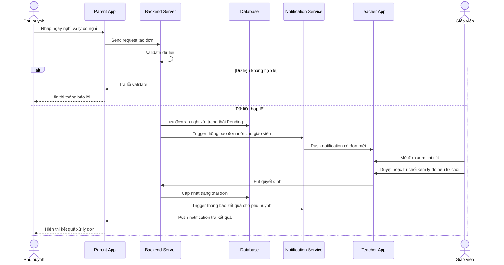
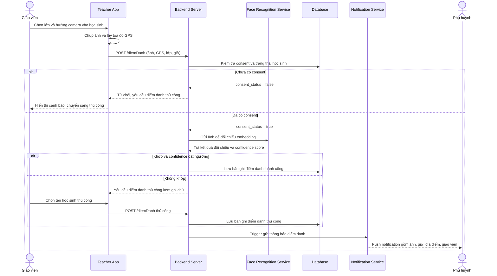

# SRS

## Parent mobile app

Software Requirements Specification

Version: 1.6 Draft

Author: Bùi Ngọc Sơn

Date: 14-07-2026

## NHẬT KÝ THAY ĐỔI (CHANGE LOG)

| Version | Ngày | Nội dung | Người thực hiện |
| --- | --- | --- | --- |
| 1.0 | 22-07-2026 | Bản đầu tiên — chuyển 19 Functional Requirement (FR) trong SRS v1.6 thành 19 User Story (tỷ lệ 1:1), sắp xếp vào 5 Sprint theo dependency, kèm Acceptance Criteria (Given-When-Then) cho từng story | Sơn |
| 1.1 | 23-07-2026 | Tách Acceptance Criteria ra file riêng (Parent-App-Acceptance-Criteria-v1.1.docx). File này chỉ còn User Story + metadata + DoD bổ sung, giữ mã liên kết AC-XX để truy vết. | Sơn |

## Mục Lục

## Giới thiệu

## Mục đích tài liệu

Tài liệu này đặc tả chi tiết các yêu cầu chức năng (Functional Requirement) và phi chức năng (Non-Functional Requirement) của hệ thống Parent Mobile App, dựa trên các Stakeholder Requirement (SR-01 → SR-07) đã được xác nhận trong Business Requirements Document (BRD).

Đối tượng đọc chính: Developer, Tester/QA, Technical Lead — những người trực tiếp thiết kế, xây dựng và kiểm thử hệ thống.

## Phạm vi hệ thống

Hệ thống Parent App hỗ trợ phụ huynh:

- Theo dõi thông tin điểm danh học sinh

- Nhận thông báo từ nhà trường

- Gửi yêu cầu xin nghỉ học

Trong phạm vi:

- Sổ liên lạc

- Thời khoá biểu

- Hạn học phí

- Điểm danh học sinh

- Lịch sử đăng ký khoá học

- Xin nghỉ học

Ngoài phạm vi:

- Thanh toán online

- Chỉnh sửa điểm danh

- Chat realtime

## Định nghĩa

| Thuật ngữ | Mô tả |
| --- | --- |
| SR | Stakeholder Requirement — yêu cầu của bên liên quan, định nghĩa ở BRD |
| FR | Functional Requirement — yêu cầu chức năng, đặc tả chi tiết ở tài liệu này |
| NFR | Non-Functional Requirement — yêu cầu phi chức năng (hiệu năng, bảo mật...) |
| Face Recognition | Nhận diện khuôn mặt — công nghệ AI đối chiếu danh tính qua khuôn mặt, dùng cho điểm danh |
| Consent | Sự đồng ý của phụ huynh trước khi hệ thống thu thập dữ liệu sinh trắc học (khuôn mặt) của học sinh |
| Push Notification | Thông báo đẩy đến ứng dụng di động của phụ huynh |
| Embedding | Dữ liệu khuôn mặt được mã hoá thành vector số học, không lưu ảnh gốc, phục vụ đối chiếu nhận diện |

## Tài liệu tham chiếu

- Business Requirements Document (BRD) — Parent App, v0.9

- Quy trình nhà trường (Trong sản phẩm này không có)

## Mô tả tổng quan

## Bối cảnh sản phẩm

Parent Mobile App là ứng dụng di động độc lập, kết nối với hệ thống quản lý của nhà trường (Vclassio) để lấy dữ liệu học sinh, lớp học, thời khóa biểu và đồng bộ dữ liệu điểm danh, học phí. Ứng dụng phục vụ 2 nhóm người dùng chính: phụ huynh (xem thông tin, tương tác) và giáo viên/School Admin (nhập liệu, quản lý nội dung).

## Nhóm người dùng (User Classes)

| Nhóm người dùng | Mô tả | Chức năng sử dụng chính |
| --- | --- | --- |
| Phụ huynh (Parent) | Người dùng cuối trên ứng dụng di động | Xem sổ liên lạc, thời khoá biểu, học phí, điểm danh, lịch sử đăng ký, tin tức; gửi đơn xin nghỉ |
| Giáo viên (Teacher) | Người dùng vận hành ở cấp lớp học | Điểm danh học sinh; duyệt/từ chối đơn xin nghỉ; cập nhật nội dung sổ liên lạc |
| School Admin | Người quản trị hệ thống ở cấp trường | Quản lý danh mục lớp/học sinh; đăng tin tức; cấu hình Business Rule |

## Giả định và ràng buộc kỹ thuật

- Ứng dụng phát triển dạng mobile app (iOS & Android), không phải web app — theo ngữ cảnh BRD gọi là "ứng dụng di động"

- Thiết bị giáo viên dùng để điểm danh cần có camera (cho nhận diện khuôn mặt) và định vị GPS hoạt động ổn định

- Hệ thống phụ thuộc vào việc tích hợp dữ liệu từ Vclassio hiện có của nhà trường

## Sơ đồ hệ thống (Diagrams)

Phần này cung cấp góc nhìn trực quan bổ sung cho các đặc tả văn bản tại mục 4 (Functional Requirements) và mục 6 (Data Requirements).

## Use Case Diagram (Tổng quan)

Sơ đồ dưới đây thể hiện ở mức Stakeholder Requirement (SR) — mỗi use case tương ứng với 1 SR trong BRD, không tách theo từng FR chi tiết để tránh sơ đồ quá rối. 3 nhóm actor: phụ huynh, giáo viên, School Admin.

<!-- Ảnh gốc: media/SRS_image_01.png -->

Hình 1 — Use Case Diagram tổng quan hệ thống Parent App

## Use Case Diagram chi tiết - Điểm danh

<!-- Ảnh gốc: media/SRS_image_02.png -->

Hình 2 — Use Case Diagram chi tiết nhóm Điểm danh

## Use Case Diagram chi tiết - Xin nghỉ

<!-- Ảnh gốc: media/SRS_image_03.png -->

Hình 3 — Use Case Diagram chi tiết nhóm Xin nghỉ

## Activity Diagram - Điểm danh (Chi tiết)

<!-- Ảnh gốc: media/SRS_image_04.png -->

Hình 4 — Activity Diagram chi tiết luồng Điểm danh (bao gồm nhánh Consent)

## Sơ đồ quy trình Xin nghỉ (Tham chiếu từ BRD)

<!-- Ảnh gốc: media/SRS_image_05.png -->

Hình 5 — Sơ đồ BPMN Quy trình Xin nghỉ (tham chiếu từ BRD)

## Sequence Diagram xin nghỉ

<!-- Ảnh gốc: media/SRS_image_06.png -->

Hình 6 — Sequence Diagram: Gửi & Duyệt đơn xin nghỉ

## Sequence Diagram danh

<!-- Ảnh gốc: media/SRS_image_07.png -->

Hình 7 — Sequence Diagram: Điểm danh bằng nhận diện khuôn mặt

## Yêu cầu chức năng (Functional Requirements)

Mỗi Functional Requirement (FR) dưới đây cụ thể hóa 1 Stakeholder Requirement (SR) tương ứng trong BRD. Mã FR theo định dạng FR-[số SR].[số thứ tự] — ví dụ FR-01.1 là FR đầu tiên phục vụ SR-01.

## Sổ liên lạc

### FR-01.1 — Xem sổ liên lạc

| Mô tả | Phụ huynh có thể xem nội dung sổ liên lạc của con, được giáo viên/School Admin cập nhật, hiển thị theo thứ tự thời gian (mới nhất lên đầu). |
| --- | --- |
| Actor | Parent |
| Pre-condition | Phụ huynh đã đăng nhập thành công; học sinh đã được liên kết với tài khoản phụ huynh |
| Input | Không có (hệ thống tự lấy theo học sinh liên kết với tài khoản) |
| Validation | Không áp dụng (thao tác chỉ đọc — read-only) |
| Output | Danh sách nội dung sổ liên lạc: ngày, nội dung, người cập nhật (tên giáo viên) |
| Post-condition | Không có thay đổi dữ liệu hệ thống (read-only) |
| Business Rule áp dụng | BRULE-001 (phụ huynh chỉ xem dữ liệu học sinh của mình) |
| Luồng chính | 1. Phụ huynh mở màn hình Sổ liên lạc 2. Hệ thống lấy dữ liệu theo học sinh liên kết với tài khoản đang đăng nhập 3. Hệ thống hiển thị danh sách theo thời gian giảm dần |
| Luồng ngoại lệ | Nếu chưa có nội dung nào, hiển thị màn hình trống kèm thông báo "Chưa có thông tin sổ liên lạc" |
| Ưu tiên | Must |

### FR-01.2 — Giáo viên/School Admin cập nhật nội dung sổ liên lạc

| Mô tả | Giáo viên hoặc School Admin có thể thêm nội dung mới vào sổ liên lạc cho 1 học sinh hoặc cả lớp. |
| --- | --- |
| Actor | Teacher, School Admin |
| Pre-condition | Giáo viên/School Admin đã đăng nhập; đã chọn được học sinh hoặc lớp hợp lệ thuộc quyền quản lý |
| Input | Học sinh/lớp áp dụng, nội dung văn bản (bắt buộc), ảnh đính kèm (tuỳ chọn) |
| Validation | Nội dung văn bản không được để trống, tối đa 1000 ký tự; nếu có ảnh đính kèm: định dạng JPG/PNG, dung lượng tối đa 5MB |
| Output | Bản ghi sổ liên lạc mới được lưu, phụ huynh liên quan nhận được thông báo |
| Post-condition | 1 bản ghi SoLienLac mới được tạo với trạng thái đã lưu; thông báo được đưa vào hàng đợi gửi cho phụ huynh liên quan |
| Business Rule áp dụng | BRULE-015 (thông báo phải được gửi khi có thay đổi liên quan đến học sinh) |
| Luồng chính | 1. Giáo viên chọn học sinh/lớp 2. Nhập nội dung, đính kèm ảnh nếu cần 3. Nhấn Lưu 4. Hệ thống lưu bản ghi và gửi thông báo cho phụ huynh liên quan |
| Luồng ngoại lệ | Nếu nội dung để trống hoặc ảnh sai định dạng/quá dung lượng, hệ thống chặn lưu và hiển thị thông báo lỗi validate tương ứng |
| Ưu tiên | Must |

## Thời khoá biểu

### FR-02.1 — Xem thời khóa biểu

| Mô tả | Phụ huynh xem thời khóa biểu của con theo đúng lớp học hiện tại, hiển thị theo tuần. |
| --- | --- |
| Actor | Parent |
| Pre-condition | Phụ huynh đã đăng nhập; học sinh đã được gán vào 1 lớp học hợp lệ (theo BRULE-013) |
| Input | Tuần cần xem (mặc định tuần hiện tại) |
| Validation | Tuần chọn phải nằm trong năm học hiện tại — không cho chọn quá xa về quá khứ/tương lai (giá trị giới hạn cụ thể CẦN xác nhận thêm với School Admin) |
| Output | Bảng thời khoá biểu: thứ, tiết học, môn học, giáo viên phụ trách (nếu có) |
| Post-condition | Không có thay đổi dữ liệu (read-only) |
| Business Rule áp dụng | BRULE-011 (hiển thị đúng theo lớp học), BRULE-012 (chỉ xem, không chỉnh sửa) |
| Luồng chính | 1. Phụ huynh mở màn hình Thời khoá biểu 2. Hệ thống lấy lớp học hiện tại của học sinh 3. Hệ thống hiển thị thời khoá biểu tuần hiện tại, cho phép chuyển tuần trước/sau |
| Luồng ngoại lệ | Nếu học sinh chưa được gán lớp hợp lệ (vi phạm BRULE-013), hiển thị thông báo lỗi và ghi log để School Admin xử lý |
| Ưu tiên | Must |

### FR-02.2 — Đồng bộ thời khoá biểu từ hệ thống nhà trường

| Mô tả | Hệ thống đồng bộ dữ liệu thời khóa biểu từ School Management System của nhà trường theo lịch định kỳ hoặc khi có thay đổi. |
| --- | --- |
| Actor | Hệ thống (tự động), School Admin (kích hoạt đồng bộ thủ công nếu cần) |
| Pre-condition | Có kết nối hợp lệ đến hệ thống nguồn (School Management System) — cơ chế cụ thể chưa xác nhận, xem mục 8 |
| Input | Dữ liệu thời khoá biểu từ hệ thống nguồn |
| Validation | Dữ liệu đồng bộ phải đúng định dạng kỳ vọng (lớp học, môn học, giáo viên phải tồn tại và hợp lệ trong hệ thống) trước khi ghi đè dữ liệu cũ |
| Output | Dữ liệu thời khoá biểu được cập nhật trong hệ thống Parent App |
| Post-condition | Dữ liệu ThoiKhoaBieu được cập nhật thành công; nếu đồng bộ thất bại, dữ liệu cũ được giữ nguyên không bị mất |
| Business Rule áp dụng | BRULE-011 |
| Luồng chính | 1. Hệ thống chạy tiến trình đồng bộ theo lịch (VD: mỗi đêm) hoặc School Admin bấm "Đồng bộ ngay" 2. Hệ thống lấy dữ liệu mới nhất từ nguồn 3. Cập nhật vào cơ sở dữ liệu Parent App |
| Luồng ngoại lệ | Nếu đồng bộ thất bại (mất kết nối, dữ liệu nguồn lỗi), hệ thống ghi log lỗi và thông báo cho School Admin — KHÔNG được xoá dữ liệu cũ khi đồng bộ thất bại |
| Ưu tiên | Must |

## Học phí

### FR-03.1 — Xem thông tin học phí

| Mô tả | Phụ huynh xem số tiền, hạn đóng và trạng thái học phí của con. |
| --- | --- |
| Actor | Parent |
| Pre-condition | Phụ huynh đã đăng nhập; có ít nhất 1 khoản học phí được ghi nhận cho học sinh |
| Input | Không có (tự động lấy theo học sinh) |
| Validation | Không áp dụng (read-only) |
| Output | Danh sách khoản học phí: kỳ/tháng áp dụng, số tiền, hạn đóng, trạng thái (Chưa đóng/Đã đóng/Quá hạn) |
| Post-condition | Không có thay đổi dữ liệu (read-only) |
| Business Rule áp dụng | BRULE-009 (hiển thị đầy đủ số tiền/hạn đóng/trạng thái), BRULE-010 (không hỗ trợ thanh toán online) |
| Luồng chính | 1. Phụ huynh mở màn hình Học phí 2. Hệ thống hiển thị danh sách khoản học phí, sắp xếp theo hạn đóng gần nhất lên đầu |
| Luồng ngoại lệ | Nếu quá hạn đóng, hệ thống đánh dấu nổi bật (VD: màu đỏ) dòng tương ứng |
| Ưu tiên | Must |

### FR-03.2 — Nhắc nhở hạn đóng học phí

| Mô tả | Hệ thống gửi thông báo nhắc nhở phụ huynh trước hạn đóng học phí. |
| --- | --- |
| Actor | Hệ thống (tự động) |
| Pre-condition | Có khoản học phí ở trạng thái "Chưa đóng" và còn trong ngưỡng ngày cấu hình trước hạn |
| Input | Cấu hình số ngày nhắc trước hạn (School Admin cấu hình, mặc định gợi ý 3 ngày) |
| Validation | Chỉ gửi nhắc nhở nếu trạng thái khoản học phí = "Chưa đóng"; không gửi trùng quá 1 lần/ngày cho cùng 1 khoản |
| Output | Push notification gửi đến phụ huynh |
| Post-condition | Thông báo được ghi nhận đã gửi (hoặc đưa vào hàng đợi retry nếu thất bại) |
| Business Rule áp dụng | BRULE-015 |
| Luồng chính | 1. Hệ thống quét danh sách khoản học phí sắp đến hạn mỗi ngày 2. Với mỗi khoản trong ngưỡng cấu hình, gửi push notification cho phụ huynh liên quan |
| Luồng ngoại lệ | Nếu khoản học phí đã đóng, không gửi nhắc nhở dù còn trong ngưỡng ngày cấu hình |
| Ưu tiên | Should |

## Điểm danh

### FR-04.1 — Giáo viên điểm danh bằng nhận diện khuôn mặt

| Mô tả | Giáo viên thực hiện điểm danh học sinh thông qua quét khuôn mặt (face recognition) trên thiết bị di động/máy tính bảng. |
| --- | --- |
| Actor | Teacher |
| Pre-condition | Giáo viên đã đăng nhập; đã chọn đúng lớp học đang điểm danh; học sinh đã có consent + dữ liệu khuôn mặt (face_embedding) hợp lệ trong trường hợp điểm danh bằng khuôn mặt |
| Input | Ảnh khuôn mặt học sinh chụp qua camera thiết bị (thời gian thực), lớp học đang điểm danh |
| Validation | Ảnh chụp phải đủ độ sáng/độ nét tối thiểu để đối chiếu; thiết bị phải lấy được toạ độ GPS hợp lệ tại thời điểm chụp; độ tương đồng khuôn mặt (confidence score) phải vượt ngưỡng cấu hình mới tính là khớp |
| Output | Bản ghi điểm danh: học sinh, lớp, ngày giờ, kết quả đối chiếu (thành công/thất bại), ảnh chụp, toạ độ GPS |
| Post-condition | 1 bản ghi DiemDanh được tạo với kết quả xác định (thành công/thủ công/bị chặn); trigger FR-04.2 nếu điểm danh thành công |
| Business Rule áp dụng | BRULE-002 (chỉ giáo viên tạo/cập nhật), BRULE-003 (phụ huynh không sửa được), BRULE-004 (gắn 1 học sinh - 1 lớp - 1 ngày), BRULE-016 (xử lý dữ liệu khuôn mặt tuân thủ bảo vệ trẻ em), BRULE-017 (yêu cầu consent trước khi thu thập) |
| Luồng chính | 1. Giáo viên mở màn hình Điểm danh, chọn lớp 2. Giáo viên hướng camera vào từng học sinh 3. Hệ thống đối chiếu khuôn mặt với dữ liệu embedding đã đăng ký 4. Nếu khớp: hệ thống ghi nhận điểm danh THÀNH CÔNG kèm giờ, GPS, ảnh chụp 5. Hệ thống trigger FR-04.2 (gửi thông báo) |
| Luồng ngoại lệ | 4a. Nếu không nhận diện được (ánh sáng kém, góc chụp xấu, confidence score dưới ngưỡng): hệ thống cho phép giáo viên điểm danh thủ công (chọn tên từ danh sách lớp) kèm ghi chú lý do 4b. Nếu học sinh chưa có dữ liệu khuôn mặt đăng ký (chưa có consent — xem FR-CC.03): hệ thống CHẶN điểm danh bằng khuôn mặt, bắt buộc điểm danh thủ công và cảnh báo School Admin cần thu thập consent |
| Ưu tiên | Must |

### FR-04.2 — Gửi thông báo điểm danh

| Mô tả | Ngay sau khi điểm danh thành công, hệ thống gửi push notification cho phụ huynh với đầy đủ nội dung theo BRULE-018. |
| --- | --- |
| Actor | Hệ thống (tự động, trigger từ FR-04.1) |
| Pre-condition | Đã có 1 bản ghi DiemDanh vừa được tạo (thành công hoặc thủ công) từ FR-04.1 |
| Input | Bản ghi điểm danh vừa tạo (từ FR-04.1) |
| Validation | Nội dung thông báo phải đủ 4 trường bắt buộc theo BRULE-018 (ảnh, giờ, địa điểm, giáo viên) trước khi gửi — nếu thiếu bất kỳ trường nào, không gửi và ghi log lỗi |
| Output | Push notification gửi đến phụ huynh, gồm: ảnh chụp tại thời điểm điểm danh, giờ vào lớp, địa điểm (tên lớp + toạ độ GPS), tên giáo viên thực hiện |
| Post-condition | Thông báo được ghi nhận trạng thái đã gửi thành công, hoặc đưa vào hàng đợi retry nếu thất bại (theo NFR-08) |
| Business Rule áp dụng | BRULE-018, BRULE-015 |
| Luồng chính | 1. Hệ thống nhận sự kiện điểm danh thành công từ FR-04.1 2. Hệ thống tạo nội dung thông báo theo đúng 4 trường bắt buộc ở BRULE-018 3. Gửi push notification đến (các) tài khoản phụ huynh liên kết với học sinh |
| Luồng ngoại lệ | Nếu gửi thất bại (mất kết nối, thiết bị phụ huynh offline): áp dụng cơ chế retry theo NFR Reliability (mục 6.4); thông báo vẫn hiển thị trong lịch sử app khi phụ huynh mở lại |
| Ưu tiên | Must |

### FR-04.3 — Xem thống kê chuyên cần

| Mô tả | Phụ huynh xem thống kê tổng hợp số buổi đi học/vắng của con theo tuần hoặc tháng, thay vì chỉ xem từng lần điểm danh riêng lẻ. |
| --- | --- |
| Actor | Parent |
| Pre-condition | Phụ huynh đã đăng nhập; có ít nhất 1 bản ghi điểm danh trong lịch sử học sinh |
| Input | Khoảng thời gian muốn xem (tuần/tháng, mặc định tháng hiện tại) |
| Validation | Khoảng thời gian chọn: ngày bắt đầu phải nhỏ hơn hoặc bằng ngày kết thúc, và không vượt quá phạm vi năm học hiện tại |
| Output | Số buổi đi học, số buổi vắng, tỷ lệ chuyên cần (%), biểu đồ hoặc danh sách chi tiết theo ngày |
| Post-condition | Không có thay đổi dữ liệu (read-only) |
| Business Rule áp dụng | BRULE-001 |
| Luồng chính | 1. Phụ huynh mở màn hình Thống kê điểm danh 2. Chọn khoảng thời gian (tuần/tháng) 3. Hệ thống tổng hợp dữ liệu điểm danh trong khoảng đó và hiển thị |
| Luồng ngoại lệ | Nếu chưa có dữ liệu điểm danh trong khoảng thời gian chọn, hiển thị thông báo "Chưa có dữ liệu" |
| Ưu tiên | Must |

## Lịch sử đăng kí khoá học

### FR-05.1 — Xem lịch sử đăng ký khoá học

| Mô tả | Phụ huynh xem lại danh sách các khóa học con đã đăng ký, bao gồm khóa đang học và đã hoàn thành. |
| --- | --- |
| Actor | Parent |
| Pre-condition | Phụ huynh đã đăng nhập |
| Input | Không có (tự động lấy theo học sinh) |
| Validation | Không áp dụng (read-only) |
| Output | Danh sách khoá học: tên khoá, thời gian bắt đầu/kết thúc, trạng thái (Đang học/Đã hoàn thành) |
| Post-condition | Không có thay đổi dữ liệu (read-only) |
| Business Rule áp dụng | BRULE-001 |
| Luồng chính | 1. Phụ huynh mở màn hình Lịch sử đăng ký 2. Hệ thống hiển thị danh sách khoá học, mới nhất lên đầu |
| Luồng ngoại lệ | Nếu chưa từng đăng ký khoá học nào, hiển thị thông báo trống |
| Ưu tiên | Should |

## Xin nghỉ học

### FR-06.1 — Phụ huynh tạo đơn xin nghỉ

| Mô tả | Phụ huynh tạo đơn xin nghỉ học cho con trực tiếp trên app, theo đúng luồng BPMN "Xin nghỉ" (To-Be) đã có trong BRD. |
| --- | --- |
| Actor | Parent |
| Pre-condition | Phụ huynh đã đăng nhập; học sinh đang trong trạng thái học tập active (chưa nghỉ học/chuyển trường) |
| Input | Ngày nghỉ, lý do (bắt buộc) |
| Validation | Ngày nghỉ phải nằm trong khoảng cho phép theo BRULE-005 (tối đa X ngày trước/sau — giá trị X cần chốt trực tiếp với School Admin trước khi triển khai); lý do không được để trống, tối đa 500 ký tự; không cho phép tạo trùng đơn cho cùng 1 ngày nghỉ đã có đơn Pending/Approved |
| Output | Đơn xin nghỉ được tạo với trạng thái Pending, gửi thông báo cho giáo viên phụ trách lớp |
| Post-condition | 1 bản ghi DonXinNghi được tạo với trạng thái Pending; giáo viên phụ trách lớp nhận được thông báo |
| Business Rule áp dụng | BRULE-005 (hạn gửi đơn tối đa X ngày — giá trị X cần chốt, xem Open Question), BRULE-006 (bắt buộc có ngày nghỉ và lý do), BRULE-007 (trạng thái Pending/Approved/Rejected) |
| Luồng chính | 1. Phụ huynh mở màn hình Xin nghỉ, chọn học sinh (nếu có nhiều con) 2. Nhập ngày nghỉ và lý do 3. Hệ thống validate theo BRULE-005, BRULE-006 4. Hệ thống lưu đơn với trạng thái Pending, lưu trữ tập trung 5. Gửi thông báo cho giáo viên phụ trách lớp |
| Luồng ngoại lệ | 3a. Nếu ngày nghỉ vượt quá giới hạn X ngày cho phép: hệ thống chặn và hiển thị lỗi 3b. Nếu thiếu lý do: hệ thống chặn lưu, yêu cầu nhập đầy đủ 3c. Nếu đã có đơn Pending/Approved cho cùng ngày: hệ thống chặn tạo đơn trùng |
| Ưu tiên | Must |

### FR-06.2 — Giáo viên duyệt/từ chối đơn xin nghỉ

| Mô tả | Giáo viên phụ trách lớp xem xét và duyệt hoặc từ chối đơn xin nghỉ. |
| --- | --- |
| Actor | Teacher |
| Pre-condition | Đơn đang ở trạng thái Pending; giáo viên đang đăng nhập là người phụ trách đúng lớp của học sinh gửi đơn |
| Input | Quyết định (Duyệt/Từ chối), lý do từ chối (bắt buộc nếu từ chối) |
| Validation | Nếu chọn Từ chối, lý do từ chối bắt buộc phải nhập, tối đa 500 ký tự; không cho phép duyệt lại đơn đã ở trạng thái Approved/Rejected |
| Output | Đơn cập nhật trạng thái Approved/Rejected, phụ huynh nhận thông báo kết quả |
| Post-condition | Trạng thái DonXinNghi chuyển từ Pending sang Approved hoặc Rejected (không thể đảo ngược); phụ huynh nhận thông báo |
| Business Rule áp dụng | BRULE-008 (chỉ giáo viên phụ trách lớp mới có quyền duyệt) |
| Luồng chính | 1. Giáo viên xem danh sách đơn Pending của lớp mình 2. Chọn 1 đơn, xem chi tiết 3. Nhấn Duyệt hoặc Từ chối (kèm lý do nếu từ chối) 4. Hệ thống cập nhật trạng thái và gửi thông báo cho phụ huynh |
| Luồng ngoại lệ | Nếu giáo viên không phải người phụ trách lớp đó, hệ thống không hiển thị đơn này trong danh sách chờ duyệt (theo BRULE-008) |
| Ưu tiên | Must |

### FR-06.3 — Phụ huynh theo dõi trạng thái đơn xin nghỉ

| Mô tả | Phụ huynh xem lại lịch sử và trạng thái các đơn xin nghỉ đã gửi. |
| --- | --- |
| Actor | Parent |
| Pre-condition | Phụ huynh đã đăng nhập; đã từng gửi ít nhất 1 đơn xin nghỉ |
| Input | Không có (tự động lấy theo học sinh) |
| Validation | Không áp dụng (read-only) |
| Output | Danh sách đơn xin nghỉ: ngày nghỉ, lý do, trạng thái, lý do từ chối (nếu có) |
| Post-condition | Không có thay đổi dữ liệu (read-only) |
| Business Rule áp dụng | BRULE-007 |
| Luồng chính | 1. Phụ huynh mở màn hình Lịch sử đơn xin nghỉ 2. Hệ thống hiển thị danh sách, mới nhất lên đầu, kèm trạng thái rõ ràng (badge màu theo trạng thái) |
| Luồng ngoại lệ | Không có |
| Ưu tiên | Must |

## Tin tức

### FR-07.1 — School Admin đăng tin tức

| Mô tả | School Admin đăng nội dung tin tức/thông báo chung, hiển thị cho toàn bộ phụ huynh trong trường. |
| --- | --- |
| Actor | School Admin |
| Pre-condition | School Admin đã đăng nhập |
| Input | Tiêu đề, nội dung, ảnh minh hoạ (tuỳ chọn) |
| Validation | Tiêu đề bắt buộc, tối đa 200 ký tự; nội dung bắt buộc, tối đa 2000 ký tự; ảnh nếu có phải đúng định dạng JPG/PNG, tối đa 5MB |
| Output | Bài tin tức được đăng, phụ huynh nhận thông báo |
| Post-condition | 1 bản ghi Tin Tức mới được tạo; thông báo được đưa vào hàng đợi gửi cho toàn bộ phụ huynh |
| Business Rule áp dụng | BRULE-019 (chỉ School Admin đăng, phụ huynh chỉ xem) |
| Luồng chính | 1. School Admin mở màn hình Quản lý Tin tức 2. Nhập tiêu đề, nội dung, đính kèm ảnh nếu cần 3. Nhấn Đăng 4. Hệ thống lưu bài và gửi thông báo cho toàn bộ phụ huynh |
| Luồng ngoại lệ | Nếu thiếu tiêu đề hoặc nội dung, hoặc ảnh sai định dạng/quá dung lượng, hệ thống chặn đăng |
| Ưu tiên | Should |

### FR-07.2 — Phụ huynh xem tin tức

| Mô tả | Phụ huynh xem danh sách tin tức từ nhà trường, sắp xếp theo thời gian đăng. |
| --- | --- |
| Actor | Parent |
| Pre-condition | Phụ huynh đã đăng nhập |
| Input | Không có |
| Validation | Không áp dụng (read-only) |
| Output | Danh sách tin tức: tiêu đề, ảnh, nội dung, ngày đăng |
| Post-condition | Không có thay đổi dữ liệu (read-only) |
| Business Rule áp dụng | BRULE-019 |
| Luồng chính | 1. Phụ huynh mở màn hình Tin tức 2. Hệ thống hiển thị danh sách bài đăng, mới nhất lên đầu |
| Luồng ngoại lệ | Nếu chưa có tin tức nào, hiển thị màn hình trống |
| Ưu tiên | Should |

## Yêu cầu xuyên suốt (Cross-cutting Functional Requirements)

Các FR dưới đây không phục vụ riêng 1 SR nào, mà là nền tảng áp dụng cho toàn bộ hệ thống — tương ứng với 2 dòng "cross-cutting" trong Traceability Matrix của BRD.

### FR-CC.01 — Đăng nhập & xác thực tài khoản

| Mô tả | Người dùng (Parent/Teacher/School Admin) đăng nhập vào hệ thống bằng tài khoản đã được cấp. |
| --- | --- |
| Actor | Parent, Teacher, School Admin |
| Pre-condition | Tài khoản đã được cấp bởi School Admin/hệ thống, chưa bị khoá |
| Input | Tài khoản (số điện thoại/email), mật khẩu |
| Validation | Tài khoản/mật khẩu đúng định dạng; kiểm tra số lần đăng nhập sai liên tiếp — khoá tài khoản tạm thời sau 5 lần sai (theo NFR-06) |
| Output | Phiên đăng nhập hợp lệ (token), điều hướng vào màn hình tương ứng theo vai trò |
| Post-condition | 1 phiên đăng nhập (token) hợp lệ được tạo, gắn với vai trò và phạm vi dữ liệu tương ứng |
| Business Rule áp dụng | BRULE-001 |
| Ưu tiên | Must |

### FR-CC.02 — Phân quyền truy cập dữ liệu

| Mô tả | Hệ thống đảm bảo mỗi tài khoản chỉ truy cập được dữ liệu đúng phạm vi quyền hạn của mình. |
| --- | --- |
| Actor | Hệ thống (áp dụng ngầm cho mọi FR khác) |
| Pre-condition | Người dùng đã đăng nhập thành công (có token hợp lệ từ FR-CC.01) |
| Input | Vai trò + phạm vi dữ liệu liên kết của tài khoản đang đăng nhập |
| Validation | Token còn hiệu lực (chưa hết hạn); vai trò của tài khoản khớp với phạm vi dữ liệu đang yêu cầu truy cập |
| Output | Chặn/cho phép truy cập dữ liệu tương ứng |
| Post-condition | Yêu cầu truy cập được cho phép hoặc chặn; nếu bị chặn, ghi nhận vào Audit Log (FR-CC.04) |
| Business Rule áp dụng | BRULE-001, BRULE-003, BRULE-012 |
| Ưu tiên | Must |

### FR-CC.03 — Thu thập Consent dữ liệu khuôn mặt (Onboarding)

| Mô tả | Trước khi hệ thống dùng nhận diện khuôn mặt để điểm danh cho 1 học sinh, phụ huynh phải xác nhận đồng ý (consent) qua app. |
| --- | --- |
| Actor | Parent |
| Pre-condition | Phụ huynh đã đăng nhập; học sinh liên kết chưa có consent hoặc consent trước đó đã hết hiệu lực/bị rút lại |
| Input | Xác nhận đồng ý/từ chối trên màn hình consent, hiển thị trong luồng onboarding tài khoản |
| Validation | Phụ huynh bắt buộc phải đọc và chọn 1 trong 2 lựa chọn (Đồng ý/Từ chối) — không cho phép bỏ qua màn hình này nếu muốn dùng tính năng điểm danh khuôn mặt |
| Output | Trạng thái consent lưu theo học sinh; nếu từ chối, học sinh đó không thể điểm danh bằng khuôn mặt (bắt buộc điểm danh thủ công theo FR-04.1 luồng ngoại lệ 4b) |
| Post-condition | Trường consent_status của HocSinh được cập nhật (Đồng ý/Từ chối), gắn timestamp xác nhận |
| Business Rule áp dụng | BRULE-017 |
| Ưu tiên | Must |

### FR-CC.04 — Audit Log

| Mô tả | Hệ thống ghi nhận lịch sử các thay đổi quan trọng: điểm danh, duyệt/từ chối đơn xin nghỉ, cập nhật dữ liệu học sinh/lớp. |
| --- | --- |
| Actor | Hệ thống (tự động) |
| Pre-condition | Có 1 hành động thay đổi dữ liệu quan trọng vừa xảy ra ở FR khác |
| Input | Mọi hành động thay đổi dữ liệu quan trọng từ các FR khác |
| Validation | Không áp dụng (ghi tự động, không qua nhập liệu người dùng) |
| Output | Bản ghi log: người thực hiện, hành động, thời gian, dữ liệu trước/sau thay đổi |
| Post-condition | 1 bản ghi AuditLog được tạo, không thể sửa hoặc xoá (immutable) sau khi ghi |
| Business Rule áp dụng | BRULE-014 |
| Ưu tiên | Must |

## Yêu cầu phi chức năng (Non - Function Requirements)

## Hiệu năng (Performance)

| Mã | Yêu cầu | Nguồn gốc |
| --- | --- | --- |
| NFR-01 | Thời gian tải mỗi màn hình < 3 giây trong điều kiện mạng 4G ổn định | BR-005 |
| NFR-02 | Thời gian đối chiếu nhận diện khuôn mặt (FR-04.1) < 2 giây/lần quét | Suy ra từ yêu cầu vận hành thực tế giờ vào lớp cao điểm |
| NFR-03 | Push notification (FR-04.2, FR-03.2) phải được gửi trong vòng 30 giây kể từ khi sự kiện xảy ra | BR-002 ("kịp thời") |

## Bảo mật (Security)

| Mã | Yêu cầu | Nguồn gốc |
| --- | --- | --- |
| NFR-04 | Dữ liệu khuôn mặt phải lưu dưới dạng mã hoá (embedding), không lưu ảnh gốc trừ ảnh chụp điểm danh phục vụ hiển thị cho phụ huynh (khác mục đích với dữ liệu dùng để đối chiếu) | BRULE-016 |
| NFR-05 | Toàn bộ dữ liệu truyền tải giữa app và server phải mã hoá qua HTTPS/TLS | BR-006 |
| NFR-06 | Mật khẩu tài khoản phải được hash (không lưu plain-text); áp dụng khoá tài khoản tạm thời sau 5 lần đăng nhập sai | BR-006 |
| NFR-07 | 0 sự cố rò rỉ dữ liệu; 100% user chỉ truy cập đúng phạm vi dữ liệu được phân quyền | BR-006 (lấy nguyên Success Criteria) |

## Khả năng sử dụng (Usability)

- Giao diện hỗ trợ tiếng Việt đầy đủ, chữ đủ lớn để phụ huynh nhiều độ tuổi dễ đọc

- Các thao tác chính (xem điểm danh, gửi đơn xin nghỉ) không quá 3 bước chạm kể từ màn hình chủ

- Thông báo lỗi phải rõ ràng, gợi ý hành động khắc phục (không chỉ hiện mã lỗi kỹ thuật)

- UI hỗ trợ cho tất cả các loại kích cỡ màn hình như điện thoại, Ipad, tablet

## Độ tin cậy & khả dụng (Reliability & Availability)

| Mã | Yêu cầu | Nguồn gốc |
| --- | --- | --- |
| NFR-08 | Cơ chế retry tự động tối đa 3 lần khi gửi notification thất bại, giãn cách 30s/60s/120s | Rủi ro "Notification gửi chậm/thất bại" trong BRD |
| NFR-09 | Hệ thống đạt uptime ≥ 99.5% (tương đương downtime tối đa ~3.6 giờ/tháng) | Rủi ro "Lỗi hệ thống/downtime" trong BRD |
| NFR-10 | Có cơ chế backup dữ liệu hàng ngày, khôi phục được trong vòng 4 giờ nếu sự cố | Rủi ro "Lỗi hệ thống/downtime" trong BRD |

## Khả năng mở rộng (Scalability)

- Hệ thống cần chịu tải đồng thời tối thiểu bằng tổng số phụ huynh + giáo viên toàn trường trong khung giờ cao điểm (giờ vào lớp buổi sáng — nhiều điểm danh + notification cùng lúc)

- Kiến trúc cần cho phép mở rộng thêm trường/chi nhánh khác trong tương lai mà không phải thiết kế lại từ đầu (dù hiện tại phạm vi chỉ 1 trường)

## Tuân thủ pháp lý (Compliance)

| Mã | Yêu cầu | Nguồn gốc |
| --- | --- | --- |
| NFR-11 | Tuân thủ quy định về bảo vệ dữ liệu cá nhân trẻ em khi thu thập, lưu trữ dữ liệu khuôn mặt và vị trí (GPS) | BRULE-016, BRULE-017; Rủi ro pháp lý trong BRD |
| NFR-12 | Phải có cơ chế cho phụ huynh rút lại consent và yêu cầu xoá dữ liệu khuôn mặt đã thu thập | Hệ quả pháp lý của NFR-11 — bổ sung mới khi viết SRS |

## Yêu cầu dữ liệu (Data Requirements)

## Danh sách thực thể dữ liệu chính (Entities)

| Thực thể | Mô tả | Thuộc tính chính |
| --- | --- | --- |
| HocSinh | Học sinh | id, ten, ngay_sinh, lop_id, phu_huynh_id, face_embedding, consent_status |
| PhuHuynh | Tài khoản phụ huynh | id, ten, so_dien_thoai, email |
| GiaoVien | Tài khoản giáo viên | id, ten, lop_phu_trach_id |
| LopHoc | Lớp học | id, ten_lop, giao_vien_chu_nhiem_id |
| DiemDanh | Bản ghi điểm danh | id, hoc_sinh_id, lop_id, ngay, gio, anh_chup, gps_lat, gps_lng, ket_qua, ghi_chu |
| DonXinNghi | Đơn xin nghỉ học | id, hoc_sinh_id, ngay_nghi, ly_do, trang_thai, ly_do_tu_choi, ngay_tao |
| HocPhi | Khoản học phí | id, hoc_sinh_id, ky_ap_dung, so_tien, han_dong, trang_thai |
| ThoiKhoaBieu | Thời khoá biểu | id, lop_id, thu, tiet, mon_hoc, giao_vien_id |
| SoLienLac | Bản ghi sổ liên lạc | id, hoc_sinh_id, noi_dung, anh_dinh_kem, nguoi_cap_nhat_id, ngay_tao |
| TinTuc | Bài tin tức | id, tieu_de, noi_dung, anh, nguoi_dang_id, ngay_dang |
| AuditLog | Nhật ký thay đổi | id, actor_id, hanh_dong, du_lieu_truoc, du_lieu_sau, thoi_gian |

## Mối quan hệ chính

LopHoc (1) ------ (N) HocSinh

HocSinh (1) ------ (N) PhuHuynh [1 học sinh có thể có nhiều phụ huynh liên kết]

LopHoc (1) ------ (N) DiemDanh

HocSinh (1) ------ (N) DiemDanh

HocSinh (1) ------ (N) DonXinNghi

HocSinh (1) ------ (N) HocPhi

LopHoc (1) ------ (N) ThoiKhoaBieu

HocSinh (1) ------ (N) SoLienLac

GiaoVien (1) ------ (N) LopHoc [1 giáo viên có thể chủ nhiệm nhiều lớp — cần xác nhận nếu giới hạn 1 lớp/giáo viên]

## Yêu cầu về vòng đời dữ liệu (Data Retention)

- Dữ liệu khuôn mặt (face_embedding): xoá ngay khi phụ huynh rút consent (theo NFR-12) hoặc khi học sinh rời trường

- Ảnh chụp điểm danh: đề xuất lưu tối đa 6 tháng rồi tự động xoá (cần School Admin xác nhận thời hạn cụ thể)

- AuditLog: lưu tối thiểu 1 năm phục vụ tra soát khi có tranh chấp

## Yêu cầu giao diện ngoài (External Interface Requirements)

## Tích hợp với hệ thống nhà trường (Vclassio)

Dưới đây là khung yêu cầu tối thiểu, cần xác nhận lại trước khi thiết kế kỹ thuật chi tiết (API contract, tần suất đồng bộ...).

| Dữ liệu cần tích hợp | Chiều đồng bộ (dự kiến) | Trạng thái xác nhận |
| --- | --- | --- |
| Danh sách học sinh, lớp học | Một chiều: Nhà trường → Parent App | CHƯA xác nhận cơ chế (API/file/thủ công) |
| Thời khoá biểu | Một chiều: Nhà trường → Parent App | CHƯA xác nhận |
| Thông tin học phí | Một chiều: Nhà trường → Parent App | CHƯA xác nhận — cần biết hệ thống kế toán nhà trường dùng gì |

- Giao diện phần cứng thiết bị

- Camera thiết bị di động/máy tính bảng của giáo viên: dùng cho chụp ảnh điểm danh và nhận diện khuôn mặt (FR-04.1)

- GPS thiết bị: dùng để lấy toạ độ tại thời điểm điểm danh (BRULE-018) — cần xin quyền truy cập vị trí (location permission) trên thiết bị

## Traceability Summary (SR → FR)

Bảng dưới đây điền nốt cột "Functional Requirement" đang để trống ở Traceability Matrix trong BRD (mục 4.3) — dùng để copy ngược lại BRD khi cập nhật, hoặc dùng trực tiếp làm input cho việc lên Backlog (mỗi FR sẽ sinh ra 1+ User Story).

| Mã SR | Chức năng | Mã FR tương ứng |
| --- | --- | --- |
| SR-01 | Sổ liên lạc | FR-01.1, FR-01.2 |
| SR-02 | Thời khoá biểu | FR-02.1, FR-02.2 |
| SR-03 | Học phí | FR-03.1, FR-03.2 |
| SR-04 | Điểm danh | FR-04.1, FR-04.2, FR-04.3 |
| SR-05 | Lịch sử đăng ký | FR-05.1 |
| SR-06 | Xin nghỉ | FR-06.1, FR-06.2, FR-06.3 |
| SR-07 | Tin tức | FR-07.1, FR-07.2 |
| (cross-cutting) | Bảo mật, phân quyền, consent, audit log | FR-CC.01, FR-CC.02, FR-CC.03, FR-CC.04 |

## Phê duyệt

| Vai trò | Tên | Ngày |
| --- | --- | --- |
| Technical Lead |  |  |
| Project Manager |  |  |
| Business Analyst |  |  |
| QA Lead |  |  |
